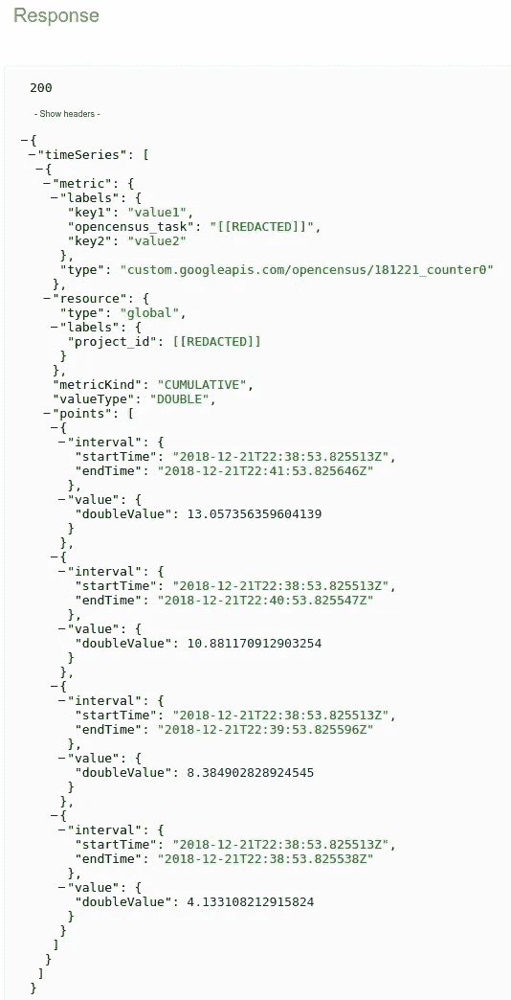
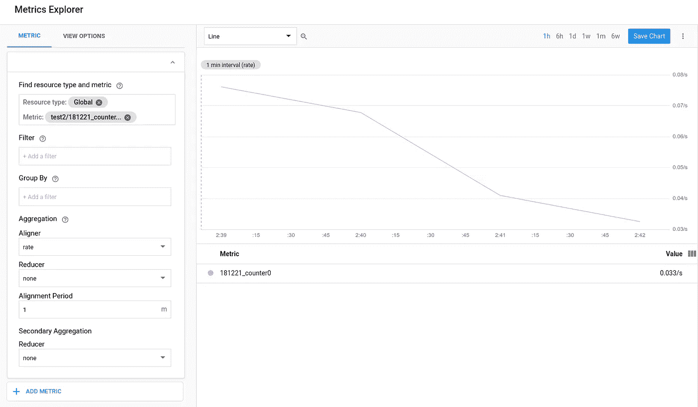

# OpenCensus 导入程序(原文如此。)

> 原文：<https://medium.com/google-cloud/opencensus-importer-sic-68855d74c3b5?source=collection_archive---------0----------------------->

## 我有了新的小狗

> **TL；DR** OpenCensus 提供了应用程序源和监控解决方案接收器之间的单向代理。OpenCensus 导入程序提供了返回路径。

我的日子是遛狗、写代码、吃饭和睡觉的快乐结合。这就减少了写博客的时间。我仍然缺乏带走我的故事但不给予太多回报的中等不对称。在我决定是否去其他地方之前，我会在这里写作——尽管不那么频繁。

我的兴趣之一是谷歌的开源 [OpenCensus](http://opencensus.io) 项目。我想我对监控解决方案感兴趣，因为我喜欢测量“事物”。使用像 OpenCensus 这样的解决方案，可以让产生数据的东西(您的应用程序)以一种不可知的监控方式来产生数据。编写一次您的监控代码，并且确信，当 DevOps 想要监控它时，他们将能够使用他们首选的监控系统来这样做；Prometheus、Datadog、Stackdriver (AWS|Google)、AWS 和 Azure 的自主开发的解决方案都受到支持，并且正在添加更多解决方案。

谷歌的[万亿](http://github.com/google/trillian)项目支持普罗米修斯。在试图为 Trillian[编写(需要更新:](https://github.com/google/trillian)[链接](https://gist.github.com/DazWilkin/cb0592ff63fbb4fed1c473e7aeb5a3a5))open census 解决方案时，我无法通过 Trillian 的特定监控测试。这是因为，Trillian 的监控界面假定能够读取测量值并打开 Census Exporters(！)不允许从监控系统读取数值。

而且，由于 OpenCensus 是一个支持任意导出器的可插拔解决方案，每个服务也需要一个读取值的解决方案。

我的用处？)解决方案是考虑 OpenCensus Importers(原文如此。)并反映导出器的接口，以查看读取值是否实用和有用:

[https://github.com/DazWilkin/opencensus-testing](https://github.com/DazWilkin/opencensus-testing)

## 工作

OpenCensus 涵盖统计|监测和追踪。下文仅涉及统计|监控功能。

OpenCensus 的命名是精确而独特的。总之，至少有一个出口商已注册，例如 Stackdriver。然后定义多个度量。这些要么是整型，要么是浮点型。每个度量可以与一个或多个视图相关联。视图表示发送给导出器的数据。这是我测试中代码的快照:

```
sd, err := stackdriver.**NewExporter**(stackdriver.Options{
  MetricPrefix: "test2",
})
if err != nil {
  glog.Fatal(err)
}

defer sd.Flush()view.**RegisterExporter**(sd)view.SetReportingPeriod(60 * time.Second)prefix := "181221"
separator := "_"
name := "counter0"prefixedName := prefix + separator + name
measure := **stats.Float64**(prefixedName, "Testing", "1")...v := **&view.View**{
  Name:        prefixedName,
  Measure:     measure,
  Description: "Testing",
  Aggregation: view.Sum(),
  TagKeys:     tagKeys,
 }
if err := view.**Register**(v); err != nil {
  glog.Fatal(err)
}
```

在下面的测试用例(代码)中，我使用了一个名为`counter0`的 float64 度量。和一个同名的视图(尽管为了清楚起见，我可能应该给它起一个不同的名字)。该视图通过对值求和来聚合使用该度量进行的度量。要使用测量进行测量:

```
stats.Record(ctx, measure.M(val))
```

> **NB** 就像森林中倒下的树木一样，如果没有视图来表示和导出它们，度量就不会被听到(被丢弃)。

下面是从上面的“度量”中读取值的导入器代码:

```
sdIn, err := importer_stackdriver.**NewImporter**(stackdriver.Options{
  MetricPrefix: "test2",
 })importer_view.**RegisterImporter**(sdIn)iv := &**view.View**{
  Name:       prefixedName,
  LabelNames: labelNames,
}
if err := view.**Register**(iv); err != nil {
  glog.Fatal(err)
}
```

> **NB** 进口商使用视图而非度量，因为出口商视图是监控系统的接口。

希望您能看到导出器|写入器和导入器|读取器代码之间的对称性。

下面是测试代码:

对我的包命名表示歉意。

该规范要求:

```
export PROJECT=[[YOUR-PROJECT]]
export GOOGLE_APPLICATION_CREDENTIALS=[[YOUR-SERVICE-ACCOUNT-KEY]]
```

`PROJECT`与您的 Stackdriver 工作区相关联。服务账户必须有`roles/monitoring.viewer`和`roles/monitoring.metricWriter`或`roles.monitoring.editor`。

您可以使用以下配置在 Visual Studio 代码中进行调试:

```
{
  "name": "[[YOUR-PROJECT]]",
  "type": "go",
  "request": "launch",
  "mode": "auto",
  "program": "${fileDirname}",
  "env": {
    "GOOGLE_APPLICATION_CREDENTIALS":"[[YOUR-SERVICE-ACCOUNT-KEY",
    "PROJECT":"[[YOUR-PROJECT]]"
  },
  "args": []
}
```

顺便说一下，一个隐藏的优点是，您也可以在 Visual Studio 代码中运行测试，但是您需要一种方法在用户或(最好)工作区设置中指定上述内容:

```
{
  "go.testEnvVars": {
    "GOOGLE_APPLICATION_CREDENTIALS":"[[YOUR-SERVICE-ACCOUNT-KEY]]",
    "PROJECT":"[[YOUR-PROJECT]]"
  }
}
```

## 结论

这是测试的结果。该测试使用 Stackdriver 作为导出器来创建 OpenCensus 度量和视图(Sum)。测试运行 10 分钟。每 10 秒钟，记录一次随机浮动 64。每隔 30 秒，Stackdriver 将被轮询一次，以获取最新的值。因为 OpenCensus 对记录的测量值求和，所以编写器输出随机值和累计值。这个总数可以与 Stackdriver 的值进行比较:

您可以在上面看到，在 Stackdriver 开始报告收到测量值之前有一个小的延迟。我已经编辑了输出来分隔读数。对于每个读取值，您可以找到写入总数命中它的位置。我添加了“←”来帮助您识别匹配项。

这是使用 Google APIs Explorer 提取的时间序列。您可以在这里看到重复的读取值:



这是 Stackdriver 指标。我无法解释这个图表是如何表示上面显示的数据的(我会做出解释:



现在，我必须去遛狗了。

**更新时间:2012 年 12 月 28 日**

我添加了一个 Datadog 导入器。

GitHub repo 上的[自述文件](https://github.com/dazwilkin/opencensus-testing/)中更详细地描述了 Stackdriver 和 Datadog 的实现及其示例。

## 弗雷迪

