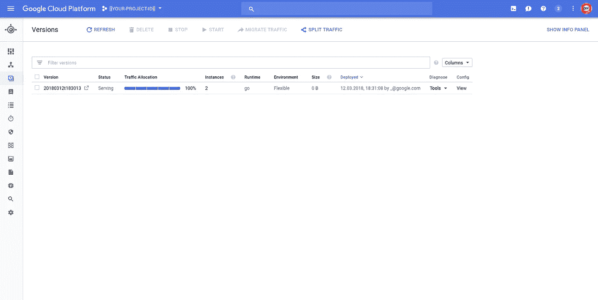
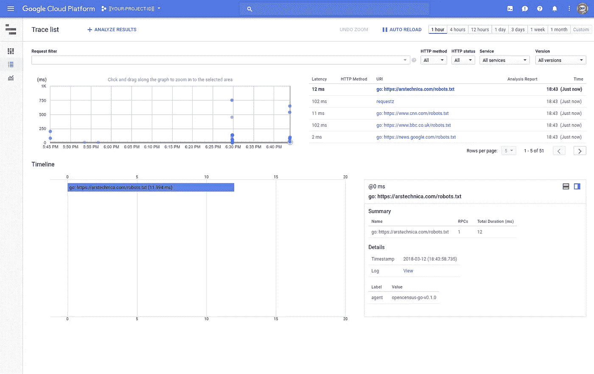
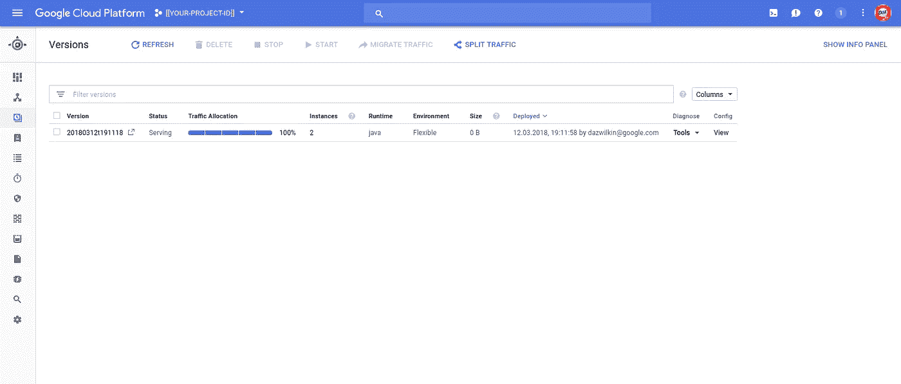
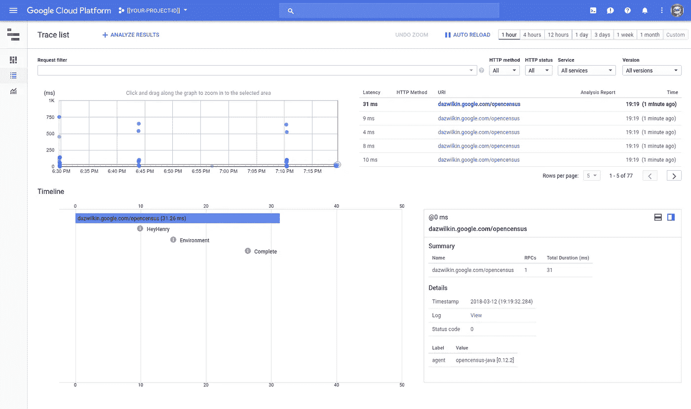

# 使用堆栈驱动程序打开人口普查跟踪

> 原文：<https://medium.com/google-cloud/opencensus-tracing-w-stackdriver-a079fae52499?source=collection_archive---------0----------------------->

一位客户的工程师询问他们如何在 Java 应用中灵活地结合 OpenCensus tracing w/ App Engine，并在 Stackdriver 中显示结果。

这些天我是“Golang First ”,所以这里有两种解决方法:Golang 和 Java。

文件是…稀疏。希望这些工作(！)示例将帮助您了解如何将这些神奇的东西应用到您的项目中。

准备好谷歌云平台项目并启用计费…

在您的项目中创建 App Engine 应用程序:

```
gcloud app create \
--region=us-central \
--project=${PROJECT}
```

对我来说，Stackdriver 跟踪是启用的，但您可以确保这一点。请确保将`PROJECT`设置为您的项目 ID:

```
gcloud services enabled cloudtrace.googleapis.com --project=${PROJECT}
```

## 第一:Golang

App Engine 灵活部署配置了`app.yaml`，对于 Golang，我假设您已经配置了`GOPATH`等。

app.yaml:

> **NB** 这包括对两个环境变量的引用`PROJECT`是您的 GCP 项目，而`PORT`定义了 httpd 的端口。我建议您将其保留在`8080`，因为这是 App Engine 所期望的值。只要定义了环境变量，就可以用`go run main.go`在本地运行示例。*当代码部署到 App Engine (GKE 等)时，不需要指定* `*PROJECT*` *。)但是我把它放在这里是为了允许在本地运行。*

主页面:

您可以在本地运行此代码:

```
export PROJECT=[[YOUR-PROJECT-ID]]
export ADDR="8080"go get ./...
go run main.go
```

在`/`上列举了机器的环境变量。您可以在`/_ah/health`和等效的`/healthz`上检查健康检查。当你不在谷歌上运行时，你可以使用`/requestz`端点，但是在谷歌的服务上，请使用同义词`/remotez`。

而且，当您准备好(并希望看到真实的痕迹)时，您可以使用以下工具部署到 App Engine:

```
gcloud app deploy --project=${PROJECT}
```

您可以确认应用程序已部署:



云控制台:应用引擎(运行时:Go)

或者:

```
gcloud app services browse default \
--project=${PROJECT}
```

一切正常，您应该很快就会看到跟踪列表工具中出现的项目:

https://console.cloud.google.com/traces/traces?project=[[您的项目 ID]]



堆栈驱动程序跟踪列表

## 第二:Java

对于 Java，你需要 Maven。下面是`pom.xml`、`MainServlet.java`和`app.yaml`:

app.yaml:

> **NB** 与 Golang 示例不同，Java 示例假设端口是`8080`。事后看来，Golang 示例也应该假设这一点(我可能会修改它以反映这一点)。

pom.xml:

MainServlet.java:

您可以在本地运行:

```
export PROJECT=[[YOUR-PROJECT-ID]]mvn clean jetty:run
```

这个例子更简单。它枚举环境变量*并*在根端点上生成跟踪跨度(`/`)。

要生成可以在 Stackdriver 中检查的跟踪，您需要将示例部署到 App Engine:

```
mvn clean appengine:deploy -Dapp.deploy.project=${PROJECT}
```

在这个构建和部署的过程中，去读一本关于 Golang 的快乐的书吧…



云控制台:应用引擎(运行时:Java)

您应该能够切换到 Stackdriver 跟踪列表来查看:



堆栈驱动程序跟踪列表

## 结论

OpenCensus 支持“可插拔”的监控和跟踪服务。Stackdriver Trace 只是一种选择。在这篇文章中，我们编写了 Golang 和 Java 示例，将 OpenCensus Tracing 整合到一个部署到 App Engine Flexible 的应用程序中，以展示该解决方案的一致性和能力。

就是这样！