# 操作重点:为什么是症状，而不是原因？

> 原文：<https://medium.com/google-cloud/operational-focus-why-symptoms-not-causes-e4af0e115e14?source=collection_archive---------3----------------------->

“用户不关心*为什么*某个东西不工作，而是*它不工作。”*

我们如何将这种陈词滥调转化为有助于运营团队的东西？

让我们从传统模式开始，在这种模式中，运营部门专注于基础架构，我们等待客户告诉我们哪里出了问题:

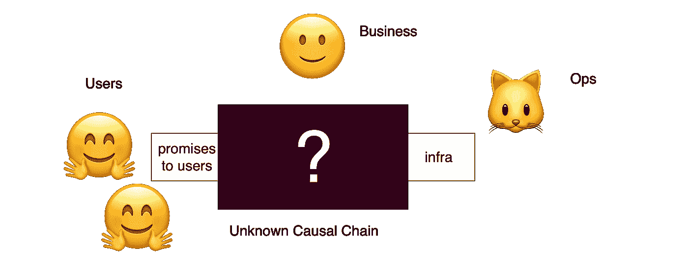

让我们考虑这种传统状态下的最坏情况。

用户遇到了一个问题:企业向用户做出了承诺，但没有兑现。但是基础设施很好。

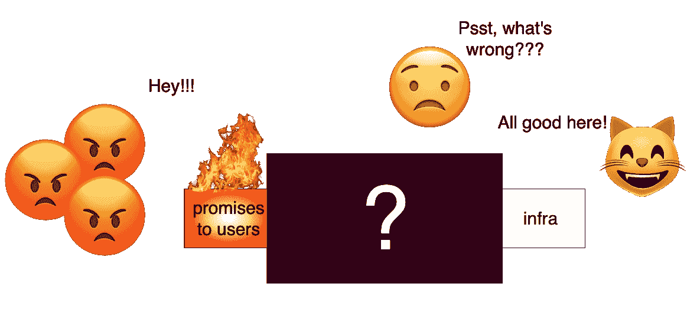

用户不在乎。

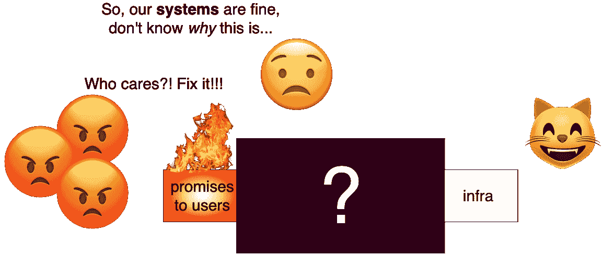

运营团队可能只有一个小的局部视图，而这个局部视图会导致另一个潜在的问题。

假设业务进展顺利，更多用户开始使用他们的服务。

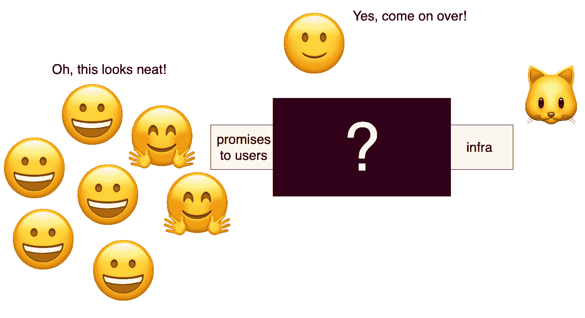

传统的运营部门可能会感到恐慌，甚至当一些*好的事情*正在为用户发生的时候。他们可能有合理的理由担心！

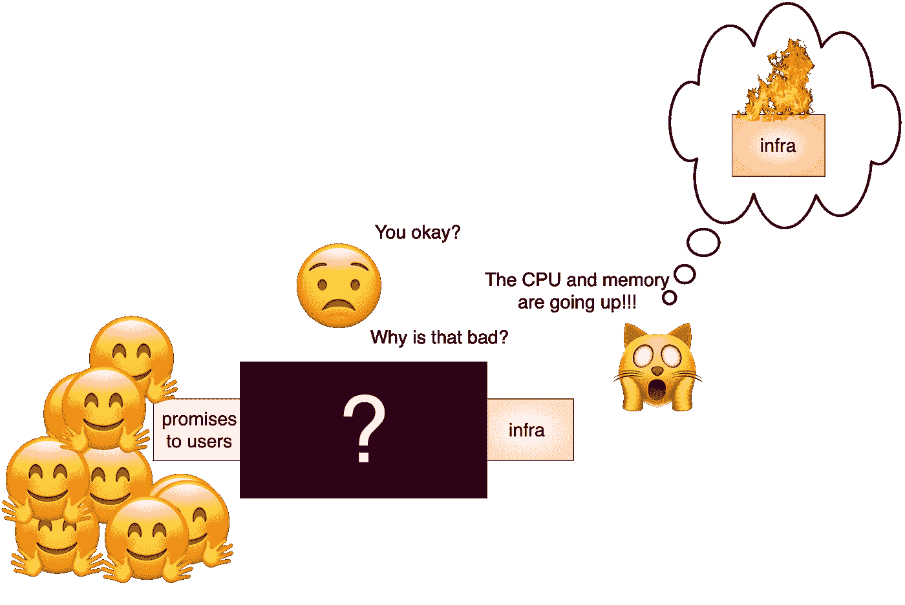

运营最终是一个业务问题，而不仅仅是一个技术问题。

我们需要能够看到系统不同层次之间的因果链。

我们看到一个依赖链以不同的方式出现，混合着清晰和模糊的原因。

我们还看到了冗余层，允许较低级别的基础架构出现故障，而不会影响用户。

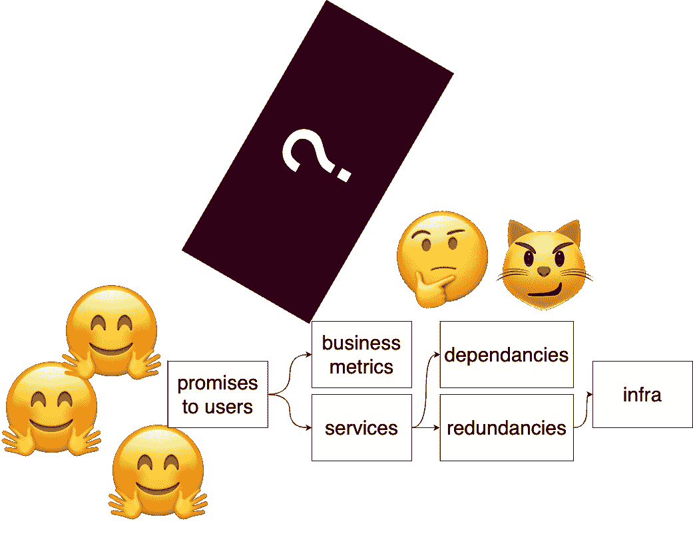

从这个概念意识出发，你可以考虑如何识别和度量不同的兴趣领域。根据它们对用户的明显程度，我们可以将它们分为症状和原因。

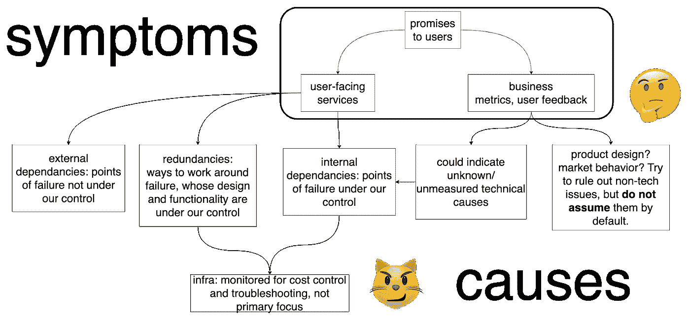

现在我们有了一个因果顺序的模型，Ops 可以像业务的其他部分一样更加关注相同的领域:**用户**。

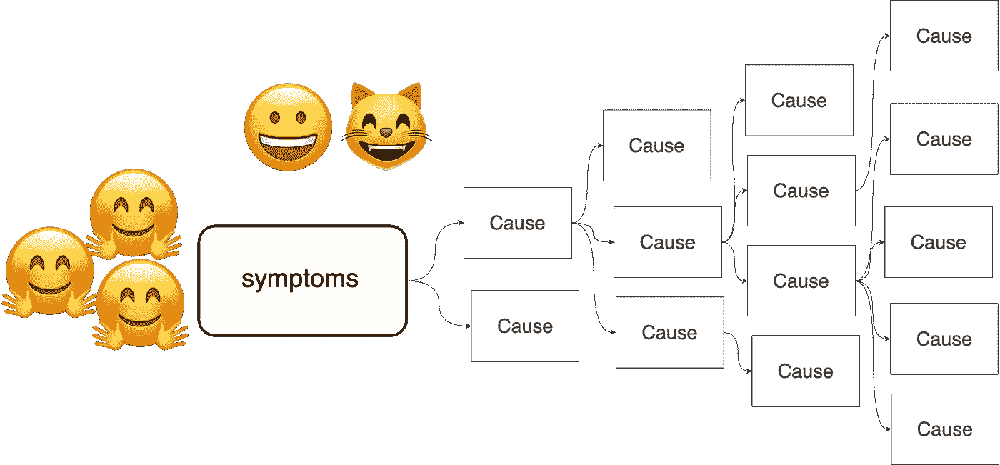

当问题出现时，从一个*少数症状*开始，Ops 可以比以前更有效地找到原因。

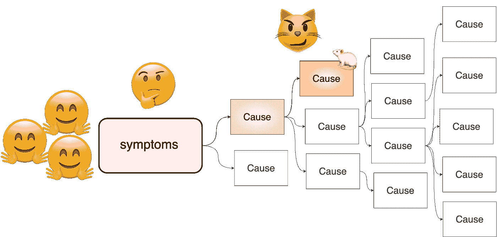

但是如果我们知道原因先于症状，难道我们不想提前知道原因什么时候开始看起来不对劲*？*

*不管我们是否知道因果链，症状优先方法*不是更具反应性*而不是更具预测性*吗？**

*如果原因仍然像以前一样强大，如果我们仍然需要做更多的工作来减轻我们系统内部故障的影响，这些都是合理的担忧。*

*因此，假设我们*警告*原因，而不是那些缓解措施。*

*我们冒着被偶然的失败淹没的风险。警觉疲劳和高信噪比并不能帮助我们更快地解决问题。*

*如果我们仅仅是意识到有更多的火灾发生，消防工作似乎很难变得更容易管理。*

*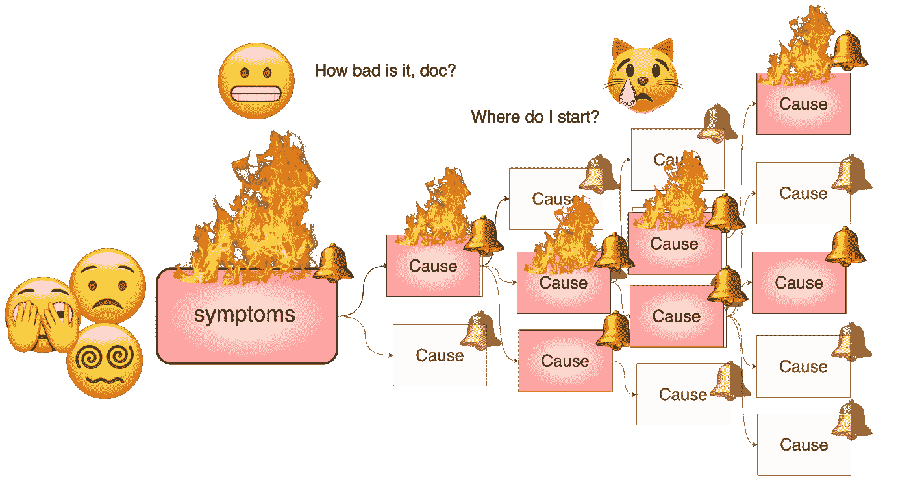*

*我们如何摆脱这种困境？*

*理想情况下，我们会问，“怎样才能让*只对症状而不是原因发出警报？”**

*我们将构建自动化层，避免警报的需要。*

*为什么？因为警报需要是可操作的，所以我们应该有一个准备好处理故障的系统。*

*我们的最终目标是*关闭原因警报*，我们尽可能地自动化，并逐步向*靠近，仅仅是*症状。*

*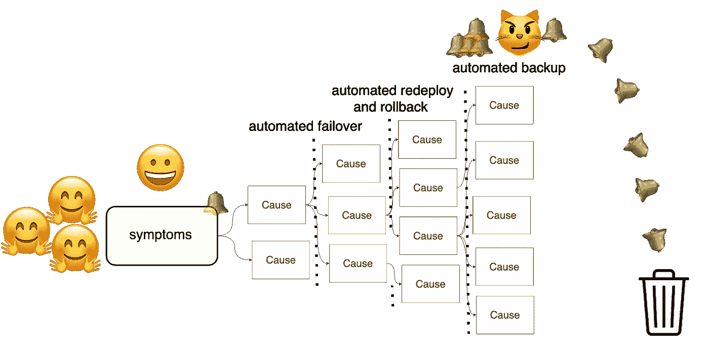*

*即使扔掉警报，我们也绝不会关闭*监控。**

*我们仍然需要监控故障原因、成本控制等——但我们越来越相信自己有能力主要关注症状。*

*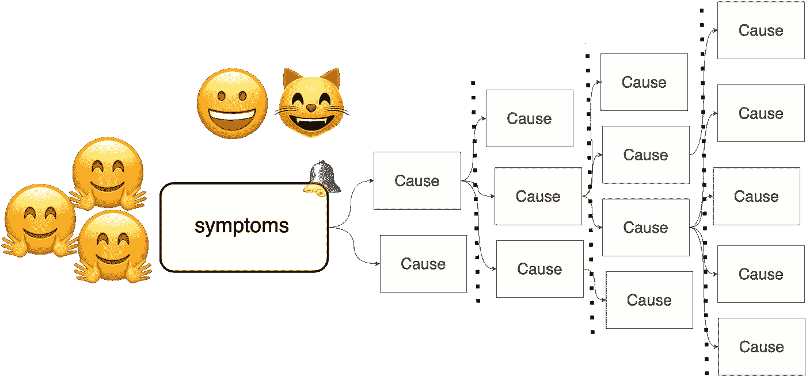*

*即使有了自动化和监控，我们早就接受了任何技术系统都会出现一些故障。*

*除了我们可以预防的失败类型，还有未知的潜在原因。*

*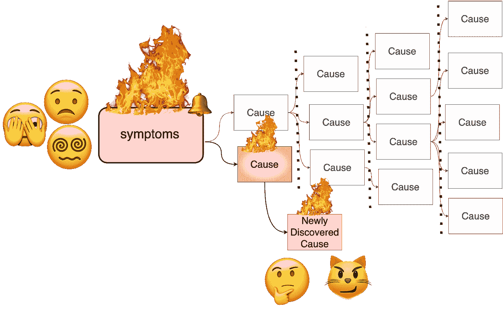*

*有了处理新发现原因的模式，我们就不需要纠结于它们。*

*一点项目工作让我们免于未来的许多辛劳。再过一点时间，我们就可以把重心回到用户身上了。但是我们这样做是因为我们期望失败是不可避免的，并且我们已经准备好去发现未来未知的原因。*

*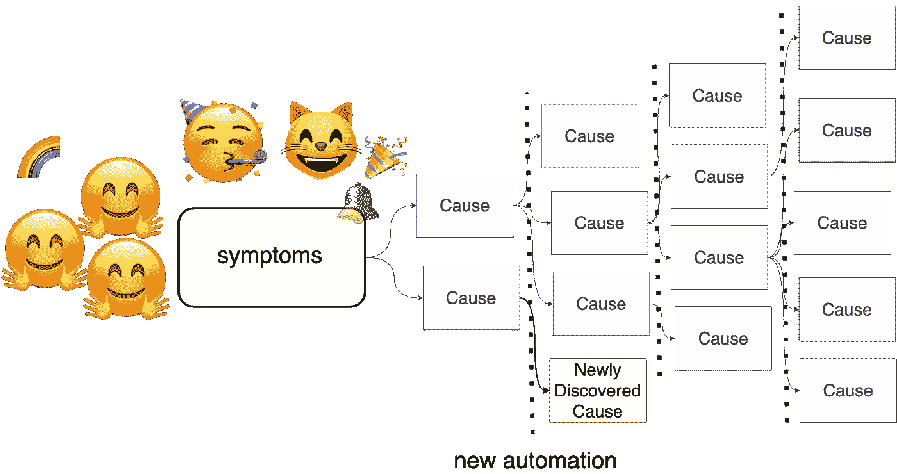*

*运用这一观点来引导有关运营预期改进的讨论。*

*想想当一位 IT 领导说，“我们希望**完全**、**端到端**可见性。”*

*但是，在这种情况下，什么是*的主要优先级*？*

*“我们想知道什么时候出了问题。”*

*如果你设计了一个处理失败的系统，那么“出错”意味着什么？*

*有一种煽动性的方法可以让人们思考这些问题:*

*“从明天开始，除了面向用户的症状之外，关闭所有警报。有异议吗？”*

*您将得到一长串的依赖项，缺乏冗余，以及监控中的缺口。一下子做出这一举动太唐突了。*

*关键是要问:*

**“怎样才能让*朝着那个理想状态前进呢？”*

*运营部门应该更关心*为什么*某些东西不工作——即使用户不关心。这里观点的改变不仅仅是短暂地关心同样的事情；同理心只是一个起点。*

*相反，以用户为中心的视角带给我们的是一套不同的价值观:*

*   *在我们的系统中，问题的可能原因比象棋中可能的走法更多；*接受*的模糊性，关注**最相关的**。*
*   *开始时的“业务问题”可能会导致发现我们以前没有发现的新的技术问题。*
*   *从用户开始并提醒操作人员注意症状是进行调试的最明智的方法。我们的目标应该是专门针对症状发出警报。*
*   *自动化不是一个次要项目或奢侈品。这是自信地达到我们目标的最好方法。*

*狩猎愉快！*