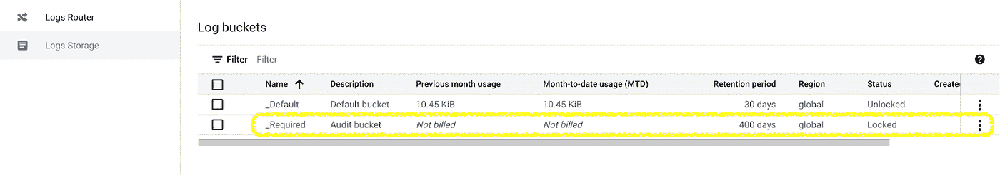

# 使用日志查询语言优化 Google Cloud 中的云日志

> 原文：<https://medium.com/google-cloud/optimise-cloud-logging-in-google-cloud-with-logging-query-language-6f4e4ba417b0?source=collection_archive---------2----------------------->

*您的云日志记录费用是否超出了您的预期？让我们来学习一种方法，把它们过滤掉，减少你每月的消费。*

在跳到步骤之前，我们先了解一下云日志定价是如何工作的。

基于以下两个因素，云日志记录会产生费用:

1.  **摄取**:将数据写入云日志 API，并将其路由到日志桶
2.  **存储**:记录日志桶中保留的数据

Google Cloud 在日志存储中自动创建两个存储桶，分别是 **_Default** 和 **_Required** 。

**_Required** 日志桶包含某些日志，如审计日志和透明日志，这些日志会自动进入该桶。我们不允许删除或编辑此存储桶。最重要的是，我们不为它的摄入和储存付费。但是，如果您想在其他存储桶中保存这些日志的副本，我们可能会收费。

除了 **_Required** 之外的桶将对其摄取和储存收费。目前，云日志记录为前 30 天的日志保留提供免费存储，而不考虑任何存储桶。发布日期**2023 年 1 月 16 日**，存储费用将适用于保留超过 30 天的日志数据。请参考此处的文档。

下面是云日志记录如何路由和存储日志条目的高级流程图。请参考此[链接](https://cloud.google.com/logging/docs/routing/overview)以阅读更多详细信息，了解如何通过日志记录获取日志，并使用接收器通过日志路由器路由日志。

现在我们知道日志路由器接收日志并将其路由到接收器。因此，为了过滤日志，我们必须设置一个或多个排除过滤器来排除来自接收器目的地的日志。

排除筛选器是使用日志记录查询语言创建的。我们可以在 Google Cloud 控制台的日志浏览器、日志 API 或命令行界面中使用日志查询语言。在这里阅读更多。

我们可以基于以下字段构建查询:

*   资源.类型
*   资源.标签. *
*   日志名
*   严重
*   时间戳
*   insertId
*   操作. id
*   找到；查出
*   httpRequest.status
*   标签。*
*   Split.uid

除了这些字段之外，我们还可以构建查询，并基于我们的自定义字段对它们进行配置(目前在正式发布前)。这里详细阅读更多[。](https://cloud.google.com/logging/docs/analyze/custom-index)

**问题陈述:**

有些情况下，客户在不知情的情况下为 Google Cloud 中的云日志支付了过高的费用，他们也不知道如何过滤相关的日志。

Google Cloud 建议使用日志查询语言来查询数据，并编写过滤器来创建汇和基于日志的指标。然而，有时事情并不那么简单。

**解决方案:**

为了解决这个问题，作为一个最佳实践，我们应该根据我们想要排除的字段在日志路由器接收器中添加排除过滤器。

要进入排除过滤器，请在 GCP 控制台中进入日志，然后单击左侧面板中的日志路由器(如下所述)。

点击默认水槽/自定义水槽的三个垂直点，然后点击**编辑水槽**。

向下滚动到**选择要过滤掉的日志(可选)**，然后点击**添加排除**。

现在，假设您想要根据资源类型“Google App Engine”应用程序和严重性“默认”来过滤日志。为您的过滤器命名，如 **sampleexclusionfilter，**在排除中输入以下查询，然后单击 **Update Sink** 。

**resource . type = " gae _ app "**

***严重性=默认***

这将从 GAE 应用程序中删除所有默认日志。类似地，您可以输入更多的查询，以根据日志名称、项目 id、模块 id 和所选区域过滤掉接收器。

在 Logs explorer 中找出最大数量的不相关日志，并在 exclusion filter 中复制相同的查询，如上所述。

**概要:**

这就是我们如何了解 GCP 云日志记录的定价因素、使用汇点通过日志路由器接收和路由日志的过程，以及最终我们如何在谷歌云平台中显著降低我们的云消费账单。

*阅读更多关于云日志的* [*特性*](https://cloud.google.com/logging#section-6) *。*