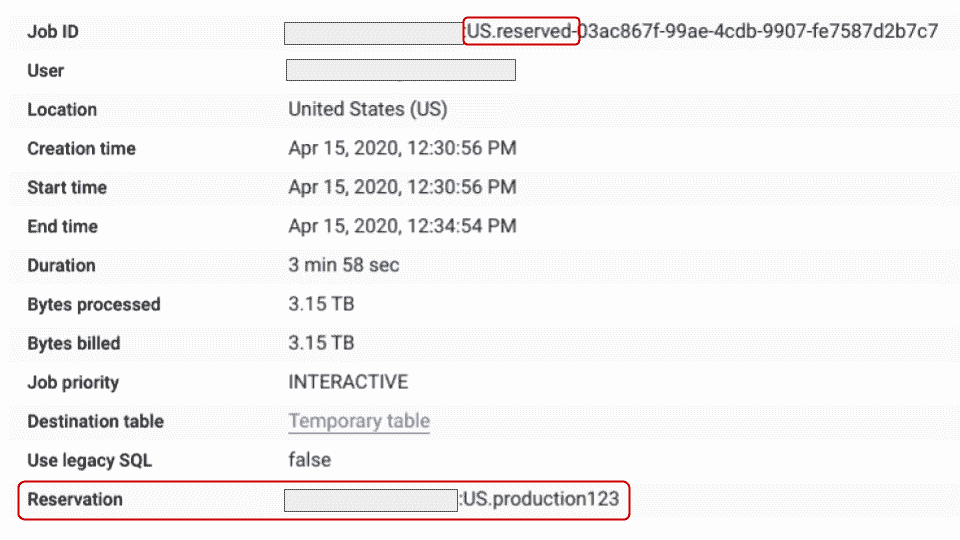
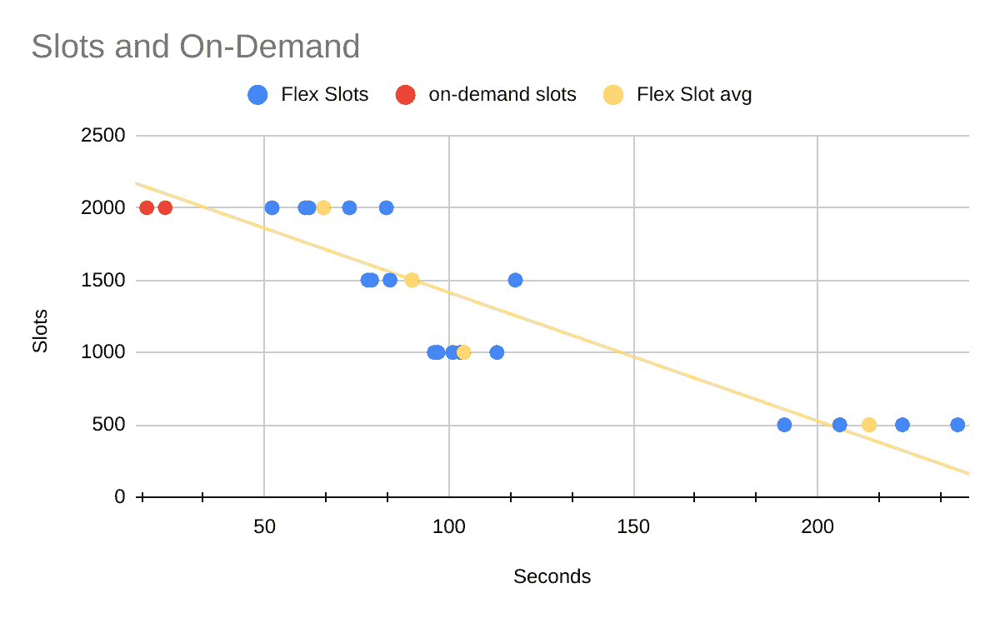
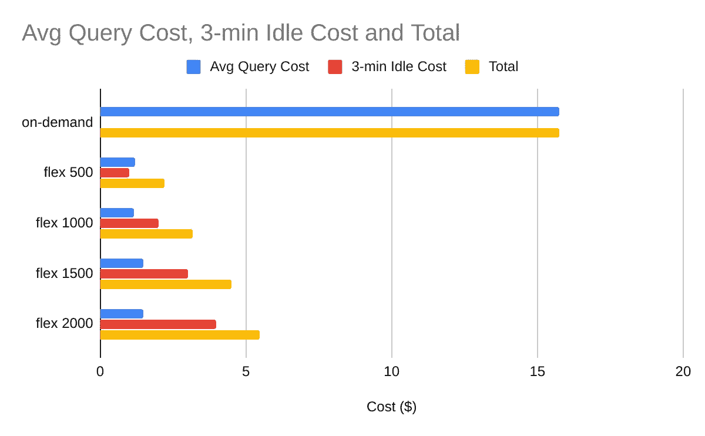

# 使用灵活插槽优化 BigQuery 成本

> 原文：<https://medium.com/google-cloud/optimize-bigquery-costs-with-flex-slots-e06ec5e4aa90?source=collection_archive---------1----------------------->

(2020 年 5 月 13 日更新:代码现在使用保留的[客户端库](https://googleapis.dev/python/bigqueryreservation/latest/index.html)

谷歌云最近增加了 [Flex Slots](https://cloud.google.com/blog/products/data-analytics/introducing-bigquery-flex-slots) 作为 BigQuery 的新定价选项。使用[统一费率承诺](https://cloud.google.com/bigquery/pricing#flat_rate_pricing)的用户不再按扫描的字节数为查询付费，而是为预留的计算资源付费；使用[弹性时段承诺](https://cloud.google.com/bigquery/pricing#flex-slots-pricing)，用户现在可以在 60 秒后随时取消预订。按每秒 20 美元/500 个时段计费，Flex Slots 可以为查询大小超过 1tb 的按需客户节省大量成本。

在本文中，我将向您展示您的应用程序如何使用 Reservations APIs，以与单个 4tb 按需查询(当前定价为 [$5/TiB](https://cloud.google.com/bigquery/pricing#on_demand_pricing) )相同的价格，对 500 个插槽的预留运行****小时的查询。在[预订用户界面](https://console.cloud.google.com/bigquery/admin/reservations)中也有相同的功能。****

## **管理项目设置**

**BigQuery 预订的推荐最佳实践是维护一个用于管理预订的专用项目。在本指南中，该项目将被称为“管理项目”。**

**为了创建预订，您的用户将需要项目上的 **bigquery.resourceAdmin** 角色和至少 500 个预订 API 插槽的可用[配额](https://cloud.google.com/bigquery/docs/reservations-intro#quotas)。**

## **用户项目设置**

**将需要创建 BigQuery“用户项目”。为了简单起见，您的用户应该在用户项目中拥有 **bigquery.admin** 角色，允许您附加预订和运行查询。**

**从云壳集到你的用户项目。**

```
$gcloud projects add-iam-policy-binding $DEVSHELL_PROJECT_ID member='user:myuser@org.com' role='roles/bigquery.admin'
```

## **在笔记本中测试行为**

**为了展示 API，我将使用一个协同实验室(Colab)笔记本，它将允许您在浏览器中运行 Python。(另一种选择，如 BigQuery quickstart 文档中的[所示，是使用经过认证的 Python 客户端。)](https://cloud.google.com/bigquery/docs/quickstarts/quickstart-client-libraries#client-libraries-usage-python)**

**配置 [Colab](https://colab.research.google.com/) 环境，并在出现提示时启动新的笔记本选项。**

**在初始单元格中输入该代码。**

**您需要将# '您的 _ 管理 _ 项目'和# '您的 _ 用户 _ 项目'替换为您之前创建的项目。**

**提示:按 Shift-Enter 执行单元格中的代码。**

**colab 项目现在以您的用户身份登录，其中一个基本项目设置为您的用户项目。**

**现在，您将创建一系列专用函数来演示 Flex Slots 特性。**

**首先，创建 run_query 函数，默认情况下，该函数将估计样本查询的大小。若要执行查询，请将 dry_run 标志设置为 False。**

**调用时，您将看到 run_query 估计大约扫描了 3.2TiB，或者按需定价的运行成本超过 15 美元。**

**现在，创建一个预订客户机。**

**接下来，创建购买承诺的函数。承诺是购买时段的机制。弹性承诺购买以 500 时段小时为增量收取 20 美元；这相当于约 33 /时段分钟。希望更快查询或更多并发性的客户可以增加他们的槽承诺。**

**现在，创建一个函数来创建预订。预留创建一个指定的插槽分配，并且是将插槽分配给项目所必需的。**

**接下来，创建一个函数来创建分配。分配将保留分配给组织、文件夹或项目。该函数将在管理项目中创建的保留分配给用户项目。**

**最后，创建一个清理函数。[槽承诺](https://cloud.google.com/bigquery/docs/reservations-concepts#commitment_plans)不能删除，直到 60 秒承诺，结束时间已到；使用简单的[重试](https://googleapis.dev/python/google-api-core/latest/retry.html)，直到可以删除资源。**

**既然已经创建了所有的效用函数，您将把所有的东西放在一起并观察结果。创建以下承诺将为您的项目收取预计运行 5-10 分钟的费用。**

***注意:在撰写本文的时候，BigQuery Reservations API 将会在插槽分配就绪之前指出它是活动的。该脚本包括 3 分钟的等待时间，以便预留附加的时间。如果你愿意的话，你可以在等的时候吃点小吃。***

## ****确认查询预约****

****

**预订名称和查询前缀以红色突出显示**

**您可以在 BigQuery 控制台的 [BigQuery 查询历史选项卡](https://console.cloud.google.com/bigquery?page=queries)中看到格式良好的查询统计数据。预留名称将由使用预留槽的查询的属性来指示。**

## **解释结果**

****

**随着插槽的增加，性能接近线性增长**

****

**灵活插槽可节省 60%至 80%的成本**

**这些图表比较了按需运行的查询时间和成本，2000 个槽的[和 2000 个槽的增量为 500 个槽的运行。重要的是要记住，Flex Slots 客户也将为闲置时间付费，对于较大的预订，这些成本可能会很快增加。然而，即使加上三分钟的空闲时间， **Flex Slots 的成本** **比本教程的大型示例查询的按需定价成本**低 60%到 80%。](https://cloud.google.com/bigquery/docs/release-notes#December_10_2019)**