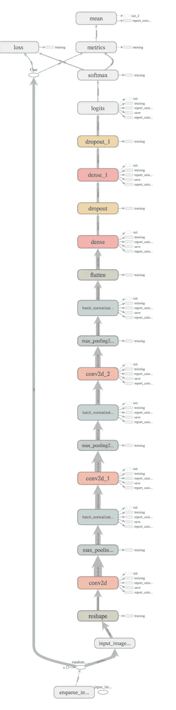

# 为服务优化张量流模型

> 原文：<https://medium.com/google-cloud/optimizing-tensorflow-models-for-serving-959080e9ddbf?source=collection_archive---------0----------------------->

在机器学习的世界里，人们非常关注优化训练。关于优化预测的信息少得多。然而，为预测提供模型是我们在 ML 中赚钱的地方！服务性能会对您的用例中 ML 的价值产生重大影响。事实上，服务于预测的成本可能是 ML 应用的总投资回报的主要因素。在本帖中，我们将向您展示一些优化 TensorFlow 模型以服务预测的方法，帮助您降低成本并提高 ML 解决方案的性能。这项工作是与我在谷歌云解决方案架构师团队的同事 [Khalid Salama](https://medium.com/u/aa480048c61f?source=post_page-----959080e9ddbf--------------------------------) 合作完成的。这篇文章的代码可以在 github 的[这里](https://github.com/GoogleCloudPlatform/tf-estimator-tutorials/tree/master/00_Miscellaneous/model_optimisation)找到。

# 延迟(和大小)很重要

当谈到优化服务模型时，我们主要关心三件事:

*   模型尺寸
*   预测速度
*   预测吞吐量

在服务 ML 时，**模型大小**很重要。当然，更小的型号使用更少的内存，更少的存储和网络带宽，它们加载更快。在某些情况下，硬件内存约束或服务限制可能会限制模型大小。例如，谷歌云上的机器学习引擎服务为模型设置了 250MB 的默认大小限制。当我们使用硬件加速进行预测时，我们需要确保我们的模型适合加速设备的内存。当我们在功能有限的边缘设备或移动设备上为模型提供服务时，模型大小有着特殊的影响。我们希望模型下载速度尽可能快，使用最少的网络带宽，占用尽可能少的内存和存储空间。

**预测速度**是我们关心的另一个服务指标。当我们在线执行预测时，我们通常希望结果尽快返回。在许多在线应用程序中，服务延迟对于用户体验和应用程序需求至关重要。但是我们关心预测的速度，即使我们批量处理我们的预测。预测速度与服务成本直接相关，因为它与进行预测所需的计算资源量直接相关。在任何衡量预测吞吐量的公式中，进行预测所需的时间始终是一个关键变量。更快的预测意味着在相同硬件上更高的预测吞吐量，从而降低成本。

**预测吞吐量**是对我们的系统在给定时间段内可以执行多少预测的度量。除了刚才提到的预测速度之外，其他系统属性也会影响吞吐量，包括预测的批处理、硬件加速、负载平衡和服务实例的水平扩展。在本文中，除了针对单个输入示例的预测时间优化之外，我们不会讨论优化预测吞吐量的技术。

# TensorFlow 中的模型格式

TensorFlow 在其相对较短的生命周期中，已经设法积累了几种模型序列化格式。对所有这些格式的讨论超出了我们目前的范围；[tensor flow 文档中的这一页](https://www.tensorflow.org/mobile/prepare_models)很好地总结了它们。需要了解的最重要的是 GraphDef 和 SavedModel 格式。GraphDef 格式是 ProtoBuf 序列化协议的一个版本，以文本或二进制的形式，对张量流图的定义进行编码。GraphDef 还可以包括一个训练模型的权重，我们将在后面看到，但这不是必须的——权重可以存储为单独的检查点文件。SavedModel 格式将 GraphDef(实际上是元 GraphDef，我们将在后面讨论)与存储权重的检查点文件结合在一起，所有这些都收集在一个文件夹中。有关已保存模型的更多信息，请参见 TensorFlow 文档中的[本页](https://www.tensorflow.org/guide/saved_model)。在本帖中，我们将同时使用 GraphDef 和 SavedModel 格式。

# 工具和技术

TensorFlow 中有多种技术可让您缩小模型的大小并改善预测延迟。以下是其中的一些:

*   **冻结**:将保存在 SavedModel 的检查点文件中的变量转换成直接存储在模型图中的常量。这减小了模型的整体尺寸。
*   **修剪**:剥离预测路径和图形输出中未使用的节点，合并重复节点，以及清理其他节点操作，如摘要、标识等。
*   **常量合并**:在模型中寻找任何子图，这些子图总是评估为常量表达式，并用这些常量替换它们。
*   **折叠批量规范:**将批量规范中引入的乘法折叠到上一层的权重乘法中。
*   **量化**:将权重从浮点转换为较低精度，如 16 位或 8 位。

在这篇文章中，我们将展示如何执行上面列出的每一项技术。我们在这里讨论的优化过程将足以为各种模型执行基本的服务优化。

我们在这里没有足够的空间来深入讨论这些技术。特别是量化，是一个很大的话题，本身就值得发几个帖子。当然，对于移动部署，还有 [TFLite](https://www.tensorflow.org/lite/) ，它在移动模型上执行 8 位量化。我们不会讨论的其他优化技术包括融合卷积和 AOT 编译与`tfcompile`。

我们将使用 TensorFlow [图形转换工具](https://github.com/tensorflow/tensorflow/blob/master/tensorflow/tools/graph_transforms/README.md#fold_constants)来执行许多优化，这是一个 C++命令行工具。我们将展示如何使用 Python APIs 来使用该工具。Graph Transform 工具被设计用于处理以 *protobuf* 格式保存为 GraphDef 文件的模型。然而，SavedModel 格式是最现代的，也是最受其他工具和服务支持的格式。例如，在训练评估者之后导出的模型是 SavedModel 格式的。是云机器学习引擎唯一支持预测的格式。因此，在我们优化我们的模型后，我们将把它转换回 SavedModel 格式。我们还将展示如何使用`saved_model_cli`工具输出 SavedModel 中的 MetaGraphDef 定义，以及 TensorFlow saved_model 包的 Python API 来检查 GraphDef。

我们将遵循的优化步骤以及模型格式转换如下:

1.  冻结保存的模型:

**saved model graph def**

2.优化冻结模型:

**图表定义图表定义**

3.将优化的冻结模型转换回 SavedModel:

**GraphDef 已保存的模型**

# 生成模型

让我们开始吧。首先我们需要一个模型。我们将使用在“Hello World”深度学习数据集上训练过的一个，MNIST。这是我们模型的代码，一个简单的 MNIST CNN 分类器。该代码可在[笔记本](https://github.com/GoogleCloudPlatform/tf-estimator-tutorials/blob/master/00_Miscellaneous/model_optimisation/Tutorial%20-%20TensorFlow%20Model%20Optimisation%20for%20Serving%20-%20MNIST%20with%20Keras.ipynb)以及[github repo](https://github.com/GoogleCloudPlatform/tf-estimator-tutorials/blob/master/00_Miscellaneous/model_optimisation/optimize_graph_keras.py)中的脚本中获得。

下面是训练模型并导出保存的模型的代码:

该模型应该需要大约一分钟来训练，因为我们将 **TrainSpec** 中的`max_steps`值设置为 50。我们在这里不追求准确性；我们只是想要一个导出模型的例子。运行此代码以执行培训并导出保存的模型:

```
train_data, train_labels, eval_data, eval_labels = load_mnist_keras()
export_dir = train_and_export_model(train_data, train_labels)
```

# 检查保存的模型

现在我们有了一个 SavedModel，让我们检查一下它的内容。这是 TensorBoard 模型的图像，我们在这里设置了`num_conv_layers= 3`和`hidden_units=[512,512]`:



## 输出元图形定义

我们可以使用 TensorFlow 代码库中的`saved_model_cli`工具从 SavedModel 中输出 MetaGraphDef。什么是元图形定义？它是一个 GraphDef，带有关于模型“签名”的附加信息，即输入和输出。让我们在刚刚导出的 SavedModel 上运行`saved_model_cli`工具:

```
$ saved_models_base=models/mnist/cnn_classifier/export
$ saved_model_dir=${saved_models_base}/$(ls ${saved_models_base} | tail -n 1)
$ saved_model_cli show — dir=${saved_model_dir} — all
```

这是输出，在我们的图表中显示了输入和输出的特征。MetaGraphDef 格式可以包含多个签名定义，但是`estimator.export_savedmodel`方法只导出一个标记为`‘serving_default’`的签名:

```
MetaGraphDef **with** tag-set: ‘serve’ contains the following SignatureDefs:signature_def[‘serving_default’]:
The given SavedModel SignatureDef contains the following input(s):
 inputs[‘input_image’] tensor_info:
     dtype: DT_FLOAT
     shape: (-1, 28, 28)
     name: serving_input_image:0
 The given SavedModel SignatureDef contains the following output(s):
 outputs[‘softmax’] tensor_info:
     dtype: DT_FLOAT
     shape: (-1, 10)
     name: softmax/Softmax:0
Method name **is**: tensorflow/serving/predict
```

“input_image”输入是我们在上面的`**make_serving_input_receiver_fn**`中定义的输入。“softmax”输出在 keras 模型函数中定义。

## 加载并输出图形定义

让我们检查 SavedModel 中 MetaGraphDef 结构的 GraphDef 部分。我们使用前面提到的用于 TensorFlow `saved_model`模块的 Python APIs 来加载 SavedModel 并从 MetaGraphDef 获取 GraphDef:

以下代码显示了如何显示 GraphDef 中的信息。我们可以输出图表中各种节点的名称列表，以及各种节点类型的计数。

这是我们的 SavedModel 的输出:

```
models/mnist/keras_classifier/export/1540846525

Input Feature Nodes: [u'serving_input_image', u'input_image']

Unused Nodes: []

Output Nodes: [u'softmax/Softmax']

Quanitization Nodes: []

Constant Count: 61

Variable Count: 97

Identity Count: 30

Total nodes: 308
```

## 输出模型尺寸

让我们用下面的代码来看看模型的大小:

SavedModel 大小的大小大致可以分为 GraphDef 的大小，和变量的大小(即模型的权重)。在任何优化之前，运行上面的代码来获得我们的模型的大小:

```
models/mnist/keras_classifier/export/1540846525Model size: 57.453 KB
Variables size: 10691.978 KB
Total Size: 10749.431 KB
```

# 基线预测基准

现在，让我们对在未优化的图上执行预测所需的时间进行基准测试。在此之前，我们应该说几句关于基准测试方法的话。

## 标杆管理模型

对 ML 模型性能进行基准测试本身就是一个很深的话题。我们必须小心行事。有很多方法不正确地做到这一点，导致对我们的模型优化的影响的不准确的评估。有几种方法可以用来测试张量流模型的预测性能。以下是一些可能的候选人:

1.  使用 Python 代码和 contrib.predictor 模块在本地开发系统上对模型执行预测。
2.  使用云机器学习引擎的预测服务来测试使用该 API 进行预测的速度。
3.  使用 TensorFlow 的 REST API 来测试预测的速度。

无论我们是在测试 ML 模型(还是其他任何东西)，任何基准测试方法都有几个关键属性:

1.  **可重复性**:也就是说，我们的基准测试结果在不同的运行中表现出较低的方差。
2.  **受控环境**:我们希望对基准环境有很大程度的了解和控制，这样我们就可以对我们正在测试的东西做出明确而准确的陈述。如果我们缺乏对环境的控制，那么我们可能会得出一个不同于我们声称要进行基准测试的系统的结论。
3.  **有限焦点**:我们要尽可能的限制基准的焦点。在任何像最大似然预测流水线这样复杂的系统中，都会有许多决定性能的系统因素。在我们的例子中，我们只想尽可能地测试由于模型图本身而产生的性能差异。理想情况下，网络性能、进行 API 调用和处理结果的速度以及可用的计算能力等其他因素不应该影响我们的基准测试结果。

B)和 C)的错误选择通常会导致 A)的糟糕结果。换句话说，如果我们不在有限关注的受控环境中运行我们的测试，我们将在基准测试结果中看到很多可变性。

[示例代码](https://github.com/GoogleCloudPlatform/tf-estimator-tutorials/blob/master/00_Miscellaneous/model_optimisation/inference_test.py)展示了如何使用上述三种技术选项运行推理基准。然而，根据上述标准 A-C，TensorFlow 服务选项是最佳选择。我们可以针对运行在 docker 容器中的 TF Serving 的本地实例轻松运行基准测试。这给了我们对环境的高度控制，并将测试的焦点尽可能地限制在图形本身的性能上。由于请求是在本地网络接口上发出的，因此对网络性能的影响很小。预测图的处理仅由 TensorFlow 运行时和 TF 服务引擎来执行，所有这些都是用 C++代码实现的，c++代码在其执行中或多或少具有确定性。我们将使用 TF Serving 的 REST API 进行 API 调用，设置和接收结果只需要很少的处理。

Python 代码方法不是正确的选择，因为缺乏对环境的控制。这里的环境是 Python 解释器本身。因为 Python 在运行您的代码时做了很多事情，包括内存分配、数据管理和垃圾收集，所以有很多事情我们无法控制。事实上，我们观察到，当使用`inference_test.py`中基于“纯 Python”的推理测试在模型上运行本地测试时，每次运行的基准测试结果都有很大的可变性。这种可变性可能会导致我们错误地评估图形优化的性能影响。当然，我们可以运行许多测试，并对结果进行平均，以说明这种可变性。但是这使得基准测试方法更加复杂，增加了一层我们不愿意做的统计验证。

我们还可以使用 Google Cloud ML 引擎的预测服务来执行基准测试；示例代码也展示了如何做到这一点。该服务是轻松部署您的生产模型以供服务的绝佳选择。当然，我们在这里讨论的一切都是为了优化生产服务的性能！但是由于缺乏对环境的控制，以及缺乏焦点，它并没有成为一个很好的系统来精确地、可重复地量化图形优化的影响。云 ML 引擎预测的环境有太多方面是我们作为基准环境无法控制的。像 CMLE 预测这样的自动扩展服务将根据您的使用情况自动部署可扩展的资源，这些资源可能会在基准测试运行过程中发生变化。资源可用性可能会随着时间的推移而变化，并且根据您在其中执行的区域而有所不同。由于该服务是一个云 API，本地和云网络性能都将发挥作用，因此将测试的重点扩展到网络。

尽管如此，我们可以确信，如果我们成功地优化我们的张量流图，使服务速度显著提高，当我们在 CMLE 预测上部署我们的模型时，我们将看到延迟性能的提高和成本的降低。请注意，批量大小和模型复杂性等因素会对生产优化的相对改进产生影响。我们将在下面对此多说一点。

## 运行基准测试

为了运行基准测试，我们首先启动一个运行 TF 的本地 docker 容器，并加载我们的模型。示例代码中的`tfserving.sh` [脚本](https://github.com/GoogleCloudPlatform/tf-estimator-tutorials/blob/master/00_Miscellaneous/model_optimisation/tfserving.sh)展示了如何做到这一点。为了使用这个脚本，你必须首先在你的系统上安装 docker 和 TF 服务容器；更多信息见[本页](https://www.tensorflow.org/serving/docker)。您应该在一个单独的 shell 窗口中运行`tfserving.sh`脚本作为基准测试，因为 TF Serving 在运行时会产生控制台输出。

我们调用`tfserving.sh`脚本来启动一个指向我们模型的本地服务实例，然后在一个单独的 shell 中使用`inference_test.py` [脚本](https://github.com/GoogleCloudPlatform/tf-estimator-tutorials/blob/master/00_Miscellaneous/model_optimisation/inference_test.py)调用`inference_tfserving`方法来执行基准测试。

```
$ ./tfserving.sh$ python inference_test.py tfserving serving_default
```

我们得到以下结果:

```
Total elapsed time: 189.821555 seconds
Batch size 100 repeated 1000 times
Average latency per batch: 0.189821555 seconds
```

绝对结果对您来说可能是不同的，这取决于您运行它的系统。尽管如此，无论您在什么系统上运行它们，每次运行时它们都应该表现出很小程度的可变性。我们在为 GCP 使用[深度学习图像](https://cloud.google.com/deep-learning-vm-image/)创建的实例上运行了我们的基准，提供了对环境的额外控制。示例代码包括[指令](https://github.com/GoogleCloudPlatform/tf-estimator-tutorials/blob/master/INSTALL.md)，展示了如何在 GCE 上启动这样一个实例。

# 优化模型

是时候对我们的模型进行一些优化了。我们必须执行的第一步是“冻结”模型的权重，将存储在单独变量文件中的权重合并到 GraphDef 中。为什么先做这个？好的，我们将在图上执行许多操作，合并节点，修剪节点，并且通常改变图的结构。我们需要对与图相关的变量，即权重，执行相同的操作。如果当我们修改图时权重保持分离，那么权重的结构将不再映射到模型的结构，并且我们将不能恢复模型的权重，使其对服务无用。

冻结图形也是一种优化形式。在 SavedModel 中，权重在图形定义中表示为“Const”ops，在检查点文件中也表示为变量。将这两者结合起来消除了作为变量的权重的冗余存储，并且还消除了单独加载和合并权重的需求，这将导致更快的加载过程。该操作将适度减少模型的总大小。正如我们将在下面看到的,`freeze_graph`工具也执行一些图形修剪。

当在移动设备上部署模型时，冻结是非常有用的，在移动设备上减少模型的大小、在单个文件中下载模型的能力以及减少加载时间都是非常重要的。TensorFlow Lite 框架自动处理移动模型的图表冻结。

## 指定输出节点

冻结图形时，您还需要指定最终冻结图形的输出节点。我们的模型只包含一个输出节点，“softmax”，但有时当您使用 TensorFlow 的高级 API 创建模型时，可能会创建多个输出节点。当您冻结图形时，除指定节点之外的输出节点将被移除。对于服务预测，我们通常只需要一组输出。移除额外的输出节点是一种优化，可以减少图表执行的计算，从而减小图表的大小并提高预测速度。

## 冻结图表

为了冻结图形，我们使用 TensorFlow 中的`freeze_graph`工具，这是一个二进制命令行工具。除了冻结权重之外，冻结图表工具还会修剪图表，使其仅包含用于评估我们指定的输出节点的节点。

如上所述，我们实际上将使用 Python APIs 调用该工具:

我们通过调用上面的方法来冻结我们的图形:

```
freeze_graph(saved_model_dir, “head/predictions/class_ids”)
```

## 描述冻结后的图形

我们来看看冷冻后的曲线图。在图上运行我们上面定义的 describe_graph 方法:

```
frozen_filepath = os.path.join(frozen_model_dir, ‘frozen_model.pb’)
describe_graph(get_graph_def_from_file(frozen_filepath))
```

我们得到以下输出:

```
models/mnist/cnn_classifier/export/1536079934/freezed_model.pbInput Feature Nodes: [u'serving_input_image']Unused Nodes: []Output Nodes: [u'softmax/Softmax']Quantization Nodes: []Constant Count: 34Variable Count: 0Identity Count: 27Total nodes: 94
```

请注意，与冻结操作之前的 97 个节点相比，变量节点的数量已经下降到 0 个。上图中的所有变量都已替换为存储权重值的常数。

模型的总尺寸略有减小:

```
get_size(saved_model_dir, ‘frozen_model.pb’)models/mnist/cnn_classifier/export/1536079934/frozen_model.pbModel Size: 10702.063 KB
```

# 优化图表

现在我们有了一个冻结的图，我们可以执行上面列出的其他优化。使用[图形变换工具](https://github.com/tensorflow/tensorflow/blob/master/tensorflow/tools/graph_transforms/README.md)，大部分都可以在一个步骤中完成。这是一个命令行工具，包含在 TensorFlow 的预构建二进制文件中，也可以从源代码中构建。我们将使用 Python APIs 调用该工具。下面的代码显示了如何:

我们通过传递所需优化的列表来调用模型上的代码，如下所示:

```
transforms = [
 ‘remove_nodes(op=Identity)’, 
 ‘merge_duplicate_nodes’,
 ‘strip_unused_nodes’,
 ‘fold_constants(ignore_errors=true)’,
 ‘fold_batch_norms’
]optimize_graph(saved_model_dir, “frozen_model.pb” , transforms, ‘head/predictions/class_ids’)
```

列表中的前三个优化属于上面的“修剪”类别。它们从图中清除未使用的或重复的节点。“strip_unused_nodes”变换基本上与“冻结图形”工具执行的变换相同，即移除所有未连接到输出的节点。所以这个操作在目前的工作流程中技术上是多余的。我们在这里包括它只是为了指出图形转换工具也有执行这种优化的能力。第四个和第五个优化是上面提到的“常数折叠”和“折叠批量规范”。

图形变换工具包括其他几个有趣的变换，包括量化，我们将在后面讨论。您甚至可以编写自己的转换，并将它们插入工具中。更多详细信息，请参见该工具的[在线文档](https://github.com/tensorflow/tensorflow/blob/master/tensorflow/tools/graph_transforms/README.md)。

## 关于批处理规范化的一个注记

如果您在模型中使用批处理规范化，您总是可以通过运行“fold_batch_norms”转换来提高性能。如果您没有在深度神经网络或卷积神经网络模型中使用批处理规范化，您可能应该这样做。它将几乎总是提高训练速度和准确性。从 TensorFlow 1.10 开始，它被内置到 dnn 的“固定估值器”中。

## 描述优化的图形

让我们检查优化后的图形。运行我们在上面使用的 describe_graph 方法:

```
optimized_filepath = os.path.join(saved_model_dir,’optimized_model.pb’)
describe_graph(get_graph_def_from_file(optimized_filepath))
```

我们得到以下输出:

```
models/mnist/cnn_classifier/export/1536341328/optimized_model.pbInput Feature Nodes: [u’input_image’]Unused Nodes: []Output Nodes: [u’head/predictions/class_ids’]Quantization Nodes: []Constant Count: 29Variable Count: 0Identity Count: 0Total nodes: 62
```

优化的图甚至比冻结的图更小，所有的标识节点都被删除了。如果您对优化和结果图的更多细节感兴趣，请尝试将 show_nodes=True 参数传递给 describe_graph 方法。

优化图形的大小略小于冻结图形:

```
get_size(saved_model_dir, ‘optimized_model.pb’)models/mnist/cnn_classifier/export/1537571371/optimized_model.pbModel size: 10698.921 KB
```

与原始图相比，优化图中的节点数量大幅减少。所有不用的节点都被去掉了，只有一个输出节点，变量和常数的数量明显减少。然而这个图的功能应该完全等同于原始的 SavedModel 图！

当然，这是一个我们应该“相信，但要核实”的声明您应该总是在您的原始测试集上测试优化的模型，以验证准确性和其他指标没有降低。对于任何给定的预测输入，我们到目前为止所执行的优化都不会改变模型的输出。

# 量化

量化是一种既能减小张量流模型的大小又能提高推断速度的技术。有了量化，你可以在推理中获得显著的加速，特别是如果你可以利用为量化模型设计的加速硬件的特殊能力。请看[这篇文章](https://developers.googleblog.com/2018/03/tensorrt-integration-with-tensorflow.html)的例子。通过将服务中使用的权重精度从 64 位或 32 位降低到 16 位或 8 位，您还可以将模型大小减少 2 倍或 4 倍，甚至可能是 8 倍。如前所述，这是一个太大的主题，无法在这里深入讨论。指出图形转换工具可以用来量化你的模型就足够了。下面是我们如何使用该工具来量化我们当前的模型，例如:

```
transforms = [
 ‘quantize_nodes’, 
 ‘quantize_weights’,
]
optimize_graph(saved_model_dir, **None**, transforms, ‘head/predictions/class_ids’)
```

“quantize_weights”转换将模型中的现有权重压缩为 8 位，然后进行解压缩操作，将单字节权重转换回浮点数。这导致模型大小大大减小，但没有相应的加速，因为计算仍在浮点中执行。更复杂的“quantize_nodes”优化实际上将所有使用权重执行的计算转换为 8 位，在每次计算之前和之后进行浮点转换。这可以大大加快推断的速度。

请注意，由于权重精度的降低，这两种变换都会对模型精度产生影响。当然，在优化前后测试模型性能的最佳实践在这里更加适用。

同样，如果您正在使用部署到移动设备的模型，请查看 TensorFlow Lite，它是专门为移动设备执行量化而定制的。

# 将优化的图形转换回 SavedModel

下一步，我们将把冻结的、优化的 GraphDef 转换回 SavedModel。基本上，转换过程包括添加回 MetaGraphDef 信息，以指定模型的输入和输出。使用 TensorFlow 中的`saved_model`模块的`**simple_save**`方法，这变得非常简单。此方法为图形生成默认的 MetaGraphDef。

我们必须将模型的输入和输出传递给`**simple_save**`方法。输出与我们在优化图形时指定的输出相同，通过在图形中查找占位符节点，可以很容易地找到输入。我们像这样调用方法，传递一个新目录来包含我们的 SavedModel:

```
optimized_export_dir = os.path.join(export_dir, ‘optimized’)
optimized_filepath = os.path.join(saved_model_dir, ‘optimized_model.pb’)
convert_graph_def_to_saved_model(optimized_export_dir, optimized_filepath)
```

现在我们又有了一个 SavedModel，我们可以使用`saved_model_cli`输出 MetaGraphDef:

```
$ saved_models_base=models/mnist/cnn_classifier/export
$ optimized_model_dir=${saved_models_base}/optimized
$ saved_model_cli show — dir=${optimized_model_dir} — all
```

输出是:

```
MetaGraphDef with tag-set: ‘serve’ contains the following SignatureDefs:signature_def[‘serving_default’]:
 The given SavedModel SignatureDef contains the following input(s):
 inputs[‘serving_input_image’] tensor_info:
     dtype: DT_FLOAT
     shape: (-1, 28, 28)
     name: serving_input_image:0
 The given SavedModel SignatureDef contains the following output(s):
 outputs[‘softmax’] tensor_info:
     dtype: DT_FLOAT
     shape: (-1, 10)
     name: softmax/Softmax:0
 Method name is: tensorflow/serving/predict
```

# 对优化模型进行基准测试

最后一步。让我们使用上面讨论的基于 TF 服务的方法，量化所有优化对推理速度的影响。我们需要重新启动 TF 服务容器，以指向我们新优化的 SavedModel。如果您向`tfserving.sh`脚本传递一个参数，它会将该文件夹名称附加到模型导出路径，并启动一个指向相应模型的 TF 服务实例:

```
$ docker kill $(docker ps -q)
$ tfserving.sh optimized
```

在优化的模型上重新运行基准测试，

```
$ python inference_test.py tfserving serving_default
```

我们得到以下结果:

```
Total elapsed time: 162.434886 seconds
Batch size 100 repeated 1000 times
Average latency per batch: 0.162434886 seconds
```

这表示预测速度比原始模型提高了 17%。对于运行一些脚本来说，这是一个不错的回报。这种速度上的提高和成本上的降低可以对您的 ML 应用程序的 ROI 产生有意义的影响。

# 影响优化收益的因素

注意有许多变量会影响我们看到的性能差异的大小，包括预测的批量大小。许多在线预测应用程序使用的批量大小为 1，一次将单个示例上传到 API。这往往会降低任何模型优化的好处。模型复杂性也有影响。对于更大、更复杂的模型，这些优化可能会带来更大的性能提升。对所有这些因素的更详细的分析将不得不等待未来的帖子。

# 包扎

我们希望这是对优化用于预测的张量流模型这一重要主题的有益介绍。一路上，我们了解了一些关于张量流图的底层表示、不同的模型导出格式和基准测试方法。有了我们探索的技术，您可以提高 ML 生产管道的效率和效用。感谢您的阅读，并祝服务愉快！