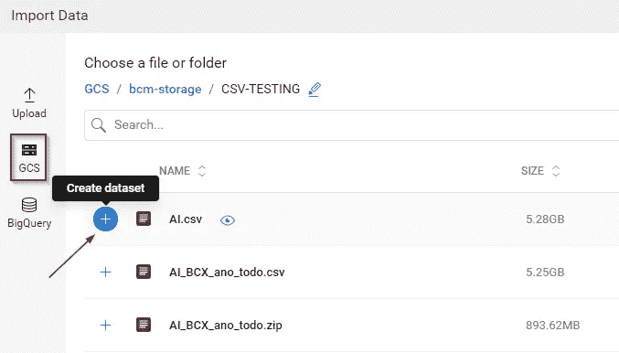
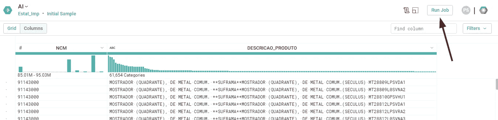
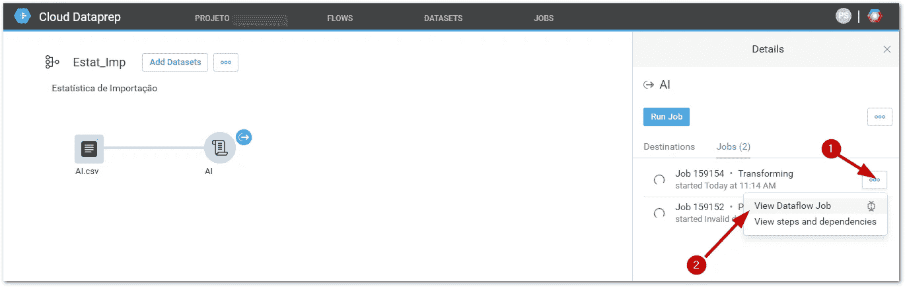

# 使用 Google Cloud 数据流和 Dataprep 将 Oracle 数据(ETL)转换为 Google BigQuery

> 原文：<https://medium.com/google-cloud/oracle-data-to-google-bigquery-using-google-cloud-dataflow-and-dataprep-20884571a9e5?source=collection_archive---------0----------------------->

# ETL 变得简单

尽管事实上 ETL 任务在加载大数据时非常具有挑战性，但仍然存在这样一种场景，即您可以相对容易且非常有效地从 Oracle 向 BigQuery ( [Analytics 数据仓库 Google Cloud](https://cloud.google.com/bigquery/) )加载千兆字节或兆兆兆字节的数据。

> 数据准备和转换过程消耗了数据科学家近 80%的时间。

在我的例子中，下图是基于云架构，我们已经为我们的客户使用机器学习库创建了云架构，如 pandas、numpy 和其他数据科学库。我们客户的数据库表被导入 BigQuery，以便使用 Google Cloud Dataprep 进行进一步的数据准备和转换。

*   我想提一下 [TRIFACTA](https://www.trifacta.com/) 的出色工作，这是一家与谷歌共同开发 Dataprep 的公司。

这个工具真的很有用，很省时，可以说它让我们的数据科学家笑了。


数据管道

# 步骤:

## 1.将 Oracle 数据库表导出到 CSV。

您也可以使用第三方 ETL 工具将您的数据库直接连接到 BigQuery，如这个[链接](https://cloud.google.com/bigquery/partners/)中所述，省去了下面描述的一些步骤。

## 2.将文件上传到云存储桶。


GCP 数据存储桶

## 3.创建数据集并将 csv 数据导入 Google Cloud Dataprep


选择数据集并从云存储中导入数据:


Dataprep —选择 csv 并创建数据集

选择云存储桶并选择要导入的文件:



## 4.将数据集添加到流中，以在 Google Cloud 数据流上运行作业


添加新配方


编辑配方


## **5。清除数据并将作业设置为运行**

我真的很喜欢它可以轻松地与谷歌云平台上的所有其他工具集成。您可以在数据清理上节省大量时间，数据科学家可以专注于业务价值。



我不会详细介绍 Dataprep，因为还有其他很棒的帖子可以用作参考。；)

## 6.编辑作业

您也可以安排作业定期运行。Dataprep 提供了这个选项。


## **7。在 BigQuery 上创建一个新表**


## 8.保存设置并运行作业


## 9.查看数据流上运行的作业



谷歌云数据流工作详细信息


## 10.检查结果

Dataprep 对于数据分析的重要性不亚于飞行前清单对于数据科学飞行员的重要性。


## 11 视图 Bigquery 表

选择搜索字符串的示例(38.5 米的行)。

*   查询完成(耗时 16.0 秒，处理 4.78 GB)

```
#standardSQL
SELECT * FROM
 `project.BCM.AI` t
WHERE
 REGEXP_CONTAINS(LOWER(TO_JSON_STRING(t)), r’caixa marcha’)
```


# 后续步骤:

*   利用 GCP 数据实验室(数据科学笔记本)探索大查询。


数据实验室

*   与 [GCP 数据工作室](https://cloud.google.com/data-studio/)一起探索大数据可视化

# 参考资料:

[](https://codelabs.developers.google.com/codelabs/mlimmersion-dataprep/index.html?index=..%2F..%2Fcloud#4) [## 在云数据准备中计算时间窗特征

### 在本实验中，您将使用 Google Cloud Dataprep 获取、转换和分析出租车数据集。我们将计算…

codelabs.developers.google.com](https://codelabs.developers.google.com/codelabs/mlimmersion-dataprep/index.html?index=..%2F..%2Fcloud#4)  [## 为谷歌云平台上的云原生数据仓库设计 ETL 架构

### 了解如何使用谷歌云数据流、谷歌云发布/订阅和谷歌应用程序为谷歌大查询构建 ETL 解决方案…

cloud.google.com](https://cloud.google.com/blog/big-data/2017/05/designing-etl-architecture-for-a-cloud-native-data-warehouse-on-google-cloud-platform) [](https://cloud.google.com/dataprep/) [## 云数据准备-数据准备和数据清理|谷歌云

### Google Cloud Dataprep 是一个智能数据准备和清理服务，用于可视化探索、清理和…

cloud.google.com](https://cloud.google.com/dataprep/) [](https://cloud.google.com/data-studio/) [## 数据工作室-漂亮的数据可视化|谷歌云

### Google Data Studio 将您的数据转化为信息丰富的仪表板和报告，易于阅读、共享和定制…

cloud.google.co](https://cloud.google.com/data-studio/)