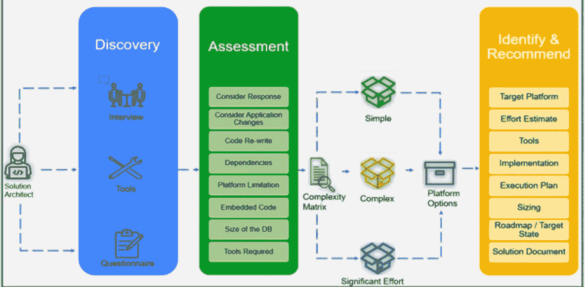
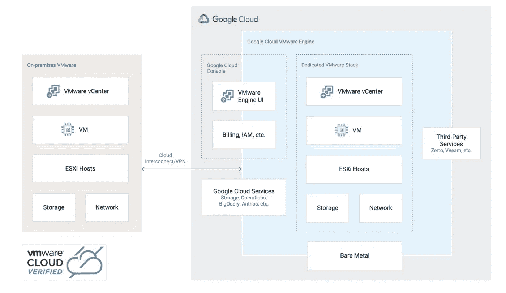
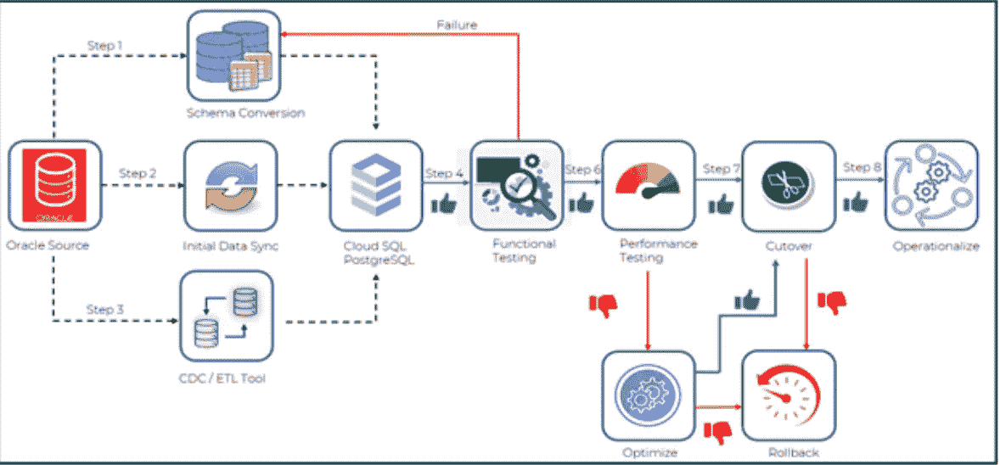

# Oracle 向 GCP 的迁移

> 原文：<https://medium.com/google-cloud/oracle-migrations-to-gcp-ced7246e1151?source=collection_archive---------2----------------------->

随着最近公共云的异常增长，越来越多的企业正在将其基础架构、应用程序和数据库迁移到云。数据库迁移是任何工作负载迁移的最重要的组成部分之一，是的，由于以下几个原因，它可能是一项具有挑战性的任务:

*   许多专有技术和功能内置于传统数据库技术和功能中，如存储过程、自定义函数、Oracle RAC 等。
*   历史上的本地数据库都是庞大的服务器。
*   不兼容问题:面向内部和外部的应用程序都依赖于数据库，可能与不同的数据库平台不兼容。

Oracle 数据库迁移到 Google Cloud 是许多组织正在采用和关注的重要用例之一，以开始他们的旅程。

# Oracle 在 GCP 的迁移策略

通常，有两种类型的数据库迁移:

1.  同构迁移(提升和转移/重新托管、重新搭建平台)
2.  异质迁移

一切从评估开始；这是订婚最关键的阶段。在评估期间花时间分析源数据库，以便为不同类型的迁移和方法建立合适的候选数据库，这一点很重要

# 同质迁移

# 主机更换

您保留相同的数据库引擎，但只是从内部迁移到云。在不改变基础平台(OS)或应用程序的情况下，在云上重新托管数据库。在 Google Cloud 上有多种方法可以实现这一点:

*   通过扩展到 GCVE(Google Compute VM-ware Engine)在 Google Cloud 上重新托管虚拟化 VM-Ware 工作负载。
*   将裸机解决方案用于专业工作负载
*   在 GCE(谷歌计算引擎)上重新托管数据库

这种方法非常常见，并且带来了很多好处，例如:

*   您已经拥有训练有素的员工，他们了解技术并熟悉当前的解决方案。因此，将它迁移到云上不会影响资源，因为没有太多与之相关的学习曲线，同时它加快了迁移时间。
*   数据库引擎仍然是一样的—您的应用程序重写次数更少，或者说没有应用程序更改，这意味着更低的风险和更短的迁移时间。

**裸机解决方案**

为了迁移具有特定配置的 Oracle 工作负载，谷歌云提供了[裸机解决方案](https://cloud.google.com/bare-metal)，在这里您可以简单地提升和转移您的工作负载。裸机解决方案提供硬件、硬件支持以及集成的计费和支持。该基础设施通过高度弹性的互连进行连接，并以不到 2 毫秒的延迟连接到所有本机 Google 云服务。

**将数据库迁移到谷歌云 VMware 引擎(GCVE)**

有些客户希望将数据库从内部(物理或 VMware)迁移到 Google Cloud VMware Engine (GCVE)。在开始数据库升级和现代化工作流之前，许多客户选择这种提升和转移迁移方法作为将数据库快速迁移到 Google Cloud 的第一步。

## GCVE 是什么？

GCVE 是一项完全托管的服务，允许您在 Google Cloud 中运行 VMware 平台。该解决方案包括 vSphere、vCenter、vSAN、NSX-T 和相应的工具。GCVE VMware 环境在一些 Google Cloud 位置的 Google Cloud 裸机基础架构上本机运行，GCVE 服务包括帮助高效、安全地使用 VMware 平台所需的所有功能。每个集群至少由三个节点组成，并通过 vSphere High Availability 提供高可用性。

需要记住的要点:

*   一个 GCVE 私有云= 1 个 vCenter + 1 个 NSX-T 经理+ 1 个 HCX 经理
*   GCVE 不允许 vSphere 或 HCX 管理网络的 CIDR 范围重叠。
*   一个集群必须至少有三个节点。

## GCVE 的数据库迁移工具

有许多工具可以将服务器迁移到 GCVE，下面列出了两个常见的选项。

**VMware HCX** VMware HCX 用于将虚拟机从您的内部 VMware 环境迁移到 Google Cloud VMware 引擎。GCVE 要求在本地和私有云中下载、安装、部署和配置 [HCX 连接器 OVA](https://docs.vmware.com/en/VMware-HCX/4.3/hcx-user-guide/GUID-A26BFB16-FA94-426F-8E18-15BAD4BF840E.html) 。本地 vCenters 和 HCX 连接器应用装置之间存在 1:1 的对应关系。例如，如果有 10 个安装了 VMware 的数据中心，则每个 vCenter 都需要安装一个连接器。

**PlateSpin Migrate** [PlateSpin Migrate](https://www.microfocus.com/en-us/products/platespin-migrate/overview)是一款数据中心迁移工具，可将工作负载基础架构与其软件(操作系统、应用程序和数据)分离，从而将物理服务器迁移至 VMware 虚拟机管理程序等目标服务器平台。一个常见的使用案例是在迁移到 GCVE 时进行两步迁移，首先从 P2V 内部部署开始，然后使用 HCX 从 V2V 迁移到 GCVE。

# 平台

保持应用程序不变，同时采用与云兼容或有助于在将工作负载迁移到云的同时创造附加值的平台。保留您的核心应用程序代码并迁移到新平台，以帮助降低许可费用和维护成本。例如，将运行在 AIX 上的数据库移植到 Linux 平台上

其他一些例子包括本地 MS SQL Server / MySQL / PostgreSQL 向云 SQL 的迁移。比如用 [Cloud SQL for PostgreSQL](https://cloud.google.com/sql) 进行现代化开源，与 Oracle 有很多相似之处。

您还可以将以数据分析为中心的工作负载卸载到与 SQL 兼容的数据仓库解决方案，如 [BigQuery](https://cloud.google.com/bigquery) 。

# 异质迁移

# 重写

另一种类型的迁移称为异构迁移，在这种迁移中，您希望移植旧的数据库引擎。组织通常将此用于现代化或数字化转型。重写您的应用程序，以充分利用云原生数据库。如果您的应用程序需要一个具有全局可伸缩性的关系数据库，您可以迁移到[云扳手](https://cloud.google.com/spanner)，它提供可伸缩性和业界领先的 99.999% SLA 的高可用性。

触发异构迁移的原因

*   许可和续订成本
*   随着业务的增长，组织倾向于开发越来越多的新应用程序。因此，要利用云的优势，如成本节约、降低 TCO(总拥有成本)
*   减少您对特定供应商专有技术的依赖。
*   采用开源技术

虽然从高层次上看，从 Oracle 这样的企业数据库迁移到 PostgreSQL 这样的开源数据库似乎是一个有利可图的提议，但人们可以立即看到积极的影响，例如没有定期更新成本，可以自由选择开源数据库。然而，在选择前进道路时，必须考虑以下因素。

*   没有两个定制的应用程序会有相同的模式。重要的是要理解，与提升、转移和重新搭建平台不同，异构转换的问题更深层次。数据库对象和代码不能按原样迁移。在提交之前进行深入的模式级分析是很重要的。
*   是否有嵌入式代码或 ORM(对象关系映射器)
*   在应用程序重构或数据库代码重写的情况下，业务逻辑知识是必不可少的。
*   源数据库和目标数据库之间的功能不匹配。例如，在源上可用的本地包在目标上可能没有对等的包。这需要寻找解决具体问题的方法，这很费时间。
*   停机可用性，虽然它不是代码转换期间的一个因素。在转换期间，它可能会成为一个关键的依赖项。因此，工具的选择变得至关重要。
*   代码的复杂性和数据库的大小是决定所需工作量的因素。
*   如果应用程序已经开发了一段时间，那么最初的应用程序开发人员很有可能不再是团队的一部分，并且可能需要重写遗留代码。
*   尽管功能测试是应用程序团队的主要职责，但它需要数据库资源的参与。预计花费在功能和性能测试上的总时间约为 50%。这些数字是指示性的，可能会根据模式和应用程序的复杂性/要求而有很大变化。

平台的选择对于迁移的成功至关重要，因为不同的平台提供不同的功能。平台的选择会影响代码兼容性是主要问题的工作。工具的选择取决于平台的选择和停机时间的可用性(特别是对于生产环境)

迁移工具的选择是另一个重要因素。有几个开源和许可的工具可供使用。两者都有各自的优势、挑战和成本。知道何时使用哪种工具是基于团队的经验。例如，在某些情况下，您可能更喜欢使用 Ora2PG 这样的开源工具进行转换，而不是使用 Ispirer 这样的授权工具，反之亦然。

对于无法承受转换期间停机或需要并行运行的关键应用程序/数据库，数据大小和数据更改率是需要考虑的因素。那么必须考虑基于 CDC(变更数据捕获)的同步工具，以促进接近零的停机时间、连续同步和可能的回滚。有云原生工具和第三方工具可供选择。

下图提供了异构迁移步骤的高级视图，例如从 Oracle 到云 SQL。

# 结论

数据库迁移是一个复杂的过程，组织应该通过深入评估，利用充分证明的规划来决定他们的云路线图。同构和异构迁移都有各自的优势和挑战，在发现和评估阶段必须加以考虑。通过仔细的规划、正确的策略、工具和资源，成功的迁移是可以实现的，组织可以获得 Google Cloud 的真正好处。