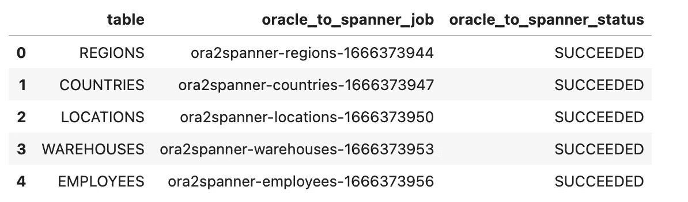

# Oracle 到云扳手:使用 Vertex AI 笔记本和 GCP Dataproc 无服务器将 Oracle 数据库迁移到云扳手

> 原文：<https://medium.com/google-cloud/oracle-to-cloud-spanner-migrate-oracle-database-to-cloud-spanner-using-vertex-ai-notebooks-and-gcp-49152ce7f4e8?source=collection_archive---------1----------------------->

正在寻找将 Oracle 表并行迁移到 Cloud Spanner 的预构建解决方案吗？别再看了。我们开发了一个 Vertex AI 笔记本(Jupyter notebook)解决方案，它使用 dataproc 无服务器进行迁移。您只需提供必要的参数，笔记本将帮助您将完整的 Oracle 数据库迁移到 Cloud Spanner。

[Dataproc 模板](https://github.com/GoogleCloudPlatform/dataproc-templates)使用 [VertexAI 笔记本](https://cloud.google.com/vertex-ai/docs/tutorials/jupyter-notebooks)和 [Dataproc 无服务器](https://cloud.google.com/dataproc-serverless/docs)提供一站式解决方案，将数据直接从 MySQl 迁移到 Cloud Spanner。

1.从 [API 控制台](https://console.developers.google.com/)启用 GCP 项目中的以下服务:

*   计算引擎 API
*   Dataproc API
*   顶点人工智能应用编程接口
*   顶点笔记本 API

2.在[顶点 AI 工作台中创建一个](https://pantheon.corp.google.com/vertex-ai/workbench/list/instances)[用户管理的](https://cloud.google.com/vertex-ai/docs/workbench/user-managed/introduction)笔记本。

3.使用 GIT 选项卡克隆 Dataproc 模板 GitHub repo，如下图所示

或者从启动窗口打开一个终端，使用 git clone 进行克隆。

`git clone [https://github.com/GoogleCloudPlatform/dataproc-templates.git](https://github.com/GoogleCloudPlatform/dataproc-templates.git)`

4.从文件夹选项卡中，打开路径为 data proc-templates/notebooks/Oracle 2 spanner 的**Oracle tospanner _ notebook . ipynb**notebook

5.笔记本包含帮助将数据从 Oracle 迁移到 Cloud Spanner 的分步过程。逐一运行每个步骤。笔记本里有详细的说明。下面是迁移的步骤:

**第一步:安装所需的软件包**

迁移所需的一些软件包需要单独安装，因为它们在笔记本中不可用，例如 SQLAlchemy、JDK 等。

**步骤 2:导入库:**导入所需的包

**第三步:分配参数:**运行笔记本前需要设置以下配置:

**步骤 3.1:通用参数**

*   `PROJECT` : GCP 项目标识
*   `REGION` : GCP 地区
*   `GCS_STAGING_LOCATION` : GCS 暂存位置，用于此笔记本存储工件
*   `SUBNET` : VPC 子网
*   `JARS`:坛子清单。对于这个笔记本，除了 dataproc 模板 jar 之外，还需要 mysql 连接器和 avro jar
*   `MAX_PARALLELISM`:并行运行作业数参数，默认值为 2
*   `SERVICE_ACCOUNT`:自定义服务帐户电子邮件，用于笔记本中提到的权限的顶点 ai 管道和 dataproc 作业

**步骤 3.2: Oracle 到云扳手参数**

*   `ORACLE_HOST` : ORACLE 实例 ip 地址
*   `ORACLE_PORT` : ORACLE 实例端口
*   `ORACLE_USERNAME`:甲骨文用户名
*   `ORACLE_PASSWORD`:甲骨文密码
*   `ORACLE_DATABASE`:要迁移的数据库的名称
*   `ORACLE_TABLE_LIST`:您要迁移的表的列表，例如:['table1 '，' table2']否则提供一个空列表以迁移整个数据库，例如:[]
*   `SPANNER_INSTANCE`:云扳手实例名
*   `SPANNER_DATABASE`:云扳手数据库名称
*   `SPANNER_TABLE_PRIMARY_KEYS`:为 Oracle 中没有主键的表提供格式为{"table_name":"primary_key"}的字典
*   `SPANNER_OUTPUT_MODE` : <追加|覆盖>

**步骤 3.3:笔记本配置参数**

这些参数包含 dataproc 作业所需的 jar 和属性的路径。除非您想要更改 jar 的位置，否则不需要更改这些参数。

**第四步:生成 Oracle 表列表**

这一步生成要迁移的表列表。如果步骤 3.2 中的`ORACLE_TABLE_LIST`参数为空列表，则选择数据库中的所有表格。

**步骤 5:获取 SPANNER_TABLE_PRIMARY_KEYS 中不存在的表的主键**

该步骤获取出现在`ORACLE_TABLE_LIST`参数中的表的主键，如果这些表的主键未在步骤 3.2 的参数`SPANNER_TABLE_PRIMARY_KEYS`中提供

**步骤 6:获取表的行数并识别分区列**

该步骤使用`PARTITION_THRESHOLD`(默认值为 1 百万)参数，任何行数大于`PARTITION_THRESHOLD`的表都将基于主键进行分区

**第 7 步:下载 JAR 文件并上传到 GCS(只需要运行一次)**

该步骤创建所需的 JAR 文件，并将其上传到步骤 3.1 中定义的`GCS_STAGING_LOCATION`

**步骤 8:计算 Oracle 到云扳手的并行作业**

基于步骤 3.1 中设置的`MAX_PARALLELISM`参数，该步骤计算 Oracle 到 Cloud Spanner 迁移的并行作业。基本上是将并行迁移到 Cloud Spanner 的 Oracle 表的数量。

**步骤 9:执行管道将表从 Oracle 迁移到 Cloud Spanner**

这一步启动 Oracle 表迁移的顶点 AI 管道执行。为每个作业生成管道链接。我们还可以在 Dataproc UI 的[批处理](https://console.cloud.google.com/dataproc/batches?_ga=2.256091016.2085864710.1666708114-43261181.1657894175)部分看到作业正在运行

**步骤 10:获取从 Oracle 迁移到 Cloud Spanner 的表的状态**

该步骤获取在步骤 9 中执行的作业的状态

**步骤 11:验证从 Oracle 迁移到 Cloud Spanner 的表的行数**

这些步骤有助于验证从 Oracle 迁移到 Cloud Spanner 的每个表的记录数量

如有任何疑问/建议，请联系:dataproc-templates-support-external@googlegroups.com