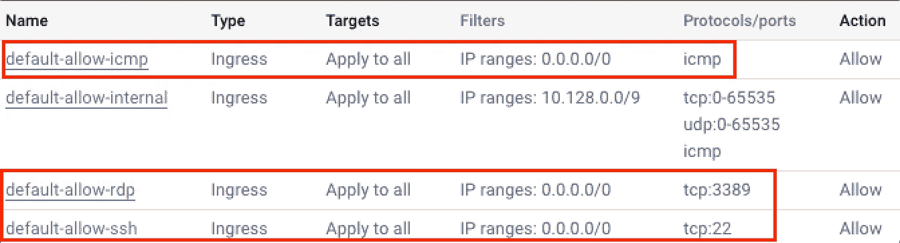

# 必须启用的组织政策，以加强您的 google 云安全。

> 原文：<https://medium.com/google-cloud/organization-policies-that-needs-to-be-enforced-to-tighten-your-gcp-security-f3bfb724e9dd?source=collection_archive---------0----------------------->

向所有人问好。今天，我们将探讨 gcloud 组织政策如何帮助建立跨项目的标准，并了解如果不采取行动会产生什么影响。

什么是组织政策，为什么我需要改变它们？
组织策略由约束组成，这些约束定义了跨项目使用资源的一组规则和限制。有几个策略可能会对项目产生影响，默认情况下会启用它们。我们将看到一些有助于加强 GCP 环境安全的方法。

**注意** :-对大多数组织策略的更改不会影响现有的资源/权限，它们将仅在新的更改时实施。但是，很少有策略会撤销现有权限，请确保在执行任何策略之前确认相同的权限。
通过以下链接访问组织政策
[https://console . cloud . Google . com/iam-admin/org policies/list？organization id =](https://console.cloud.google.com/iam-admin/orgpolicies/list?organizationId=)your _ GCP _ org _ id _ here

以下是一些有助于确保 GCP 安全的政策。

**禁用默认网络创建** 启用此选项将在新项目中创建一个默认 VPC 网络，并低于默认防火墙规则，将网络中所有实例上的 RDP 和 ssh 端口以及 ICMP 暴露给整个互联网，如果实例与公共 IP 连接，这可能会导致攻击暴露。



确保强制执行此组织策略，以避免创建默认网络。如果它已经在当前环境中使用，请确保在所有现有项目中删除上面列出的防火墙规则。
运行下面的命令来审计项目中的所有防火墙规则，并查找与上面匹配的任何规则名称。

```
gcloud asset search-all-resources --asset-types=compute.googleapis.com/firewall --scope=organizations/your_org_id_here --format="table(displayName,project)"
```

**禁用默认服务帐户的自动 IAM 授权** 在您的组织策略中默认启用此选项将为计算和云服务创建一个默认服务帐户，该帐户默认具有编辑者角色


当然，我希望你不要让任何用户以编辑的身份访问与 VM 实例绑定的服务帐户和任何可以用来对 GCP 项目进行各种控制的组件。请确保实施此策略，并重新检查您的 GCP 项目的所有默认服务帐户权限。

以下是由 gcloud
`project-id@appspot.gserviceaccount.com
project-number-compute@developer.gserviceaccount.com`
`project-number@cloudservices.gserviceaccount.com` 创建的默认服务帐户了解更多关于默认服务的信息[这里](https://cloud.google.com/iam/docs/service-accounts#default)

**实施公共访问防护** 如果您想要限制某人意外公开暴露存储桶，此策略将有助于减少此类事件。这将防止存储桶公开暴露它们。此外，实施此策略将撤销在 IAM 级别或 ACL 级别上拥有公共权限 allusers/allauthenticatedusers 的所有现有存储桶。

如果存在公开公开对象的用例，并且您不能强制执行此策略，请考虑对 bucket 使用细粒度访问，这将允许将对象级别的权限设置为公开，而不是将整个 bucket 公开。将整个桶公开将会泄漏桶中所有对象的密钥标识符。使用细粒度访问，您可以通过编程将单个对象强制发布给公众。请参考文档[中的](https://cloud.google.com/storage/docs/access-control/making-data-public#objects)。

**域受限共享** 默认情况下，所有域实体都允许添加到 gcloud 中的 IAM 策略中，像 gmail.com 或者其他任何域。通过强制实施属于允许或拒绝客户 id 工作区域的主体来启用此策略将避免添加不需要的域 ID。通过在强制中添加您的工作区 ID，您可以通过选择允许策略类型来限制属于您的工作区域的域。

要获取您自己工作区的客户 id，请参考此处的。

在您的 GCP 组织中运行审计，以查找是否有任何第三方域 ID 被添加到 IAM 策略中，并执行清理。

```
gcloud beta asset search-all-iam-policies --scope=organizations/your_gcp_org_id_here
```

**禁用虚拟机串口访问** 访问虚拟机串口访问没有 IP 限制。任何拥有实例 ssh 用户和密钥线索的人都可以访问任何人，即使没有 IAM 访问权限。保持这一点将有助于确保没有虚拟机启用虚拟机串行端口访问。

**禁用服务帐户密钥创建** 默认情况下，服务帐户密钥的创建会将密钥设置为“Jan 10000”，这将导致拥有永久认证 SA 的密钥，并且永不过期。应该强制执行此策略，以防止密钥滥用，并在组织中建立标准的密钥轮换策略来限制密钥创建。
我们之前已经讨论过服务账户密钥的最佳安全实践[这里](/@madhusm/best-security-practice-for-service-account-on-gcloud-3146e977dad3)

**限制云 SQL 实例上的公共 IP 访问** 通过控制台选择创建云 SQL 实例的默认配置会导致附加公共 IP。尽管授权网络是专门添加的，但将 SQL 放在内部网络上是最佳实践，而不是通过公共 IP 访问它们。实施这一点将有助于减少云 SQL 在公共网络上的暴露。

我希望这将有助于在您的 GCP 环境中审计和执行一些安全标准。很快再见