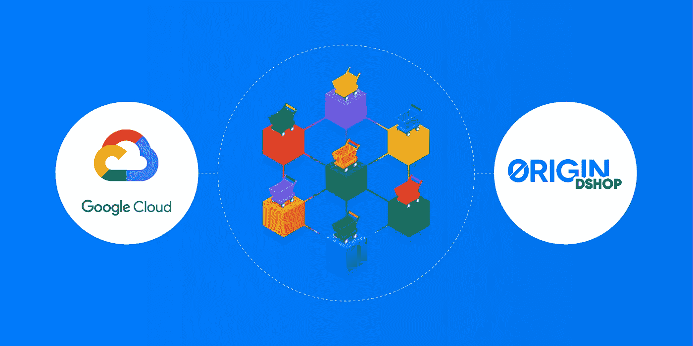
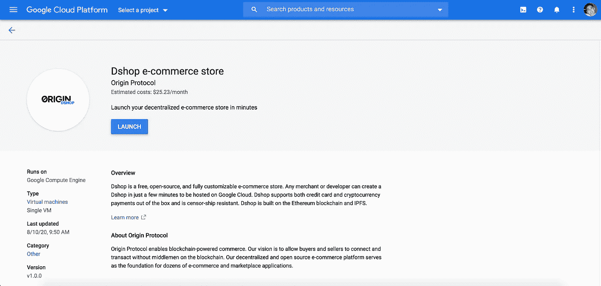
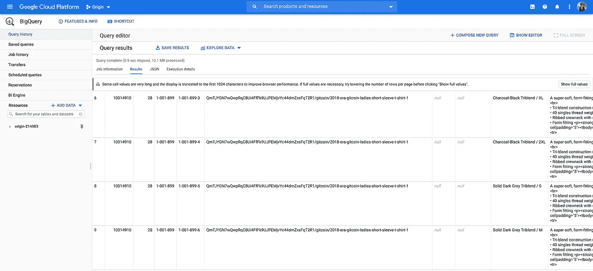
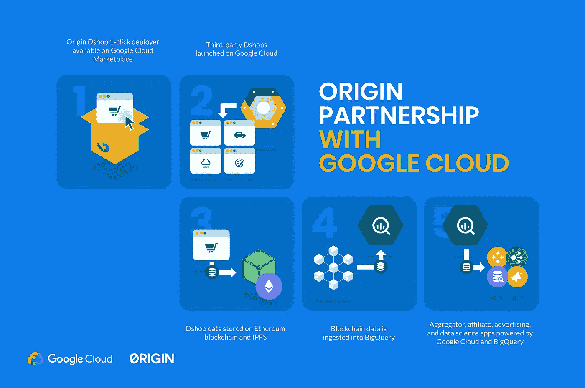

# Origin 在 Google Cloud Marketplace 上推出分散式商务

> 原文：<https://medium.com/google-cloud/origin-launches-decentralized-commerce-on-google-cloud-marketplace-b74fb46be7d9?source=collection_archive---------0----------------------->

我们很高兴地宣布，Origin 已经与 Google Cloud 合作，将我们的分散式商务平台引入 Google Cloud 广泛的全球开发者和客户网络。

作为合作伙伴关系的一部分，Origin 将其 Dshop 电子商务平台放在了谷歌云市场上。商家可以在几分钟内部署和创建自己的分散式电子商务商店。此外，Origin 的商业合作伙伴的公开产品数据现在可以在 Google BigQuery 中获得。开发者、数据科学家和其他感兴趣的团体将能够通过 Origin 的合作伙伴网络快速分析以太坊区块链和 IPFS 产生的数据。

**谷歌云市场整合**

Origin 的 [Dshop](http://www.originprotocol.com/dshop) 1-click deployer 现在可以在 [Google Cloud Marketplace](https://console.cloud.google.com/marketplace/details/originprotocol-public/origin-protocol-dshop) 上使用，允许经验丰富的开发者、大型电子商务商家和个人卖家在几分钟内部署他们自己的分散商店。

作为谷歌云合作伙伴，Origin 致力于与谷歌云密切合作，向广泛的商业合作伙伴推广我们的分散式商店平台，同时推动谷歌云的新客户增长和收入。我们设想未来，许多不同垂直行业(电子商务、数字商品、租赁和其他服务)的数千家数据商店将由运行在谷歌云基础设施上的 Origin 技术平台提供支持。我们期待着与谷歌云团队合作，在不久的将来将新的技术集成推向市场。

只需点击一下，即可在 Google 上启动您的 Dshop

只需几分钟，你就可以在谷歌云上启动自己的 Dshop。查看我们的[指南](https://github.com/OriginProtocol/dshop/blob/master/backend/scripts/gcp/marketplace/GCP_Deployment_Guide.pdf)开始行动。部署后，下面的教程视频将向您展示如何完成设置您的 Dshop。

**谷歌大查询集成**

Origin Dshop 数据现在也可以在 Google BigQuery 中公开获得。因为 Origin 是建立在以太坊区块链和 IPFS 的基础上的，来自选择在链上发布数据的商家的产品列表数据是公开的。区块链是由这些商业伙伴生成的所有产品数据的权威来源。这些商业合作伙伴希望他们的产品能够很容易地被客户和代销商发现，从而有助于推广产品和推动销售。然而，区块链难以编制索引，使得数据分析困难且耗时。

随着今天的宣布，Origin 的 Dshop 数据将通过使用谷歌云参与的[以太坊 ETL 库](https://github.com/blockchain-etl/ethereum-etl)在谷歌 BigQuery 中可用。

Google BigQuery 中的原始数据

简单地说，Google BigQuery 集成就像将 Google 搜索引入区块链数据。这意味着代销商可以很容易地发现要推广的产品，有利于商家增加销售额。数据科学家可以执行分析来了解区块链支持哪种类型的商家和产品。开发人员可以查看这些数据，并利用 Origin 共享公共数据层的数据构建新的强大的第三方应用程序。

相关数据集在 Google BigQuery 上的`origin-214503.marketplace.listings`和`origin-214503.dshop.products`表中。

起源和谷歌云流程

在 Origin，随着 Dshops 用户群的增加，我们很高兴能够产生有趣而有用的数据。我们特别期待看到我们更广泛的开发人员、分支机构和其他生态系统参与者在这些开放数据的基础上构建了什么。

**了解更多关于 Dshop**

Origin Dshops 是分散的商店，可完全定制，抗审查，免费使用。运营 Dshops 的开发者和商家可以完全控制他们的卖家体验。

除了传统的信用卡和 PayPal 之外，数字商店还可以接受加密货币支付，如以太坊(ETH)和 ERC 20 代币，如 Origin Tokens (OGN ),为商家和消费者提供了灵活的支付选择。Origin 的分散商店还与精选的直运服务提供商进行了本地集成，使客户订单的履行变得简单而轻松。

***了解更多关于起源的信息***

*   *在 Google 上部署 Dshop:*[*console.cloud.google.com*](https://console.cloud.google.com/marketplace/details/originprotocol-public/origin-protocol-dshop?preview=originprotocol-public%2Forigin-protocol-dshop&project=origin-214503)
*   *推出你的分散商店:*[【originprotocol.com/dshop】T21](https://originprotocol.com/dshop)
*   *购买起源令牌(OGN):***[*火币*](https://www.huobi.com/en-us/exchange/ogn_usdt/)*[*Upbit*](https://upbit.com/exchange?code=CRIX.UPBIT.BTC-OGN)*[*bit trex Global*](https://global.bittrex.com/Market/Index?MarketName=BTC-OGN)****
*   ***追踪 originprotocol.com/dashboard 令牌指标:***
*   ****在我们公司网站了解更多:*[*originprotocol.com*](http://originprotocol.com/?source=post_page---------------------------)***