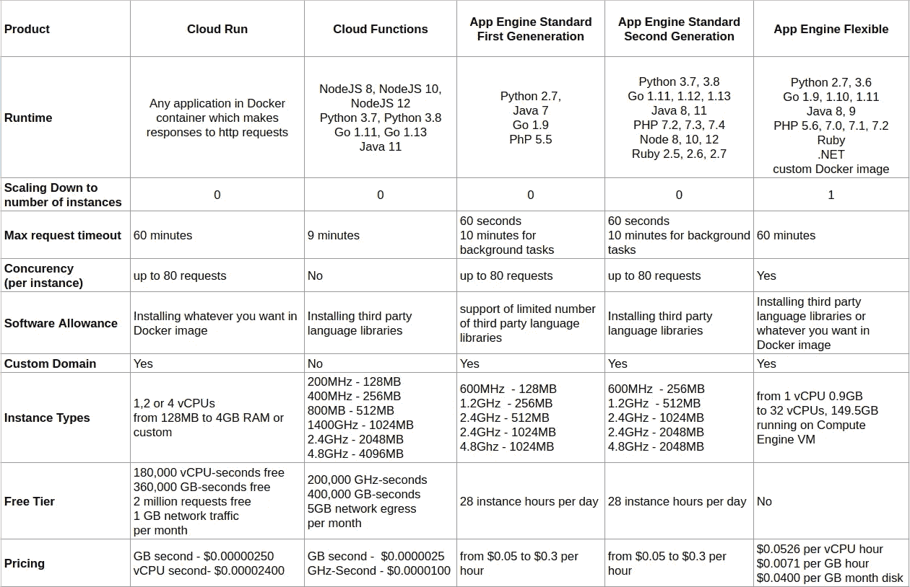

# 谷歌云平台上无服务器计算产品概述

> 原文：<https://medium.com/google-cloud/overview-of-serverless-compute-products-on-google-cloud-platform-f4aa47a14ecb?source=collection_archive---------0----------------------->

随着 [Google Cloud Run](https://cloud.google.com/run/) 在 Cloud Next 2019 期间推出，无服务器/托管计算家族迎来了一名新成员。

现在有 3 种主要产品:

*   应用引擎(我在这里写了更多关于它的细节
*   云函数
*   云跑。

Cloud Run 如何适应这里，它的属性和用例是什么？

我创建了一个比较表，以便更容易与谷歌云上的其他无服务器计算产品进行比较。

最后更新日期 2020 年 11 月。

[指向谷歌电子表格的网址](https://docs.google.com/spreadsheets/d/1zYcREIgdVXL-RX-bU9PXYyJ-oy4VlhihmjQZH84upUs/edit?usp=sharing)

Cloud Run 最大的卖点是，你可以部署任何 Docker 映像(其中应用程序响应 HTTP 请求)，自动扩展，你不必担心配置基础架构，你只需为使用付费。另一个选择是直接部署到 Google Kubernetes 引擎，以防您想要使用您更容易控制的基础设施。

我个人喜欢的一个很好的功能是可以打开或关闭互联网服务。如果您不想将服务暴露在互联网上，访问是通过 IAM 来管理的，即具有适当角色的服务帐户。

我还喜欢将 Cloud Run 用作异步任务工作器的可能性，其中任务由 Pub/Sub 消息触发(这触发了定义的 Cloud Run URL 端点)，尽管如果 PubSub 可以基于事件运行任何容器(而不仅仅是响应 HTTP 请求的容器)会很酷(现实生活中的例子)。

我还缺少一些基本图表，如每秒请求数、延迟、时间段内的实例数等，因为它在云功能或应用引擎中。有可能在 Stackdriver 中实现这一点，但在服务细节中直接实现更简单。例如，日志在服务细节下。

无论如何，有了云运行，谷歌云的无服务器前景在可能性方面看起来更加光明。

并且记住[没有别的无服务器](/@zdenulo/nothing-else-serverless-2b2ec459c800)！