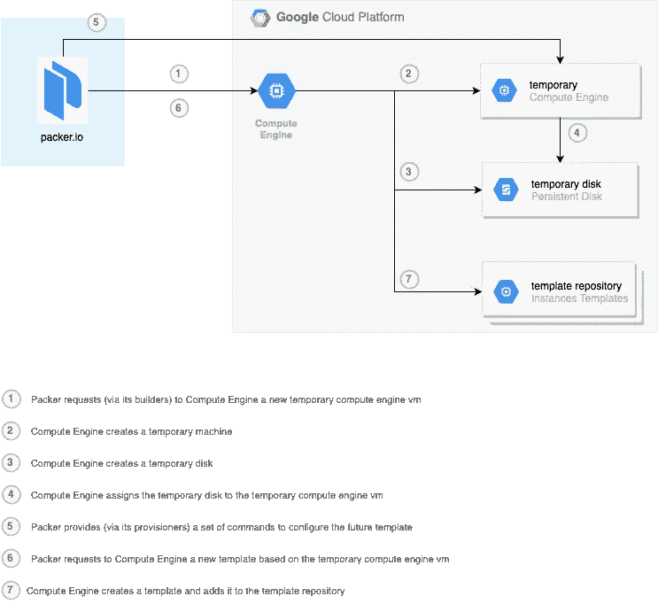

# 封隔器和屏蔽 dVM 支架

> 原文：<https://medium.com/google-cloud/packer-and-shieldedvm-support-7573fbe65e30?source=collection_archive---------2----------------------->

[***屏蔽的虚拟机***](https://cloud.google.com/shielded-vm/) 是来自谷歌云平台( *gcp* )的一个很棒的工具，它允许您拥有定制的映像，经过预先批准、烘焙和屏蔽(不可修改)，随时可以在谷歌计算引擎( *gce* )中进行配置。

***屏蔽的虚拟机*** 在与 ***约束/compute . requireshieldevm***约束(来自[组织策略](https://cloud.google.com/resource-manager/docs/organization-policy/org-policy-constraints))结合使用时效果极佳。

另一方面， ***Packer*** 是处理和管理跨不同云提供商的定制映像的创建和维护的绝佳工具。

为了烘焙出新的形象 ***张风*** 有各种各样的[](https://www.packer.io/docs/builders/index.html)*。构建者的目标是在选择的云( ***gce*** )内部署和供应虚拟机。调配虚拟机后，构建器还负责根据之前配置的磁盘创建新映像。*

**

*包装机架构和工作流程*

*在***【GCP】***中使用 ***Packer*** 作为提供和管理映像的工具的缺点是它不具备与 ***屏蔽的虚拟机*** 接口的能力。换句话说， [googlecompute](https://www.packer.io/docs/builders/googlecompute.html) 构建器缺乏基于 ***屏蔽虚拟机*** 创建屏蔽映像的能力。*

*为了克服这个障碍，我在 ***Packer 的*** [源代码](https://github.com/hashicorp/packer)上做了一点小调整。*

*首先，必须了解 ***Packer*** 的内部架构以及它的局限性。*

****Packer*** 依赖于 go 和官方同行提供的现有云库(在我们这里是 google 项目)。*

*经过仔细考虑，我发现谷歌已经提供了(在其 go 库级别)对 ***屏蔽虚拟机*** 的支持。因此，剩下唯一要做的就是在 ***封隔器*** 层启用它们。*

*为此，您可能需要查看位于[***packer/builder/Google compute/driver _ GCE . go***](https://github.com/hashicorp/packer/blob/master/builder/googlecompute/driver_gce.go)的***GCP***provisioner 文件。*

*如果你仔细观察，你会发现对于 ***屏蔽虚拟机*** 没有配置块。同样，要启用它，需要添加以下配置块:*

```
*ShieldedInstanceConfig: &compute.ShieldedInstanceConfig{
   EnableSecureBoot: true,
   EnableVtpm: true,
   EnableIntegrityMonitoring: true,
}*
```

*我知道这可以通过添加变量而不是硬编码来修饰。但是你要记住，这样做是为了验证使用 ***Packer*** 作为 ***屏蔽虚拟机*** 在***【GCP】***内的管理工具的可行性。*

*我将把 diff 留给您，这样您就可以继续修补您的 ***打包器*** 代码副本，构建它并使用它在 ***gce*** 中提供定制的 ***屏蔽虚拟机*** 映像。*

```
*diff --git a/builder/googlecompute/driver_gce.go b/builder/googlecompute/driver_gce.go
index f2adaa591..82761d129 100644
--- a/builder/googlecompute/driver_gce.go
+++ b/builder/googlecompute/driver_gce.go
@@ -420,6 +420,11 @@ func (d *driverGCE) RunInstance(c *InstanceConfig) (<-chan error, error) {
   Tags: &compute.Tags{
    Items: c.Tags,
   },
+  ShieldedInstanceConfig: &compute.ShieldedInstanceConfig{
+   EnableSecureBoot: true,
+   EnableVtpm: true,
+   EnableIntegrityMonitoring: true,
+  },
  }d.ui.Message("Requesting instance creation...")*
```

*为了完成这个壮举，你可能想参考一下 ***Packer 的*** 官方文档，了解如何[构建和贡献](https://github.com/hashicorp/packer/blob/master/.github/CONTRIBUTING.md)这个项目。*