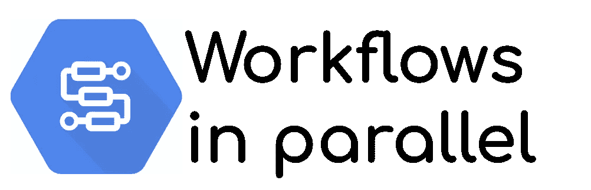

# Google 工作流的并行执行

> 原文：<https://medium.com/google-cloud/parallel-executions-with-google-workflows-3a16f8fee0eb?source=collection_archive---------0----------------------->



云组件有用且强大。然而，**它们都与其他的**断开连接，当你想要部署一个完整的管道时，**你需要把它们粘在一起**。你可以用 PubSub 和 Cloud 函数来实现。
然而，它很快**变成了一个有很多主题和功能的意大利面设计**。有一个**集中的地方来查看、管理和配置**您的管道工作流程可能会很棒！

# 谷歌工作流程

谷歌工作流程在这里进行。它已于 2020 年夏季在 Cloud Next on Air 上宣布，并于 2021 年 1 月开始正式上市。这是一个完全托管的解决方案，采用按使用付费的模式**。这是 Cloud Composer 的一个更轻便的*(也非常便宜的)*解决方案，基于 Apache Airflow。对于很多用例来说已经足够了，而且**对于未来**来说非常有前途。**

[Guillaume Laforge](https://medium.com/u/431147437aeb?source=post_page-----3a16f8fee0eb--------------------------------) (谷歌云开发者倡导者)已经分享了[他的工作流之旅](/google-cloud/day-1-with-cloud-workflows-your-first-step-to-hello-world-4b545064759e)。他们和 [Mete Atamel](https://medium.com/u/6444b44155fa?source=post_page-----3a16f8fee0eb--------------------------------) (也是谷歌云开发者倡导者)一起发布了[一篇很棒的博客文章](https://cloud.google.com/blog/topics/developers-practitioners/orchestrating-pic-daily-serverless-app-workflows)。
所以**主题已经被很好的覆盖和记录了**。

> 然而，有一个缺失的部分:工作流中并行化步骤的能力。

# 实验并行化

我参与了 Alpha 项目，来自测试人员**的最大需求**之一是调用的并行化。它已经被推到了开发团队的最高优先级。然而，**今天它还没有完全实现**，我们只有**一个可以使用的实验特性**:执行图。

在这个组件中，您需要引用

*   **您想要调用的工作流程 ID** 。*我将称之为“可调用工作流”*
*   一系列的争论。数组中的每个条目都是对*“可调用工作流”*的并行调用
*   *如果“可调用工作流”不在同一个区域和/或项目中，您也可以指定位置和项目 ID*

可以想象，通过设计，有 **2【限制】**

1.  您必须**创建另一个*可调用的工作流*** 才能使用执行图。你不能直接调用你想要的 API。
2.  您必须使用**相同的*可调用工作流*** *，*只是每个并行调用的参数不同。您不能并行化不同的*可调用工作流*，自定义参数总是相同的。

实际上，这不再是一个限制，参见 ***高级工作流程*** 部分查看解决方法。

无论如何，让我们先试一试。

# 首次并行执行

为了测试执行的并行性，我们需要**执行一个花费或多或少时间的调用**。*在现实世界用例中，你可以想象* ***几个 BigQuery 查询并行*** *，每个查询都有不同的执行时间。*
然后我们需要构建一个*可调用的工作流*来使用这个应用
，最后创建一个具有执行图实验特性的工作流

## 部署去瞌睡应用程序

为了等待更多或更少的时间，我创建了一个简单的 **Go 应用程序，它根据提供的查询参数** a `w`(以秒为单位)休眠。

你可以在 [Github 库找到它。](https://github.com/guillaumeblaquiere/parallel-workflow)克隆它并运行这个命令

```
gcloud beta run deploy --source=. --region=us-central1 \
  --platform=managed --allow-unauthenticated sleepy-app
```

*获取部署结束时提供的云运行服务 URL。*

## 创建可调用的工作流

这个可调用的工作流非常简单。它**使用参数**中提供的参数调用云运行服务(此处名称为`wait`)并打印结果。

```
main:
  params: [args]
  steps:
  - callSleepyApp:
      call: http.get
      args:
        url: <SLEEPY-APP URL>
        query:
          w: ${args.wait}
      result: result
  - returnOutput:
      return: ${result}
```

*用云运行服务 URL* 替换 `*<SLEEPY-APP URL>*`

*和部署工作流*

```
*gcloud workflows deploy --source=workflow/run-long-process.yaml \
     --location=us-central1 run-long-process*
```

**在 GitHub 资源库中，工作流文件都在* `[*workflow*](https://github.com/guillaumeblaquiere/parallel-workflow/tree/main/workflow)` [*目录下*](https://github.com/guillaumeblaquiere/parallel-workflow/tree/main/workflow) *。根据您的项目结构调整命令**

## *并行执行工作流*

*最后是执行图。如上所述，您需要**的*可调用工作流* ID(此处为** `**run-long-process**` **)并提供正确的参数。***

```
*main:
  steps:
  - parallel-executor:
      call: experimental.executions.map
      args:
        workflow_id: run-long-process
        arguments: [{"wait":5},{"wait":10},{"wait":15}]
      result: result
  - returnOutput:
      return: ${result}*
```

*和部署工作流*

```
*gcloud workflows deploy --source=workflow/parallel-executor.yaml \
     --location=us-central1 parallel-executor*
```

*现在，您可以通过 UI 或 CLI 测试它*

```
*gcloud workflows execute parallel-executor*
```

*最后，您可以看到**按照您在参数**中定义的顺序获得了每个调用的结果数组。*无论哪一个先结束，在结果中都会尊重论证顺序**

# *高级工作流*

*实际上，它使用起来很简单，但并不完美。如前所述，对于高级用例，您可能会有一些**限制，我提出了解决方法**。*

## *并行调用不同的 URL*

*一个用例是**并行调用不同 URL 的能力**。对此，一个解决方案是**将 API 调用包装在一个带有适当参数的“*可调用工作流”*** 中，如下所示*

```
*main:
  params: [args]
  steps:
  - prepareQuery:
      switch:
        - condition: ${"query" in args}
          assign:
            - query: ${args.query}
        - condition: true
          assign:
            - query: null
  - callCustomUrl:
      call: http.get
      args:
        url: ${args.url}
        query: ${query}
      result: result
  - returnOutput:
      return: ${result}*
```

**你可以注意到* `*prepareQuery*` *步骤，它允许调用者不传递一些参数(这里是* `*query*` *参数)。**

*这个工作流是一个例子，您可以根据您的用例进行调整。`call`值可以不同，一个`body`可以传递到`callCustomUrl`步骤，…*

*然后，你就有了类似于这个的执行图，*有或者没有* `*query*` *参数**

```
*main:
  steps:
  - parallel-executor:
      call: experimental.executions.map
      args:
        workflow_id: custom-api-call
        arguments: [{"url":"<SLEEPY-APP URL>","query":{"w":5}},{"url":"https://www.google.com"}]
      result: result
  - logStep:
      call: sys.log
      args:
        text: ${result}
        severity: INFO
  - returnOutput:
      return: ${result}*
```

## *并行调用不同的可调用工作流*

*在另一个用例中，您希望**用不同的参数**调用不同的*“可调用工作流】*。这里的想法是**将对一个特定的*【可调用工作流】*** 的调用包装在一个*可调用工作流中。**

*好吧，这听起来像俄罗斯娃娃，但这是一个实验性功能的变通方法，使用了另一个实验性选项: [execution.run](https://cloud.google.com/workflows/docs/reference/stdlib/experimental.executions/run)*

```
*main:
  params: [args]
  steps:
  - callCustomWorkflow:
      call: experimental.executions.run
      args:
        workflow_id: ${args.workflow}
        argument: ${args.argument}
      result: result
  - returnOutput:
      return: ${result}*
```

*然后，您可以从一个执行图中调用这个包装器，将它与以前的现有工作流结合起来。*

```
*main:
  steps:
  - parallel-executor:
      call: experimental.executions.map
      args:
        workflow_id: custom-workflow
        arguments: [{"workflow":"run-long-process","argument":{"wait":5}},{"workflow":"custom-api-call","argument":{"url":"<SLEEPY-APP URL>","query":{"w":5}}}]
      result: result
  - returnOutput:
      return: ${result}*
```

> *您可以在 GitHub 存储库中找到部署和测试这个`[README.ms](https://github.com/guillaumeblaquiere/parallel-workflow/blob/main/README.md)` [](https://github.com/guillaumeblaquiere/parallel-workflow/blob/main/README.md)文件的说明。*

# *仅仅是开始*

*如简介中所述，该产品非常新，但已经正式上市，前景非常看好。*

*有些解决方案并没有完美地包含和内置，但是您**可以在没有太多限制和约束的情况下实现许多用例**。*

*然而，在这些具体的实验特性上，**请记住，这些特性是实验性的**，将来可能会被破坏或删除！ ***但是为了更好的解决方案，我敢肯定！****