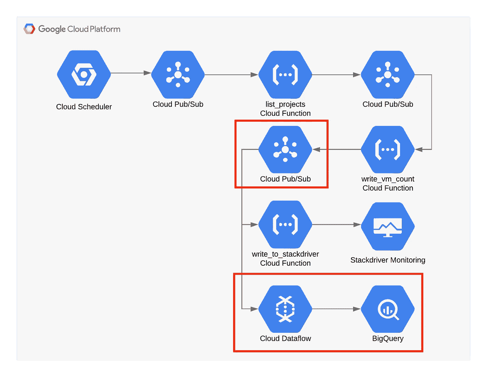
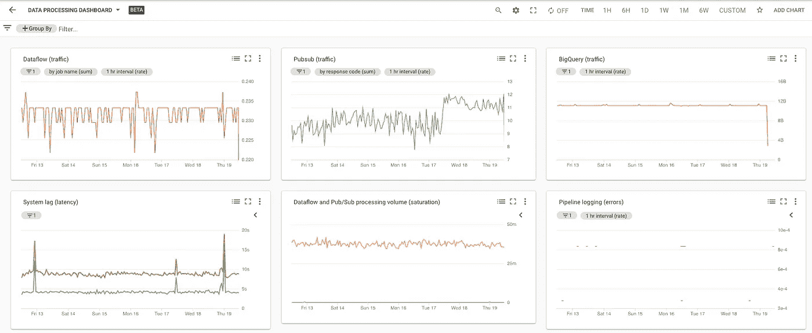
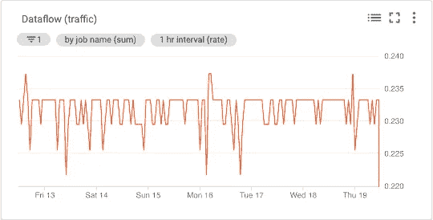
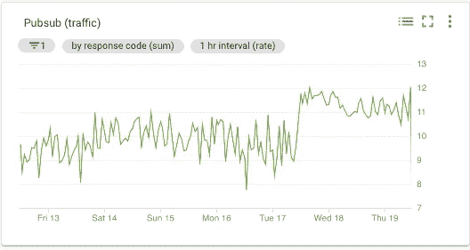
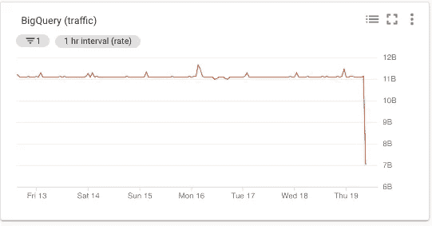
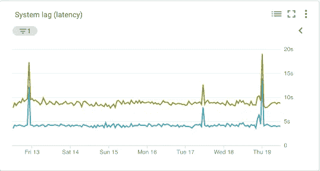
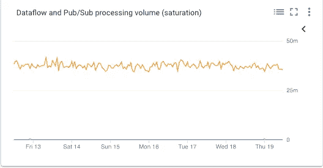
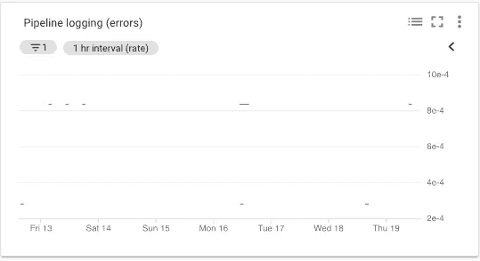

# 使用 Stackdriver Dashboard API 为数据处理管道构建仪表板

> 原文：<https://medium.com/google-cloud/part-1-building-a-dashboard-for-a-data-processing-pipeline-with-the-stackdriver-dashboard-api-3cb14a27cd59?source=collection_archive---------0----------------------->

这是 2 部分系列的第 1 部分。

*   第 1 部分:介绍了如何确定推荐用于数据处理管道的 Stackdriver 监控指标
*   [第 2 部分](/@charles.baer/part-2-building-a-dashboard-for-a-data-processing-pipeline-with-the-stackdriver-dashboard-api-69e3260b5ec3):介绍如何使用 Stackdriver Dashboards API 从 JSON 模板中实现第 1 部分中描述的图表和仪表板。

# 仪表板中应该显示什么

我花了很多时间与正在使用或正在考虑如何使用 Stackdriver 的 DevOps 和 SRE 团队交谈。我收到的一个一致的问题是应该监控哪些指标。

我所见过的关于这个主题的最好的全面指导来自于《网站可靠性工程》一书，在[第 6 章——监控分布式系统](https://landing.google.com/sre/sre-book/chapters/monitoring-distributed-systems/)下。在本章中，他们讨论了您应该考虑在系统中监控的“四个黄金信号”。

四个黄金信号是:

1.  **延迟** —服务完成一个请求所需的时间
2.  **流量** —有多少需求是针对你的服务的
3.  **错误** —您的服务失败的比率
4.  **饱和度** —衡量服务资源接近完全利用的程度

当考虑要在系统甚至数据处理管道中监控的重要指标时，可以使用这些监控类别。出于监控的目的，您可以将管道视为要监控的“服务”。这意味着您可以考虑每个产品组件中的指标，以及如何将这些指标应用于“四个黄金信号”。在本文的剩余部分，我将介绍如何将度量映射到图表，例如部署在 GCP 的数据处理管道。

# 样本数据处理管道

我基于本[参考指南](https://github.com/GoogleCloudPlatform/gcf-gce-usage-monitoring)*使用云函数和 Stackdriver* 监控计算引擎足迹，为 BigQuery 的 [PubSub 主题添加一个简单的云数据流模板，扩展了一个示例数据处理管道。《参考指南》中描述的体系结构构建了一个计算引擎实例清单，然后将结果写入 Stackdriver Monitoring。](https://cloud.google.com/dataflow/docs/guides/templates/provided-streaming#pubsub-topic-to-bigquery)

在本文中，云函数只是我们的发布/订阅、云数据流和 BigQuery 数据处理管道的一个数据源。该架构由一系列通过发布/订阅连接的云函数组成，这些云函数将结果写入 Stackdriver Monitoring。添加云数据流组件允许我将结果写入 BigQuery，除了 Stackdriver 监控之外，还可以用于这个管道示例。

出于本例的目的，我将重点放在监控 Pub/Sub 入口点、云数据流和 BigQuery 组件的指标上，它们在下图的红框中突出显示。

您可以将此管道归纳为以下步骤:

1.  将度量数据发送到发布/订阅主题
2.  从云数据流中的发布/订阅订阅接收数据
3.  将结果写入 BigQuery

有了“四个黄金信号”监控框架和简单的数据处理管道，我可以在接下来的部分中就具体的指标以及应该监控哪些监控信号提出建议。

下面的屏幕截图显示了仪表板上的 6 个不同图表，涵盖了数据处理流程。

# 交通

流量表示在给定时间内有多少请求得到服务。衡量流量的常用方法是每秒请求数。我选择为数据处理管道架构(Pub/Sub、Cloud Dataflow 和 BigQuery)中的 3 种技术构建 3 个不同的图表，以使其更容易阅读，因为 y 轴刻度对于每个指标来说是不同的数量级。为了简单起见，您可以选择将它们包含在一个图表中。

# 数据流交通图

Stackdriver Monitoring 为云数据流提供了许多不同的指标，您可以在指标[文档](https://cloud.google.com/monitoring/api/metrics_gcp#gcp-dataflow)中找到。大体上，它们被分为总体工作指标，如`job/status`或`job/total_vcpu_time`，以及处理指标，如`job/element_count`和`job/estimated_byte_count`。

因为我们希望监控通过云数据流的流量，所以代表“*到目前为止添加到 pcollection 的元素数量*”的`job/element_count`非常适合测量流量。重要的是，度量将随着流量的增加而增加。因此，这是一个用于理解进入管道的流量的合理指标。

下面的屏幕截图显示了仪表盘中的云数据流流量图表。

# 发布/订阅交通图

发布/订阅的堆栈驱动程序监视指标分为主题、订阅和快照指标。订阅和主题度量都可以用于绘制流量图表，因为它们表示发布到发布/订阅的消息的两端。

因为我想查看传入流量，所以查看接收数据的入站主题的指标是一个合理的选择。具体来说，`topic/send_request_count`表示“*发布请求的累积计数，按结果分组”*与测量流量非常一致。

下面的屏幕截图显示了仪表板中的发布/订阅流量图表。

# BigQuery 流量图表

BigQuery 的 Stackdriver 监控指标分为 bigquery_project、bigquery_dataset 和查询指标。

因为我希望看到传入流量，所以查看与上传数据相关的指标是一个合理的选择。具体来说，`storage/uploaded_bytes`非常适合测量 BigQuery 的传入流量。

下面的屏幕截图捕获了仪表板中的 BigQuery 流量图表。

# 潜伏

延迟表示在给定时间内处理一个请求需要多长时间。衡量延迟的一种常用方法是以秒为单位计算服务一个请求所需的时间。在这个具有发布/订阅、大查询和云数据流的示例架构中，可能有助于理解延迟的指标可以指示通过云数据流或云数据流中的步骤需要多长时间，消息在发布/订阅中未被确认需要多长时间，以及将记录插入大查询需要多长时间。

# 系统滞后图表

因为我想看看服务请求所需的时间，所以查看与处理时间和滞后区域相关的指标是合理的选择。具体而言，表示由管道完全处理的最近数据项的年龄(自事件时间戳起的时间)的`job/data_watermark_age`和表示以秒为单位的数据项等待处理的当前最大持续时间*的`job/system_lag`与测量通过云数据流管道处理所花费的时间一致。*

下面的屏幕截图捕捉了仪表板中的云数据流系统滞后图表。

# 浸透

饱和度表示运行服务的资源的利用率。饱和度是指监控一个指标，该指标显示系统何时可能开始受限。在这个具有发布/订阅、大查询和云数据流的示例架构中，可能有助于理解饱和度的指标是最早的未确认消息(如果处理速度变慢，则消息将在发布/订阅中保留更长时间)，在云数据流中，是数据的水印年龄(如果处理速度变慢，则消息将需要更长时间才能通过管道)。

# 饱和度图表

因为我想知道服务何时接近所提供的容量，所以我可以做的一个假设是，当系统接近完全利用其资源时，处理给定消息的时间将会变慢。一般来说，数据处理流水线的情况可能并不总是如此。因为我是用发布/订阅和云数据流异步处理的，所以这个假设是合理的。

具体来说，我们上面使用的`job/data_watermark_age`和代表主题中最早未确认消息的*年龄(以秒计)的`topic/oldest_unacked_message_age_by_region`与测量云数据流处理时间和管道从发布/订阅接收/确认输入消息的时间的增加非常一致。*

下面的屏幕截图显示了仪表板中发布/订阅和云数据流的饱和度图表。

# 错误

错误表示应用程序错误、基础设施错误或故障率。这里的要点是监控一个指标，当遇到错误时，该指标显示错误率增加。在这个具有发布/订阅、大查询和云数据流的示例架构中，可能有助于理解饱和度的指标是发布/订阅、云数据流和大查询的日志中报告的错误。

# 数据处理管道错误图表

因为我希望看到服务的错误率，所以我可以查看体系结构中包含的服务的日志中报告的错误。

具体来说，代表特定于 3 个服务中的每一个的“*数量的日志条目*”的`log_entry_count`与测量错误数量的增加非常一致。

下面的屏幕截图捕获了仪表板中发布/订阅、云数据流和 BigQuery 的错误图表。

# 使用仪表板

在本文中，我描述了一种基于“四个黄金信号”为数据处理管道选择指标的方法。您可以在 Stackdriver 监控控制台的 Dashboards 部分中轻松地手工构建这个仪表板。然而，更好的方法是使用仪表板模板。阅读本系列的第 2 部分，了解如何从 JSON 模板部署这个仪表板。