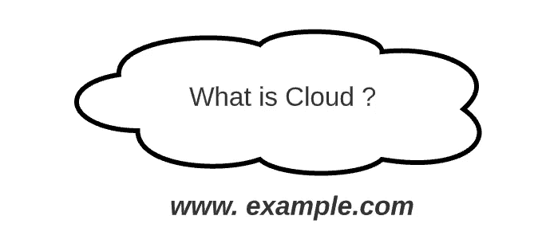
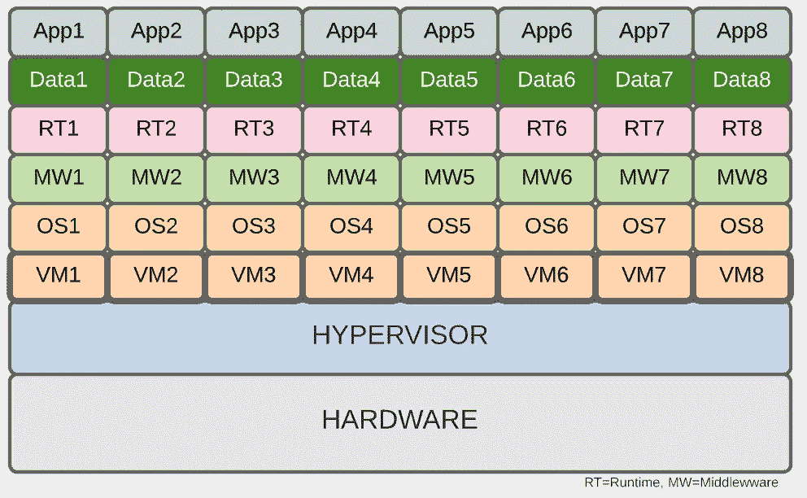
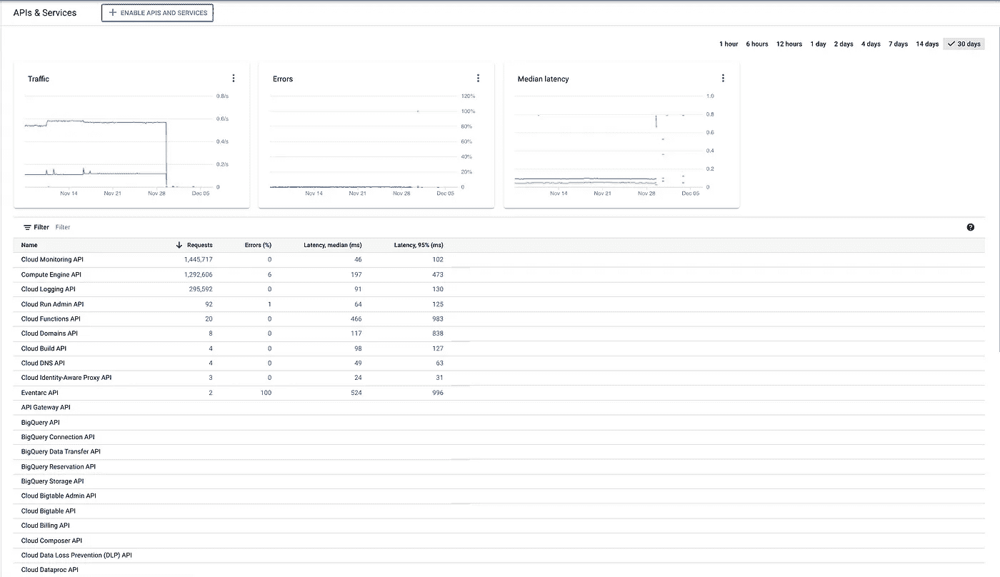

# 通过 GCP 学习云—第 1 部分:什么是云？

> 原文：<https://medium.com/google-cloud/part-1-what-is-cloud-507c60d3f849?source=collection_archive---------2----------------------->

> ***“如果有人问我什么是云计算，我尽量不去纠结定义。我告诉他们，简而言之，云计算是经营企业的更好方式。”***
> 
> ***——马克·贝尼奥夫，Salesforce*** 创始人、首席执行官兼董事长

关于云是什么/不是什么，已经说了很多，但多年来，我对它到底是什么投入了大量的思考。Marc Benioff 是 Salesforce 的创始人、首席执行官兼董事长，他的这句话深深打动了我，因为 Marc 更关注 it 的魔力。在他看来，这只是一种更好的经营方式。句号。

本博客系列的目标是将云计算分解成简化的组件，以便最终任何人都可以理解云可以达到的深度，以及如何利用它来改变你和你的公司的生活。我在博客系列中使用了大量的**谷歌云平台(GCP)** 结构，这样我们可以更好地理解和欣赏这些概念。

## **一些免责声明**

在这个博客系列中讨论的所有观点都是我自己的，决不能归因于来自我现在或曾经是其中一部分的公司。这些是我学到的东西，我试图用尽可能简单的方式表达出来。我明白过度简化有时会导致另一种可能不真实的版本。我会尽最大努力不要过于简单化，但我唯一的要求是对所有这些持保留态度。从尽可能多的来源进行验证。

## W 云是什么帽子？

当你学习任何新东西时，你要做的第一件事就是定义它。任何人都想知道的第一件事是我正在学习什么。头脑想要弄清楚它在处理什么，因此在开始时问这个问题是很自然的。因为这个博客系列的目标是以一种简化的方式来分解事物，所以我不会从技术定义开始。但是我稍后会介绍它，这样我们可以把它分解成简单的结构。

***云不过是一种外包模式。作为云客户，您选择将不会直接为您的业务增加价值的任务外包给专业人员，以便您可以专注于重要的任务。***

**实用新型？**

照片由来自 [Pexels](https://www.pexels.com/photo/transmission-tower-under-gray-sky-189524/?utm_content=attributionCopyText&utm_medium=referral&utm_source=pexels) 的 [Pok Rie](https://www.pexels.com/@pok-rie-33563?utm_content=attributionCopyText&utm_medium=referral&utm_source=pexels) 拍摄

简而言之，这是我们在日常生活中一直遵循的模式，例如，为了让我们的房子获得电力，我们从电力公司获得公用事业连接。这些电力公司的工作是从各种原材料中生产电力，并尽可能高效地利用最好的人员和技术。另一方面，我们不想专注于生产电力，因为我们想专注于做我们生活中重要的事情，即接听客户电话或开发代码或任何我们喜欢做的事情。充其量，我们投资有一个备份，因为我们不希望我们的生活被停电打乱。因此，我们安装了逆变器或发电机，并配备了自动资产管理系统，以便有人可以维护这些设备。

我们在云上看到了一个类似的模型，其中我们确定了对于业务运营、竞争、发展和超越竞争对手至关重要的任务。他们决定自己完成任务是否会有成效( ***成本效益/效率*** )，或者他们是否应该专注于获得更多客户，开展营销活动，增加更多合作伙伴，并依靠 COTS(商业现成软件)或 SaaS 版本的应用程序来运营业务。这完全取决于企业的 DNA 或构建模块。如果业务的核心 DNA 是技术(谈论拼车应用程序，连接买家和卖家的应用程序)，而最终用户消费的核心产品是应用程序，那么企业往往会雇佣最优秀的人来编写代码，并雇佣工程师来确保他们运行的环境(即使是在公共云上)高效且响应迅速(他们不想因为缓慢的应用程序/网页而失去客户)。另一方面，如果主要业务不是以技术为中心，我看到有人将大量业务外包给公共云，并让合作伙伴管理大部分业务。当然，这些情况并不是一成不变的，可能会有一些例外。

好的。那么技术上的定义是什么。国家标准与技术研究所是一个物理科学实验室，也是美国商务部的非监管机构。他们将云计算定义为

> 

***自动售货机型号？***

照片由来自 [Pexels](https://www.pexels.com/photo/bright-soda-and-candy-machines-in-building-4062275/?utm_content=attributionCopyText&utm_medium=referral&utm_source=pexels) 的 [Erik Mclean](https://www.pexels.com/@introspectivedsgn?utm_content=attributionCopyText&utm_medium=referral&utm_source=pexels) 拍摄

我理解上述复杂定义的方法是将云比作自动售货机。如果你曾经使用过自动售货机，你会记得这个巨大的机器出售食品、电子产品或无限的可能性。本质上，这个想法是没有人的参与，你把你的东西放进机器卖给最终用户。没有讨价还价，没有你必须给的折扣。它卖得很好。唯一需要的人与人之间的互动是在机器的管理中，给它装满新的东西，取出钱。

**积木**

云的构建模块:虚拟化

从本质上来说，有了云，你就在出售计算资源。这些资源包括服务器、存储、应用程序、网络、服务等。现在，你不能把一台 19.5 公斤重的服务器放在一台机器里，然后期望人们为它付费，甚至把它带到他们的办公室或数据中心。这就是所谓的**虚拟化**技术的用武之地，虚拟化使用虚拟化(创建虚拟版本的硬件)将资源集中起来，并根据需求分解成不同的大小。终端用户还可以创建自定义大小的资源，因为原始资源已经过池化和虚拟化。

由于资源是虚拟的(没有物理机)，所以只需点击一个按钮就可以调配或创建资源，只需点击一个按钮就可以删除资源并将其释放回池中。本质上，我们已经使用虚拟化将所有资源放入这个巨大的自动售货机中(如果云是一个**数据中心**),任何人都可以在需要时按需消费，在不需要时释放。谷歌云使用安全加固的 **KVM** 作为管理程序，在[这篇文章](https://cloud.google.com/blog/products/gcp/7-ways-we-harden-our-kvm-hypervisor-at-google-cloud-security-in-plaintext)中，他们提到了 7 种安全加固方法。通过 Google [VMware Engine](https://cloud.google.com/vmware-engine) ，还可以选择让您自己的基于 VMware 的 ESXi 的 Hypervsior 作为软件定义数据中心的一部分。

**计量**

照片由[从](https://www.pexels.com/@shvets-production?utm_content=attributionCopyText&utm_medium=referral&utm_source=pexels)[像素](https://www.pexels.com/photo/woman-showing-measuring-tape-for-checking-body-forms-6975471/?utm_content=attributionCopyText&utm_medium=referral&utm_source=pexels)拍摄生产

我们仍然需要明白的是要付多少钱。同样，云也需要一种方法来测量资源被使用的时间。因此，在云中，就像公用事业计量表或出租车计量表一样简单，您还需要技术和应用程序来帮助测量用户的消耗率，并使用价格图表(每分钟/每秒/每毫秒等)向客户收费(也称为 **CHARGEBACK)** 。因此，从本质上说，作为一个用户，我是按需为资源付费的。对于更大的企业客户，他们知道自己的使用情况，并且可以肯定地说，一部分资源将一年 365 天 24x7 全天候使用，有不同的承诺模式可供选择，您可以提前支付或拖欠(一个月后)，并降低每小时/每秒/每毫秒的费用。在 GCP，有一种按需定价模式，实质上是 GCP 根据机器在一个月内使用的小时数，对某些机器类型给予[持续使用折扣](https://cloud.google.com/compute/docs/sustained-use-discounts)，并根据客户选择在特定地区为机器系列提供核心和 RAM 的期限(1 年或 3 年)给予[承诺使用折扣](https://cloud.google.com/compute/docs/instances/signing-up-committed-use-discounts)

**按钮**

照片由 [Pexels](https://www.pexels.com/photo/anonymous-person-pressing-button-of-lift-3861787/?utm_content=attributionCopyText&utm_medium=referral&utm_source=pexels) 的 [Kelly L](https://www.pexels.com/@kelly-l-1179532?utm_content=attributionCopyText&utm_medium=referral&utm_source=pexels) 拍摄

在自动售货机里，你按一下按钮就可以买到你要的东西。在云的情况下，你按下按钮的方式是在你的鼠标或键盘上，云提供商已经建立了一个在线市场/市场(想想任何电子商务网站)，在那里他们展示其市场中所有可用的资源，以及类似地其他公司在其平台(市场)上出售的所有可用资源。有不同的模式可以列出和购买资源，如控制台(GUI)或 SDK(软件开发工具包)，其中包括命令行(使用 shell 脚本)或甚至在您的代码中(客户端库)。

来自 [Pexels](https://www.pexels.com/photo/woman-writing-on-whiteboard-3861943/?utm_content=attributionCopyText&utm_medium=referral&utm_source=pexels) 的 [ThisIsEngineering](https://www.pexels.com/@thisisengineering?utm_content=attributionCopyText&utm_medium=referral&utm_source=pexels) 摄影

这个想法是**协调**在请求抽象的虚拟资源时后面的所有操作，以便最终用户不必关注或担心这些步骤(记得关注重要的事情吗？)作为专业参与者的云提供商编写了大量代码来协调和构建软件定义的数据中心，在该数据中心中，一切都使用代码控制，一切都由 **API** 驱动。API 或应用程序可编程接口是云中每个服务都有的软件接口。因此，云只不过是那些有软件界面可供出售的大量资源，以便这些资源可以被消费、计量、按存储容量使用计费、删除或与您自己的代码集成。

想象一下，你从自动售货机上购买的一包薯片有一个按钮，它会告诉卖家你消费了多少片薯片，这样他们就可以提供单个薯片的定价模型，而不是对整包薯片收费。你可以用那个按钮打开包装，处理掉它等等。基本上，这个小按钮成为你想做的所有任务的中心。这是云中的 API。

在 GCP 中，您可以使用控制台集中启用或禁用所有 API，还可以监控请求数量、错误和这些 API 的延迟。

GCP 上的 API 和服务控制

**访问**

所以我们建造了这个巨大的自动售货机。我们希望我们的用户预定一辆出租车到我的数据中心，然后排着长队去出售服务器吗？不。这就是互联网的救援之处。互联网在云发展到今天的过程中发挥了巨大的作用。本质上，你不需要去任何地方，你不需要有一个办公室来放置这些资源。你只需要有一个客户端设备(笔记本电脑或手机)连接互联网，或者如果你在办公室，你的办公室网络需要连接到云网络(通过 VPN 或租用线路)。就是这样。您的笔记本电脑/手机成为您运行价值十亿美元的企业并确保您的最终用户能够以最佳方式使用您的应用程序的地方。在 GCP，面向最终用户的互联网分为两个服务等级:[标准(优化成本)和高级](https://cloud.google.com/network-tiers)(使用谷歌全球网络)。[云 VPN](https://cloud.google.com/network-connectivity/docs/vpn/concepts/overview#:~:text=Cloud%20VPN%20securely%20connects%20your,it%20travels%20over%20the%20internet.) 和[云互联](https://cloud.google.com/network-connectivity/docs/interconnect)可以用来将你的办公室或现场数据中心与谷歌云连接起来。

下一步是什么？

那就是云。这不是一个时髦的词，也不是一种炒作，而是一种必要，因为这些公司已经意识到，使用这种联营模式更好，而且由于规模经济和巨大的资源共享，云提供商可能会降低资源的成本。但是云比你自己做更便宜吗？那是另一个讨论的话题。

这只是开始。有了对云的这种理解，我们将触及

— [**通过 GCP 学习云—第一部分:什么是云？**](/@abhinavbhatiaoncloud/part-1-what-is-cloud-507c60d3f849?source=your_stories_page----------------------------------------) (本博客)

— [**通过 GCP 学习云—第二部分:我如何使用云？**(IaaS、PaaS、SaaS、FaaS、XaaS)](/@abhinavbhatiaoncloud/part-2-how-can-i-consume-cloud-98fa1c2880aa?source=your_stories_page----------------------------------------)

— [**通过 GCP 学习云计算—第 3 部分:我在哪里进行云计算？**](/@abhinavbhatiaoncloud/part-3-where-do-i-compute-on-cloud-4c105d74b35a?source=your_stories_page----------------------------------------) 在这里，我将谈到云上可用的几种计算选项，以及如何在它们之间进行选择。(虚拟机 vs Kubernetes vs 无服务器 vs 事件驱动的无服务器框架)

— [**通过 GCP 学习云——第 4 部分:我在哪里存储我的云数据？**](/@abhinavbhatiaoncloud/part-4-where-do-i-store-my-data-on-cloud-f672b1a3bbb2?source=your_stories_page----------------------------------------) 在这里，我将尝试回答一个非常相关的问题，即如何选择合适的存储单元来保存您的数据。(OLTP vs OLAP，ETL vs ELT，SQL vs NoSQL，文件 vs 块存储，什么是 NewSQL？)

— [**通过 GCP 学习云—第 5 部分:如何连接到我的云？**](/@abhinavbhatiaoncloud/part-5-how-do-i-connect-to-my-cloud-53279e1e9e5e?source=your_stories_page----------------------------------------) 在这里，我将讨论一些云上可用的重要网络和安全结构。(负载平衡器、DNS、CDN、WAF、VPC)

云上有大量的产品和服务。这个博客系列的目的不是覆盖所有的问题，而是触及关键的问题，也就是最基本的问题。在此基础上，您可以根据您的用例添加不同的层。