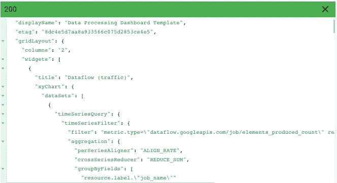

# 使用 Stackdriver Dashboard API 为数据处理管道构建仪表板

> 原文：<https://medium.com/google-cloud/part-2-building-a-dashboard-for-a-data-processing-pipeline-with-the-stackdriver-dashboard-api-69e3260b5ec3?source=collection_archive---------1----------------------->

这是 2 部分系列的第 2 部分。

*   [第 1 部分](/@charles.baer/part-1-building-a-dashboard-for-a-data-processing-pipeline-with-the-stackdriver-dashboard-api-3cb14a27cd59):包括识别推荐的堆栈驱动程序监控指标，用于数据处理管道
*   第 2 部分:介绍如何使用 Stackdriver Dashboards API 从 JSON 模板中实现第 1 部分中描述的图表和仪表板。

# 首先，为什么要自动化？

我从使用 Stackdriver Monitoring 的 DevOps 和 SRE 团队那里听到的一个常见请求是，他们希望像对大多数基础架构或环境设置那样自动部署仪表板。这是减少人类[辛劳](https://landing.google.com/sre/sre-book/chapters/eliminating-toil/)的流行配置代码方法！我听到的另一个常见请求(这次是来自仪表板用户)是，用户希望能够共享他们开发的仪表板的配置，以便同事可以将仪表板用作模板。最近发布的 [Stackdriver Dashboards API](https://cloud.google.com/monitoring/api/ref_v3/rest/v1/projects.dashboards) 为这两种用例提供了解决方案。

# 堆栈驱动仪表板 API

Stackdriver 监控 API 提供了一个名为 *projects.dashboards* 的资源，它提供了一组熟悉的方法:*创建*、*删除*、*获取*、*列表*和*补丁*。这些方法遵循 REST 语义，接受 JSON 有效负载，并与其他基于 Google Cloud REST 的 API 保持一致。

这篇文章的其余部分要求理解如何在 Stackdriver 监控控制台中使用仪表板、图表和指标的细节。你可以阅读文档中的[创建图表](https://cloud.google.com/monitoring/charts/)部分来找到所有细节。

# 以最简单的方式构建 dashboard JSON 有效负载

我提到仪表板 API 提供了一个*创建*和一个*获取*方法。因为从头开始在 JSON 中构建仪表板需要详细了解 API 数据模型和相应的 JSON 语法，所以更简单的方法是在 Stackdriver Monitoring 的仪表板部分构建仪表板，然后使用 API 来展示仪表板的 JSON 表示。一旦有了 JSON，就可以使用 *create* 方法创建另一个基于 JSON 的仪表板。我强烈推荐这种方法，作为一种简单的开始方式。

# 仪表板 JSON 有效负载

为了让您通过 Dashboards API 创建仪表板，您需要定义几个 JSON 有效负载数据，您可以使用这些数据来调用[projects . Dashboards . create](https://cloud.google.com/monitoring/api/ref_v3/rest/v1/projects.dashboards/create)方法。下面是一个 JSON 有效负载的例子:

*   显示名称—仪表板的可读名称
*   gridLayout —小部件的容器
*   小部件—图表项目的容器
*   数据集—这包括用于在 timeSeriesFilter 对象中收集特定数据的详细信息，包括指标名称、指标过滤器以及指标的聚合方式。
*   xAxis，yAxis 影响轴表示的定义
*   图表选项—影响图表模式的定义

# 使用项目.仪表板.创建

有许多方法可以调用 projects.dashboards.create 方法。在本例中，您可以直接在 API 文档中轻松使用“尝试此 API”功能来测试 API 调用*。

*请注意，您应该已经定义了一个 Stackdriver 监控工作区，并且已经为包含该工作区的项目定义了 GCP 项目 id。

我已经创建了一个 [JSON dashboard 模板](https://gist.github.com/charlesbaer/d4f29e73684facc6c53d90ae9ba7f55f)，其中包含了本系列第 1 部分中描述的所有 6 个图表。您可以将这个 JSON 有效负载用作您自己的仪表板的模板。

1.  要创建仪表板，请单击蓝色的“试试看！”按钮打开[projects . dashboards . create](https://cloud.google.com/monitoring/api/ref_v3/rest/v1/projects.dashboards/create)方法右侧的“尝试这个 API”特性。
2.  以“projects/*YOUR _ PROJECT _ id*”模式为父输入表单输入一个值，替换您自己的 GCP 项目 ID，该项目 ID 包含您要为“ *YOUR_PROJECT_ID* ”字符串值创建仪表板的 Stackdriver 工作区。
3.  突出显示请求正文输入表单中的默认值，然后复制/粘贴 JSON 仪表板模板

4.点击页面底部的“执行”按钮。如果一切顺利，您应该会看到一个绿色的 HTTP“200”响应代码，以及您刚刚创建的仪表板的 JSON 描述。

5.在 Stackdriver 监控控制台中打开[仪表板部分](https://console.cloud.google.com/monitoring/dashboards)以查看您新创建的仪表板。找到“数据处理仪表板模板”,单击名称打开仪表板。

如果您已经部署了 Pub/Sub、Dataflow 和 BigQuery 资源，您应该已经在仪表板中看到了值。

# 仪表板模板的实际使用案例

我从两个常见的用例开始了这个系列:

1.  开发运维团队/SRE 团队成员创建或更新仪表板
2.  用户共享仪表板模板

那么，如何将仪表板 API 用于用例呢？

在第一种情况下，可以通过从 Stackdriver 监控控制台导出现有仪表板来构建仪表板 JSON 模板，然后可以将 JSON 签入 github 或 Cloud Source Repos 之类的源存储库。从那里，您可以通过调用 Dashboards API 来部署 dashboard，这是您的标准部署过程的一部分，从 repo 中提取 JSON 模板文件。

在第二种情况下，您可以从 Stackdriver 监控控制台的现有仪表板创建一个仪表板，然后使用 Dashoards API 导出 JSON 模板。然后，您可以通过 repo 或通常与同事共享文件的方式共享该模板。

在这两种情况下，有一个预构建的模板仪表板开始应该更容易构建和共享 Stackdriver 监控仪表板。

# 结论

在本系列中，我详细介绍了数据处理管道的一组合理的指标和图表，然后描述了使用 Dashboards API 部署 dashboard 模板的详细方法。

# 有用的资源

*   [堆栈驱动监控文件](https://cloud.google.com/monitoring/docs/)
*   [堆栈驱动监控 API](https://cloud.google.com/monitoring/docs/apis)
*   [网站可靠性工程书籍](https://landing.google.com/sre/books/)