# 通过 GCP 学习云—第 2 部分:我如何使用云？

> 原文：<https://medium.com/google-cloud/part-2-how-can-i-consume-cloud-98fa1c2880aa?source=collection_archive---------6----------------------->

> 曾几何时，每个家庭、城镇、农场或村庄都有自己的水井。今天，共享的公共设施让我们只需打开水龙头就能获得干净的水；云计算以类似的方式工作。就像你厨房水龙头里的水一样，云计算服务可以根据需要快速开启或关闭。像自来水公司一样，有一个专门的专业团队来确保所提供的服务是安全可靠的，并且是全天候可用的。当水龙头没有打开时，你不仅节约了水，也没有为你目前并不需要的资源买单。”–维韦克·孔德劳，美国政府联邦首席信息官，2010 年。

在我的上一篇博客 [**中，我们讨论了什么是云，什么不是云，第一部分:什么是云？**](https://medium.com/p/507c60d3f849/edit?source=your_stories_page----------------------------------------) 。我尽力把它分解成尽可能简单的结构，这样我们的大脑就能更好地理解它。从本质上来说，云是一台巨大的自动售货机，通过一个按钮(记住 API)的帮助，虚拟池化资源按需(或有可用的承诺模型)出售给最终用户，并且发生计费，以便客户可以选择按小时或按分钟或按秒等付费，并使用它来外包所有不是他们的生计的任务。

## 一些免责声明

在这个博客系列中讨论的所有观点都是我自己的，决不能归因于来自我现在或曾经是其中一部分的公司。这些是我学到的东西，我试图用尽可能简单的方式表达出来。我明白过度简化有时会导致另一种可能不真实的版本。我会尽最大努力不要过于简单化，但我唯一的要求是对所有这些持保留态度。从尽可能多的来源进行验证。

这篇博文的目的是介绍云上可用的不同服务模型。本质上有三种，但随着创新，出现了不同的模式，我们将在这篇博客中讨论。但在此之前，为了解释这些模型，有必要了解软件应用程序的层次，让我们从上到下。

**应用**

你们大多数人过去一定接触过的顶层是应用程序。你阅读这篇博客的地方是一个应用程序，你可以在你的手机或浏览器上访问客户端应用程序，它的服务器部分运行在云中(假设)。在客户机和服务器之间存在这种持续的交互，以确保您能够读写博客条目。但实际上，您已经编写了一些代码，这些代码定义了应用程序的用户界面以及定义应用程序的所有业务逻辑。

**数据**

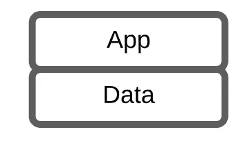

任何应用程序都有与之相关的数据。这个 blogpost 网站有博客、用户资料、分析数据和各种其他数据作为应用程序的一部分。通常，您会使用某种持久层来永久存储这些数据。它可能是数据库，也可能是某种文件存储。这取决于数据的类型(稍后在第 4 部分中会有更多内容:[我应该把我的数据存储在云的什么地方？](https://medium.com/p/f672b1a3bbb2/edit?source=your_stories_page----------------------------------------))。

**运行时**

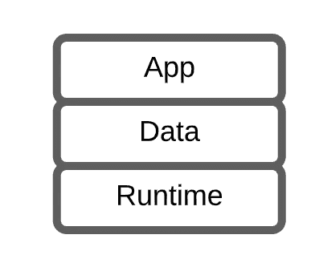

应用程序通常用高级语言编写，如 JAVA 或 C++或。NET 就是其中的几个例子。你需要一个组件来把高级语言转换成机器特定的指令，这样代码才能完成它的工作。这个组件就是运行时。它还完成代码正常运行所需的许多其他工作(比如垃圾收集是由一些运行时完成的)。

**中间件**

中间件是一种软件，它为应用程序提供不同的功能，如数据管理(数据库)、消息传递(想想从应用程序的一个组件到另一个组件的调用)、事务管理等。本质上，你只是在应用层编写你希望应用程序做的事情，即编写业务逻辑，但运行时和中间件是围绕应用程序开发生态系统，使它能够更好地完成工作。

**操作系统**

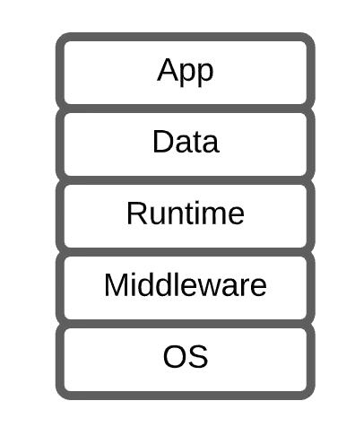

操作系统是软件的另一个关键部分，它就像是最终用户和硬件之间的接口，也运行着上面的应用+数据+运行时+中间件。它扮演许多角色，如文件管理、内存管理、设备管理、安全等等。典型地，在过去(或者现在也是),代码通常只为特定的操作系统编写。当像迁移到另一个操作系统这样的场景出现时，这就产生了很多问题。但是在这个领域已经有了很大的改进，人们已经意识到保持灵活架构的重要性，跨平台语言框架已经来拯救了。

**虚拟化**

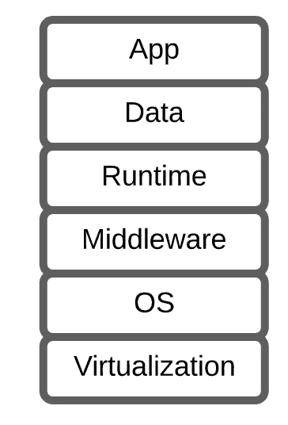

我在上一篇博客 [**第 1 部分提到了虚拟化:什么是云？**](https://medium.com/p/507c60d3f849/edit?source=your_stories_page----------------------------------------) 我在这里提到虚拟化是云之旅成功的基石之一。借助这一层，您可以将硬件组件转换为软件(或对其进行虚拟化),以便您可以对硬件进行池化和抽象化。这也有助于硬件的维护和管理，因为您不再需要担心，例如，在灾难或设施维护期间将服务器从一个数据中心转移到另一个数据中心。您应该能够通过网络迁移虚拟机，因为您已经对其进行了虚拟化。在计算的情况下，使这一切成为可能的层被称为**虚拟机管理程序。**

**服务器**

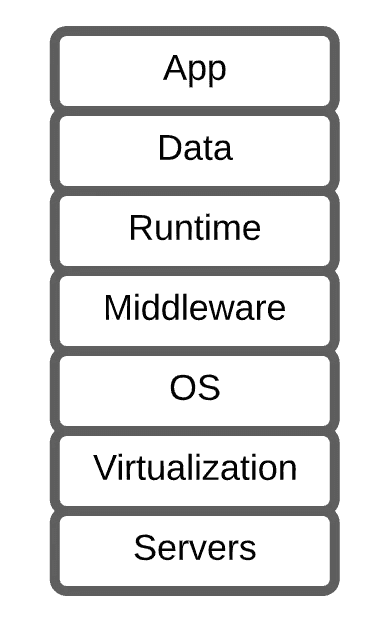

服务器是运行代码的大脑。计算功能基本上是为您的代码服务并执行所需的任务。它由安装在一个小盒子中的物理核心、内存(RAM)、一些存储(直连存储)、总线、芯片组和许多其他东西组成。

**存储**

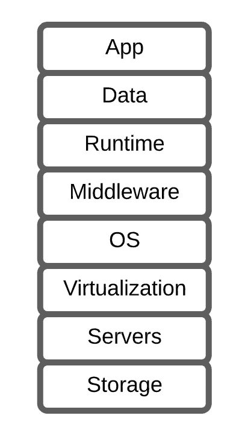

虽然由数据库或文件服务器管理，但您的数据需要存储在物理上的某个地方。那个地方就是你的存储设备。它保存数据记录的方式有很多种，但本质上它把所有的东西都转换成一系列的 1 和 0，这就是它记忆数据的方式。每个云供应商甚至一个企业数据中心都有多个这样的存储设备(存储区域网络/网络附加存储/对象存储),用于永久保存数据。数据是新的石油，因此备份数据也非常重要，这样您就可以在磁盘损坏或意外删除(或非意外删除，如勒索软件)的情况下恢复数据

**网络**

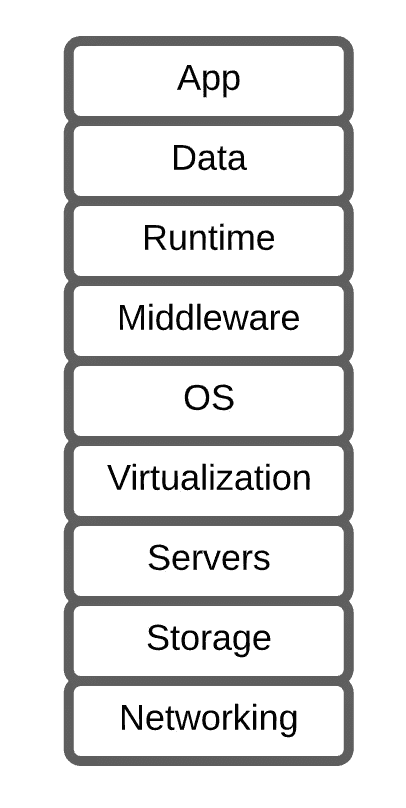

现在，服务器正在计算您的数据，但是如何将数据传输给最终用户或应用程序的不同组件呢？使用网络。这一层主要负责将数据从一个地方传输到另一个地方。集线器/交换机/路由器等设备或 web 应用程序防火墙/网络防火墙/负载平衡器等安全设备有助于实现安全传输。

这就是你在云上运行的数字应用。使用以上九层来构建你的应用程序。有了云，这是一种外包模式，你可以决定哪些东西你想集中精力，哪些东西你想外包。做出该决定后，您和云供应商签订了一份协议，双方决定签订一份**共享责任模型**，在该模型中，双方基本上都同意只履行各自的职责。这种共享责任模式催生了许多*aaS(即服务)模式，定义如下:

# **基础设施即服务(IaaS)**

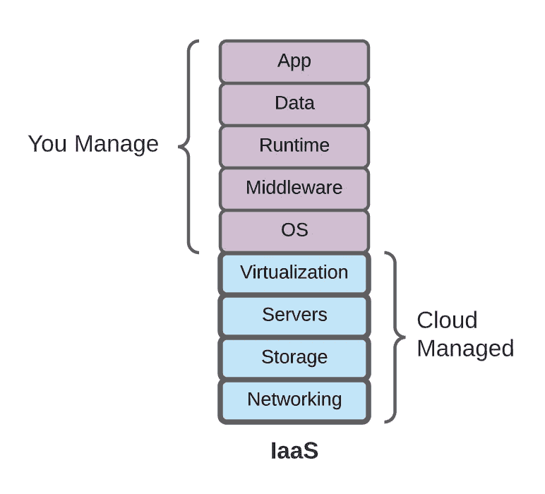

【IaaS 的责任分担模式

在这种模式中，云供应商为您提供了**虚拟化** **硬件**堆栈(服务器、存储、网络)以及*操作系统*，但责任止于虚拟化层。操作系统及以上职责由客户完成。因此，通常使用公开可用的操作系统映像，客户可以获得一个虚拟机，客户可以在其上构建堆栈的其余部分，如上所述，并负责这些层的修补和安全性等所有职责。来自**谷歌云平台**的[计算引擎](https://cloud.google.com/compute)就是 IaaS 的一个例子。

# **平台即服务(PaaS)**

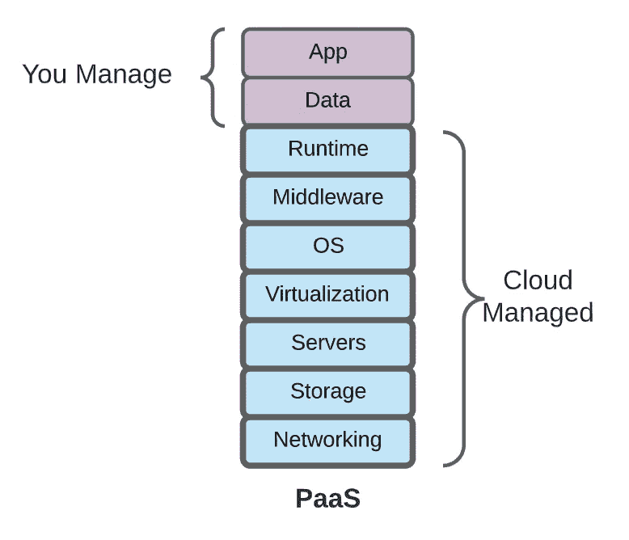

**PaaS 的共享责任模式**

借助平台即服务，云供应商构建堆栈直到运行时(硬件+虚拟化+操作系统+中间件+运行时)，客户带来他们的应用及其数据。来自 GCP 的 [**应用引擎**](https://cloud.google.com/appengine) 是一个平台即服务的完美例子，谷歌以这样一种方式建立了编排，如果没有人在晚上打开你的网络应用，你就不用为服务付费(在应用引擎标准中)。

# **软件即服务(SaaS)**

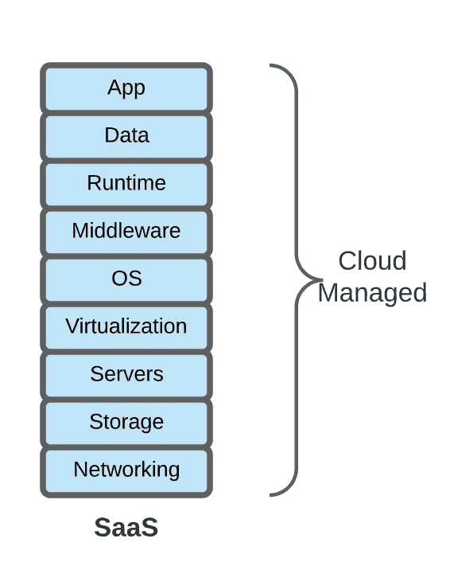

SaaS:完全云管理

有了软件即服务，一切都是云厂商给你的。想想 Salesforce，一个非常受欢迎的 CRM，它是 SaaS 的一个完美例子。

# **功能即服务(FaaS)**

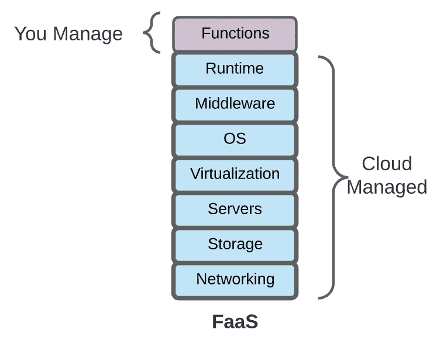

**FaaS 共同责任模式**

“功能即服务”在推出时掀起了波澜，因为它本质上催生了无服务器计算(仍有服务器需要计算，但用户看不到)。在这种模型中，客户编写一个特定的函数来完成一项关键工作(如视频转码/图像处理)，该任务由最终用户的操作(如某人上传一个对象)触发。来自谷歌云的云功能是 FaaS 的一个例子。

**FaaS vs PaaS**

云供应商协调层仅在触发时创建功能，执行作业，然后关闭它，因此您只需在功能执行时支付毫秒费用。大多数 PaaS 服务(例外:App Engine Standard)不支持这种启动、执行、关闭的模式，并且保持服务器进程在后台运行，因此客户必须支付一些费用。

# **金属即服务(MaaS)**

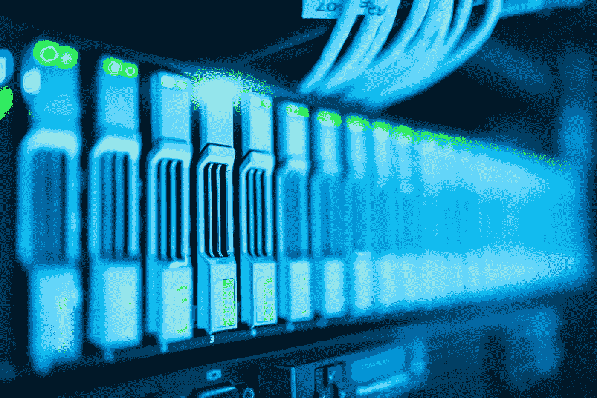

照片由 [Pexels](https://www.pexels.com/photo/close-up-photo-of-mining-rig-1148820/?utm_content=attributionCopyText&utm_medium=referral&utm_source=pexels) 的 [panumas nikhomkhai](https://www.pexels.com/@cookiecutter?utm_content=attributionCopyText&utm_medium=referral&utm_source=pexels) 拍摄

虚拟化无疑为应用程序创建了高效且可维护的计算，但在一些使用案例中，您不想要虚拟化层(虚拟机管理程序)的开销，或者您的应用程序有一个许可模型，该模型阻止您在虚拟化堆栈上运行。对于这些用例，金属即服务(MaaS)是一种尝试，旨在协调裸机服务器的创建以及围绕它的各种活动。

在 Google Cloud 中，[裸机解决方案](https://cloud.google.com/bare-metal)可提供 oracle 工作负载，其中计费、支持和 SLA 由 Google Cloud 提供

# 一切即服务(XaaS)

“任何东西即服务”是将任何东西作为服务提供的通用术语。任何时候都可以包括灾难恢复(DR)服务、数据库、容器、身份验证等等(包括上述的通用 IaaS、PaaS、SaaS、FaaS、MaaS)。

以上总结了与云相关的不同服务模型。最重要的是，我们不再采用提前采购服务器、存储设备和其他设备的模式，而是转向一种实用模式，在这种模式下，任何东西都可以作为服务以方便用户的计费模式提供。您可以提前计划，以便在需要时有能力可用，但本质上事情会变得顺利得多。

下一步是什么？

既然我们已经在下一部分
[中了解了云及其服务模型，第 3 部分:我在哪里进行云计算？](/@abhinavbhatiaoncloud/where-do-i-compute-on-cloud-4c105d74b35a)让我们从云计算层开始，了解在哪里计算你的云计算数据。

点击此处查看其他部分:

— [**通过 GCP 学习云—第一部分:什么是云？**](/@abhinavbhatiaoncloud/part-1-what-is-cloud-507c60d3f849?source=your_stories_page----------------------------------------) 在这里，我试图以尽可能简单的方式来揭开云的神秘面纱，以便我们的大脑能够描绘出它(云模型类似于自动售货机/公用事业公司吗？)

— [**通过 GCP 学习云—第二部分:我如何使用云？**](/@abhinavbhatiaoncloud/part-2-how-can-i-consume-cloud-98fa1c2880aa?source=your_stories_page----------------------------------------) (本博客)

— [**通过 GCP 学习云计算——第 3 部分:我在哪里进行云计算？**(虚拟机 vs Kubernetes vs 无服务器 vs 事件驱动的无服务器框架)](/@abhinavbhatiaoncloud/part-3-where-do-i-compute-on-cloud-4c105d74b35a?source=your_stories_page----------------------------------------)

— [**通过 GCP 学习云—第 4 部分:我在哪里存储我的云数据？**](/@abhinavbhatiaoncloud/part-4-where-do-i-store-my-data-on-cloud-f672b1a3bbb2?source=your_stories_page----------------------------------------) 在这里，我将尝试回答一个非常相关的问题，即如何选择合适的存储单元来保存您的数据。(OLTP vs OLAP，ETL vs ELT，SQL vs NoSQL，文件 vs 块存储，什么是 NewSQL？)

— [**通过 GCP 学习云—第 5 部分:如何连接到我的云？**](/@abhinavbhatiaoncloud/part-5-how-do-i-connect-to-my-cloud-53279e1e9e5e?source=your_stories_page----------------------------------------) 在这里，我将讨论一些云上可用的重要网络和安全结构。(负载平衡器、DNS、CDN、WAF、VPC)