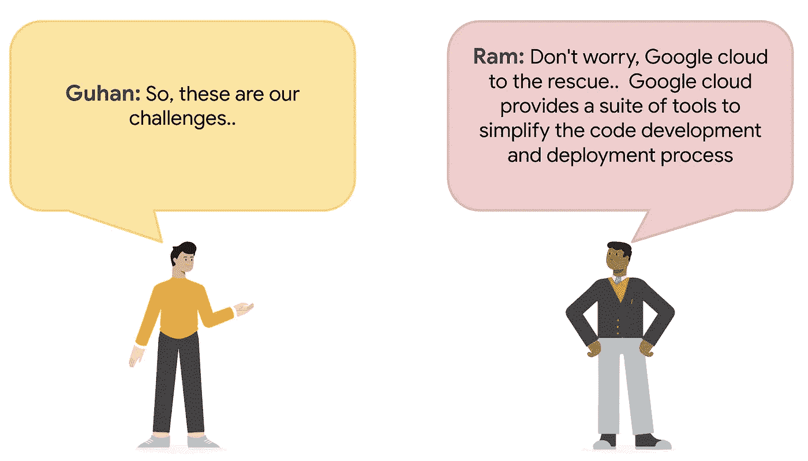

# Google Cloud DevOps 系列:持续开发工作流

> 原文：<https://medium.com/google-cloud/part-3-google-devops-continuous-development-workflow-3ef446edfeb7?source=collection_archive---------1----------------------->

## Google Cloud DevOps 系列:第 3 部分

欢迎来到 Google Cloud DevOps 系列的第 3 部分..你可以在这里找到完整系列[](/google-cloud/google-cloud-devops-part-1-introduction-to-google-native-devops-process-bfb55be9e3f3)

************************

****持续开发工作流程:实践演示****

****

**“gcloud”是谷歌云的命令行工具。它预装在云壳上。在 cloud shell 环境中，键入以下命令来设置项目。**

```
gcloud config set project <Your-Project-Name>
```

**设置“项目名称”变量**

```
PROJECT_NAME=<Your-Project-Name>
```

**为发展目的创建 GKE 集群**

```
gcloud beta container --project "$PROJECT_NAME" clusters create "dev-cluster" --zone "us-central1-a" --no-enable-basic-auth --cluster-version "1.20.10-gke.301" --release-channel "regular" --machine-type "e2-medium" --image-type "COS_CONTAINERD" --disk-type "pd-standard" --disk-size "10" --metadata disable-legacy-endpoints=true --scopes "https://www.googleapis.com/auth/cloud-platform" --max-pods-per-node "110" --num-nodes "6" --logging=SYSTEM,WORKLOAD --monitoring=SYSTEM --enable-ip-alias --network "projects/placeholder-322809/global/networks/default" --subnetwork "projects/placeholder-322809/regions/us-central1/subnetworks/default" --no-enable-intra-node-visibility --default-max-pods-per-node "110" --no-enable-master-authorized-networks --addons HorizontalPodAutoscaling,HttpLoadBalancing,GcePersistentDiskCsiDriver --enable-autoupgrade --enable-autorepair --max-surge-upgrade 1 --max-unavailable-upgrade 0 --enable-shielded-nodes --node-locations "us-central1-a"
```

**在谷歌云控制台上验证新创建的 GKE 集群**

****

**转到云外壳并连接到集群**

```
gcloud container clusters get-credentials dev-cluster — zone us-central1-a — project $PROJECT_NAME
```

**打开**ide.cloud.google.com**并导航到您已经克隆的微服务-演示文件夹。(注意—步骤参见 [**博客-2**](/google-cloud/google-cloud-devops-series-4013adab603b) )**

****

**找到 skaffold.yaml 文件**

****

**选择“云代码”选项**

****

**选择“在 Kubernetes 上运行”选项**

****

**选择适当的 GKE 集群**

****

**它将开始构建微服务。检查输出部分的进度。**

********

**访问应用程序:**

**注意前端外部服务的公共 IP 地址。单击公共 IP 地址，它将在您的默认浏览器中打开应用程序。**

********

**更改代码并观察自动部署**

**转到源代码库中的文件“micro services-demo/src/frontend/templates/header . html ”,找到以下文本**

```
Free shipping with $75 purchase!
```

**把 75 美元改成 150 美元**

```
Free shipping with $150 purchase!
```

**Skaffold 会自动检测到这种变化，启动相应微服务的构建和部署过程。Skaffold 不构建和部署与代码变更无关的其他微服务。**

********

## **接下来…**

**在这篇博客中，我们学习了 GKE 在谷歌云中的持续开发工作流程。现在，古汉变得更加好奇，想知道他如何在谷歌云上为 Samajik 的集装箱化工作负载实现端到端的 CI/CD 工作流。请继续收听拉姆和古汉的对话，了解更多相关信息..**

**供稿人:[施吉木尔·阿克](https://medium.com/u/41b475b881ff?source=post_page-----3ef446edfeb7--------------------------------)、[丹杜斯](https://medium.com/u/71d9487165c6?source=post_page-----3ef446edfeb7--------------------------------)、[安其特·尼尚特](https://medium.com/u/2d47f7f3f8e2?source=post_page-----3ef446edfeb7--------------------------------)、[杰瓦纳·黑德](https://medium.com/u/ad9524f7f7fa?source=post_page-----3ef446edfeb7--------------------------------)、[图沙尔·古普塔](https://medium.com/u/ee905ea343d?source=post_page-----3ef446edfeb7--------------------------------)**

**更新:这里可以看 Part-4 [。](/google-cloud/part-4-google-devops-continuous-development-workflow-3feb1ea2227e)**