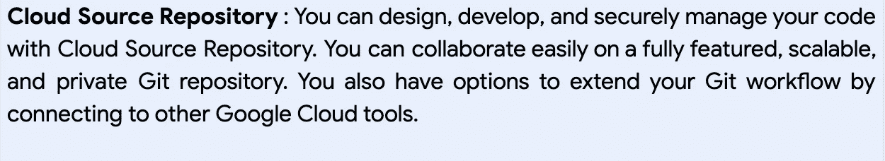

# Google Cloud DevOps 系列:持续集成/持续部署工作流(CICD)

> 原文：<https://medium.com/google-cloud/part-4-google-devops-continuous-development-workflow-3feb1ea2227e?source=collection_archive---------0----------------------->

## Google Cloud DevOps 系列:第 4 部分

**欢迎来到 Google Cloud DevOps 系列的第 4 部分..你可以在这里找到完整系列**[](/google-cloud/google-cloud-devops-part-1-introduction-to-google-native-devops-process-bfb55be9e3f3)

********************************

****持续集成和持续部署:动手演示****

**我们已经在[之前的博客](/google-cloud/google-cloud-devops-series-4013adab603b)中克隆了在线精品应用。在本演示中，我们将持续集成和持续部署到 QA、试运行和生产环境中。**

****启用 Google 云部署、云构建、GKE 和云存储 API****

****创建一个 Google 云仓库，并将应用程序推送到仓库。****

```
PROJECT_ID=<your project ID>
SOURCE_REPO_NAME=<name of repository>gcloud source repos create $SOURCE_REPO_NAME
```

****

****将在线精品应用程序推送到新创建的存储库。****

****为 QA、试运行和生产创建 3 个不同的 GKE 环境。****

```
REGION=<region name eg. us-central1>gcloud container clusters create qa-cluster --region=$REGION --scopes=cloud-platform --workload-pool=${PROJECT_ID}.svc.id.googgcloud container clusters create staging-cluster --region=$REGION --scopes=cloud-platform --workload-pool=${PROJECT_ID}.svc.id.googgcloud container clusters create production-cluster --region=$REGION --scopes=cloud-platform --workload-pool=${PROJECT_ID}.svc.id.goog
```

****创建一个谷歌云工件注册表****

```
ARTIFACT_REPO_NAME=<name of artifact repository>gcloud artifacts repositories create $ARTIFACT_REPO_NAME --repository-format=docker --location=$REGION
```

****

****创建一个构建触发器****

```
gcloud beta builds triggers create cloud-source-repositories  --repo=$SOURCE_REPO_NAME --branch-pattern=”^master$” --build-config=cloudbuild.yaml
```

****

****授予云构建服务帐户操作云部署的权限。****

1.  ***打开 IAM 页面:***
2.  **选择您的云项目。**
3.  ***在权限表中，找到电子邮件地址以* `*@cloudbuild.gserviceaccount.com*` *结尾的行。这是您的云构建服务帐户。***
4.  ***点击铅笔图标。***
5.  ***选择* ***云部署操作员*** *角色，授予云构建服务账户。***
6.  ***点击* ***保存*** *。***

****向您的帐户添加 Google Kubernetes 引擎开发人员角色:****

1.  ***打开云构建设置页面，你会看到* ***服务账号权限*** *页面***
2.  ***将* ***Kubernetes 引擎开发者*** *角色的状态设置为* ***启用*** *。***

****在代码库的根目录下创建 clouddeploy.yaml 文件，如下:****

```
apiVersion: deploy.cloud.google.com/v1
kind: DeliveryPipeline
metadata:
 name: boutique
description: main application pipeline
serialPipeline:
 stages:
 - targetId: qa
   profiles: []
 - targetId: staging
   profiles: []
 - targetId: prod
   profiles: []
---apiVersion: deploy.cloud.google.com/v1
kind: Target
metadata:
 name: qa
description: development cluster
gke:
 cluster: projects/**<project-id>**/locations/**<region>**/clusters/qa-cluster
---apiVersion: deploy.cloud.google.com/v1
kind: Target
metadata:
 name: staging
description: production cluster
gke:
 cluster: projects/**<project-id>**/locations/**<region>**/clusters/staging-cluster---apiVersion: deploy.cloud.google.com/v1
kind: Target
metadata:
 name: prod
description: production cluster
gke:
 cluster: projects/**<project-id>**/locations/**<region>**/clusters/production-cluster
```

****修改 Cloudbuild.yaml 以包含工件注册表并触发云部署，如下:****

```
steps:
 - id: 'prepare build and run skaffold'
   name: 'gcr.io/k8s-skaffold/skaffold:v0.20.0'
   entrypoint: 'bash'
   args:
   - '-c'
   - >
     gcloud auth configure-docker **<region>**-docker.pkg.dev;
     skaffold build -f=skaffold.yaml \
                    --build-concurrency=0 \
                    --default-repo=**<artifact registry endpoint>** \
                    --file-output /workspace/artifacts.json;
 - id: 'Deploy to cluster'
   name: 'google/cloud-sdk:latest'
   entrypoint: 'bash'
   args:
   - '-c'
   - >
     gcloud deploy apply --file clouddeploy.yaml --region=**<region>** --project=**<project-id>**;
     gcloud deploy releases create boutique-$SHORT_SHA \
                         --delivery-pipeline boutique \
                         --description "$(git log -1  --pretty='%s')" \
                         --region=**<region>** \
                         --build-artifacts /workspace/artifacts.json# Add more power, and more time, for heavy Skaffold build
 timeout: '3600s'
 options:
   machineType: 'N1_HIGHCPU_8'
```

**使用 git 命令将代码推送到存储库。**

****您可以跟踪云部署控制台，并将部署推进到下一阶段。****

********

****现在，您可以对应用程序进行任何更改，并将更新的代码推送到存储库，云构建将被自动触发，云部署管道将被执行。****

****

# **接下来…**

**在这篇博客中，我们学习了如何在 Google cloud 上为 Samajik 的集装箱化工作负载实现端到端 CI/CD 工作流。在下一次对话中，我们将了解如何在 Google Cloud 中执行日志记录和监控操作。请继续收听拉姆和古汉的对话，了解更多相关信息。**

**供稿人:[普什卡·科塔瓦德](https://medium.com/u/c79cc28e2999?source=post_page-----3feb1ea2227e--------------------------------)，[施吉木尔·阿·克](https://medium.com/u/41b475b881ff?source=post_page-----3feb1ea2227e--------------------------------)，[丹杜斯](https://medium.com/u/71d9487165c6?source=post_page-----3feb1ea2227e--------------------------------)，[图沙尔·古普塔](https://medium.com/u/ee905ea343d?source=post_page-----3feb1ea2227e--------------------------------)**

**更新:你可以在这里阅读 Part-5 [。](/google-cloud/part-5-google-devops-observability-with-sre-principles-33446da05c16)**