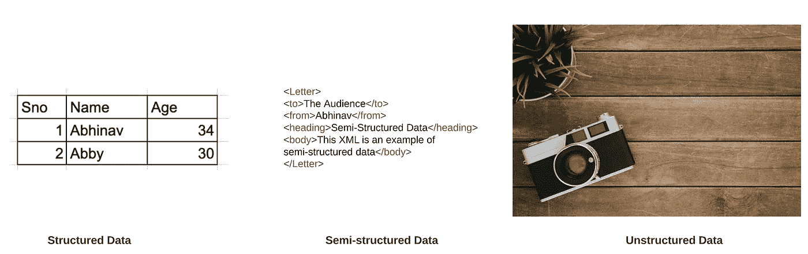
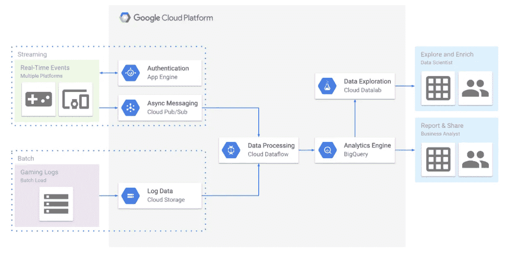
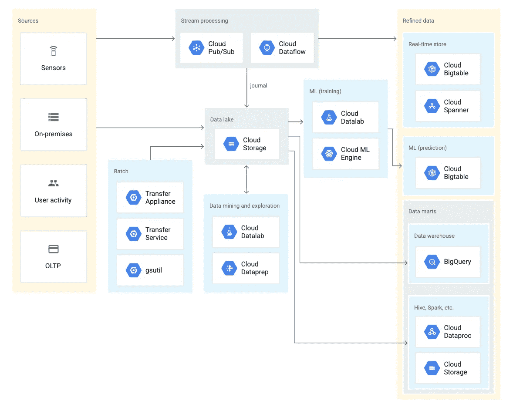
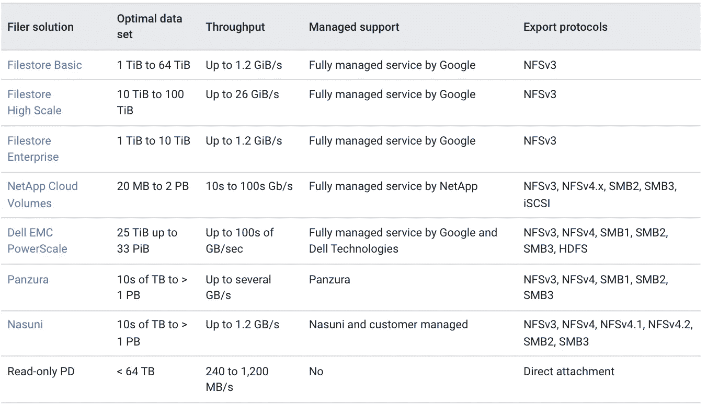
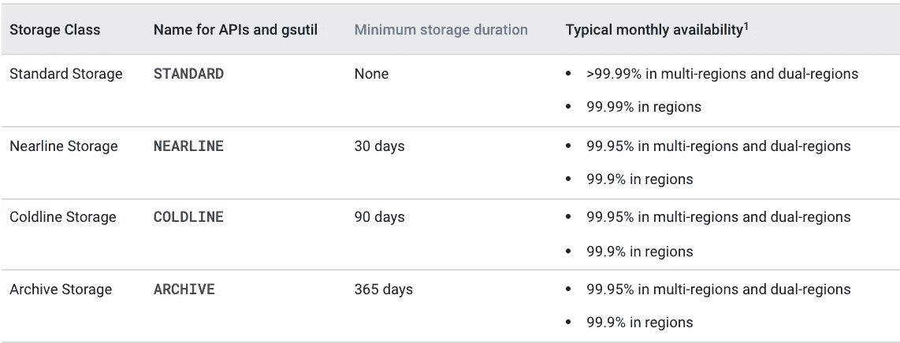
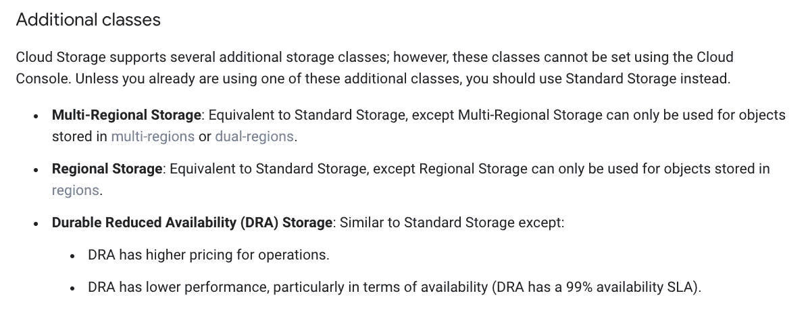
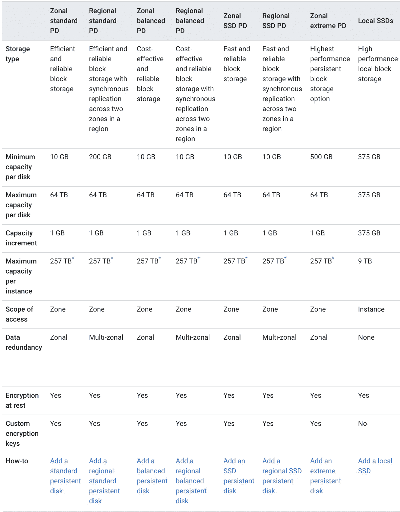
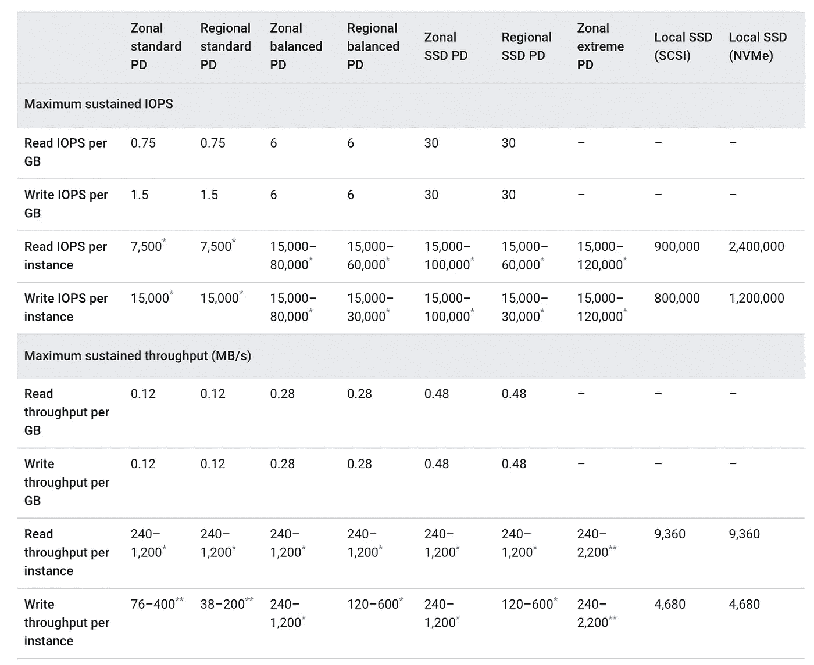

# 通过 GCP 学习云—第 4 部分:我在哪里存储我的云数据？

> 原文：<https://medium.com/google-cloud/part-4-where-do-i-store-my-data-on-cloud-f672b1a3bbb2?source=collection_archive---------0----------------------->

> 如今，人们希望云出现的地方不再是[基础设施和打包应用]。这实际上是关于‘你能给我以前得不到的新能力吗？’谷歌云首席执行官托马斯·库里恩

因此，在[的最后一部分](/@abhinavbhatiaoncloud/where-do-i-compute-on-cloud-4c105d74b35a)中，我们讨论了分为四类的云计算选项——虚拟机、容器引擎、无服务器和事件驱动无服务器，我们介绍了这些选项以及可能有助于您在它们之间进行选择的一些标准。

## 一些免责声明

在这个博客系列中讨论的所有观点都是我自己的，决不能归因于来自我现在或曾经是其中一部分的公司。这些是我学到的东西，我试图用尽可能简单的方式表达出来。我明白过度简化有时会导致另一种可能不真实的版本。我会尽最大努力不要过于简单化，但我唯一的要求是对所有这些持保留态度。从尽可能多的来源进行验证。

计算和存储经常被相提并论。没有数据你无法计算出一些东西。应用程序堆栈的每个点都有数据处理，有时您需要一个地方来存储它们。让我们举一个电子商务应用程序的例子。我去它的网站搜索，要么作为一个客人，要么验证我自己。在这两种情况下，电子商务企业需要一种方法来记录我的交互，以便他们可以了解我的购买行为，并在未来向我推荐产品。但是它们会将我的详细信息作为客人(我来自哪个设备，cookie 信息，一天中的时间等)或作为认证用户(我的个人资料信息，其中包含我的地址和卡片信息)存储在某个地方。我搜索一个拉杆箱包，出现了许多可供选择的方案。这些选项中的每一个都有一些预览信息，其中列出了价格、可用的交付日期、图像和一些其他细节。点击我的任何一个选项，我就会看到该产品的详细目录，其中有一些图片、详细信息、评论、提问的地方、其他人购买的类似产品以及大量有助于我最终购买的信息。在做了大量研究后，我最终选择了一个，并点击购买。然后，它会询问或者更确切地说是确认我的地址、卡的详细信息并下订单。一旦下了订单，它会一直跟踪并显示更新(同样是存储在某个地方的一些数据)，直到交付(或履行)为止。如果产品有问题，我选择退货，这是另一个处理链，会有很多细节，如退货原因、退货跟踪、退款处理和退款发票存储在某个地方。关键是每个应用程序都必须在其生命周期中处理数据和存储，其中一些必须持久存储(永久存储)，一些只能从缓存中获得一段时间，然后过期(产品的新价格或产品的新图像)，一些需要作为应用程序的暂存空间或临时存储区域。

# **数据类型**

数据可以按照不同的类别进行分类，但最重要的分类是关于数据的结构。如果数据是可组织的，可以像在数据库中一样放在行和列之下，它被称为**结构化**数据。如果数据不能以行和列的形式存放，但具有一定的组织能力，这种数据被称为**半结构化**数据(如 XMLs/JSON)。最后，如果数据不能以预定义的方式组织，如图像、pdf、视频，那么这些数据被称为**非结构化**数据。通常，机器学习可以帮助理解这些数据并分析它们(见[图像的视觉人工智能](https://cloud.google.com/vision)/视频的视频人工智能[视频的自然语言人工智能](https://cloud.google.com/video-intelligence)[文本的自然语言人工智能](https://cloud.google.com/natural-language)

数据类型(第三张照片由 [Tirachard Kumtanom](https://www.pexels.com/@tirachard-kumtanom-112571?utm_content=attributionCopyText&utm_medium=referral&utm_source=pexels) 拍摄，来自 [Pexels](https://www.pexels.com/photo/black-and-silver-film-camera-on-brown-wooden-surface-733853/?utm_content=attributionCopyText&utm_medium=referral&utm_source=pexels)

# **数据库**

数据库是一个应用程序的重要支柱或组件，当您设计或概念化您的应用程序时，您必须考虑它。这些应用程序(或中间件)的主要目的是管理记录系统和数据。数据库管理系统(DBMS)执行诸如并发控制、完整性、安全性、备份等关键操作。如何组织和存储数据是每个架构师在设计应用程序时都要经历的一个非常重要的决定。因为它是负责存储您的数据(您的真实来源)的重要部分，确保您的应用程序能够在需要时获取信息，并且在此过程中不会花费太多时间，因为如果太耗时，应用程序的整体性能会降低。让我们继续讨论各种可用的数据库

1.  **关系型(SQL)数据库:**在以下情况下，您通常会使用关系型数据库，如 MySQL、PostGre、MSFT Sql Server 或 Oracle

*   你的数据集有一个**模式**:你的数据有一个固定的模式(表、列、数据格式都是预先决定的，以后不能更改)。有像交易数据这样的用例，比如在银行应用程序中，各种客户的账户交易(借/贷)通常存储在关系数据库中。
*   您的数据集是**关系型的:**您的整个数据库可以放在一个表格格式中，不仅包含一个表，还包含一组相互链接的表。例如，采购表依赖于由所有产品 id 组成的产品表，并且只接受来自产品表的产品交易。因此，一个查询必须通过许多相互关联的表，这确保了有参照完整性来获得您的答案。
*   遵循 **ACID** 属性:如果您的 DBMS 设计遵循 [ACID 属性](https://en.wikipedia.org/wiki/ACID)—**A**to city——事务必须要么完全成功，要么如果失败，则恢复到事务开始时的状态。没有部分运行。
    **C** 一致性——数据库随着事务从一个有效的一致状态进入另一个状态
    **I** 隔离——数据库调节对数据的争用访问，因此并发事务看起来按顺序运行。
    **D** 可用性——即使在停电或任何系统故障的情况下，完整的交易数据也将持续存在。

[**Google Cloud 的云 SQL**](https://cloud.google.com/sql) 是一款托管数据库即服务产品，目前提供托管 MySQL、PostGreSQL 和 MS SQL 服务器。移动到相同类型的数据库通常还涉及使用 [**数据库迁移服务**](https://cloud.google.com/database-migration) ，而移动到新类型的数据库将借助来自 GCP 的 [**数据流**](https://cloud.google.com/datastream) (预览版)服务。

2.**非关系型(不仅仅是 SQL)数据库:** NoSQL 数据库是一种流行的数据库，如 MongoDB、Google 的 Firestore、Cassandra、Redis，它们在以下情况下使用

*   你的数据集**模式**是灵活的:考虑一个产品目录。与拉杆箱之类的产品相比，移动电话之类的产品将具有不同的字段/属性来描述规格。有些人可能比其他人有几个字段。所以很难提前描述。
*   你的数据集是**非关系型**:NoSQL 的数据存储模型基本上是**文档**，主要由JSON 文档组成(比如 MongoDB)，**键值**，由键值对组成(比如 Redis，Memcache/ GCPs Cloud Memorystore)，宽列:包含行和动态列的表(比如 Google Cloud Big Table 或 Apache Cassandra)，图:节点和边(比如 Neo4j)。为了链接多种类型的数据，您仍然可以选择将数据嵌套在文档中。例如嵌套的 JSON。
*   遵循**基本**属性: **B** 基本 **A** 可用， **S** 关闭状态， **E** 实际一致。基础数据库优先考虑实现可用性而不是一致性。所以这些都是可用的，这意味着没有即时的一致性，因为它们的主要目的是通过将数据分布在多个节点上来确保数据的可用性。数据保持在 **S** oft 状态，这意味着数据的值可能会改变，因为它是 **E** 事实上一致的，这意味着当数据被复制时，在此期间可能会得到陈旧的数据，但最终它会变得一致。

在讨论下一个类别之前，我们应该触及的另一个重要定理是 CAP，它说在分布式系统中，你只能实现三个目标中的两个
— **C** 一致性:线性化。系统中的所有节点将具有相同的数据视图
—**—**可用性:节点始终可用于服务请求
— **P** 分区容错:如果多个节点之间的网络中断，系统将保持在线。

人们通常将分布式 NoSQL 数据库分为 AP 或 CP 系统。这是对数据库分类的一个非常严格的定义，如果我们按照 Martin Klepmann 的这篇文章[来看，没有数据库属于这些类别。](https://martin.kleppmann.com/2021/01/13/decentralised-content-moderation.html)

3. **NewSQL** :它是两个世界(SQL 和 NoSQL)的最佳选择，NewSQL 数据库是为 OLTP(在线事务处理应用程序)设计的，在 OLTP 中同时需要 ACID 和水平可伸缩性。这个维基百科页面强调了它们被概念化的原因

> **NewSQL** 是一类[关系型](https://en.wikipedia.org/wiki/Relational_database_management_system) [数据库管理系统](https://en.wikipedia.org/wiki/Database_management_system)，它寻求为[在线事务处理](https://en.wikipedia.org/wiki/Online_transaction_processing) (OLTP)工作负载提供 [NoSQL](https://en.wikipedia.org/wiki/NoSQL) 系统的可伸缩性，同时保持传统数据库系统的 [ACID](https://en.wikipedia.org/wiki/ACID) 保证
> 
> 许多处理高调数据的[企业系统](https://en.wikipedia.org/wiki/Enterprise_software#Enterprise_system)(例如，财务和订单处理系统)对于传统的关系数据库来说太大，但是具有[事务性](https://en.wikipedia.org/wiki/Database_transaction)和一致性需求，这对于 NoSQL 系统来说是不切实际的。

这个类别中一些著名的数据库是 Google Cloud Spanner、Amazon Aurora、蟑螂 DB 和许多其他数据库。[这个](https://storage.googleapis.com/pub-tools-public-publication-data/pdf/45855.pdf)是 Eric Brewer 自己写的一篇关于扳手、真时间和 CAP 定理的有趣文章(他在 90 年代末公式化了 CAP 定理)如果你想更好的理解这类数据库。

# **数据仓库/数据湖**

这就是关于数据库的全部内容，它是 ***在线交易处理系统的一部分。*** 这些系统通常由应用程序(内部或外部)的用户使用，提供面向交易的应用程序，如银行、电子商务或销售机票的在线旅行社。周围的一切都可能有一个 OLTP 系统。

但是每一个成熟的企业也会开始考虑投资建立一个**在线分析处理系统**，在这里你可以为 ***分析******商业决策*** 建立工具。如果您已经在 7 个国家售出了百万张门票，但需要知道*哪个国家的销售量最大*或需要找出*7 个国家的 1000 家分店中哪家最赚钱*或任何其他复杂的查询，如*为什么 XYZ 分店的销售额如此之低*。是因为分支机构所在的地区被完全封锁了吗？基本上，如果您想要找到有关您业务的答案，您需要能够遍历您业务中所有不同数据源的系统，如果需要，还需要一个到外部公共可用数据库的管道(如锁定)，将两者结合起来，进行大量转换，并创建一个关于我的业务中正在发生的事情的整体视图。如果目的被很好地定义，这种最终状态被称为数据仓库，因为你有一个非常战略性的目的来收集某些商业见解。在存储数据之前定义您的 ***模式*** ，本质上执行 ***ETL-Extract 转换和加载操作*** 。

但是，如果您将原始数据(结构化、半结构化、非结构化)中的所有内容都转储到最终状态，目的是获得深入的分析，以找出如何超越竞争对手，或者回答仍未定义的查询，那么这种最终状态被称为**数据湖**。由于在捕获数据时目标是不同的或相当不明确的，我们通常做一个***ELT-提取加载和转换操作*** 和 ***模式是在数据被存储后定义的*** 。数据湖的诞生是为了利用大数据的力量(数据正以巨大的 ***量、速度和多样性*** 增长)，并使用机器学习的魔力进行**预测分析**。注意:您也可以在数据仓库中使用机器学习技术。

来自 Google Cloud 的**big query 在充当数据仓库方面做得非常出色，同时也是 [**云存储**](https://cloud.google.com/storage) (其本身可以用作数据湖系统)构建数据湖的绝佳伴侣。它是无服务器的(因此也是我们在上一篇关于无服务器计算的博客中讨论的所有优势)，并且有一个创新的定价模型。除了 Bigquery 之外，还有很多其他系统可以用来创建数据管道，这些系统在这些美妙的[谷歌云架构](https://cloud.google.com/architecture)中使用。**

****

**[Google Cloud 上的数据管道，用于接收、处理、存储和分析您的游戏分析](https://cloud.google.com/architecture/gaming-analytics)**

****

**[云存储作为数据湖](https://cloud.google.com/architecture/build-a-data-lake-on-gcp)**

# ****文件存储****

**应用程序中经常需要的另一种存储服务是存储图像、视频和其他文件等非结构化数据。过去和现在，一些公司(由于他们使用的应用程序的性质/某些 COTS 应用程序的要求/或为了在组织内部共享文档)通常使用**文件服务器**来存储这些文件。文件服务器负责权限管理(谁可以访问什么)、文件锁定(一次只有一个人可以写入文件)以及在某些情况下允许多人写入文件时解决冲突。这是一个典型的应用程序，它使用各种协议来完成这项工作**

*   ****SMB** 或**服务器消息块**，为 Windows 和 macOS 系统原生支持。Linux 和 Unix 系统一般都要使用 **SAMBA** 或者 **CIFSD(通用互联网文件系统的开源版本)**来访问或者服务 SMB。**
*   ****NFS** 或**网络文件系统**:主要用于 Linux/Unix 操作系统。**

**借助上述两种协议，用户或应用程序获得一个远程文件系统以供使用/执行(在共享文件服务器上观看视频)。他们也可以复制文件并在本地使用。如果用例仅涉及通过互联网下载或上传文件，通常使用 SFTP(安全文件传输协议)。**

**如果文件服务器通过网络设置在群集中，通常称为网络连接存储，这是提供企业级文件服务器的最流行形式。**

**在使用文件服务器方面，GCP 有以下选择。**

****

**[GCP 上的文件服务器选项摘要](https://cloud.google.com/architecture/filers-on-compute-engine#summary_of_file_server_options)**

# ****物体储存****

**另一个非常有用(也非常流行)的存储是对象存储。它几乎与文件服务器的目的相同，即存储和检索对象(如图像、文本文件、视频、css 和 js 文件)。对象存储和文件存储的区别在于它的实现和体系结构。当来自文件服务器的文件通过局域网(在一个 [VPC](https://cloud.google.com/vpc) 内——在下一个博客中会有更多)被访问时，使用像 SMB 或 NFS(这是依赖于操作系统的)这样的协议，在这些协议中，你实际上是映射一个网络驱动器并存储、检索和执行文件， 在对象存储系统中，通常通过互联网访问对象(或者您可以使用私有连接选项，如 [Private Google Access](https://cloud.google.com/vpc/docs/private-google-access) )，您需要的唯一协议是 HTTP/S，它在您的应用程序和操作系统中(使用 gsutil 等云 SDK)，虽然不推荐，但高度实验性的也可以映射到您的操作系统(使用[云存储 FUSE](https://cloud.google.com/storage/docs/gcs-fuse) )。**

**第二个区别在于架构。两者是完全不同的体系。虽然文件服务器给你一个层次文件系统(C:/A/B/c.txt)，对象存储服务可以给你同样的视图，但它是一个平面文件系统。 [**云存储**](https://cloud.google.com/storage) 是 GCP 对一种对象存储服务的回答。它非常受欢迎，也用作(如前所述)数据湖系统、备份存储、临时存储系统。**

****

**云存储的基本存储类别**

****

**云存储的其他存储类别**

# **块存储器**

**我想讨论的最后一类存储是块存储。这主要用于基于虚拟机的架构(在我的[上一篇博客](/@abhinavbhatiaoncloud/where-do-i-compute-on-cloud-4c105d74b35a)中有所描述)，在这种架构中，当您启动虚拟机时，您还需要指定应该为虚拟机分配的存储量，在此基础上将预安装您的操作系统(在云的情况下，由客户进行配置和管理)。您通常需要一个用于操作系统的引导驱动器和额外的数据驱动器来存储应用程序二进制文件和其他文件。既然您选择了**基础架构即服务**模式，那么分配块存储卷、在删除虚拟机时删除虚拟机、备份虚拟机(使用快照- [PD 快照](https://cloud.google.com/compute/docs/disks/create-snapshots))、在存储耗尽时增加其大小 *(GCP 为您提供工具，但您必须执行此操作* [*操作*](https://cloud.google.com/compute/docs/disks/working-with-persistent-disks#resize_the_disk) *)* 都是需要完成的活动。**

> **注意:GCP 有一个非常简洁的[复选框](https://cloud.google.com/sql/docs/mysql/instance-settings#automatic-storage-increase-2ndgen)，当选中 CloudSQL 即 PaaS 服务(配置仍然是客户的工作)时，它会自动完成这项工作**

****块存储**有多种形式，它定义了性能特征(**延迟**、**吞吐量**、 **IOPS** )，并且是**分区**或**区域**模式，在后一种**模式中，同步**复制配置为跨一个区域中的两个分区，以确保存储**高度可用**。**

****

**GCP 上的块存储选项**

****

**这确实是一个很长的讨论话题。但这还没有结束。在下一篇博客[第 5 部分:我如何连接到我的云](/@abhinavbhatiaoncloud/part-5-how-do-i-connect-to-the-world-53279e1e9e5e):我将讨论一些在云上构建应用时通常会用到的网络和安全组件**

**点击此处查看其他部分:**

**— [**通过 GCP 学习云—第一部分:什么是云？**](/@abhinavbhatiaoncloud/part-1-what-is-cloud-507c60d3f849?source=your_stories_page----------------------------------------) 在这里，我试图用尽可能简单的方式来揭开云的神秘面纱，以便我们的大脑能够描绘出它(云模型类似于自动售货机/公用事业公司吗？)**

**— [**通过 GCP 学习云—第二部分:我如何使用云？**(IaaS、PaaS、SaaS、FaaS、XaaS)](/@abhinavbhatiaoncloud/part-2-how-can-i-consume-cloud-98fa1c2880aa?source=your_stories_page----------------------------------------)**

**— [**通过 GCP 学习云计算——第 3 部分:我在哪里进行云计算？**(虚拟机 vs Kubernetes vs 无服务器 vs 事件驱动的无服务器框架)](/@abhinavbhatiaoncloud/part-3-where-do-i-compute-on-cloud-4c105d74b35a?source=your_stories_page----------------------------------------)**

**— [**通过 GCP 学习云—第 4 部分:我在哪里存储我的云数据？**](/@abhinavbhatiaoncloud/part-4-where-do-i-store-my-data-on-cloud-f672b1a3bbb2?source=your_stories_page----------------------------------------) (本博客)**

**— [**通过 GCP 学习云—第 5 部分:如何连接到我的云？**](/@abhinavbhatiaoncloud/part-5-how-do-i-connect-to-my-cloud-53279e1e9e5e?source=your_stories_page----------------------------------------) 我将在这里讨论一些重要的网络和安全架构。(负载平衡器、DNS、CDN、WAF、VPC)**