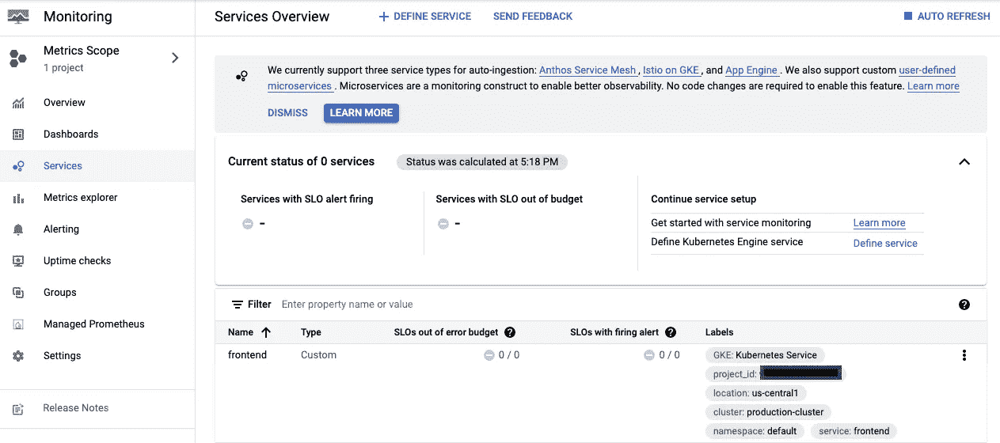

# 谷歌云 DevOps 系列:SRE 原理的可观测性

> 原文：<https://medium.com/google-cloud/part-5-google-devops-observability-with-sre-principles-33446da05c16?source=collection_archive---------0----------------------->

## Google Cloud DevOps 系列:第 5 部分

欢迎来到 Google Cloud DevOps 系列的第 5 部分..你可以在这里找到完整系列

************

**随着 Samajik 变得越来越敏捷，开发速度越来越快，Samajik DevOps 团队希望确保他们对影响客户的紧急问题做出响应，而不是对小问题做出反应，而不是在半夜被吵醒。为了实现这一目标，许多组织正在采用谷歌定义的 SRE 模式。**

********

**参考:[https://sre.google/books/](https://sre.google/books/)**

************************************

## *****【GKE 平台可观测性-日志记录和监控(演示)*****

**在本系列的前面部分，我们已经创建了多个 GKE 集群。让我们使用生产集群来理解可观察性技术。**

****

**“Google Cloud Operations”的主要优势之一是能够收集现成的系统指标、日志和丰富的上下文，而无需部署任何代理。**

****显著特征:****

1.  **不安装代理的 GKE 集群、节点和命名空间的关键指标。**
2.  **应用程序日志的默认集合**
3.  **GKE 实体对象之间的元数据和关系**

> **导航至 ***操作-监控*** 并点击 ***仪表盘。*** *它将显示所有谷歌云服务的仪表盘。***

****

****谷歌云监控仪表板-所有服务****

> **导航至 ***仪表盘*** 部分，点击***【GKE】*****

****

> **导航至 ***服务部分。*** 在这个“服务概述”页面上，有一个服务列表和一个服务摘要，其中列出了 SLO 上触发警报的服务以及超出错误预算的服务。注意，目前没有为服务定义 SLO。**

****

****谷歌云监控服务仪表板****

> **让我们首先定义服务。进入 ***定义服务*** 选项，选择服务，例如 ***【前端】*** 服务**

****

> **在设置 SLO 之前，我们需要做的第一件事是确定一个服务级别指标，我们将根据该指标创建 SLO。点击' ***'前端'*** 服务，选择' ***创建 SLO*** '选项。遵循下面给出的步骤。**
> 
> **步骤 1:通过选择“基于请求”或“基于窗口”选项来设置您的服务级别指标，然后单击“继续”。**

****

> **步骤 2:通过选择适当的性能指标定义服务级别指标详细信息，例如“kubernetes . io/container/restart _ count”**

****

> **步骤 3:通过选择“合规期”和“绩效目标”来定义您的服务水平目标**

****

> **步骤 4:检查设置并创建 SLO。**

****

> **导航到**操作-记录**T2 部分。*可以使用“搜索”部分中的查询来浏览所需微服务的日志。***

********

**你可以参考 YouTube 上的 [SRE 实现 DevOps 系列](https://www.youtube.com/playlist?list=PLIivdWyY5sqJrKl7D2u-gmis8h9K66qoj)了解更多 SRE 原则。**

****

**参考:[https://www.youtube.com/watch?v=uTEL8Ff1Zvk&list = pliivdwyy 5 sqjrkl 7d 2 u-gmis 8h 9k 66 qoj](https://www.youtube.com/watch?v=uTEL8Ff1Zvk&list=PLIivdWyY5sqJrKl7D2u-gmis8h9K66qoj)**

## **接下来…**

**在这篇博客中，我们学习了 SRE 原则以及如何使用云操作工具来实现它们。古汉对 DevOps 的理念和谷歌 SRE 的实践印象深刻。古汉和他在 Samajik 的团队不仅实现了 CI/CD 和开发人员工作流，还实现了可观测性。让我们继续关注将涵盖敏捷性和成本优化的讨论…**

**供稿人:[施吉木尔·阿克](https://medium.com/u/41b475b881ff?source=post_page-----33446da05c16--------------------------------)、[丹杜斯](https://medium.com/u/71d9487165c6?source=post_page-----33446da05c16--------------------------------)、[安其特·尼尚](https://medium.com/u/2d47f7f3f8e2?source=post_page-----33446da05c16--------------------------------)、[图沙尔·古普塔](https://medium.com/u/ee905ea343d?source=post_page-----33446da05c16--------------------------------)**

**更新:可以在这里阅读 Part-6 [。](/@tusharguptag/google-devops-agility-with-cost-optimization-930ad77ccc63)**