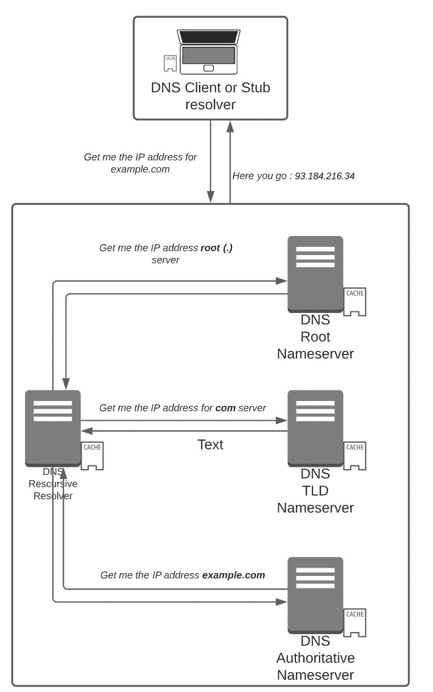
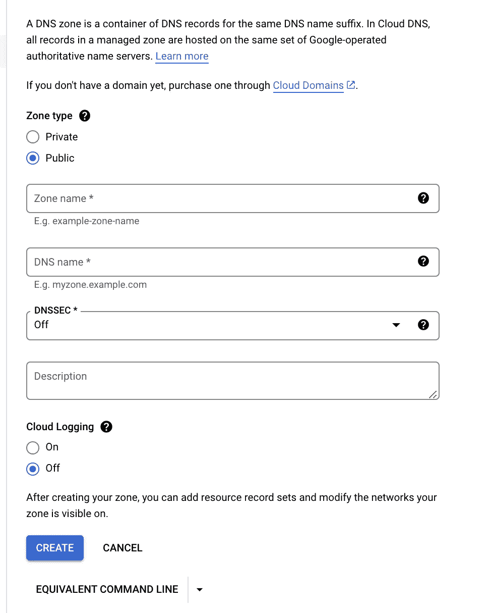
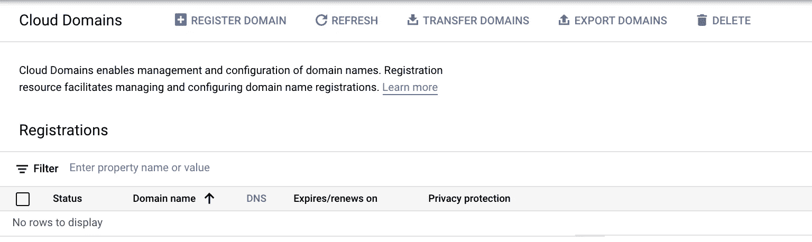
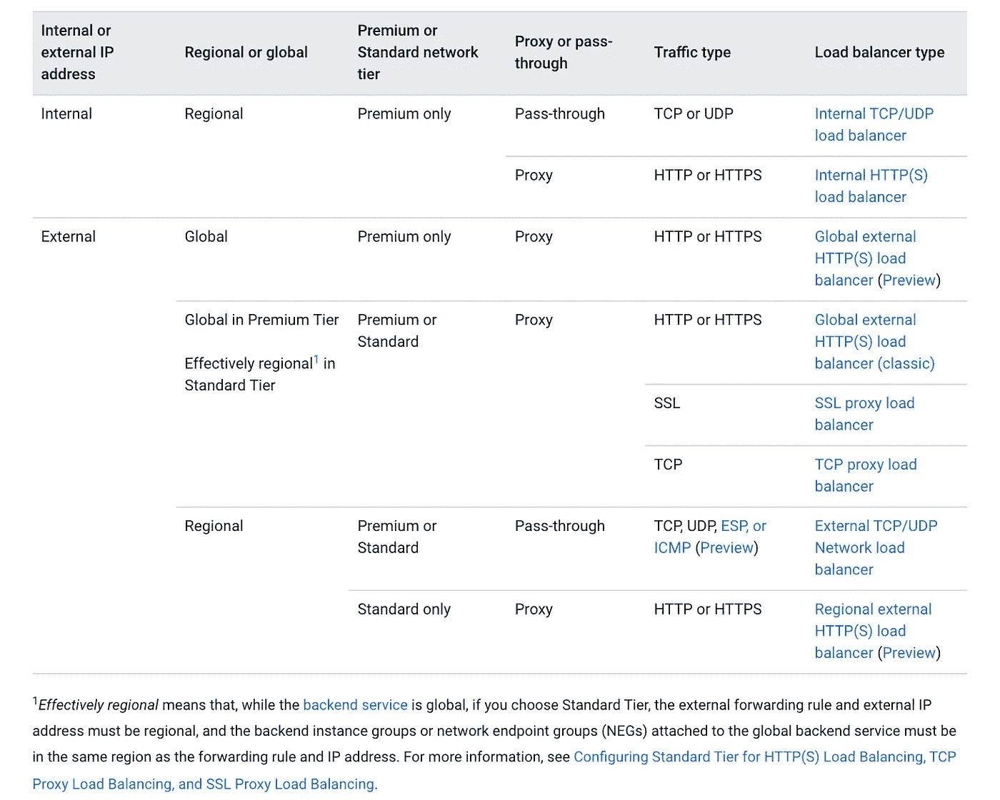
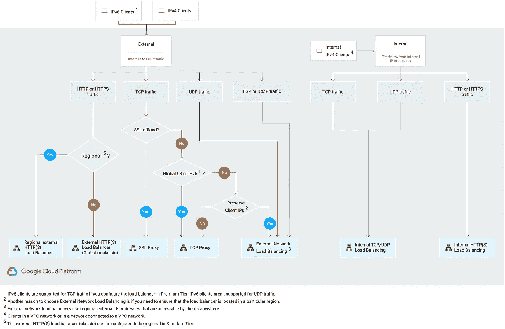
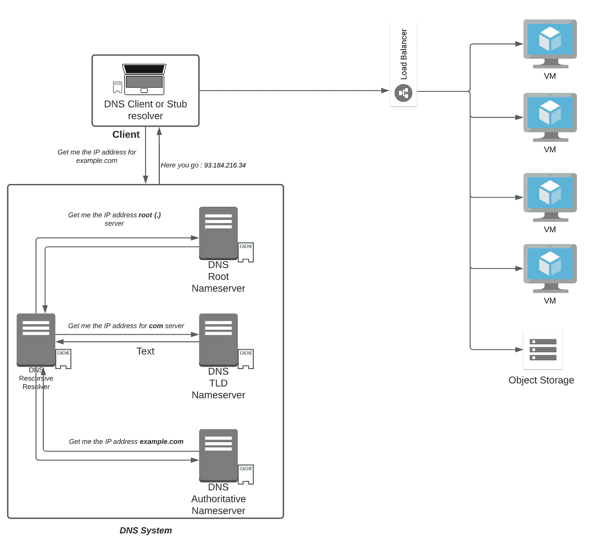
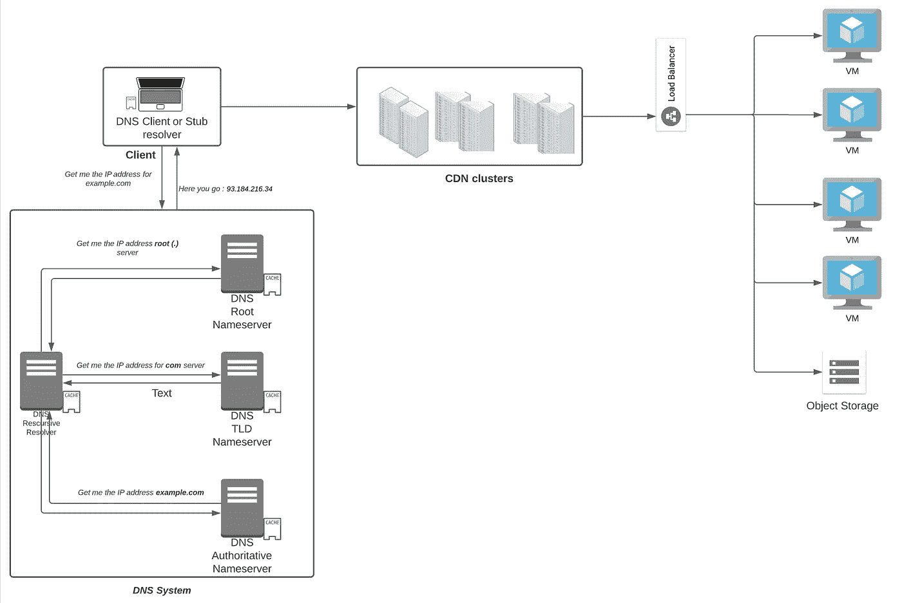
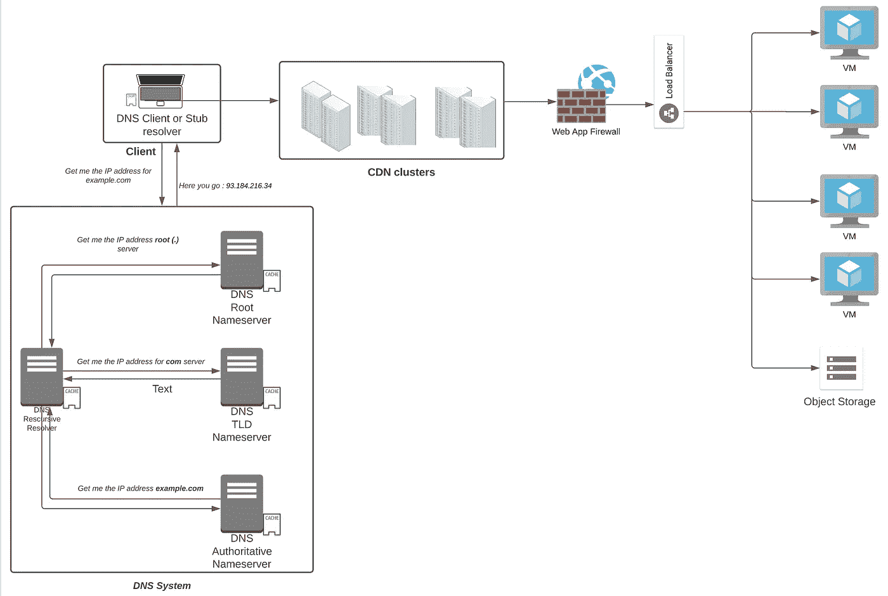
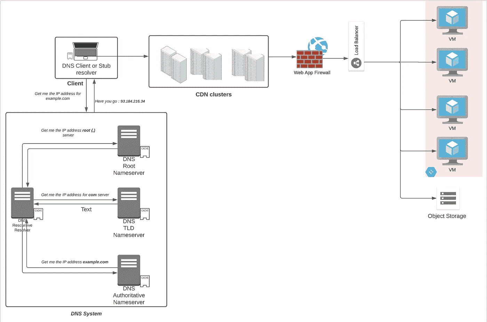

# 通过 GCP 学习云—第 5 部分:我如何连接到我的云？

> 原文：<https://medium.com/google-cloud/part-5-how-do-i-connect-to-my-cloud-53279e1e9e5e?source=collection_archive---------5----------------------->

> “互联网是人类建造的第一个人类不理解的东西，是我们有过的无政府状态下最大的实验。”
> 
> — **埃里克·施密特**

谢谢你一直陪着我。在[的上一篇博客](/@abhinavbhatiaoncloud/where-do-i-store-my-data-on-cloud-f672b1a3bbb2)中，我们浏览了存储数据的所有选项。到目前为止，我们已经了解了云计算和存储数据的方式，但仍然存在的一个重要难题是如何将应用程序与最终用户连接起来。记住，对于公用事业公司，你仍然需要有一个电源连接。电线被交叉铺设，以便电力可以从发电源传输到目的地家庭。类似地，在云的情况下，您的来源是云数据中心，在那里您拥有所有的计算能力，但是您需要一种用户可以利用计算能力的方式。连接模式是什么？这是互联网**，如果你是一家寻找专线来保证办公室更高性能的公司，你可以租用从办公室网络到云网络的线路。**

## **一些免责声明**

**在这个博客系列中讨论的所有观点都是我自己的，决不能归因于来自我现在或曾经是其中一部分的公司。这些是我学到的东西，我试图用尽可能简单的方式表达出来。我明白过度简化有时会导致另一种可能不真实的版本。我会尽最大努力不要过于简单化，但我唯一的要求是对所有这些持保留态度。从尽可能多的来源进行验证。**

**坐在家里或办公室，当您想要使用手机或笔记本电脑上的任何应用程序时，在到达目的地之前，您会与哪些设备进行交互？你听说过 DNS、CDN、负载平衡器、防火墙、路由器这样的名字吗？不。让我们在今天的博客中探讨一下。**

****DNS****

**几十年前，电话号码簿和黄页曾经在每个家庭和旅馆都可以找到，这样你就可以给邻居或公司打电话。DNS 扮演着电话号码簿的角色，浏览器需要知道域名的 IP 地址(相对于电话号码)才能连接，因为互联网上的每个域都可以用 IP 地址来标识。**

> **互联网上的每个节点都有一个 IP 地址，可以是 32 位的 IP v4(93.184.216.34)或 128 位的 IPv6(2606:2800:220:1:248:1893:25 c8:194)。它可以是私有的(不向 Internet 公开)，也可以是公共的(可通过 Internet 访问)。**

****

*****一个 DNS 请求到 example.com 的生命。*****

**基本上，当你在浏览器上输入一个域名，比如**example.com。**您的浏览器使用您笔记本电脑的 DNS 客户端向通常位于 ISP 处的 **DNS 解析器**发出递归请求。DNS 解析器的工作是获取 IP 地址。它首先到达**根服务器**(注意。example.com 之后)并获取**顶级域名(TLD)域名服务器** (com)的 ip 地址。然后，DNS 解析器到达 TLD 服务器并获取 example.com 的权威名称服务器的 IP 地址。它最终到达 example.com 的权威名称服务器，该服务器的回答是 example.com 位于 93.184.216.34 IP v4。通常，所有组件都有一个可用的缓存位置，这有助于从缓存中提供答案(因此节省了几次往返)。**

**一般来说，如果您托管您的 web 服务器，您还必须考虑托管其权威的 DNS 服务器，并创建如下记录**

*   ****给出 IPv4 地址的**记录**
*   ****AAAA** 记录哪个会给出 IPv6 地址**
*   ****CNAME** 会重定向到另一个域名的记录**
*   ****MX** 向电子邮件服务器发送地址的记录(不能指向 CNAME 记录)**
*   ****NS** 记录存储 DNS 条目的名称服务器**
*   ****TXT** 记录在记录中存储任意文本注释。有时对电子邮件安全或验证你的域名很有用。**
*   ****SOA** (授权记录的开始)记录用于存储关于域的管理信息(如域管理员的电子邮件)**
*   **用于存储特定服务的主机和端口的 SRV 记录(服务记录)(像 VOIP 呼叫中使用的会话发起协议这样的协议通常需要使用 SRV 记录)**
*   ****PTR** 记录为 IP 地址提供域名(在反向查找中)**
*   ****CAA** (证书颁发机构授权):包含主机/域可接受的证书颁发机构**
*   ****DNS Key**:DNSSEC 的密钥记录(DNS 安全扩展:通过验证返回的记录，使用公钥加密使 DNS 更加安全)**

**如果您需要这样的服务，您可以将其安装在您自己的虚拟机上并自行管理，也可以选择托管 DNS 服务，您只需对其进行配置。Google Cloud 拥有 [**云 DNS**](https://cloud.google.com/dns) ，它使用**任播**(发送到多个可能节点中距离最近的*】**域名服务器，从世界各地的冗余位置为您的 DNS 区域提供服务，为您的用户提供高可用性和更低的延迟。使用云 DNS，您可以设置**公共区域**(将由您的企业托管的公共域使用，如网站、用户应用)或**私有区域**(将由私有域使用，如内部站点、服务到服务调用与您的应用)*****

**********

*****在 Google Cloud 上管理 DNS 的选项*****

*****还有 [**云域**](https://cloud.google.com/domains/docs) 可以让你在 Google Cloud 中注册、迁移、配置一个域。*****

**********

*****GCP 上的云域*****

*******负载平衡器*******

*****一旦我们有了我们托管的域名的地址，你认为这个地址属于什么？托管中间件的 web 服务器，如 linux 中的 apache/nginx 或 windows 中的 Internet Information Server。但是，您认为一台虚拟机足以承担所有用户的负载吗？不。这就是负载平衡器的用武之地，顾名思义，它们将负载分配给托管 web 应用程序的多个服务器。主要有两种负载平衡器*****

*   *******应用负载平衡器**:这些负载平衡器工作在 [OSI 层](https://en.wikipedia.org/wiki/OSI_model)的第 7 层，那里有应用层。它们可以理解应用层协议，如 HTTP/HTTPs(端口 80，8080，443)，web 套接字，因此它们可以做出决定，如将请求重定向到特定的服务器基于主机和路径规则(主机规则，如 a.example.com 转到服务器 1，2，3，example.com 转到服务器 4，5 和 6，路径规则如 example.com/a 转到服务器 1，2，3，example.com/b 转到服务器 4，5，6)。他们还可以负责终止 HTTPs 连接，并打开与后端的新 HTTP 或 HTTPs 连接。*****
*   *******网络负载平衡器:**这些负载平衡器工作在 [OSI 层](https://en.wikipedia.org/wiki/OSI_model)的第 4 层，适用于使用 TCP 和 UDP 等网络协议的应用程序。并非所有的应用程序模块都有 web 服务器。有些会有内置的逻辑层来处理除了 web 以外的协议，如 3000 或任何协议。*****

*****关于负载平衡器，GCP 有不同的选项。*****

**********

*****[GCP 负载均衡器类型汇总](https://cloud.google.com/load-balancing/docs/choosing-load-balancer#lb-summary)*****

**********

*****[GCP 上的负载均衡决策树](https://cloud.google.com/load-balancing/docs/choosing-load-balancer#lb-decision-tree)*****

**********

*******负载平衡器的作用*******

*******内容交付网络*******

*****顾名思义，内容交付网络(CDN)是一组分布在世界各地的服务器，主要托管静态资产，如图像、视频、HTML 文件、javascript 文件、样式表，以便在更短的时间内向用户交付这些资产。这里有一个**源服务器**的概念，它是一个负载均衡器后面的服务器，承载着真实之源/您的 web 应用程序。由于 CDN 有助于将流量传输到他们的服务器网络上，因此源端的流量减少，从而降低了带宽成本。它们还有助于吸收所有流量，从而减轻一些安全攻击(如 DDOS)。因为有大量这样的服务器分布在世界各地，所以您的应用程序(以及内容)的正常运行时间也提高了。*****

**********

*******CDN 集群介绍*******

*******Web 应用防火墙*******

*****特别是对于网络流量，你需要一个设备，它可以检查正在流入的流量，并检查是否有人试图攻击你。这种攻击可以是对数据库(应用程序的核心)的攻击，也可以是对 web 层的攻击。其中一些攻击是*****

*   *******跨站点请求伪造**:目标是通过验证的用户或管理员点击恶意链接(通过电子邮件或聊天等社交工程攻击)，诱骗用户进行状态更改活动，如转移资金、更改密码等。*****
*   *******跨站脚本:**注入客户端的恶意代码(如评论框中的 JavaScript 代码)一旦加载到受害者的计算机上，就可以窃取受害者的 cookie 数据，然后被攻击者用来冒充受害者，并使用它来访问敏感数据。*****
*   *******SQL 注入:**恶意的 SQL 查询，目的是获取敏感数据和/或从数据库中删除敏感数据，通常被注入到表单之类的对象中。*****

*****在类似 [**的云解决方案上，云甲**](https://cloud.google.com/armor) 更进一步，还能抵御第 7 层 DDOS 攻击。*****

**********

*****WAF 来防止各种基于网络的攻击*****

*******虚拟私有云*******

*****我们之前讨论过，网络上的每个节点都有一个 IP 地址。寄信的时候，总是写**到**地址，从地址写**。类似地，节点之间或节点之间的所有通信都需要一个 IP 地址，因为这是系统的设计方式。云中的一切都是虚拟的，网络也是如此。虚拟私有云是一个包容的网络容器，它提供逻辑隔离并提供*******

*   *******IP 地址**:通过 ***子网(192.16.68.0/24)*** 等构造*****
*   *******路由**:类似于连接源和目的地的道路，通过一个叫做**路由器的网络设备实现，**路由连接两个节点，提供不同的路径到达特定的点*****
*   *******互联网网关**:一种类似路由器的设备，具有通往互联网(0.0.0.0/0)的路由*****
*   *******NATing** :一种设备，其主要目的是隐藏对外流量的敏感私有 IP 地址，并使用公共 IP，这样私有 IP 就不会暴露给外界，并且当收到响应流量时，同样会从公共 IP 地址变回私有 IP 地址。*****
*   *******防火墙:**类似于安全警卫，允许或拒绝流量进入或离开基于 VPC 的策略，通常定义在 5 个元组上(源 IP、目的 IP、源端口、目的端口、协议)。*****
*   *******虚拟专用网络(VPN):** 通过加密将专用网络(带有专用 IP 地址)扩展到公共网络，这样您就可以将云数据中心扩展到您的办公网络，并以安全可靠的方式进行通信*****

**********

*******托管在 VPC 内的用户虚拟机*******

**********

*****Pixabay 在[像素上拍摄的照片](https://www.pexels.com/photo/white-switch-hub-turned-on-159304/)*****

*****仅此而已。在这个由五部分组成的“了解云”系列中，我希望你们所有人都能够理解构建云的基本原则，并有望开始整理和设计你们的第一个云应用。还有很多相关的功能我还没有介绍，比如监控、日志、消息队列、人工智能和 ML 系统，它们有望成为第 6 部分。*****

*****点击此处查看其他部分:*****

*****— [**通过 GCP 学习云—第一部分:什么是云？**](/@abhinavbhatiaoncloud/part-1-what-is-cloud-507c60d3f849?source=your_stories_page----------------------------------------) 在这里，我试图用尽可能简单的方式来揭开云的神秘面纱，以便我们的大脑能够描绘出它(云模型类似于自动售货机/公用事业公司吗？)*****

*****— [**通过 GCP 学习云—第二部分:我如何使用云？**(IaaS、PaaS、SaaS、FaaS、XaaS)](/@abhinavbhatiaoncloud/part-2-how-can-i-consume-cloud-98fa1c2880aa?source=your_stories_page----------------------------------------)*****

*****— [**通过 GCP 学习云计算——第 3 部分:我在哪里进行云计算？**(虚拟机 vs Kubernetes vs 无服务器 vs 事件驱动的无服务器框架)](/@abhinavbhatiaoncloud/part-3-where-do-i-compute-on-cloud-4c105d74b35a?source=your_stories_page----------------------------------------)*****

*****— [**通过 GCP 学习云—第 4 部分:我在哪里存储我的云数据？**](/@abhinavbhatiaoncloud/part-4-where-do-i-store-my-data-on-cloud-f672b1a3bbb2?source=your_stories_page----------------------------------------) 在这里，我将尝试回答一个非常相关的问题，即如何选择合适的存储单元来保存您的数据。(OLTP vs OLAP，ETL vs ELT，SQL vs NoSQL，文件 vs 块存储，什么是 NewSQL？)*****

*****— [**通过 GCP 学习云—第 5 部分:如何连接到我的云？**](/@abhinavbhatiaoncloud/part-5-how-do-i-connect-to-my-cloud-53279e1e9e5e?source=your_stories_page----------------------------------------) (本博客)*****