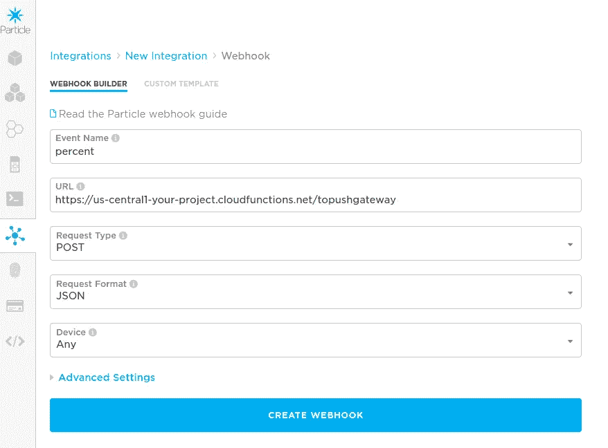
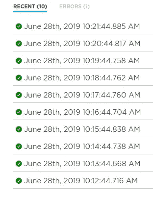
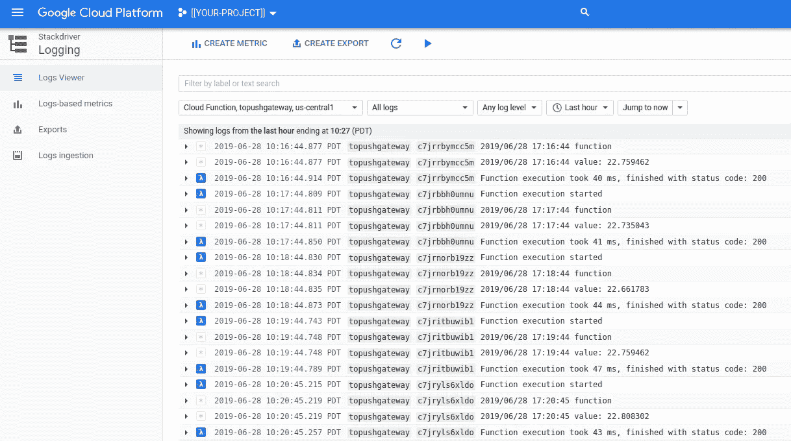
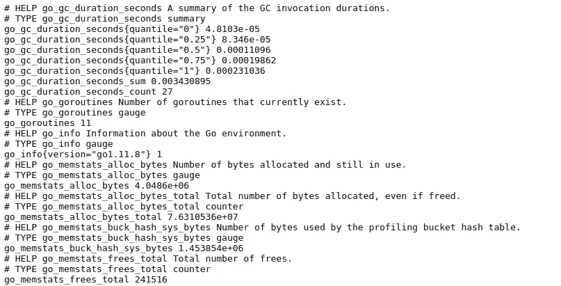
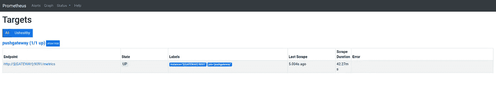
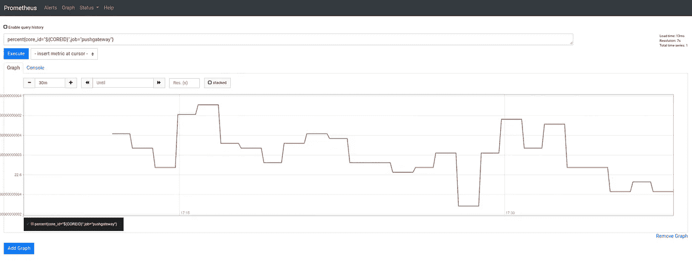

# 粒子、云函数和普罗米修斯

> 原文：<https://medium.com/google-cloud/particle-cloud-functions-prometheus-580b224b8c3e?source=collection_archive---------3----------------------->

继我之前的故事“ [Particle，OpenCensus & MicroK8s](/google-cloud/particle-opencensus-microk8s-17d886d535e) ”之后，我想知道 Prometheus [PushGateway](https://github.com/prometheus/pushgateway) 是否是一个提供粒子设备测量的好解决方案。

效果很好。

## 库伯内特斯

下面是为 Pushgateway 创建部署并将其公开为服务(使用 TCP 负载平衡器)的 Kubernetes 配置:

您可以获得服务的端点:

```
**GATEWAY**=$(kubectl get services/pushgateway \
--output=jsonpath="{.status.loadBalancer.ingress[0].ip}") && \
echo ${GATEWAY}
```

## 云函数

这里有一个云函数，它将传入的粒子 Webhook 帖子转换为普罗米修斯规范，并将其推送到 Pushgateway:

这可以通过以下方式进行部署:

```
gcloud functions deploy topushgateway \
--region=us-central1 \
--project=${PROJECT} \
--runtime=go112 \
--trigger-http \
--entry-point=ToPushGateway \
--set-env-vars=GATEWAY=**${GATEWAY}**
```

## 粒子网钩

创建一个粒子集成 Webhook，将粒子“百分比”事件发送到云函数:



## 测试

1 分钟后，Webhook 应报告事件:



云函数应该报告事件:



或者:

```
gcloud logging read 'resource.type="cloud_function" resource.labels.function_name="topushgateway"' \
--project=${PROJECT} \
--**freshness=5m** \
--format="json" \
| jq -r .[].textPayloadFunction execution took 43 ms, finished with status code: 200
2019/06/28 17:29:45 value: 22.881563
2019/06/28 17:29:45 function
Function execution started
Function execution took 40 ms, finished with status code: 200
2019/06/28 17:28:44 value: 22.710623
2019/06/28 17:28:44 function
Function execution started
Function execution took 43 ms, finished with status code: 200
2019/06/28 17:27:44 value: 22.442003
2019/06/28 17:27:44 function
Function execution started
Function execution took 42 ms, finished with status code: 200
2019/06/28 17:26:44 value: 22.710623
2019/06/28 17:26:44 function
Function execution started
Function execution took 41 ms, finished with status code: 200
2019/06/28 17:25:44 value: 22.637363
2019/06/28 17:25:44 function
Function execution started
```

Pushgateway 应该报告事件:

```
google-chrome http://**${GATEWAY}**:9091/metrics
```



您应该能够在页面中控制“百分比”度量。

## 普罗米修斯

如果您想将 Prometheus 服务器连接到 Pushgateway，创建一个`prometheus.yml`并替换`${GATEWAY}`的值:

```
global:
  scrape_interval: 5s
  external_labels:
    monitor: "local-monitor"scrape_configs:
  - job_name: "pushgateway"
    honor_labels: true
    static_configs:
      - targets: ["**${GATEWAY}**:9091"]
```

然后:

```
docker run \
--publish=9090:9090 \
--volume=${PWD}/prometheus.yml:/etc/prometheus/prometheus.yml prom/prometheus
```

并浏览`[http://localhost:9090](http://localhost:9090)`



使用 PromQL 找到`percent`:



> **NB** 在 PromQL 中，我通过`job="pushgateway"`和`core_id=${COREID}`进行过滤，其中`${COREID}`是从 Webhook 数据中提取的粒子设备的标识符。

## 结论

我一直想探索普罗米修斯之门。因为粒子发布事件是短暂可用的，所以使用类似云函数的东西将它们推送到 Pushgateway 是有意义的。

希望这有助于你想象其他场景！

仅此而已。