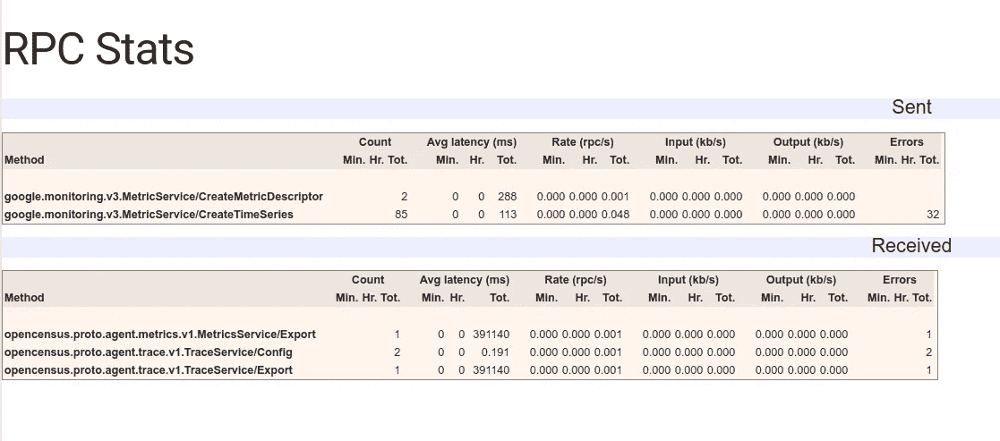

# 粒子、OpenCensus 和 MicroK8s

> 原文：<https://medium.com/google-cloud/particle-opencensus-microk8s-17d886d535e?source=collection_archive---------1----------------------->

我用[尼克·英格曼](https://medium.com/u/865200fae862?source=post_page-----17d886d535e--------------------------------)的[为盆景安装了一个湿度传感器，学习如何建立室内植物，一个网状连接的土壤监测系统](https://blog.particle.io/2019/05/06/learn-how-to-build-in-plants-a-mesh-connected-soil-monitoring-system/)。该解决方案将粒子设备数据发布到 ThingSpeak。

我想将解决方案扩展到 Google 的数据库服务，但是在应用数据(这是)和测量数据(这是)之间有一条细微的界限。对于测量，我们有监控解决方案。我感兴趣的一个监测框架是 OpenCensus。

因此，在这里，[粒子](http://particle.io)设备事件数据与谷歌云函数挂钩，该函数从数据中创建 OpenCensus 测量，并将其发送到运行在 MicroK8s 上的 OpenCensus 代理(“因为它很酷”)，并使其作为 Prometheus(也很酷)度量端点和 Stackdriver(“因为我试图成为一名优秀的谷歌人”)。


跟随 Nick 的帖子，让自己了解一个可以定期测量和发布水分数据的 particle.io 设备。如果设备正在向 ThingSpeak 发布数据，那么你就很好:


## 公开普查

OpenCensus 拥有独立于监控服务的客户端 SDK。这些将数据发送到 OpenCensus 代理，该代理被配置为将数据转换并发送到您首选的监控(和跟踪)服务。我正在集中精力监视和使用 Stackdriver 和 Prometheus。下面是代理配置:

```
receivers:
  opencensus:
    address: ":**55678**"exporters:
  stackdriver:
    project: "[[YOUR-PROJECT]]"
    enable_tracing: false
    enable_metrics: true
  prometheus:
    address: ":**8999**"zpages:
    port: **8888**
```

您可以在本地运行代理进行测试，但如果您希望将数据导出到 Stackdriver，则需要一个带有`roles/monitoring.metricWriter`的 Google 服务帐户。我是这样做的:

```
PROJECT=[[YOUR-PROJECT]]
ROBOT=opencensus
FILE=${PWD}/${ROBOT}.jsongcloud iam service-accounts create $ROBOT \
--display-name=$ROBOT \
--project=$PROJECTgcloud iam service-accounts keys create ${FILE} \
--iam-account=${ROBOT}@${PROJECT}.iam.gserviceaccount.com \
--project=$PROJECTgcloud projects add-iam-policy-binding $PROJECT --member=serviceAccount:${ROBOT}@${PROJECT}.iam.gserviceaccount.com --role=roles/monitoring.metricWriter
```

然后:

```
docker run \
--interactive --tty \
--volume=$PWD/ocagent.yaml:/configs/ocagent.yaml \
--volume=$PWD/opencensus.json:/secrets/opencensus.json \
--publish=8888:**8888** \
--publish=8999:**8999** \
--publish=55678:**55678** \
--env=GOOGLE_APPLICATION_CREDENTIALS=/secrets/opencensus.json \
omnition/opencensus-agent:0.1.8 \
  --config=/configs/ocagent.yaml
```

现在，我们来看看这个配置是如何映射到 Kubernetes 配置文件的:

```
---
apiVersion: v1
kind: ConfigMap
metadata:
  name: ocagent
data:
  ocagent.yaml: |
    receivers:
      opencensus:
        address: ":**55678**"exporters:
      stackdriver:
        project: "[[YOUR-PROJECT]]"
        enable_tracing: false
        enable_metrics: true
      prometheus:
        address: ":**8999**"zpages:
        port: **8888**
...
---
apiVersion: apps/v1
kind: Deployment
metadata:
  labels:
    project: particle.io
  name: ocagent
spec:
  replicas: 1
  selector:
    matchLabels:
      project: particle.io
      app: agent
  template:
    metadata:
      labels:
        project: particle.io
        app: agent
    spec:
      volumes:
      - name: ocagent
        configMap:
          name: ocagent
      - name: opencensus-key
        secret:
          secretName: opencensus-key
      containers:
      - name: ocagent
        image: omnition/opencensus-agent:0.1.8
        imagePullPolicy: IfNotPresent
        args:
        - --config=/configs/ocagent.yaml
        volumeMounts:
        - name: ocagent
          mountPath: /configs/
        - name: opencensus-key
          mountPath: /var/secrets/google
        env:
        - name: GOOGLE_APPLICATION_CREDENTIALS
          value: /var/secrets/google/opencensus.json
...
---
apiVersion: v1
kind: Service
metadata:
  labels:
    project: particle.io
  name: ocagent
spec:
  selector:
    project: particle.io
    app: agent
  ports:
  - name: zpages
    port: **8888**
  - name: prometheus
    port: **8999**
  - name: grpc
    port: **55678**
  type: NodePort
...
```

## 云函数

我们需要一种方法来接收来自 Particle 的 Webhooks，并将它们转换成 OpenCensus。我用的是谷歌云功能和 Golang。函数如下:

以及附带的 go.mod:

```
module cloudfunctiongo 1.12require (
 contrib.go.opencensus.io/exporter/ocagent v0.5.0
 go.opencensus.io v0.21.0
)
```

对于本地开发，我建议将它们放在一个子目录中，为了一致起见，我们称之为“`p`”。在一个姊妹子目录中，创建一个“`server`”，并在其中放置`main.go`:

```
package mainimport (
 "log"
 "net/http""github.com/[[YOUR-ACCOUNT]]/webhook/p"
)func main() {
 log.Println("main")
 http.HandleFunc("/", p.Percent)
 log.Fatal(http.ListenAndServe(":9999", nil))
}
```

这只是提供了一个方便的包装器，以便我们可以在本地测试我们的功能。OpenCensus 代理运行后，启动服务器:

```
SERVICE_NAME=test \
AGENT_ENDPOINT=:55678 \
go run server/main.go
```

然后，您可以在服务中抛出一些测试数据:

```
#!/bin/bashENDPOINT="localhost:9999"
for TEST in {1..100}
do
  PERCENT=$(bc <<< "scale=2; ${TEST}/100")
  DATE=$(date --rfc-3339=seconds)
  DATA="\
    {\"event\":\"test\",\
    \"data\":\"${PERCENT}\",\
    \"published_at\":\"${DATE}\",\
    \"coreid\":\"TEST\"}"
  RESULT=$(\
    curl \
    --silent \
    --request POST \
    --header "Content-Type:application/json" \
    --data "${DATA}" \
    ${ENDPOINT})
  printf "%s [%s]\n" ${PERCENT} ${RESULT}
done
```

一旦生成了一些数据，您就可以查看 zPages:

`[http://localhost:8888/debug/rpcz](http://localhost:8888/debug/rpcz)`



普罗米修斯:

`http://localhost:8999/metrics`


还有斯塔克德瑞。使用“指标浏览器”，您应该能够浏览“开放人口普查/百分比”:


## 库伯内特斯

使用 Kubernetes 托管 OpenCensus 代理有点过分了，但是 Kubernetes 为使用容器共享文件(例如 ocagent.yaml)的问题提供了一个优雅的解决方案。出于这个原因，我在容器图像上使用 micro k8s([链接](/google-cloud/microk8s-on-google-cloud-platform-d8b7a71a3ef))。

我们希望群集能够对 Stackdriver 进行身份验证。为此，我们将服务帐户密钥复制到集群实例，从中创建一个 Kubernetes 秘密，然后将该秘密(作为卷挂载中的文件)提供给部署。从您的工作站:

```
gcloud compute scp \
  ${PWD}/opencensus.json \
  ${INSTANCE}: \
--project=${PROJECT} \
--zone=${ZONE}
```

在`${INSTANCE}`内:

```
microk8s.kubectl create secret generic opencensus-key \
--from-file=**opencensus.json**=${PWD}/opencensus.jsonsecret/opencensus-key created
```

> **注意**为了简单起见，我在秘密中保留了密钥的文件名(`opencensus.json`)。但是，您也可以使用此命令重命名该文件。

然后:

```
microk8s.kubectl apply --filename=kubernetes.yaml
```

我们需要 OpenCensus 代理的 gRPC 端点的节点端口来配置云功能:

```
GRPC=$(\
  microk8s.kubectl get services/ocagent \
  --output=jsonpath='{.spec.ports[?(@.name=="grpc")].nodePort}') && \
echo ${GRPC}
```

> **NB** 如果你愿意，你也可以确定 zPages(用`ZPGS`和`name=="zpages"`替换`GRPC`)和 Prometheus(用`PROM`和`name=="prometheus"`替换`GRPC`)的节点端口

当您创建 MicroK8s VM 时，您应该有一个实例名(`${INSTANCE}`)。我们可以用这个，`${PROJECT}`和`${ZONE}`来获取公共 IP 地址:

```
MICROK8S=$(\
  gcloud compute instances describe ${INSTANCE} \
  --project=${PROJECT} \
  --zone=${ZONE} \
  --format="value(networkInterfaces.accessConfigs[0].natIP)") && \
echo ${MICROK8S)
```

你需要在防火墙上打一个洞，这样云功能就可以访问服务:

```
gcloud compute firewall-rules create particle-demo \
--direction=INGRESS \
--priority=1000 \
--network=default \
--action=ALLOW \
--rules=tcp:${GRPC}**,tcp:${ZPGS},tcp:${PROM}** \
--source-ranges=0.0.0.0/0 \
--project=${PROJECT}
```

> 如果您想通过外部 IP 使用 zPage 和 Prometheus 端口，请仅包括它们。

## 云函数

一旦您对本地测试感到满意，您就可以部署到云功能:

```
PROJECT=[[YOUR-PROJECT]]
REGION=[[YOUR-REGION]] # Perhaps 'us-central1'gcloud services enable functions.googleapis.com \
--project=${PROJECT}gcloud functions deploy webhook \
--region=${REGION} \
--project=${PROJECT} \
--runtime=**go112** \
--trigger-http \
--entry-point=Percent \
--set-env-vars=\
SERVICE_NAME=particle.io,\
AGENT_ENDPOINT=${MICROK8S}:${GRPC}
```

一旦部署，云功能可以像以前一样使用 bash 脚本进行最好的测试，但是添加一个新的 Particle Webhook 也一样快。

## Webhook

使用粒子控制台:


几分钟后，配置好的 Webhook 将会报告——希望如此——成功接收到事件，如下所示。

## 测试

检查粒子设备是否正在发布事件。您可以使用粒子控制台来完成此操作:

然后检查 Webhook 是否正在将事件发送到云函数:


查看云功能控制台或日志:

```
gcloud logging read 'resource.type="cloud_function"' \
--project=${PROJECT} \
--format=json --limit=25 \
| jq -r .[].textPayloadFunction execution took 3 ms, finished with status code: 200
value: 20.122101
percent
Function execution started
Function execution took 4 ms, finished with status code: 200
value: 20.415140
percent
Function execution started
Function execution took 3 ms, finished with status code: 200
value: 20.317461
percent
Function execution started
Function execution took 4 ms, finished with status code: 200
value: 20.561661
percent
Function execution started
Function execution took 8 ms, finished with status code: 200
value: 20.366301
percent
Function execution started
Function execution took 4 ms, finished with status code: 200
value: 20.317461
percent
Function execution started
Function execution took 3 ms, finished with status code: 200
```

确认 MicroK8s 服务(pod)正在侦听:

```
POD=$(\
  microk8s.kubectl get pods \
  --selector=project=particle.io \
  --output=jsonpath="{.items[0].metadata.name}")microk8s.kubectl get logs pod/${POD}Setting Stackdriver default location to "[[YOUR-PROJECT]]"
{..."msg":"Metrics Exporter enabled","exporter":"stackdriver"}
{..."msg":"Metrics Exporter enabled","exporter":"prometheus"}
Running OpenCensus Trace and Metrics receivers as a gRPC service at ":55678"
Running zPages on port 8888
```

如果您公开了`${ZPGS}`和`${PROM}`端口，您可以查看这两个端口，以确认数据正在通过代理推送:

```
google-chrome ${MICROK8S}:${ZPGS}/debug/rpcz
google-chrome ${MICROK8S}:${PROM}/metrics
```

我将让您配置一个 Prometheus 服务器来定位 OpenCensus Prometheus 端点。

这是一个堆栈驱动图:


## 结论

在这个故事中，我们通过使用 Google Cloud 函数创建 Webhook 服务来扩展 Nick 的解决方案，该服务创建 OpenCensus 测量值，将这些测量值发送到部署在 MicroK8s 上的 OpenCensus 代理，并向 Stackdriver 和 Prometheus 提供测量值。

OpenCensus 的优势之一是它将生产者和消费者的关注点分开。既然粒子数据被公开为 OpenCensus 数据，那么重新配置代理以将数据公开给 Datadog、AWS、Azure 和任何其他支持的监控服务就是一件小事。

仅此而已！

## 整理

焦土方案将删除所有内容，包括项目…

小心行事…

```
gcloud projects delete ${PROJECT}
```

或者，您可以选择以下某个子集来删除特定资源:

```
gcloud functions delete webhook \
--region=us-central1 \
--project=${PROJECT}gcloud compute instances delete ${INSTANCE} \
--zone=${ZONE} \
--project=${PROJECT}gcloud compute firewall-rules delete particle-demo \
--project=${PROJECT}
```