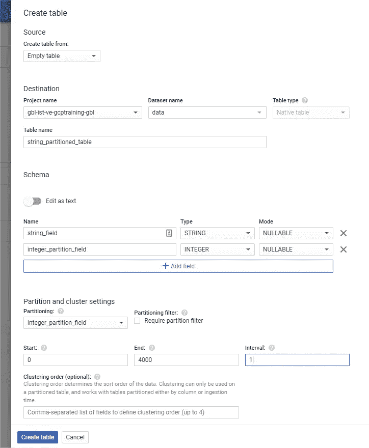
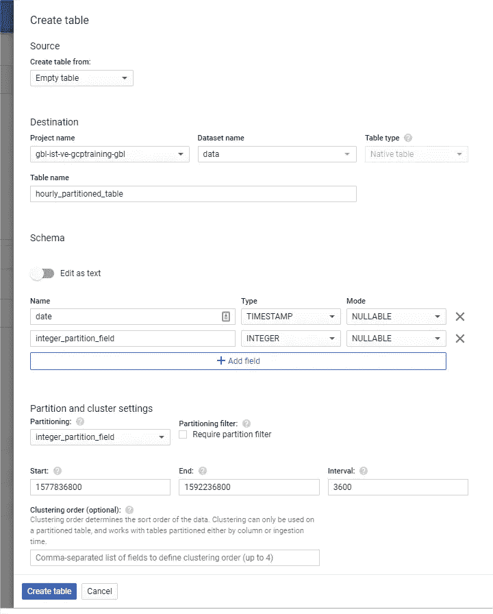

# 使用 BigQuery 对任何字段进行分区

> 原文：<https://medium.com/google-cloud/partition-on-any-field-with-bigquery-840f8aa1aaab?source=collection_archive---------0----------------------->


数据对公司至关重要。他们中的许多人拥有比处理能力更多的数据。而且，可悲的是，大量的值沉睡在数据库中。

BigQuery 是 Google 云平台产品，它解决了这个问题。 **BigQuery 是一个 Pb 级的数据仓库**，你可以在几秒钟内查询 TB 级的数据，你可以**释放你休眠数据的能量**。

# 定价模型和划分问题

BigQuery 有两种定价模式:**按需**和**统一费率**

使用**统一费率模型**，您提交了许多“[槽位](https://cloud.google.com/bigquery/docs/slots)”(计算能力的单位)，并且您预先知道您将支付的账单。第一个统一费率承诺相当高(每月 1 万美元)，**建议大数据公司采用。**

使用**按需模式**，您需要根据扫描的数据量付费。这种模式非常适合初创、中型和小型公司。由于“*扫描的数据越多，支付的费用就越多*，为了限制成本，必须对数据进行优化，以减少读取的数据。为此，BigQuery **允许对数据进行分区，以缩小扫描的数据量**。

*注意:区分扫描的数据量和返回的数据量很重要。一个* `*limit*` *在查询结束时限制结果不是卷扫描。*

# 划分和聚类

**分区和集群是两个特性，允许您缩小在数据库中扫描的数据量**。

到目前为止，分区只能在日期: [**上，或者在时间戳字段**](https://cloud.google.com/bigquery/docs/creating-column-partitions) **上，或者在摄取时间** **上** [**上；两者同一天粒度**。像这样，为每天创建一个类似于“*子表”、*的分区。当你寻找一个数据时，只需指定日期(或日期范围)**，只查询感兴趣的分区，只扫描相关数据**。](https://cloud.google.com/bigquery/docs/creating-partitioned-tables)

集群是分区内更细粒度的优化，类似于关系数据库中的复合索引。 [Felipe Hoffa](https://medium.com/u/279fe54c149a?source=post_page-----840f8aa1aaab--------------------------------) (谷歌云开发者倡导者)发布了一篇关于这方面的文章

# 整数范围划分

2019 年 12 月，Google 已经发布了**新的分区能力:** [**整数范围分区**](https://cloud.google.com/bigquery/docs/creating-integer-range-partitions) 。这个特性允许您在同一个分区中存储同一个范围的所有值

您必须定义最小值和最大值，以及范围大小。就这样，碎片是为你做的！**你有用户 ID，邮政编码，地理坐标，(…)分区为你工作**！

> 但是，如果我没有数值或日期值呢？

# 创建您定制的分区

通过允许整数分区， **BigQuery 允许您在任何字段上进行分区** : Float、String、Date……为了实现这一点，您**必须在存储和查询数据时将分区字段转换成一个整数值**。

## 字符串字段上的分区

> 如果我的数据库中没有数字用户 ID，只有电子邮件 ID，如何对这个表进行分区？

为此， **BigQuery 有很多内置函数**，其中一个就是 [Farm-Fingerprint](https://cloud.google.com/bigquery/docs/reference/standard-sql/hash_functions#farm_fingerprint) hash 函数。这个函数将您输入转换成一个带符号的 INT64 值。不要指望有 1e+19 分区来微调你的账单。根据 **BigQuery 的限制和配额，** [**每个表限制 4000 个分区**](https://cloud.google.com/bigquery/quotas#partitioned_tables) **。**

因此，根据这个限制，您可以像这样创建最优化的表分区



现在，这个表上有多达 4000 个分区。在分区字段中填入正确的值

```
INSERT INTO `data.string_partitioned_table` 
     VALUES ("string_example",        
              ABS(MOD(FARM_FINGERPRINT("string_example"),4000)) + 1)
```

为了检索符合正确分区的数据，通过使用相同的分区值处理

```
SELECT * 
FROM `data.string_partitioned_table` 
WHERE integer_partition_field =     
           ABS(MOD(FARM_FINGERPRINT("string_example"),4000) + 1)
```

## 每小时需要一个分区？

**BigQuery 时间戳划分如今仅限于日粒度**，而且不能有更细的粒度，例如，小时划分粒度。

为此，整数分区可以很容易地解决这个问题。**我们只需简单地转换时间戳**，这要感谢一个内置的 BigQuery 函数`UNIX_SECONDS` ，它可以将时间戳转换为秒，一个整数！

*注意:这也适用于毫秒和微秒。*

从定义第一个分区开始。这里`2020-01-01 12am`。

```
select UNIX_SECONDS(TIMESTAMP("2020-01-01 00:00:00"))#Result
1577836800
```

然后，加上 4000 小时，得到你的最大上限*(大约 166 天)。*记住，BigQuery 被限制为 4000 个分区

```
select UNIX_SECONDS(TIMESTAMP_ADD(
   TIMESTAMP("2020-01-01 00:00:00"), INTERVAL 4000 HOUR)
)#Result
1592236800
```

现在创建你的表格，以秒为单位给出你的下限和上限，1 小时的间隔-> 3600 秒



现在，这个表上有多达 4000 个分区。在分区字段中填入正确的值

```
INSERT INTO `data.hourly_partitioned_table`  
     VALUES (TIMESTAMP("2020-03-28 08:00:00"),        
              UNIX_SECONDS(TIMESTAMP("2020-03-28 08:00:00")))
```

为了检索符合正确分区的数据，通过使用相同的分区值处理

```
SELECT * 
FROM `data.hourly_partitioned_table` 
WHERE integer_partition_field =     
          UNIX_SECONDS(TIMESTAMP("2020-03-28 08:00:00"))
```

此外，分区是连续的，你可以像这样搜索一个小时范围

```
SELECT * 
FROM `data.hourly_partitioned_table` 
WHERE integer_partition_field >    
          UNIX_SECONDS(TIMESTAMP("2020-03-28 08:00:00"))
  AND integer_partition_field <=
          UNIX_SECONDS(TIMESTAMP("2020-03-28 18:00:00"))
```

# 限制和制约因素

除了 BigQuery 中可能的 4000 个分区的**限制之外，**解决方案意味着添加一个额外的分区字段，并将其存储在您的表中**。要激活分区，必须正确设置该分区字段。顺便说一下，当你执行摄取时，你有两个解决方案**

*   在加载作业之前填充分区字段，或者在流插入之前填充到代码中
*   将数据加载到 BigQuery 中，并对这些数据执行*插入选择*。

## 加载前填写分区字段

**解决方案要求在加载作业之前对文件进行预处理**，或者在代码中进行流插入之前进行额外的处理。

*   对于字符串字段类型，`FARM_FINGERPRINT`是一个开源的哈希函数，你可以很容易地重用它。
*   对于日期字段类型，以秒为单位的时间戳转换是所有时间库中的标准转换。

如果您使用 **自定义转换或散列**，请记住，在插入 BigQuery 之前创建的分区字段的值必须在您的 BigQuery 查询中可重用。 [*【用户自定义功能】(UDF)*](https://cloud.google.com/bigquery/docs/reference/standard-sql/user-defined-functions) *对此可以有所帮助。*

## 执行插入-选择

如果**不想执行预处理**，可以将数据*按原样*加载到 BigQuery 临时表中，然后**执行请求 INSERT-SELECT 到最终目的表**。

```
# For string partitioning
INSERT INTO `data.string_partitioned_table` 
    SELECT string_field, 
           ABS(MOD(FARM_FINGERPRINT(string_field),4000) + 1) 
    FROM `data.string_partitioned_table_temp`# For hourly partitioning
INSERT INTO `data.hourly_partitioned_table`  
    SELECT date, UNIX_SECONDS(date)
    FROM `data.hourly_partitioned_table_temp`
```

这种解决方案有几个限制

*   你必须查询临时表中的数据，因此**你必须为这个查询**付费。
*   你受到限制，今天每天每桌**t**[**1000**](https://cloud.google.com/bigquery/quotas#standard_tables)`[**INSERTs**](https://cloud.google.com/bigquery/quotas#standard_tables)`[](https://cloud.google.com/bigquery/quotas#standard_tables)**，与每天每桌加载作业的限制相同。**
*   **您必须管理临时表，因此在插入选择后，您**必须删除它们。****

# **划分任何字段**

**然而，新的 **BigQuery 特性开启了新的用例，而 push 进一步拓展了当前的限制**。**

**现在，您可以**根据您的数据类型和结构以最相关的方式优化您的查询成本**。分区不再局限于天数或整数！**