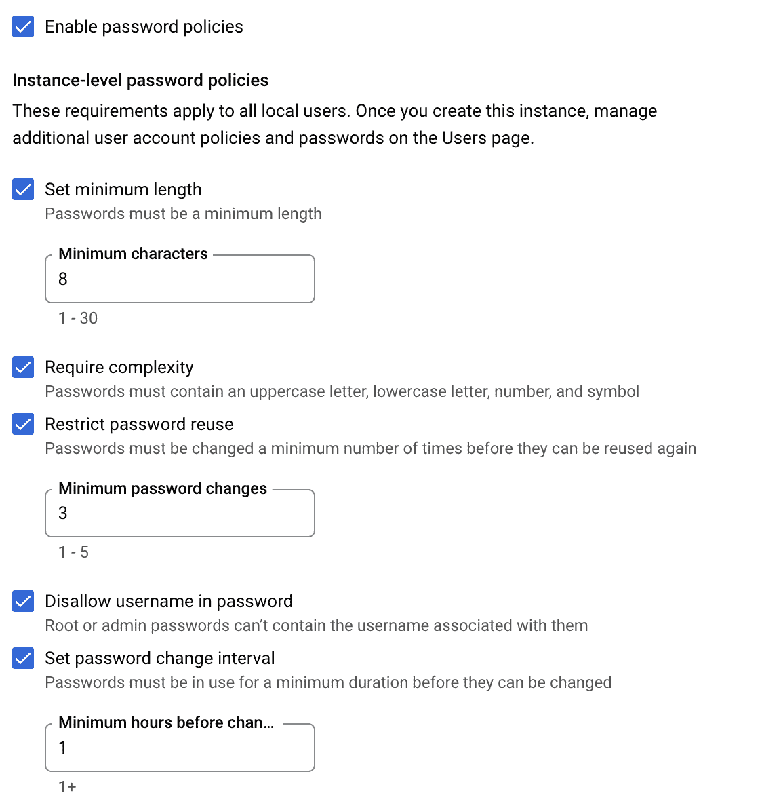
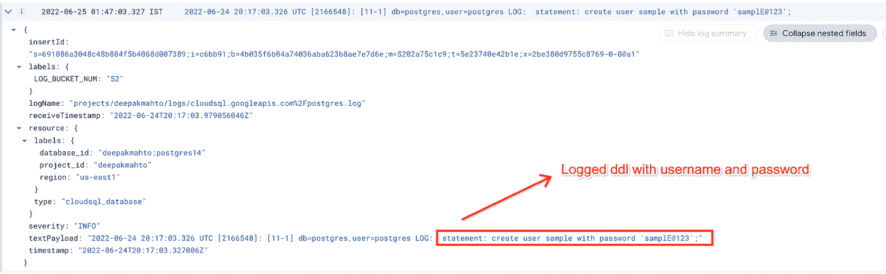
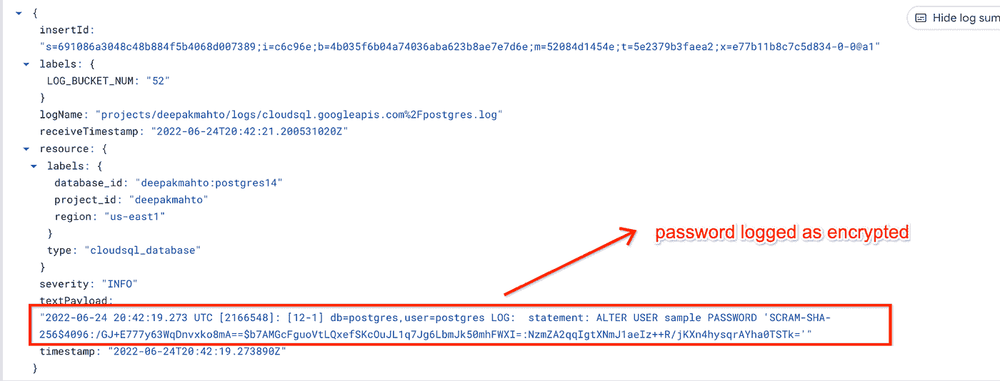
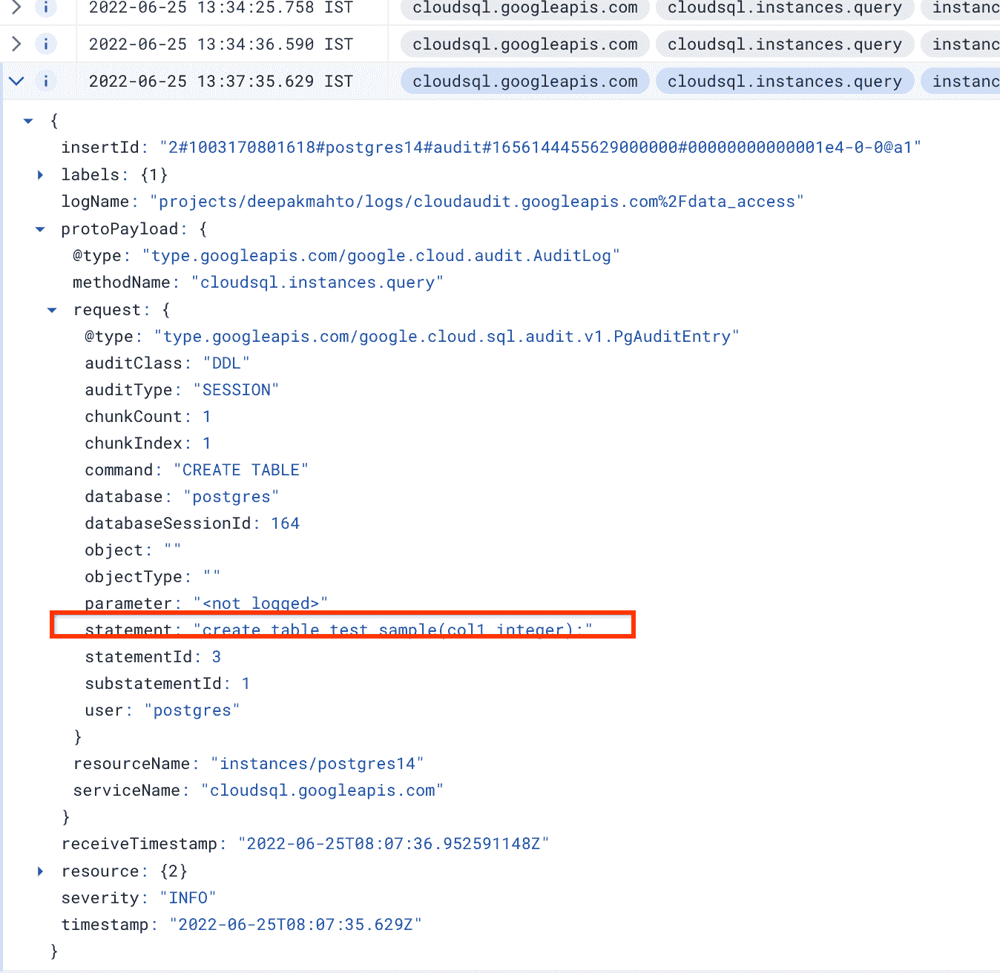

# 使用 CloudSQL for PostgreSQL 实现更强的安全性:实现密码策略。

> 原文：<https://medium.com/google-cloud/password-policies-with-cloudsql-for-postgresql-adf7f7e18cca?source=collection_archive---------0----------------------->

密码策略集根据复杂性、到期时间和可重用性来定义治理。它强制用户遵循一套作为最低要求或规则的密码标准。定义良好的密码策略(关于最小长度、复杂性和到期时间)使用内置身份验证为数据库用户增加了一层安全性。

最近，CloudSQL for PostgreSQL [推出了](https://cloud.google.com/sql/docs/postgres/built-in-authentication#built-in_authentication_for)在实例级强制执行密码策略，作为额外的安全措施。它主要用于内置身份验证，即使用数据库登录密码进行身份验证。

这篇博客将介绍所有可用的策略选项，这些策略可以在实例级应用，也可以在不强制执行的情况下应用。

例如，我们将围绕最低密码要求、可重用性和到期规则启用所有策略。



CloudSQL PostgreSQL —密码策略选项

密码策略集在实例级对所有 CloudSQL 用户强制实施，并应用于此后创建或更改的所有用户。

让我们尝试一些示例用户创建，并使用 psql 命令行检查密码策略的实施。

**长度检查** 控制密码所需的最小长度。

```
postgres=> create user sample with password ***‘test123’***;
ERROR: INVALID_PASSWORD: password is not long enough.
```

**复杂性检查** 用小写\大写、数字、符号控制密码的复杂性。

```
postgres=> create user sample with password ***‘test1234’***;
ERROR: INVALID_PASSWORD: password should contain at least one lowercase, one uppercase, one number and one non-alphanumeric characterspostgres=> create user sample with password ***‘test@1234’***;
ERROR: INVALID_PASSWORD: password should contain at least one lowercase, one uppercase, one number and one non-alphanumeric characters
```

**可重用性检查** 根据最小密码更改设置控制和限制密码的重用。

```
postgres=> alter user sample with password ***‘tesT@1234’***;
ERROR: INVALID_PASSWORD: the password should not reuse recent passwords.
```

**密码检查中的用户名** 控制检查以避免创建相同的用户名和密码。

```
​​postgres=> create user ***sample*** with password ***‘sample’***;
ERROR: INVALID_PASSWORD: password is not long enough.postgres=> create user ***“Sample@123”*** with password ***‘Sample@123’***;
ERROR: INVALID_PASSWORD: password should not contain username.
```

**密码更改过于频繁。** 我们可以配置密码更改前必须使用最短时间，任何在指定时间前更改密码的尝试都将导致违规。

```
postgres=> alter user sample with password ‘TesT@!234$’;
ERROR: INVALID_PASSWORD: password changes too frequently.
```

我们已经强制在特定的定义时间内使用 set password，因此在此期间任何更改它的尝试都将调用 INVALID_PASSWORD。

使用密码策略，我们可以实施构建 it 身份验证的规则，并在数据库中设置预定义的密码标准。对于使用加密密码修改或创建用户的情况，CloudSQL 不会强制执行任何策略，它可以跳过。

让我们更仔细地看一下场景，我们可以对抗未实施密码策略的情况，我们将首先演练将普通密码记录到 PostgreSQL 日志中的问题，以及某些解决方法如何可能不实施密码策略。

**将普通密码记录为 PostgreSQL 日志的一部分**

大多数 PostgreSQL 数据库都支持不同级别的日志记录，DDL 是最常见的，因为运行 alter user/create user 的 DDL 会以明文形式记录在日志中。被记录的密码会带来安全威胁，因为在日志中以明文形式暴露密码。

```
postgres=> show log_statement;
log_statement
— — — — — — — -
ddl
(1 row)
postgres=> create user sample with password 'samplE@123';
```

如果我们检查上述语句的日志，它将显示普通密码作为 PostgreSQL 日志的一部分。



**缓解—记录计划密码**

**\ psql 客户端的密码选项**
避免在日志或命令行中记录普通密码的最佳实践之一是利用 psql 命令行的 *\password* 选项来更改密码。它根据 *password_encryption* 标志，使用加密隐式加密作为 alter 语句的一部分的密码。

```
postgres=> \password sample1
Enter new password for user "sample1":
Enter it again:postgres=> \q--using cloudsql proxy for connection hence -h localhost.
deepakmahto$ **PGPASSWORD=test** psql -h localhost -p 5432 -d postgres -U sample1
psql (14.2)
Type "help" for help.
postgres=> \conninfo
You are connected to database "postgres" as user "sample1" on host "localhost" (address "127.0.0.1") at port "5432".
```

虽然我们选择了密码为 ***【测试】*** ，但它是加密的，所以是允许的。现在，如果我们检查日志，它将被记录下来，但被加密，而不是作为纯文本。



强制实施后密码策略，如果我们利用上面建议的选项，由于密码被加密，它将不会强制实施已定义的策略。对于加密密码，不会强制实施在实例级别配置的策略。

**日志记录的 pgaudit 扩展** 避免记录普通密码的另一种方法是使用 pgaudit.log 选项，而不是 log_statement 来记录 DDL。

我们将启用以下两个标志，以便将 pgaudit 日志记录作为 CloudSQL 的一部分，并使用 *log_statement* 标志禁用日志记录。

```
cloudsql.enable_pgaudit
pgaudit.log
```

应用数据库标志后，我们可以验证设置。

```
postgres=> show cloudsql.enable_pgaudit;
cloudsql.enable_pgaudit
- — — — — — — — — — — — -
onpostgres=> show pgaudit.log;
pgaudit.log
- — — — — — -
ddl
```

现在，如果我们尝试创建\更改用户以更改密码，它不会被记录，但其他 DDL(如创建表)会被记录。

```
postgres=> create table test_sample(col1 integer);
CREATE TABLEpostgres=> create user sample1 with password ‘Test@1234’;
CREATE ROLE
```

由于 pgaudit 功能，将只记录创建表的审计日志，即包括除与角色\用户相关的 DDL 之外的所有 DDL。



整体密码策略实施为创建或更改用户密码增加了额外的安全层。它管理规则并为实例中用户设置标准，以遵循为密码设置的策略。有了各种可用选项，用户可以按照最佳实践集进行配置，作为内置身份验证的一部分，满足 CloudSQL 用户的法规遵从性。

> 查看关于[使用密码](/google-cloud/migrate-users-with-credentials-from-cloudsql-to-another-instance-or-alloydb-for-postgresql-e377a222d3f8)迁移用户和[授予 DMS](/google-cloud/migrate-grants-and-reassign-owner-in-alloydb-for-postgresql-post-dms-610393731024) 任务的附加博客。