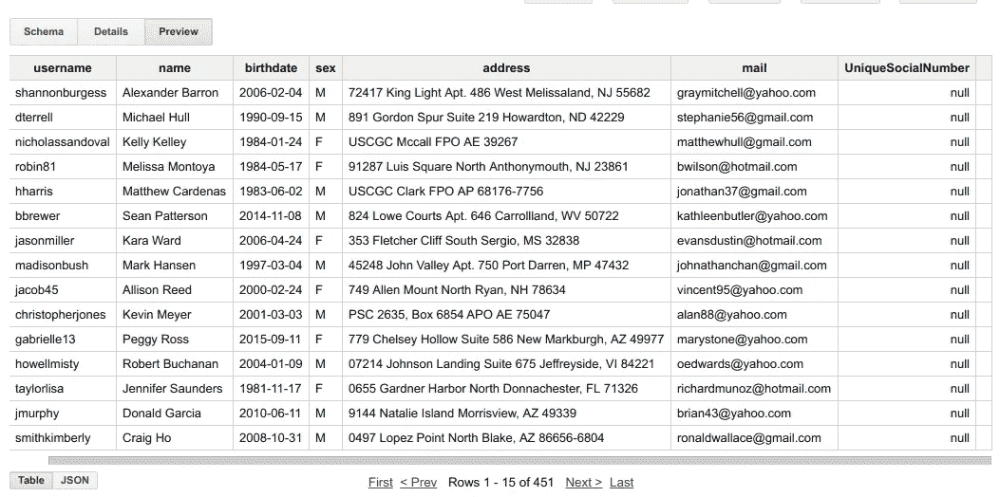

# 修补和更新表— BigQuery 第三部分

> 原文：<https://medium.com/google-cloud/patch-and-update-table-bigquery-part-iii-7f2547021926?source=collection_archive---------0----------------------->

*最初发表。*

D aemon 博客:[https://sunnykrgupta . github . io/patch-and-update-table-big query-part-iii . html](https://sunnykrgupta.github.io/patch-and-update-table-bigquery-part-iii.html)

**系列其他帖子:**

*   [导出&使用 MongoDB 加载作业— BigQuery Part-I |由 Sunny Gupta | Google Cloud—Community | Medium](/google-cloud/export-load-job-with-mongodb-bigquery-part-i-64a00eb5266b)
*   【Redis 流媒体— BigQuery Part-II |作者 Sunny Gupta | Google Cloud—Community | Medium


这篇文章是三篇文章系列的第三部分。在之前的帖子中，我们了解了 BigQuery 加载作业 [**导出&加载作业与 MongoDB—big query Part-I**](https://sunnykrgupta.github.io/export-load-job-with-mongodb-bigquery-part-i.html)**和的基本原理。**

**在这篇文章中，我们将学习修补和更新表模式。**

# **更新/修补 BigQuery 中的表**

**当您在表中准备好数据，并且突然需要在表中添加更多字段来进行分析时，表更新非常重要。**

**这里，我们将添加一个字段，并在更新操作后查看表中的变化。**

## **1.将字段添加到架构中**

**我们将使用之前用于流式传输的相同表`**StreamTable**`，并引入一个字段作为数据类型为`**INTEGER**`的字段`**UniqueSocialNumber**`。让我们将这些更改添加到`**schema.py**`中，它将被我们在后面的步骤中编写的主程序使用。**

```
$ cat schema.py*#Add field schema*
TableObject = {
    "tableReference": {
      "projectId": "mimetic-slate",
      "tableId": "StreamTable",
      "datasetId": "BQ_Dataset",
    }, "schema": {
      "fields": [
          {
              "name": "username",
              "type": "STRING",
              "mode": "NULLABLE"
          },
          {
              "name": "name",
              "type": "STRING",
              "mode": "NULLABLE"
          },
          {
              "name": "birthdate",
              "type": "STRING",
              "mode": "NULLABLE"
          },
          {
              "name": "sex",
              "type": "STRING",
              "mode": "NULLABLE"
          },
          {
              "name": "address",
              "type": "STRING",
              "mode": "NULLABLE"
          },
          {
              "name": "mail",
              "type": "STRING",
              "mode": "NULLABLE"
          },
          {
              "name": "UniqueSocialNumber",   *#New Field*
              "type": "INTEGER",
              "mode": "NULLABLE"
          }
      ],
  },
}
```

## **2.BigQuery 中的补丁/更新 API**

**我们已经准备好了`schema.py`脚本，下面是我们的主程序`**tablePatch.py**`，它将执行对 bigquery 的表补丁 API 调用。**

**BigQuery 中有两种方法可以更新表。**

*   **`**tables.patch**` -该方法仅替换资源中提供的字段**
*   **`**tables.update**` -这个方法替换整个表格资源。**

> ****补丁示例:****

```
$ cat tablePatch.py*#!/usr/bin/env python**#https://developers.google.com/api-client-library/python/*
**from** **googleapiclient** **import** discovery
**from** **oauth2client.client** **import** GoogleCredentials
**from** **schema** **import** TableObject *# [START Table Creater ]*
**def** PatchTable(bigquery):
    tables = bigquery.tables() tableStatusObject =tables.patch(                         
          projectId=TableObject['tableReference']['projectId'],\
          datasetId=TableObject['tableReference']['datasetId'],\
          tableId=TableObject['tableReference']['tableId'], \
          body=TableObject).execute()
    **print** "**\n\n**Table Patched"
*# [END]***def** main():
    *#to get credentials from my laptop*
    credentials = GoogleCredentials.get_application_default()
    *# Construct the service object for interacting with the BigQuery API.*
    bigquery = discovery.build('bigquery', 'v2', credentials=credentials)
    PatchTable(bigquery)*'''*
*https://cloud.google.com/bigquery/docs/tables#update-schema*
*'''***if** __name__ == '__main__':
    main()
    **print** "BQ Table Patch !!"
```

> **更新示例:**

```
#instead of calling patch(), we call update() to apply updates
tableStatusObject =tables.update(                         
          projectId=TableObject['tableReference']['projectId'],\
          datasetId=TableObject['tableReference']['datasetId'],\
          tableId=TableObject['tableReference']['tableId'], \
          body=TableObject).execute()
```

**应用更改后，我们可以验证 bigquery 表模式中的更改。**

**访问界面:[https://bigquery.cloud.google.com](https://bigquery.cloud.google.com/)**

**您还可以通过运行`**bq**` CLI 命令来验证表模式**

```
$ bq show BQ_Dataset.StreamTable
Table mimetic-slate:BQ_Dataset.StreamTable Last modified                Schema               Total Rows   Total Bytes   Expiration   Time Partitioning   Labels  
 ----------------- -------------------------------- ------------ ------------- ------------ ------------------- --------
  04 Nov 15:48:43   |-username: string              451          50837                                                  
                    |-name:string                                                                                      
                    |-birthdate:string                                                                                 
                    |-sex:string                                                                                       
                    |-address:string                                                                                   
                    |-mail:string                                                                                      
                    |-UniqueSocialNumber: integer
```

****参考**:**

*   ****表补丁和更新:**[https://developers . Google . com/resources/API-libraries/documentation/big query/v2/python/latest/big query _ v2 . tables . html](https://developers.google.com/resources/api-libraries/documentation/bigquery/v2/python/latest/bigquery_v2.tables.html)**

## **3.预览 bigquery 表中的数据**

**单击表格预览查看新字段。它将显示`**null**`与旧记录。您可以开始流式传输包含这个新添加的字段的数据，并将其写入表中。**

****表格预览****

****

****Github 参考**:[https://github.com/sunnykrGupta/Bigquery-series](https://github.com/sunnykrGupta/Bigquery-series)**

# **结论**

**这是对 BigQuery 表更新的介绍，我们的 3 篇文章系列到此结束。**

**在这个系列中，我们介绍了 Google BigQuery 无服务器产品的基本特性。在其他云上还有其他类似的产品，如 AWS redshift、Azure SQL Data Warehouse，它们为 BigQuery 等无限计算资源提供服务。**

**请评论您对该系列的想法/反馈。**