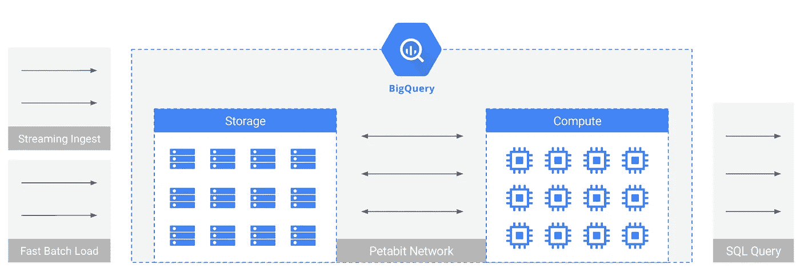

# 向前支付 BigQuery 的数据摄取如何打破技术规范

> 原文：<https://medium.com/google-cloud/paying-it-forward-how-bigquerys-data-ingest-breaks-tech-norms-8bfe2341f5eb?source=collection_archive---------3----------------------->

BigQuery 是一项有趣的服务，深深地将 T1 嵌入到谷歌的 T2 数据中心 T3 和 T4 网络 T5 技术中。因此，当在更深层次上与大多数其他技术进行比较时，人们很难理解 BigQuery 的技术优势。因此，我将在一系列博客文章中描述 BigQuery 的各个方面。

今天我将讨论批量数据接收 BigQuery 中数据接收的独特工作方式，为什么它如此不同，以及为什么它在实践中如此重要。

**1。批量摄取不会占用您的查询容量**

数据接收需要资源—传输数据的网络、加密、转换、优化和压缩数据的 CPU 和 RAM，以及将数据写入存储的 IO。在红移、雪花和 Hadoop 等更传统的大数据技术中，数据接收会消耗部署在集群中的资源。事实上，消耗的资源越多，摄取的速度就越快。

问题是，这些 CPU/RAM 资源通常相对昂贵，否则将专门用于分析。所以你摄入的越多，留给分析的空间就越少。从这个意义上说，批量摄取成本不可预测地与分析能力混为一谈。管理接收和分析的资源和成本共租是一场现实的噩梦。

另一方面，BigQuery 的批处理摄取消耗的资源完全独立于查询资源。也就是说，无论您将多少数据接收到 BigQuery 中，您执行 SQL 的能力都不会减少一点。用户也不会为这些资源买单——big query 相信提前付费，因为这些前期投资稍后会以更多存储和更多分析使用的形式回报。

引擎盖下的 BigQuery。注意“批量加载”和“计算”框之间的距离！

因此，在比较 BigQuery 与其他技术的接收性能时，在给定集群规模的情况下，声称具有一定的负载性能是不够的。必须包括一个重要的概念——资源成本。毕竟，如果摄取机制只是为了装载数据而衡量数据库达到 100%利用率的情况，那么比较它们又有什么用呢？

这就把我们带到了…

**2。批量摄取是免费的**

我们现在有了大胆断言的先决背景。与其他技术不同，BigQuery 的批量加载机制是完全免费的。

我们发现，其他技术要求用户通过集群成本本身为摄取提供资金。这很难量化，特别是因为集群通常被假定为主要用于查询操作(以及存储，如果计算和存储没有分离的话，还有红移)。对于像雅典娜这样的新来者，摄取是通过在 S3 上创建和维护文件的生产和数据管理开销来资助的。

这一点值得重复——big query 的批量摄取是免费的。

**3。批量加载操作是原子的**

这是 BigQuery 数据加载机制的微妙之处——如果您的加载失败，100%都会失败。不需要清理—只需重试加载作业或对其进行故障排除。同样，没有竞争条件或飞行中的争吵。当一个大查询负载报告成功时，100%的负载同时成功。这些东西在实际场景中真的很重要。

**4。BigQuery 在加载过程中会消耗大量的 CPU 和 RAM**

我们已经讨论过 BigQuery load 不使用专用于查询能力的 CPU 和 RAM 资源。然而，在幕后，BigQuery 确实利用了大量的 CPU 和 RAM 资源，以尽可能最佳的方式加载数据。 [BigQuery 的电容存储格式](https://cloud.google.com/blog/big-data/2016/04/inside-capacitor-bigquerys-next-generation-columnar-storage-format)做了大量的数据分析和自以为是的优化，不仅在负载上，而且在此后持续进行。所有这些复杂性对最终用户是隐藏的，完全由 Google 管理。

**5。批量摄取几乎不受限制**

因为 BigQuery 的加载路径是完全免费的，所以 BigQuery 确实有一些合理的配额和限制。默认情况下，客户每天应该能够接收几十 TB 的数据。

也就是说，一些 BigQuery 客户每天吸收超过 1pb 的数据。与所有共享的免费资源一样，您只需在这样做之前与我们交流:)

**6。联合查询是付费批量摄取**

BigQuery 能够直接从 GCS 查询数据。这个查询路径包含了典型的查询开销。

也就是说，如果您将 BigQuery-on-GCS 查询的结果写入 BigQuery 本身，您将获得一个等同于您所服从的系统——付费批量摄取。这是一个突破常规负载控制的好方法。

**结论**

BigQuery 的架构有点独特，它主要依赖于谷歌的 Dremel 和 T2 的巨像，并通过 T4 的 Borg 和 Petabit 的 Jupiter 网络连接起来。

因此，BigQuery 的属性经常被误解。在批量接收路径上，BigQuery 在几个方面有所不同:
-接收不影响查询能力
-接收完全免费
-接收操作是原子的
- BigQuery 在加载时自动优化您的数据，并在此后持续优化
- BigQuery 的批量接收规模可达每天数 Pb
-big query 的 query-on-GCS 模型可作为非常快速的付费接收

希望你发现上面的每一个词都有用。接下来，我将介绍并发和多租户。提示— [流水线执行](https://cloud.google.com/blog/big-data/2016/08/in-memory-query-execution-in-google-bigquery)是大数据领域的下一件大事！