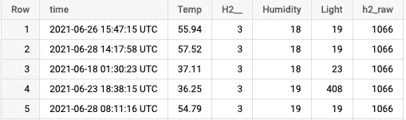
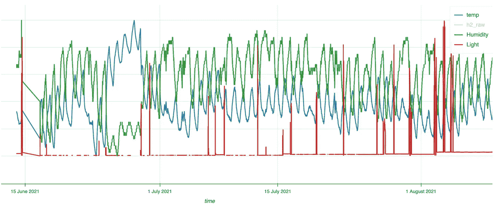
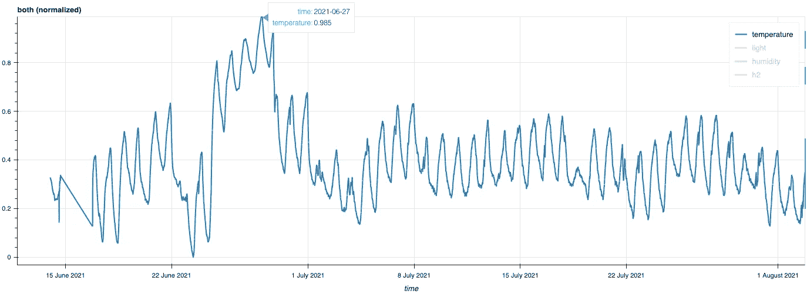
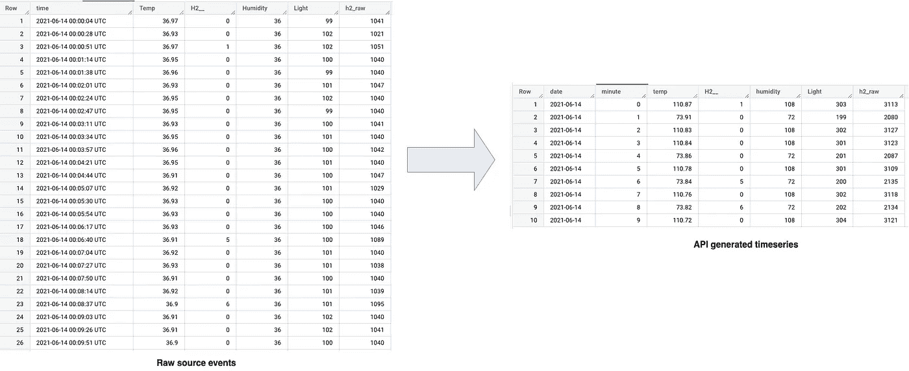
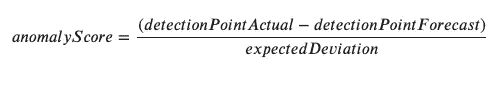

# 使用 Google Cloud 的 Timeseries Insights API 执行实时异常检测—第一部分

> 原文：<https://medium.com/google-cloud/perform-real-time-anomaly-detection-using-google-clouds-timeseries-insights-api-part-i-f6572021ac0?source=collection_archive---------1----------------------->

## *简单易用的 API 概述，通过低延迟异常检测和预测来扩展数十亿时间序列*


照片由 [Aron 视觉效果](https://unsplash.com/@aronvisuals?utm_source=medium&utm_medium=referral)在 [Unsplash](https://unsplash.com?utm_source=medium&utm_medium=referral) 上拍摄

> 这是关于使用 Google Cloud 的 Timeseries Insight API 进行实时异常检测的两篇文章中的第一篇。在本文中，我将介绍如何为异常检测创建数据集，以及如何查询异常。第二部分将重点讨论如何以流的方式添加新事件，如何在新添加的数据上获得异常，以及如何删除不需要的时间序列数据集。

时间序列预测和异常检测是 ML 中的常见用例，广泛应用于不同行业，例如交通预测、需求规划、库存等。这些现有系统中的大多数以批处理作业的形式运行预测和异常检测。在本教程中，我将解释和演示一个用例，使用 Google Cloud 的 Timeseries Insights API 近实时(亚秒延迟)检测异常。

那么什么是 Timeseries Insights API，为什么以及在哪里使用它呢？

> Google Cloud 的 Timeseries Insights API 是一个通用异常检测框架，提供低成本、低延迟和高可扩展性的解决方案。

目前存在多种异常检测方法。这些方法从基于随时间观察阈值的简单方法到动态调整分辨率间隔的更复杂的方法。这些系统的关键限制是分析时间序列和挑选感兴趣的时间序列的成本。除此之外，当以批处理方式运行时，对数十亿个时间序列的预测和异常检测在计算上是昂贵的。这是进行在线和实时分析的关键限制，例如:根据事件维度值的波动向用户发送警报。

使用 timeseries Insights API 进行时间序列预测并将其用于异常检测的主要目标是:

*   扩展到数十亿个时间序列(时间序列= >给定事件随时间的计数序列)
*   用于预测和异常检测的实时延迟(亚秒)
*   为时间序列预测提供相对便宜的批量推断

让我们通过一个例子来理解 Timeseries Insights API 是如何工作的，并看看它是如何工作的。有 4 种主要的方法与 API 交互并使事情运转。这些是:

*   **创建并加载数据集**
*   **查询数据集**
*   **更新数据集(在现有数据集中追加流/新事件)**
*   **删除数据集**

我们将在本文中介绍第一种方法。您可以查看 [**官方 API 文档**](https://cloud.google.com/timeseries-insights/docs) 获取 API 的设置说明，并设置适当的权限。现在让我们进入有趣的部分:

我们正在使用一个虚拟的物联网数据集。数据来自单个传感器，大约每 25 秒钟就会有一个事件以数据流的形式传输，其属性包括仓库内的*光*、*温度*、*氢*、*湿度*值。数据集包含大约 3 个月的数据，有 202K 行。我们将在本练习中使用该数据集。以下是数据集中的一些示例行:



表格形式的传感器数据示例(我们将不使用最后一栏)

下面是一段时间内每个属性的值:



图 1 —传感器读数的时间序列图

正如你在上面的图中所看到的，光的值波动很大，而光和温度的值或多或少是一致的，除了在同一时间温度值急剧上升而氢值急剧下降的一些日子。对于本文中的分析，我将只考虑温度值，并尝试检测温度值中的异常。

如果你只仔细观察温度值，它会在 2011 年 6 月 21 日到 2011 年 6 月 28 日之间快速上升。对于本教程，该时间范围将用于查询以检查温度值中的异常



图 2 —给定数据中的温度变化

# 1.创建数据集

在使用 Timeseries Insight API 查询异常之前，我们需要使用历史数据集在 API 中创建数据集。数据集是事件的集合，使用该数据集执行查询。API 希望这些数据采用某种 json 格式。给定数据集的这种格式的事件示例如下所示:

```
*{“groupId”:”-8865179820473228792",
 ”eventTime”:”2021–06–14T00:02:24+00:00",
”dimensions”:
[{“name”:”measure”,”stringVal”:”LTTH”},{“name”:”Humidity”,”doubleVal”:36},
{“name”:”Light”,”doubleVal”:102},
{“name”:”h2_raw”,”doubleVal”:1040},{“name”:”temp”,”doubleVal”:36.95}]}*
```

在这里，这一个事件代表前面图像中显示的表格数据集中的一行。让我们首先了解在 Timeseries Insights API 中创建数据集的不同组件。本文的`resource`部分提供了笔记本的链接，其中包含将表格数据转换成 json 所需格式的完整代码。

**groupId** 此处代表数据集中的每个唯一事件。可以把它看作一个事件标识符，因为我们数据集中的每一行都是一个事件，所以在上面转换的 json 格式中，每个事件都有一个唯一的 *groupId* 。我使用 BigQuery 的 [FARM_FINGERPRINT](https://cloud.google.com/bigquery/docs/reference/standard-sql/hash_functions) 哈希函数来生成这个。分组的目的是计算来自同一组的事件之间的相关性。请注意，如果您的数据集中没有这个，那么将使用时间戳和数据集中的其他内容自动生成一个 groupId，因此最好自己创建它，以便完全控制模式。

eventTime (区分大小写)就是事件的时间戳。

**维度**是给定事件的属性。它可以是分类的，也可以是数字的。您也可以将此视为时间序列数据的不同属性。请注意，每个维度都将使用 stringVal、doubleVal 或 longVal 来命名和赋值

> 注意:json 事件包含一个具有名为" **measure** 和" **LTTH** "的键值对的维度，但是我们的原始数据集没有同名的列。

这与 timeseries insights API 中名为 *slice* 的概念有关。切片是数据集中所有事件的子集，这些事件在某个*分类*维度上有一些值，但是由于我们的数据集中没有任何这样的属性/列(所有属性都是数字的)，我们需要创建一个分类类型的虚拟事件，并且由于我们数据集中的每个事件都是唯一的，没有层次结构，我们可以为这个虚拟维度使用任意字符串值，每个事件都有相同的值。

> 将来，API 将支持使用数值维的切片

这就是创建所需格式的数据集所需了解的全部内容。转换后的 json 文件现在有 202k 行(与原始数据集相同)。现在，在创建这个数据集之前，我们需要将这个 json 文件移动到一个云存储桶中。您可以使用以下命令在云存储中移动存储桶中的文件:

```
gsutil cp transformed.json gs://<my-data-bucket-name>
```

下一步是向 timeseries insights API 发出 create dataset 命令，以创建包含所有历史记录的数据集。

在上面的代码中，文件数据是用于创建数据集的 json 有效负载。首先，提供一个数据集**名称** ( *传感器-数据此处为*)，然后设置 **ttl** ，这是一个参数集，确定数据集数据在被丢弃之前应该存储多长时间。这表示附加的事件(对于新的输入数据)必须比当前时间减去 ttl 值新。那么 **dataNames** 参数就是数据集中所有维度的列表。实际上，您希望在这里包含您希望查询异常和预测所有维度。最后，**数据源**是包含历史数据的转换后的 json 文件的 gcs 位置。

> 如果 API 服务器接受这个创建请求，它将返回成功。您可以提交另一个请求来查看或列出数据集。最初，作业将处于“加载”*状态，直到所有维度的索引完成，然后状态变为*“已加载”，这表明数据集可以开始接受异常和预测的查询和更新。

通过运行以下代码检查状态并列出 API 服务器中的所有数据集

列出 API 中的所有数据集

以下是您将看到的回复。您可以看到数据集名称、所有索引维度、云存储中 json 文件的数据集 uri 以及数据集中的行数。请注意，您只能在状态为 *LOADED* 时查询数据集，并且根据您的数据大小，它可能需要一段时间才能被索引并准备好供查询。

```
{'datasets': [{'name': 'projects/your-project-name/locations/us-central1/datasets/sensor-data',
   'dataNames': ['measure', 'Humidity', 'Light', 'h2_raw', 'temp'],
   'dataSources': [{'uri': 'gs://<your-bucket-name>/transformed.json'}],
   'state': 'LOADED',
   'status': {'message': 'name: "num-items-examined"\nvalue: 202267\n,name: "num-items-ingested"\nvalue: 202267\n,name: "processed-session"\nvalue: 202267\n'}}]}
```

# 2.异常查询

一旦数据集成功创建并处于*已加载*状态，API 就准备好接受异常或预测的查询。与创建数据集类似，有一个查询数据 json 有效负载，将用于向 API 发出 HTTP 请求。以下是用于查询温度值异常的示例负载。

在高级别上，Timeseries Insights API 异常检测查询验证数据集中是否有任何切片在给定的特定时间点具有预期值，这称为检测时间。您需要了解四个顶级参数:

*   **检测时间**:检测时间表示当预期值与您选择的指标的实际值不同时，我们希望分析并提出异常的时间。
*   **slicingParams** : Slicing 表示如何将事件分组到幻灯片中，并在查询时进行控制。 **dimensionNames** 参数获取一个维度列表，您可以用它来分割您的数据。在上面的查询中，我们使用虚拟维度度量。*请记住，目前您只能使用 string 类型的维度对数据进行切片。将来，将支持使用数字维度对数据进行切片。*
*   **timeseriesParams** :这些参数控制在异常检测和将事件聚合成每个切片的时间序列的过程中使用多少数据。 ***预测历史*** 参数是以秒为单位的时间量，表示异常查询时我们在时间序列中包含了多少个点。 ***粒度*** 参数代表连续时间序列点之间的固定距离。这可以调整为较低的值，以捕捉重复出现的模式。它还隐式表示以秒为单位的聚合窗口时段的宽度。 ***指标*** 是数值型的参数，其值用于聚合。本质上，这是用户查询异常的维度。
*   **forecastParams** :这些参数控制灵敏度、季节性和水平窗口等设置。敏感度指定异常检测过程的敏感度。它的值必须在(0.0，0.1)区间内。较低的值表示敏感度较低，导致异常值较低，随着过程变得非常敏感，增加该值会导致异常值较高。noiseThreshold 表示给定切片在检测时间的预期值和实际值之间的最小差异。

> 注意:有更多的参数可用于创建查询负载。有关可用参数的完整列表，请查看参考资料部分。我只描述了上面代码中使用的一些。

下面是如何将原始事件时间序列转换为新的时间序列形式，其中属性值已按 360 秒的时间段进行了聚合。出于说明目的，它显示了所有属性，但实际上时间序列将只包含查询有效负载中的`metric`字段中使用的维度。



原始事件到聚合时间序列转换的示例

这是异常的查询结果，您可以看到已经创建的内部时间序列。您也可以关闭这个历史记录，只在有效负载中输出异常结果。时间戳处的这些值是在查询有效负载中设置了`granularity`值窗口的`temperature`的聚合值。用户可以对每个异常查询进行定制和更改，以适应季节性和业务需求。

```
{'name': 'projects/pnishit-mlai/datasets/sensor_data_test',
 'slices': [{'dimensions': [{'name': 'measure', 'stringVal': 'LTTH'}],
   'history': {'point': [{'time': '2021-06-24T15:00:00Z', 'value': 2995.96},
     {'time': '2021-06-24T15:30:00Z', 'value': 3180.5099999999998},
     {'time': '2021-06-24T16:00:00Z', 'value': 3330.51},
     {'time': '2021-06-24T16:30:00Z', 'value': 3468.07},
     {'time': '2021-06-24T17:00:00Z', 'value': 3583.22},
     {'time': '2021-06-24T17:30:00Z', 'value': 3672.84},
     {'time': '2021-06-24T18:00:00Z', 'value': 3744.3500000000004},
     {'time': '2021-06-24T18:30:00Z', 'value': 3813.61},
     {'time': '2021-06-24T19:00:00Z', 'value': 3624.17},
     {'time': '2021-06-24T19:30:00Z', 'value': 3935.7699999999995},
     {'time': '2021-06-24T20:00:00Z', 'value': 3978.78},
     {'time': '2021-06-24T20:30:00Z', 'value': 4022.67},
     {'time': '2021-06-24T21:00:00Z', 'value': 4064},
     {'time': '2021-06-24T21:30:00Z', 'value': 4103.86},
     {'time': '2021-06-24T22:00:00Z', 'value': 4141.099999999999},
     {'time': '2021-06-24T22:30:00Z', 'value': 4171.9800000000005},
     {'time': '2021-06-24T23:00:00Z', 'value': 4206.53},
     {'time': '2021-06-24T23:30:00Z', 'value': 4226.34},
     {'time': '2021-06-25T00:00:00Z', 'value': 4172.81},
     {'time': '2021-06-25T00:30:00Z', 'value': 4085.0400000000004},
     {'time': '2021-06-25T01:00:00Z', 'value': 4013.5500000000006},
     {'time': '2021-06-25T01:30:00Z', 'value': 3981.5299999999997},
     {'time': '2021-06-25T02:00:00Z', 'value': 3955.63},
     {'time': '2021-06-25T02:30:00Z', 'value': 3906.63},
     {'time': '2021-06-25T03:00:00Z', 'value': 3846.0699999999997},
     {'time': '2021-06-25T03:30:00Z', 'value': 3796.7999999999997},
     {'time': '2021-06-25T04:00:00Z', 'value': 3758.2000000000003},
     {'time': '2021-06-25T04:30:00Z', 'value': 3725.0299999999997},
     {'time': '2021-06-25T05:00:00Z', 'value': 3692.67},
     {'time': '2021-06-25T05:30:00Z', 'value': 3660.129999999999},
     {'time': '2021-06-25T06:00:00Z', 'value': 3633.4300000000003},
     {'time': '2021-06-25T06:30:00Z', 'value': 3610.93},
     {'time': '2021-06-25T07:00:00Z', 'value': 3592.7699999999995},
     {'time': '2021-06-25T07:30:00Z', 'value': 3568.870000000001},
     {'time': '2021-06-25T08:00:00Z', 'value': 3548.359999999999},
     {'time': '2021-06-25T08:30:00Z', 'value': 3508.33},
     {'time': '2021-06-25T09:00:00Z', 'value': 3470.5899999999997},
     {'time': '2021-06-25T09:30:00Z', 'value': 3436.9699999999993},
     {'time': '2021-06-25T10:00:00Z', 'value': 3408.55},
     {'time': '2021-06-25T10:30:00Z', 'value': 3391.9299999999994},
     {'time': '2021-06-25T11:00:00Z', 'value': 3410.7200000000003},
     {'time': '2021-06-25T11:30:00Z', 'value': 3450.05},
     {'time': '2021-06-25T12:00:00Z', 'value': 3515.57},
     {'time': '2021-06-25T12:30:00Z', 'value': 3603.83},
     {'time': '2021-06-25T13:00:00Z', 'value': 3692.41},
     {'time': '2021-06-25T13:30:00Z', 'value': 3773.9999999999995},
     {'time': '2021-06-25T14:00:00Z', 'value': 3853.7},
     {'time': '2021-06-25T14:30:00Z', 'value': 3923.61},
     {'time': '2021-06-25T15:00:00Z', 'value': 3977.2799999999997},
     {'time': '2021-06-25T15:30:00Z', 'value': 4009.2700000000004},
     {'time': '2021-06-25T16:00:00Z', 'value': 4024.3199999999997},
     {'time': '2021-06-25T16:30:00Z', 'value': 4041.01},
     {'time': '2021-06-25T17:00:00Z', 'value': 4076.29},
     {'time': '2021-06-25T17:30:00Z', 'value': 4104.429999999999},
     {'time': '2021-06-25T18:00:00Z', 'value': 4120.57},
     {'time': '2021-06-25T18:30:00Z', 'value': 4146.42},
     {'time': '2021-06-25T19:00:00Z', 'value': 4178.8099999999995},
     {'time': '2021-06-25T19:30:00Z', 'value': 4210.83},
     {'time': '2021-06-25T20:00:00Z', 'value': 4245.74},
     {'time': '2021-06-25T20:30:00Z', 'value': 4275.35},
     {'time': '2021-06-25T21:00:00Z', 'value': 4296.56},
     {'time': '2021-06-25T21:30:00Z', 'value': 4301.129999999999},
     {'time': '2021-06-25T22:00:00Z', 'value': 4299.98},
     {'time': '2021-06-25T22:30:00Z', 'value': 4319.23},
     {'time': '2021-06-25T23:00:00Z', 'value': 4345.3},
     {'time': '2021-06-25T23:30:00Z', 'value': 4326.54},
     {'time': '2021-06-26T00:00:00Z', 'value': 4273.6},
     {'time': '2021-06-26T00:30:00Z', 'value': 4212.950000000001},
     {'time': '2021-06-26T01:00:00Z', 'value': 4156.549999999999},
     {'time': '2021-06-26T01:30:00Z', 'value': 4116.820000000001},
     {'time': '2021-06-26T02:00:00Z', 'value': 4081.8199999999997},
     {'time': '2021-06-26T02:30:00Z', 'value': 4049.9899999999993},
     {'time': '2021-06-26T03:00:00Z', 'value': 4022},
     {'time': '2021-06-26T03:30:00Z', 'value': 4048.0999999999995},
     {'time': '2021-06-26T04:00:00Z', 'value': 3968.9299999999994},
     {'time': '2021-06-26T04:30:00Z', 'value': 3948.3800000000006},
     {'time': '2021-06-26T05:00:00Z', 'value': 3927.44},
     {'time': '2021-06-26T05:30:00Z', 'value': 3909.3899999999994},
     {'time': '2021-06-26T06:00:00Z', 'value': 3895.73},
     {'time': '2021-06-26T06:30:00Z', 'value': 3883.1},
     {'time': '2021-06-26T07:00:00Z', 'value': 3882.58},
     {'time': '2021-06-26T07:30:00Z', 'value': 3893.34},
     {'time': '2021-06-26T08:00:00Z', 'value': 3891.4699999999993},
     {'time': '2021-06-26T08:30:00Z', 'value': 3894.45},
     {'time': '2021-06-26T09:00:00Z', 'value': 3896.4600000000005},
     {'time': '2021-06-26T09:30:00Z', 'value': 3953.680000000001},
     {'time': '2021-06-26T10:00:00Z', 'value': 3901.069999999999},
     {'time': '2021-06-26T10:30:00Z', 'value': 3907.5699999999997},
     {'time': '2021-06-26T11:00:00Z', 'value': 3929.04},
     {'time': '2021-06-26T11:30:00Z', 'value': 3968.5},
     {'time': '2021-06-26T12:00:00Z', 'value': 4018.16},
     {'time': '2021-06-26T12:30:00Z', 'value': 4077.7299999999996},
     {'time': '2021-06-26T13:00:00Z', 'value': 4134.67},
     {'time': '2021-06-26T13:30:00Z', 'value': 4171.8099999999995},
     {'time': '2021-06-26T14:00:00Z', 'value': 4189.67},
     {'time': '2021-06-26T14:30:00Z', 'value': 4216.96},
     {'time': '2021-06-26T15:00:00Z', 'value': 4262.1900000000005},
     {'time': '2021-06-26T15:30:00Z', 'value': 4305.4},
     {'time': '2021-06-26T16:00:00Z', 'value': 4338.31},
     {'time': '2021-06-26T16:30:00Z', 'value': 4369.320000000001},
     {'time': '2021-06-26T17:00:00Z', 'value': 4403.7},
     {'time': '2021-06-26T17:30:00Z', 'value': 4435.98},
     {'time': '2021-06-26T18:00:00Z', 'value': 4521.87},
     {'time': '2021-06-26T18:30:00Z', 'value': 4478.610000000001},
     {'time': '2021-06-26T19:00:00Z', 'value': 4474.28},
     {'time': '2021-06-26T19:30:00Z', 'value': 4470.839999999999},
     {'time': '2021-06-26T20:00:00Z', 'value': 4482.829999999999},
     {'time': '2021-06-26T20:30:00Z', 'value': 4490.8099999999995},
     {'time': '2021-06-26T21:00:00Z', 'value': 4490.0199999999995},
     {'time': '2021-06-26T21:30:00Z', 'value': 4480.2},
     {'time': '2021-06-26T22:00:00Z', 'value': 4460.11},
     {'time': '2021-06-26T22:30:00Z', 'value': 4445.86},
     {'time': '2021-06-26T23:00:00Z', 'value': 4429.5},
     {'time': '2021-06-26T23:30:00Z', 'value': 4411.9},
     {'time': '2021-06-27T00:00:00Z', 'value': 4398.25},
     {'time': '2021-06-27T00:30:00Z', 'value': 4372.870000000001},
     {'time': '2021-06-27T01:00:00Z', 'value': 4341.87},
     {'time': '2021-06-27T01:30:00Z', 'value': 4368.8},
     {'time': '2021-06-27T02:00:00Z', 'value': 4283.039999999999},
     {'time': '2021-06-27T02:30:00Z', 'value': 4259.9800000000005},
     {'time': '2021-06-27T03:00:00Z', 'value': 4239.389999999999},
     {'time': '2021-06-27T03:30:00Z', 'value': 4229.23},
     {'time': '2021-06-27T04:00:00Z', 'value': 4223.23},
     {'time': '2021-06-27T04:30:00Z', 'value': 4216.63},
     {'time': '2021-06-27T05:00:00Z', 'value': 4203.12},
     {'time': '2021-06-27T05:30:00Z', 'value': 4180.82},
     {'time': '2021-06-27T06:00:00Z', 'value': 4169.47},
     {'time': '2021-06-27T06:30:00Z', 'value': 4152.599999999999},
     {'time': '2021-06-27T07:00:00Z', 'value': 4136.5},
     {'time': '2021-06-27T07:30:00Z', 'value': 4128.530000000001},
     {'time': '2021-06-27T08:00:00Z', 'value': 4119.19},
     {'time': '2021-06-27T08:30:00Z', 'value': 4100.19},
     {'time': '2021-06-27T09:00:00Z', 'value': 4085.1599999999994},
     {'time': '2021-06-27T09:30:00Z', 'value': 4141.089999999999},
     {'time': '2021-06-27T10:00:00Z', 'value': 4097.710000000001},
     {'time': '2021-06-27T10:30:00Z', 'value': 4102.32},
     {'time': '2021-06-27T11:00:00Z', 'value': 4105.12},
     {'time': '2021-06-27T11:30:00Z', 'value': 4118.86},
     {'time': '2021-06-27T12:00:00Z', 'value': 4134.59},
     {'time': '2021-06-27T12:30:00Z', 'value': 4156.07},
     {'time': '2021-06-27T13:00:00Z', 'value': 4184.75},
     {'time': '2021-06-27T13:30:00Z', 'value': 4224.679999999999},
     {'time': '2021-06-27T14:00:00Z', 'value': 4276.73},
     {'time': '2021-06-27T14:30:00Z', 'value': 4324.28},
     {'time': '2021-06-27T15:00:00Z', 'value': 4365.74}]},
   'forecast': {'point': [{'time': '2021-06-27T15:00:00Z',
      'value': 4910.465311007107}]},
   'detectionPointActual': 4365.74,
   'detectionPointForecast': 4910.465311007107,
   'expectedDeviation': 310.28363664899683,
   'anomalyScore': 1.511934641477489,
   'status': {}}]}​
```

结果输出包含大量信息。首先，我们看到 API 基于查询负载构建的时间序列。我们还可以看到指标在检测时的预测值和实际值。两条主要信息是下面描述的`expectedDeviation`和`anomalyScore`。您可以使用这些来最终计算数据在给定检测时间内的异常情况。由于异常分值大于 1.0，并且预期温度值和实际温度值之间的差异非常显著，因此我们会将此视为给定检测时间的异常。

对于每个查询，结果中几乎没有什么东西。

*   **detectionPointActual** 这是您查询的 timeseries 属性的值(在本例中，度量=温度)。这是`detectionTime`的实际值(汇总)。
*   **detectionPointForecast** 是 timeseries 属性的“检测时间”的预测值。
*   **期望偏差**表示预测值的置信水平。它指定与 API 预测值的绝对偏差。
*   **anomalyScore** 你可以认为这是`detetionTime`时预测值与实际值的实际偏差。如果这个值更高，那么我们认为切片是异常的。换句话说，这个分数表明实际偏差与预期偏差有多远。



一般来说，低于 1.0 的分数反映了切片历史中常见的变化，而高于 1.0 的分数应引起注意，分数越高表示异常越严重。这个结果可以在下游应用程序中用于商业目的。

> 同样，解释异常得分和预期偏差是相对的，可以依赖于用例，因此导致一个用例异常的特定值可能不是其他用例的异常。

如您所见，无需任何培训或定制建模，即可轻松快速地进行实时异常检测。数据集准备就绪后，用户可以快速对其进行分析，以进行异常检测和大规模低延迟预测。

在本教程中，我们介绍了如何从历史数据集创建数据集，以及如何查询异常和时间序列预测。在本博客的下一部分，我将介绍如何以实时流的方式向现有数据集添加数据，并对其进行检测。敬请关注第二部分

# **资源**

*   [Timeseries Insights API 官方文档](https://cloud.google.com/timeseries-insights)
*   [产品概述页面](https://cloud.google.com/timeseries-insights/docs/overview)
*   [使用 API 前的设置说明](https://cloud.google.com/timeseries-insights/docs/getting-started)
*   [API 教程](https://cloud.google.com/timeseries-insights/docs/tutorial)
*   [API 查询构建指南](https://cloud.google.com/timeseries-insights/docs/query-building-guide)
*   端到端笔记本和 [github](https://github.com/nishitpatel01/google-cloud/tree/main/AI%20%26%20Machine%20Learning/01%20-%20Pre-built%20ML%20APIs) 上的代码