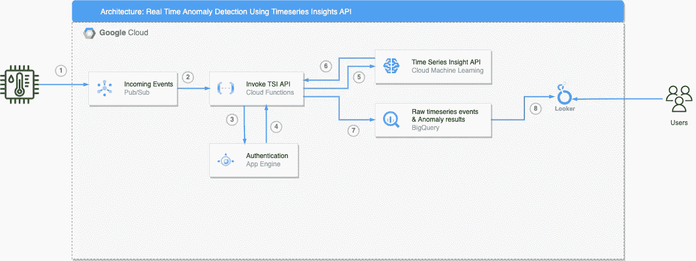
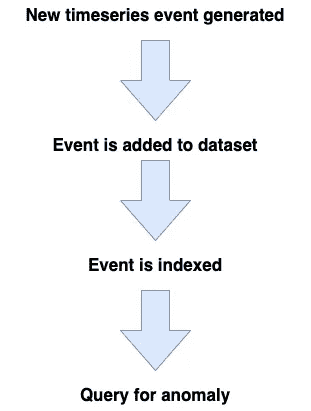
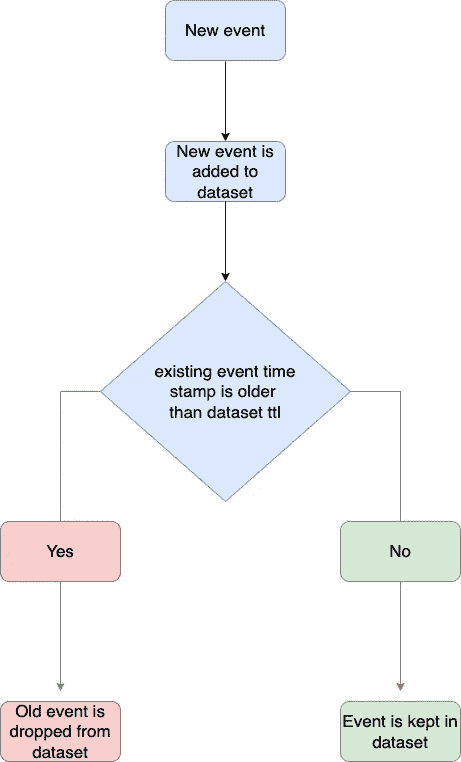

# 使用 Google Cloud 的 Timeseries Insights API 执行实时异常检测—第二部分

> 原文：<https://medium.com/google-cloud/perform-real-time-anomaly-detection-using-google-clouds-timeseries-insights-api-part-ii-54520586ad6d?source=collection_archive---------1----------------------->

## 概述了一种易于使用的 API，可通过低延迟异常检测和预测来扩展数十亿个时间序列

克里斯·利维拉尼在 [Unsplash](https://unsplash.com?utm_source=medium&utm_medium=referral) 上的照片

这是执行实时异常检测系列的第二部分。如果你还没有，看看这篇博客的第一部分 的[，了解一下基本设置，熟悉一下用例以及设置细节。](/google-cloud/perform-real-time-anomaly-detection-using-google-clouds-timeseries-insights-api-part-i-f6572021ac0)

在本文中，我将重点关注在现有的 Timeseries Insights API 数据集中接收和追加流数据，并使用现有数据集中新添加的事件来查询异常。我还将介绍如何删除未使用的 API 数据集，坦白地说，这是一个非常直接的过程，因此本文的主要重点是在相同的附加事件上附加新数据和异常查询。

正如在本系列的第一部分中所讨论的，Timeseries Insights API 对于实时异常检测和预测来说是非常高效的低代码选项。该 API 还为查询提供了非常低的延迟，这使得它成为在实时业务至关重要的地方使用的好选择。

正如您现在所知道的，有四种主要方法可以与 Timeseries insights API 进行交互。这些是:

*   **创建并加载数据集✔️**
*   **查询数据集✔️**
*   **更新数据集(在现有数据集中追加流/新事件)**
*   **删除数据集**

在第一部分的[中，我回顾了创建 API 数据集和查询异常的过程。在本文中，我将从在现有数据集中追加事件开始。在我们开始接收新数据之前，让我们考虑一下这个用例的端到端架构。](/p/f6572021ac0)

图 1 —使用传感器数据架构的异常检测

该架构中使用的服务包括:

*   发布/订阅
*   应用引擎/云运行(不是本教程的重点)
*   云函数
*   时间序列洞察 API
*   BigQuery
*   Data Studio/Looker(不是本教程的重点)

架构流程:

1.  首先，来自客户端的传感器或物联网设备记录温度、湿度、光照和氢气值等读数，并将这些数据实时(每隔 x 秒左右)发送到发布/订阅主题
2.  发布/订阅接收传入的数据负载，并使用 http 端点触发云功能来处理事件。
3.  云功能使用 app engine 服务验证传入的用户请求。
4.  一旦请求被验证，它就执行诸如数据预处理、特征工程
5.  云函数调用 Timeseries insights api 进行异常检测。
6.  Timeseries insight API 返回异常结果。
7.  Cloud function 还调用 BigQuery 流 API 将原始事件和异常结果摄取到一个表中，以便对原始事件进行进一步分析，如使用报告生成、异常结果分析等
8.  最终用户使用 data studio 或 looker 等工具访问报告/可视化

出于本教程的目的，我将只关注通过调用 API 进行摄取和异常检测。要获得完整的云函数代码，请查看本教程末尾的参考资料部分。

所以让我们开始吧！

# **3。在现有数据集中追加流/新事件**

这是 Timeseries Insights API 中我最喜欢的部分，您可以以流的方式将数据添加到现有的数据集中，API 会对这些数据进行实时索引。在数据集中追加新事件并完成索引后，可以立即查询异常和预测。这是一个非常常见的物联网用例，其中数据正在流入，我们需要使用该数据流实时做出业务决策。

`appendEvents` API 方法允许你添加新的事件到现有的数据集中。追加新事件的步骤如下:

事件附加时间线

此外，在 API 中添加新事件时，您需要注意一些事情:

1.  使用 [appendEvents](https://cloud.google.com/timeseries-insights/docs/reference/rest/v1/projects.datasets/appendEvents) 方法不能添加很久以前的事件。`appendEvents`方法不用于回填时间序列中的数据，因此被追加的事件的时间戳需要在当前日期时间左右。使用下面的方法来确定追加数据可以追溯到历史的多远。

新事件附加年表

ttl 在这里代表生存时间。这是在 Timeseries API 中创建数据集时设置的可选属性，如果数据集将用于以流方式追加新事件。如果您的数据集不接受新事件，那么您不需要设置它。ttl 的值以秒为单位设置，这表明 API 将接受哪些传入事件。如果传入的时间戳值高于 ttl 值，则该事件将被添加到数据集，旧事件将被丢弃。

2.当您在现有数据集中追加一个事件时，您只能使用`evaluateSlice`方法来查看该事件。使用列表数据集的行数不能反映数据集中新的行数，如果用户使用列表方法查找数据集中的总行数，这可能会使用户感到困惑。

为了在 API 中追加一个新事件，我们需要具有所有维度的有效载荷(类似于我们为数据集创建方法创建的有效载荷)并调用 API 的 [appendEvents](https://cloud.google.com/timeseries-insights/docs/reference/rest/v1/projects.datasets/appendEvents) 方法。

一旦添加了事件，就可以使用`evaluateSlice`方法来评估加载数据集中的数据片。这是一个可以用来查看 API 构建的时间序列的选项。

下面是示例 json 负载，展示了我们想要评估的事件。调用`evaluateSlice`方法后返回的对象是 [EvaluatedSlice](https://cloud.google.com/timeseries-insights/docs/reference/rest/v1/EvaluatedSlice) 的一个实例

> **注意**:这里需要特别注意的是，在现有 Timeseries Insights API 数据集中追加新事件不允许直接访问该事件，也就是说，如果您希望对该数据执行额外的分析，您需要在追加 API 数据集中的同时将原始事件保存到单独的表中。例如，如果用于创建 API 数据集的历史数据存储在 BigQuery 表中，那么您可以根据用例使用传统的 [Bigquery 流插入 API](https://cloud.google.com/bigquery/docs/samples/bigquery-table-insert-rows) 或[存储写入 API](https://cloud.google.com/bigquery/docs/write-api) 将传入事件写入 Bigquery 表中。

# **4。删除数据集**

在 Timeseris Insights API 中删除不需要的数据集非常容易。每一个数据集都是被创建和索引的，都是收费的，创建许多数据集用于测试变得很容易，所以有时我们需要从 API 中删除那些不需要和未使用的数据集。API 有`delete`方法来删除数据集。你只需要我们空体来传入 http API 端点。

**可选:端到端云功能代码**

下面是创建云函数、发布/订阅主题和发布新事件到发布/订阅以触发云函数的一些可选代码，您可以使用云函数来创建上面图 1 中架构图所示的端到端流。该云函数执行以下操作:

*   解析传入的有效负载(发布到发布/订阅主题)
*   为新的传入事件创建适当的 json 格式
*   向现有 API 数据集追加新事件
*   对新事件执行异常检测或预测
*   将结果插入到 BigQuery 原始事件表中以供进一步分析
*   返回异常检测或预测结果以供下游分析使用

1.  云函数的 requirement.txt

2.云函数的 main.py

3.创建发布/订阅主题和云功能，并向发布/订阅主题发布消息以触发云功能

# 资源

*   [Timeseries Insights API 官方文档](https://cloud.google.com/timeseries-insights)
*   [产品概述页面](https://cloud.google.com/timeseries-insights/docs/overview)
*   [使用 API 前的设置说明](https://cloud.google.com/timeseries-insights/docs/getting-started)
*   [API 教程](https://cloud.google.com/timeseries-insights/docs/tutorial)
*   [API 查询构建指南](https://cloud.google.com/timeseries-insights/docs/query-building-guide)
*   端到端笔记本和 [github](https://github.com/nishitpatel01/google-cloud/tree/main/AI%20%26%20Machine%20Learning/01%20-%20Pre-built%20ML%20APIs) 上的代码