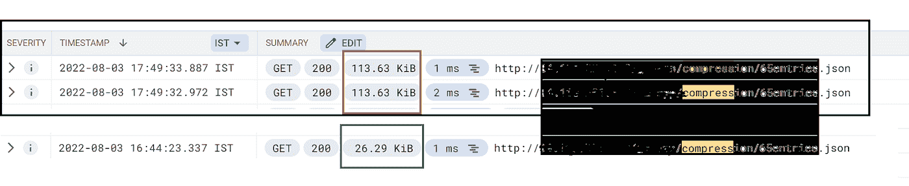

# 借助 GCP 云 CDN 动态压缩提升性能并降低成本

> 原文：<https://medium.com/google-cloud/performance-improvement-cost-reduction-with-gcp-cloud-cdn-dynamic-compression-f851a5ee7f7f?source=collection_archive---------1----------------------->

# 介绍

在我们的 IT 生活中，我们都使用过像 winzip、winrar 这样的压缩工具来减小文件、照片等的大小。压缩的主要优点是减少存储空间、数据传输时间和通信带宽。压缩文件比未压缩文件需要的存储容量少得多，这意味着存储费用大大降低。压缩文件还需要较少的传输时间，同时消耗较少的网络带宽。这也有助于降低成本，提高生产率。

从 CDN 用例的角度来看，大多数客户选择加入 CDN，以获得加速网络交付的优势。因此，CDN 中的压缩功能为最终用户体验提供了乘数效应，并改善了页面负载等重要参数。客观地说，CDN 客户通过选择压缩将获得的两大优势是

1.  **性能**:这是因为我们发送了更少的字节，因此页面加载时间等统计数据得到了改善。
2.  **成本效率**:由于 CDN 的成本参数之一是 CDN 的出口流量，出口流量越少意味着 CDN 账单越少。

Google Cloud CDN 提供了一个名为“[动态压缩](https://cloud.google.com/cdn/docs/dynamic-compression)的功能，它与全局外部 HTTP(S)负载均衡器一起工作，自动压缩云 CDN 在源和客户端之间提供的响应。这篇博客主要关注 Google Cloud CDN 的动态压缩特性。所有现代浏览器都支持压缩，唯一需要协商的是浏览器和服务器之间使用的压缩算法。现在有两个算法是相关的: **gzip** ，最常见的一个，还有 **brotli** ，新的挑战者。

在高层次上，浏览器发送一个 **Accept-Encoding** 头，其中包含它支持的算法及其优先级顺序，服务器选择一个，用它来压缩响应的正文，并使用 **Content-Encoding** 头告诉浏览器它选择的算法。

**测试拓扑**

在这篇博客中，我想展示在 Google Cloud CDN 上启用动态压缩的步骤，以及验证功能的步骤。为了这个博客的目的，我在 GCP 上使用了一个演示设置，包括以下组件

*   我有一个谷歌云存储(GCS)桶和一个 JSON 文件上传在桶里
*   我将尝试通过谷歌云 CDN 提供这个 JSON 文件
*   在这个测试中，我让终端客户发送 Accept-encoding : gzip 请求

下面是用于测试 Google Cloud CDN 动态压缩的拓扑的高级表示

# 负载平衡器和 CDN 配置设置

这篇博客的想法不是解释云 CDN 是如何配置的，或者 https 负载均衡器是如何工作的。读者可以阅读下面的 GCP 文档

*   [如何为外部后端设置 GCP HTTPS LB](https://cloud.google.com/load-balancing/docs/https/setting-up-https-external-backend-internet-neg)
*   [搭建云 CDN](https://cloud.google.com/cdn/docs/using-cdn)

为了让读者受益，下面是我在测试时使用的后端服务的快照

*$ g cloud compute back end-services 描述 servneg — global*

*affinityCookieTtlSec: 0*

*后端:*

*-平衡模式:利用率*

*容量刻度:1.0*

*组:*[*https://www . Google APIs . com/compute/v1/projects/m-AAAA-AAAA/global/networkEndpointGroups/cdn-neg*](https://www.googleapis.com/compute/v1/projects/m-aaaa-aaaa/global/networkEndpointGroups/cdn-neg)

*cdn 政策:*

*缓存关键策略:*

*includeHost: true*

*includeProtocol: true*

*includeQueryString:true*

*CACHE mode:CACHE _ ALL _ STATIC*

*客户端 Ttl: 3600*

*默认 Ttl: 3600*

*maxTtl: 86400*

*否定缓存:假*

*请求合并:真*

*serveWhileStale: 0*

*连接排水:*

*drainingTimeoutSec: 0*

*creation timestamp:' 2022–08–02t 22:00:12.236–07:00 '*

*customRequestHeaders:*

*-主机:storage.googleapis.com*

*customResponseHeaders:*

*-缓存状态:{cdn_cache_status}*

*描述:*

*enableCDN: true*

*指纹:PgKJ8FWxNHA=*

*id:' 121325304488115763 '*

*种类:计算#后端服务*

*负载平衡方案:外部*

*日志配置:*

*使能:真*

*采样率:1.0*

名称:servneg

*端口:80*

*端口名:http*

*协议:HTTP*

*self link:*[*https://www . Google APIs . com/compute/v1/projects/m-AAAA-AAAA/global/backendServices/serv neg*](https://www.googleapis.com/compute/v1/projects/m-aaaa-aaaa/global/backendServices/servneg)

会话亲和性:无

*超时时间:30*

# 如何启用/禁用压缩

请使用以下方法之一(gcloud CLI 或 GCP 控制台 UI)来禁用/启用压缩。

启用自动压缩的 gcloud 命令如下

**g cloud compute back end-BUCKET update YOUR _ BUCKET \**

**—压缩模式=自动**

禁用自动压缩的 gcloud 命令如下

**g cloud compute back-BUCKET update YOUR _ BUCKET \**

**—压缩模式=禁用**

如果您希望使用 Google Cloud console (web-UI)编辑现有的后端服务，请遵循以下步骤

图:启用/禁用 GCP 云 CDN 的动态压缩

# 如何验证压缩

有多种方法可以帮助客户确保压缩由云 CDN 完成。其中一些如下-

1.  查看由云 CDN 提供服务的请求的响应头。我们将看到，响应是用 Vary: Accept-Encoding 头提供给客户机的。

2.您可以查看响应头的“content-length”部分，以得出响应被压缩的结论。未经压缩的相同内容会产生以下结果

因此，您可以看到压缩后的内容长度是 6162，未压缩时是 115667

3.在 GCP 日志下，您可以看到大小并推断是否发生了压缩。以下示例显示了经过压缩和未经压缩的相同文件。

# 需要考虑的要点

对于云 CDN 压缩，有一些要点需要注意-

1.  云 CDN 压缩仅适用于 1 KiB 和 10 MiB(含)之间的对象。
2.  某些 MIME 类型只能被压缩，如 text/html、text/csv、application/json、application/javascript 等。在[链接](https://cloud.google.com/cdn/docs/dynamic-compression#compressible-content)中提到了详尽的列表
3.  如果浏览器使用首选压缩算法(通过权重)发送请求，如"*br；q=1.0，gzipq=0.8，*；q = 0.1”；*由于发送请求时优先选择“br ”,云 cdn 将使用“br”压缩算法压缩对象。
4.  如果浏览器发送没有偏好权重的请求，就像只发送 accept-encoding 作为“gzip，br”；云 CDN 将使用“br”作为压缩的首选算法。
5.  如果带有接受编码报头的客户端请求是针对对象发送的，并且是“高速缓存未命中”；从后端源获取对象(假设后端返回未压缩的对象)→对象由云 CDN 压缩→对象的压缩副本存储在缓存中→并返回给请求客户端。请注意:对这种客户端的第一个回复将是对象的未压缩副本，并发布 CDN 将在缓存中有对象的压缩副本，并且同样将提供给最终客户端。
6.  如果客户端请求是针对带有 accept-encoding 标头的对象发送的，但该对象在缓存中以“未压缩”形式存在；云 CDN 将使用适当的算法压缩对象，然后提供给最终客户。
7.  如果对象大于 10MiB，则云 CDN 动态压缩不适用。因此，如果客户要求小字节范围[例如 1–100]；他将获得请求的字节范围服务(无压缩)。

# 结束语:

对于内容符合可由云 CDN 压缩的内容的资格标准的现有 Google Cloud CDN 客户来说，启用该功能是显而易见的(特别是因为这是免费的)。启用此功能后，客户应该会看到出口 CDN 数据量的下降，因此应该能够享受每月在云 CDN 上的支出减少。

对于一类客户，他们在后端处理压缩；这一特性没有任何问题。GCP 云 CDN 不会尝试压缩后端服务的已压缩对象。因此，此类客户的应用程序不会有任何变化。

GCP 云 CDN 的动态压缩对于客户来说是一个简单的自动/禁用可配置项目。因此，客户不需要为配置此功能付出太多的计划和精力。向 GCP 致敬，他真的做了这个“交钥匙工程”并消除了复杂性。

**免责声明**:这是为了告知读者，文中表达的观点、想法、意见仅属于作者，不一定属于作者的雇主、组织、委员会或其他团体或个人。