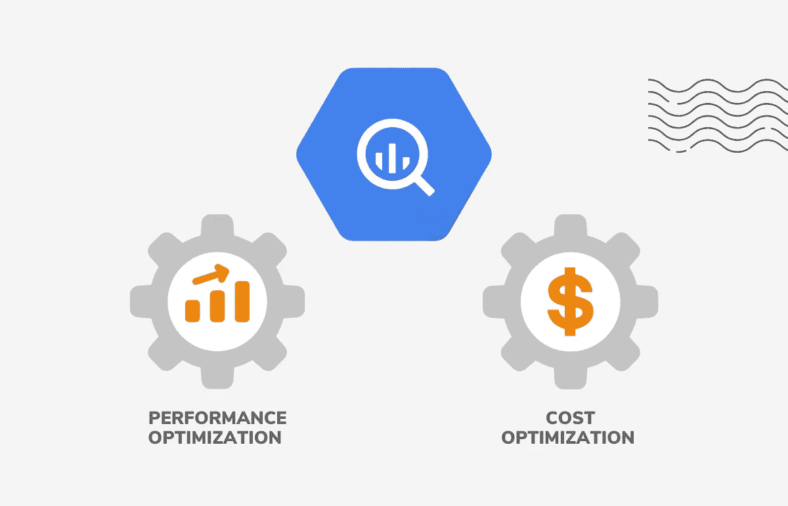

# 使用 BigQuery 进行性能优化

> 原文：<https://medium.com/google-cloud/performance-optimization-with-bigquery-821c8b648c84?source=collection_archive---------0----------------------->

到目前为止，我们已经了解了什么是 Bigquery(BQ)，BQ 的设计建议是什么？GCP BQ 有哪些实施 ELT、SCD 和安全的方法？现在，让我们看看有哪些提高 BQ 流程性能的建议。我们将在下一篇博客中看到 BQ 成本优化。

BQ 是 GCP 的托管服务，它为用户提供使用各种 GCP 以及开源服务或 ETL/BI 工具来创建/构建数据仓库的功能。让我们假设一个典型的在 GCP 数据管道上使用 BQ 的 DW 实现。因为这是谷歌的托管服务，不支持索引、约束、统计和一些用于性能优化的典型数据仓库功能。

BQ 性能优化只能在 SQL 优化方面进行。没有其他方法可以添加/删除资源、自动扩展资源或使用内存/存储来提高性能。这是完全托管的服务，我们可以使用以下技术/检查点来验证 DW 查询的性能。我们可以遵循这些建议，提高 BQ 查询、SQL 等的性能。性能更好的查询消耗的资源更少，从而可以降低成本和减少失败。

在 BigQuery 中评估查询性能时，所需的工作量取决于以下因素:

输入数据和数据源(I/O):查询读取多少字节？

节点间的通信(洗牌):查询传递给下一阶段多少字节？查询传递给每个槽多少字节？

计算:查询需要多少 CPU 工作？

输出(具体化):查询写了多少字节？

查询反模式:查询是否遵循 SQL 最佳实践？

许多这些因素都可以通过查询计划观察到。为提交给 BigQuery 的每个查询生成一个查询计划。我们可以看到执行统计数据，比如读取的字节数和消耗的槽时间。查询计划还显示了不同的执行阶段，这有助于确定提高查询性能的方法。

1.**管理输入输出数据** —我们可以只选择所需的列来查看数据/处理数据。不运行 select *而是运行 Select column list from tables

**a.** **最佳实践:控制投影—只查询需要的列**。投影指的是查询读取的列数。投影多余的列会导致额外的(浪费的)I/O 和物化(写入结果)。

使用 SELECT *是查询数据开销最大的方法。使用 SELECT *时，BigQuery 会对表中的每一列进行完全扫描。当试验数据或浏览数据时，请使用其中一个数据预览选项，而不是 SELECT *。

对 SELECT *查询应用 LIMIT 子句不会影响读取的数据量。用户因读取整个表中的所有字节而付费，并且该查询根据可用层配额计数。相反，只查询所需的列。例如，使用 SELECT * EXCEPT 从结果中排除一个或多个列。

**b.** **对数据进行分区以限制扫描的字节数** — BQ 支持对日期和整数列进行分区。基于数据，我们可以添加分区列来在表数据之上创建分区。当我们没有任何特定日期或整数列来添加分区时，我们也可以使用摄取列作为分区。这可以用在每日批量加载的情况下，以及当我们想要将每日批量加载数据划分到分区中，并仅针对当天的数据或批量数据运行查询时。这有助于减少表扫描，并且只访问一个分区来读取数据。

我们可以使用 BQ partition 子句限制用户添加分区。从已分区表中读取数据时使用分区列，以避免数据删减。

**c.** **反规范化数据** —反规范化是一种常用策略，用于提高先前已规范化的关系数据集的读取性能。在 BigQuery 中，反规范化数据的推荐方法是使用嵌套和重复的字段。当关系是分层的并且经常一起查询时，例如在父子关系中，最好使用这种策略。BQ 不需要数据完全扁平化或规范化，我们可以使用数组或结构读取给定嵌套或重复格式的数据。

**d.** **明智地使用外部数据源** —如果查询性能是重中之重，请不要使用外部数据源。在 BigQuery 托管存储中查询表通常比在云存储、驱动器或云 Bigtable 中查询外部表要快得多。

将外部数据源用于以下用例:

a.加载数据时执行提取、转换和加载(ETL)操作

b.频繁变化的数据

c.周期性负载，例如从云 Bigtable 中重复摄取数据

**e.** **在查询中使用表格时避免使用通配符** — BQ 支持使用通配符表达式查询一组表格。这将创建其中所有表和数据的联合。为了获得更好的性能，请减少粒度搜索或在非常粒度的级别添加前缀。

粒度更细的前缀比更短的前缀性能更好。例如，来自 bigquery-public-data.noaa_gsod . gsod 194 *的性能优于来自 big query-public-data . NOAA _ gsod 的性能。*因为匹配通配符的表较少。

2.**优化插槽之间的通信** —评估通信吞吐量时，考虑查询所需的洗牌量。例如，GROUP BY 子句将相似的值传递给同一个槽进行处理。被混洗的数据量直接影响通信吞吐量，从而影响查询性能。以下最佳实践提供了控制插槽间通信的指导。

a.**在连接前减少数据** —在查询执行连接之前，尽可能早地在查询中修剪数据。如果您在处理周期的早期减少数据，则混洗和其他复杂操作只会对您需要的数据执行。

b.**避免将 WITH 子句作为预准备语句** — WITH 子句主要用于可读性，因为它们没有被具体化。例如，将所有查询放在 WITH 子句中，然后运行 UNION ALL 就是对 WITH 子句的误用。如果查询出现在多个 WITH 子句中，它将在每个子句中执行。

c.**避免按日期分片的表** —当您创建按日期分片的表时，BigQuery 必须为每个以日期命名的表维护一份模式和元数据的副本。此外，当使用日期命名的表时，可能需要 BigQuery 来验证每个查询表的权限。这种做法还会增加查询开销并影响查询性能。

d.**避免表的过度分片** —表分片是指将大型数据集划分为单独的表，并为每个表名添加一个后缀。如果要按日期对表进行分片，请使用时间分区表。由于 BigQuery 存储的低成本，您不需要像在关系数据库系统中那样为成本优化表。创建大量表碎片对性能的影响超过了任何成本收益。分片表需要 BigQuery 来维护每个分片的模式、元数据和权限。因为维护每个片上的信息需要额外的开销，所以过硬的表会影响查询性能。

3.**优化查询计算** —评估查询所需的计算时，考虑所需的工作量。

a.**避免通过 SQL 查询重复转换数据** —如果您使用 SQL 执行 ETL 操作，请避免重复转换相同数据的情况。

例如，如果您使用 SQL 通过正则表达式来修剪字符串或提取数据，那么在目标表中具体化转换后的结果会更有效率。像正则表达式这样的函数需要额外的计算。在不增加转换开销的情况下查询目标表要高效得多。

b.**避免使用 JavaScript 自定义函数** —避免使用 JavaScript 自定义函数。请改用本机 UDF。调用 JavaScript UDF 需要实例化一个子流程。加速这个过程并运行 UDF 会直接影响查询性能。如果可能，请改用本机(SQL) UDF。

c.**使用近似聚合函数** —如果用例支持，使用近似聚合函数。如果您使用的 SQL 聚合函数有一个等效的近似函数，则该近似函数会产生更快的查询性能。例如，不使用 COUNT(DISTINCT)，而是使用 APPROX_COUNT_DISTINCT()。

d.**使用聚集分析函数获取最新记录** —要获取最新记录，使用 ARRAY_AGG()聚集分析函数。使用 ARRAY_AGG()聚合分析函数而不是使用编号函数(如 RANK()或 ROW_NUMBER())可以更有效地运行查询，因为 ORDER BY 子句允许删除除每个 GROUP BY 子句中最上面的记录之外的所有内容。

e.**对查询操作进行排序以最大化性能** —仅在最外层查询或窗口子句(分析函数)中使用 ORDER BY。将复杂的操作推到查询的末尾。如果需要对数据进行排序，首先进行筛选以减少需要排序的值的数量。如果首先对数据进行排序，那么排序的数据要比需要的多得多。对数据子集进行排序比对所有数据进行排序并应用限制子句更可取。当我们使用 ORDER BY 子句时，它应该只出现在最外层的查询中。除非在窗口(分析)函数中使用 ORDER BY 子句，否则将 ORDER BY 子句放在查询中间会极大地影响性能。

f.**优化连接模式** —对于连接多个表中数据的查询，优化连接模式。从最大的桌子开始。使用联接创建查询时，请考虑合并数据的顺序。标准的 SQL 查询优化器可以确定哪个表应该位于连接的哪一边，但是仍然建议对连接的表进行适当的排序。最佳做法是，首先放置行数最多的表，然后放置行数最少的表，然后按照大小递减的顺序放置其余的表。

g.**在连接中使用 INT64 数据类型以降低成本并提高比较性能** —如果用例支持，在连接中使用 INT64 数据类型，而不是字符串数据类型。

BigQuery 不像传统数据库那样索引主键，所以连接列越宽，比较时间就越长。因此，在联接中使用 INT64 数据类型比使用 STRING 数据类型更便宜、更高效。

h.**修剪分区查询** —查询已分区表时，要使用已分区表上的分区进行筛选，请使用以下列:

对于摄取时间分区表，使用伪 column _PARTITIONTIME

二。对于分区表，如基于时间单位列和整数范围的分区表，请使用分区列。

i. **避免对相同的通用表表达式(cte)进行多次求值** —使用脚本、变量、临时表和自动过期表来保存计算，并在以后的查询中使用它们。当查询包含在查询中多个地方使用的公用表表达式时，每次引用它们时都会对它们进行计算。这可能会增加内部查询的复杂性和资源消耗。根据 CTE 返回的数据，可以将 CTE 的结果存储在标量变量或临时表中。您无需支付临时桌子的存储费用。

j.**将复杂的查询拆分成多个较小的查询** —利用 BigQuery 丰富的脚本功能和存储过程来执行计算，将一个复杂的查询设计成多个更小更简单的查询。复杂的查询，例如包含多层子查询或连接的查询，运行起来可能会很慢，而且会占用大量资源。试图将所有计算放在一个巨大的 SELECT 语句中，例如使它成为一个视图，有时是一种反模式，它可能导致缓慢、资源密集型的查询。在极端情况下，内部查询计划会变得非常复杂，以至于 BigQuery 无法执行它。

4.**管理查询输出** —评估输出数据时，考虑查询写入的字节数。以下最佳实践提供了控制输出数据的指导。

a.**避免重复连接和子查询** —避免重复连接相同的表和使用相同的子查询。如果您重复连接相同的表，请考虑重新访问模式。使用嵌套的重复数据来表示关系可能比重复连接数据更有效。嵌套的重复数据可以减少连接所需的通信带宽对性能的影响。它还为您节省了重复读写相同数据所带来的 I/O 成本。

b.**具体化输出数据** — BigQuery 将缓存结果限制为大约 10 GB 的压缩。返回较大结果的查询会超过此限制，并经常导致以下错误:响应过大。当您从包含大量数据的表中选择大量字段时，通常会出现此错误。写入缓存结果的问题也可能发生在 ETL 风格的查询中，这种查询在没有减少或聚集的情况下对数据进行规范化。我们可以通过以下方式克服缓存结果大小的限制:

I .使用过滤器限制结果集

二。使用 LIMIT 子句减少结果集，尤其是在使用 ORDER BY 子句时

三。将输出数据写入目标表

c.**使用带有大量排序的 LIMIT 子句** —当对大量值进行排序时，使用 LIMIT 子句。使用 ORDER BY 子句写入查询结果会导致资源超出错误。最后的排序是在单个插槽上完成的。如果您试图对一个非常大的结果集进行排序，最终的排序可能会淹没正在处理数据的槽。如果使用 ORDER BY 子句，也要使用 LIMIT 子句。

**5。** **避免反 SQL 模式—**

a.**自连接** —避免自连接。请改用窗口(分析)函数。通常，自联接用于计算依赖于行的关系。使用自联接的结果是，它可能会使输出行数平方。输出数据的增加会导致性能下降。不使用自联接，而是使用窗口(分析)函数来减少查询生成的额外字节数。

b.**数据倾斜** —如果查询处理严重倾斜于几个值的键，则尽可能早地过滤数据。分区偏斜，有时也称为数据偏斜，是指数据被划分为大小非常不相等的分区。这造成了时隙之间发送的数据量的不平衡。您不能在插槽之间共享分区，因此如果一个分区特别大，它可能会降低速度，甚至会使处理超大分区的插槽崩溃。为了避免数据不对称导致的性能问题:

I .使用近似聚合函数(如 APPROX_TOP_COUNT)来确定数据是否有偏差。

二。尽可能早地过滤数据。

c.**不平衡联接** —当您使用联接子句时，也会出现数据倾斜。因为 BigQuery 在连接的每一端都混洗数据，所以具有相同连接键的所有数据都进入同一个 shard。这种洗牌会使插槽过载。为了避免与不平衡联接相关的性能问题:

I .用不平衡键预过滤表中的行。

二。如果可能，将查询分成两个查询。

d.**交叉连接(笛卡尔积)** —避免产生输出多于输入的连接。当需要交叉连接时，预聚合数据。交叉连接是将第一个表中的每一行连接到第二个表中的每一行的查询(两边都有非唯一键)。最坏的情况输出是左表中的行数乘以右表中的行数。在极端情况下，查询可能无法完成。

e.**更新或插入单行的 DML 语句** —避免特定于点的 DML 语句(一次更新或插入一行)。批量更新和插入。

使用特定于点的 DML 语句是试图像对待在线事务处理(OLTP)系统一样对待 BigQuery。BigQuery 通过使用表扫描而不是点查找来关注在线分析处理(OLAP)。如果需要类似 OLTP 的行为(单行更新或插入)，可以考虑设计一个支持 OLTP 用例的数据库，比如云 SQL。BigQuery DML 语句用于批量更新。BigQuery 中的 UPDATE 和 DELETE DML 语句面向数据的定期重写，而不是单行突变。

请关注我即将发表的关于 BQ 成本优化的故事。

> **关于我:**
> 
> 我是 DWBI 和云建筑师！我一直在处理各种遗留数据仓库、大数据实施、云平台/迁移。我是谷歌认证的专业云架构师。如果您在认证、GCP 实施方面需要任何进一步的帮助，您可以联系我@ [LinkedIn](https://www.linkedin.com/in/poojakelgaonkar) ！