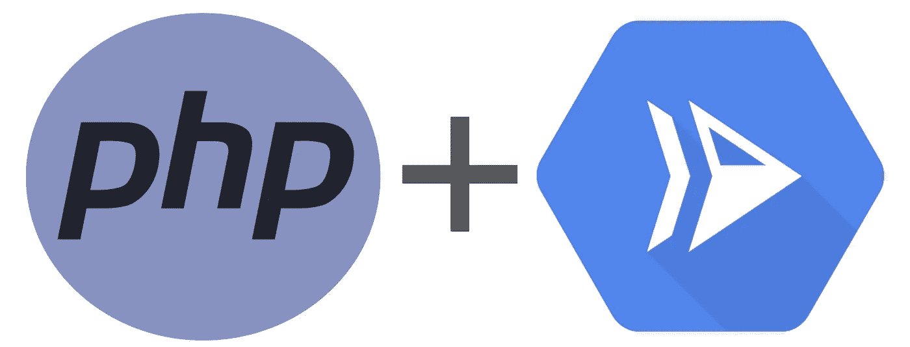

# PHP 函数在云上运行🐘 🎉

> 原文：<https://medium.com/google-cloud/php-functions-on-cloud-run-23acdb6022e9?source=collection_archive---------0----------------------->



介绍 *PHP 函数框架*。这个开源库允许您轻松地将 PHP 应用程序部署到 Cloud Run。在这篇博文中，我们将向您简要介绍这个包，并向您展示如何将 PHP 函数部署到 Cloud Run！💨👟

# PHP 函数框架

PHP 函数框架允许任何人以 FaaS 开发者的体验轻松开发自包含的 PHP 函数，这些函数可以在本地运行/测试并部署到云中。框架是发布在[packagest](https://packagist.org/packages/google/cloud-functions-framework)上的包，源代码在 [GitHub](https://github.com/GoogleCloudPlatform/functions-framework-php) 上。

## 开发 PHP 函数

PHP 函数框架允许您使用 Symfony 的面向对象的 web 应用程序框架来创建简单的 HTTP 请求处理程序。在您的计算机上进行测试时，您可以使用 PHP 的内置 web 服务器(通过一个简单的 CLI 命令)来运行您的函数代码，以响应 HTTP 请求。

这个框架最好用一个例子来说明。让我们通过在一个新文件中编写一个简单的函数来创建一个“Hello World”示例，`index.php`:

`*index.php*`

然后在一个`composer.json`文件中指定对框架的依赖:

composer.json

用`composer install`安装这个包。

最后，使用下面的脚本在本地运行函数框架，该脚本使用 PHP 内置的 web 服务器:

```
export FUNCTION_TARGET=helloHttp
export FUNCTION_SIGNATURE_TYPE=http
php -S localhost:8080 vendor/bin/router.php
```

> 注意:`export`命令最初只需要运行一次。

在`[http://localhost:8080/](http://localhost:8080/)`，你会看到你的 PHP 服务器在本地运行！🐘

## 容器化您的应用程序

PHP 函数框架是可移植的，也就是说，你可以将现有的应用程序代码和函数框架放在一起，在任何支持 PHP 的地方运行。

PHP 函数框架 repo 包括一个[示例](https://github.com/GoogleCloudPlatform/functions-framework-php/blob/master/examples/hello/Dockerfile) `[Dockerfile](https://github.com/GoogleCloudPlatform/functions-framework-php/blob/master/examples/hello/Dockerfile)`，我们可以使用/复制它来构建我们的容器。将该文件的内容(复制如下)添加到一个名为`Dockerfile`的*新*文件中，紧挨着您的`index.php`文件:

Dockerfile 文件

## 部署到云运行

将您的应用程序部署到 Google Cloud 很容易。运行以下命令来构建您的容器并部署到云运行💨👟：

```
# Set env var "GCP_PROJECT" to our project name
GCP_PROJECT=$(gcloud config list --format 'value(core.project)' 2>/dev/null)# Set our Cloud Run region (so we aren't prompted)
gcloud config set run/region us-central1# Build and upload your image in Google Container Registry
gcloud builds submit --tag gcr.io/$GCP_PROJECT/hellophp
gcloud run deploy hellophp \
  --image gcr.io/$GCP_PROJECT/hellophp \
  --region us-central1 \
  --allow-unauthenticated \
  --set-env-vars=FUNCTION_TARGET=helloHttp \
  --set-env-vars=FUNCTION_SIGNATURE_TYPE=http
```

大约 30 秒后，您会看到一个如下所示的 URL:

```
https://hellophp-q7vieseflq-uc.a.run.app/?name=Functions%20Framework
```

> 注意:此 Hello World 服务因滥用被删除…

请随意`curl`你的网址，并调用我们的功能！

你有它！您已经将第一个 PHP 函数部署到 Google Cloud 了！

## 了解更多信息

渴望通过 Google Cloud 了解更多关于函数框架的知识吗？

*   [🐘在 GitHub](https://github.com/GoogleCloudPlatform/functions-framework-php) 上阅读 PHP 函数框架的源代码
*   [📖通过阅读开发指南](https://github.com/GoogleCloudPlatform/functions-framework)了解更多关于所有功能框架的信息