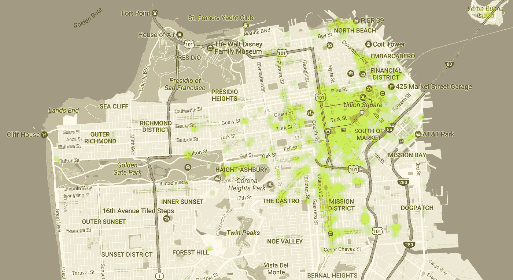
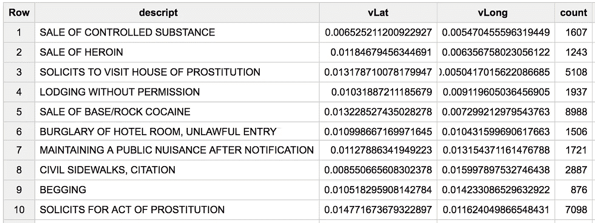
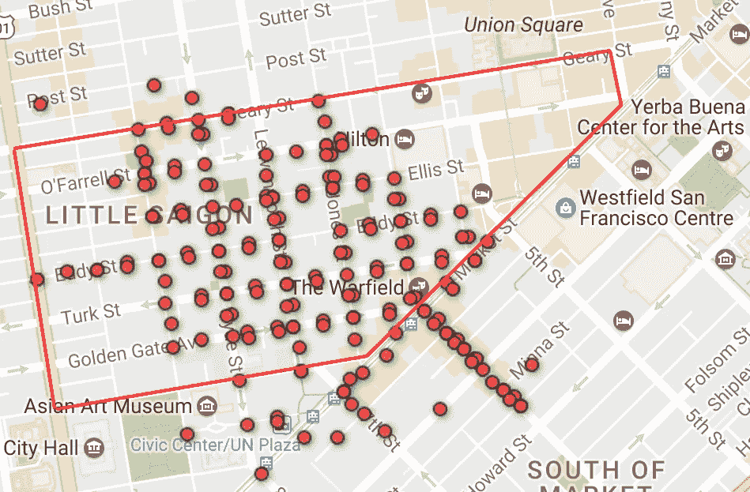
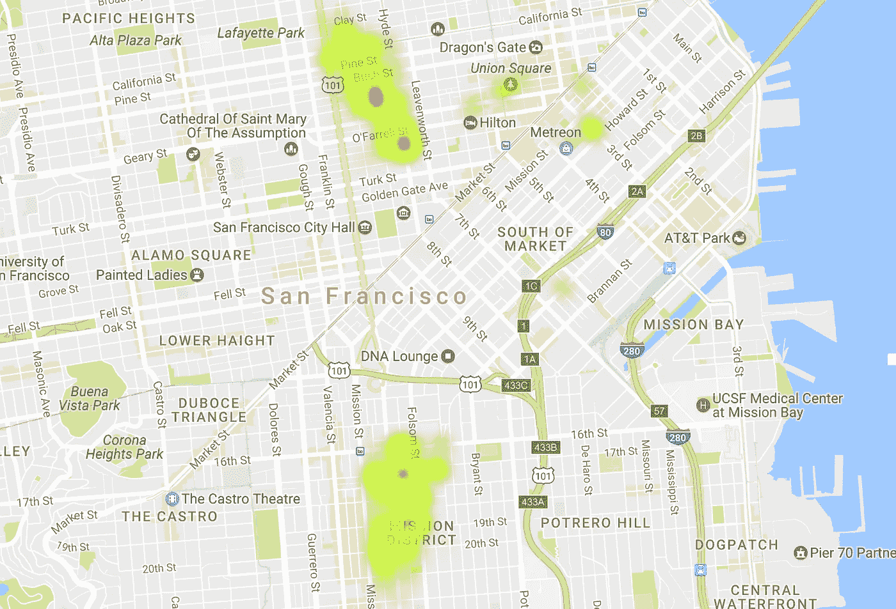
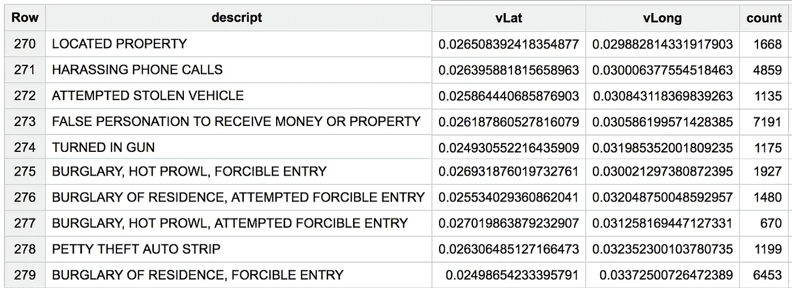
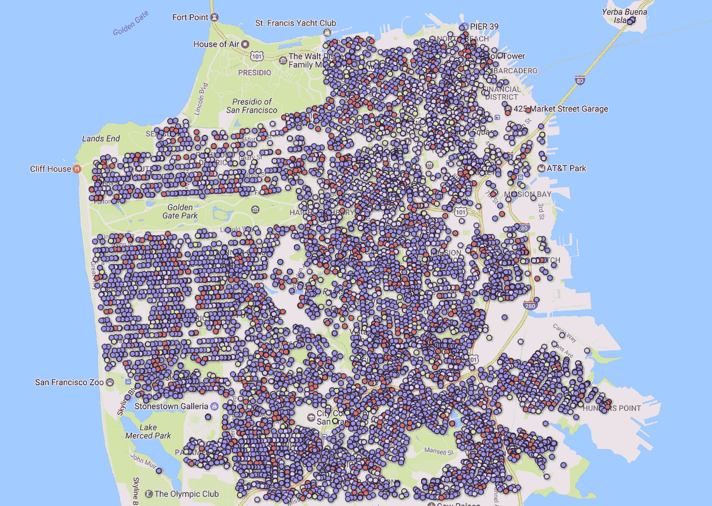
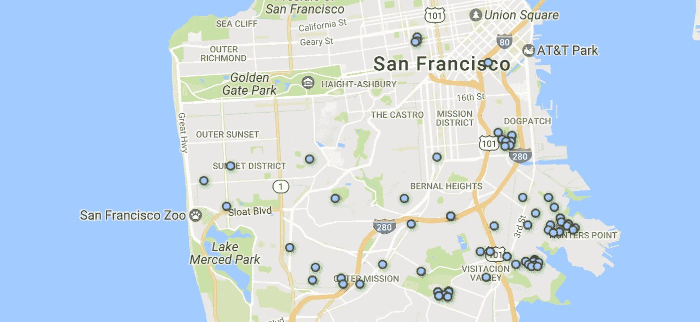

# 犯罪热点以及如何使用 BigQuery 找到它们

> 原文：<https://medium.com/google-cloud/places-to-avoid-in-san-francisco-76b0261dec6?source=collection_archive---------1----------------------->


## 旧金山的犯罪分布

绘制自 2010 年以来 SFPD 发生的所有事件，田德隆区是一个你在游览这座城市时可能要小心的地方。

我想知道不同类型的犯罪在海湾地区的城市中的分布情况如何——所以我启动了 BigQuery，并使用了 SFPD 事件的公共数据集进行调查。



基于 SFPD 事件数量的热图(按地点)

通过计算每种犯罪类型的纬度和经度的综合[标准差](https://en.wikipedia.org/wiki/Standard_deviation)，我们可以发现哪些犯罪在特定区域最为集中——突出显示整个城市中特定犯罪的热点。

```
SELECT
  descript,
  STDDEV(latitude) as sdLat,
  STDDEV(longitude) as sdLong,
  count(*) as count
FROM 
  `bigquery-public-data.san_francisco.sfpd_incidents` 
WHERE 
  (Latitude IS NOT NULL) AND (Longitude IS NOT NULL) 
  AND (Latitude > 30) AND (LATITUDE < 40) 
  AND (Longitude > -130) AND (Longitude < -120)
GROUP BY
  descript
HAVING 
  sdlat is not null and sdlong is not null 
  AND count > 500
ORDER BY 
  sdlat+sdLong ASC
```

标准差最低的结果代表位置集中程度最高的犯罪；下表显示了前 10 名。请注意，毒品和卖淫占据了前 10 名的一半。



SFPD 犯罪事件描述超过 500 次，位置标准偏差最低。

总的来说，上表中前 10 类毒品犯罪中有 75%发生在旧金山的这一地区，如下图所示:



地图显示了 75%的 SFPD 毒品相关犯罪事件，属于十大最集中的犯罪类型。里脊肉用红色标出。

卖淫也非常集中，但在这种情况下，大多数警察事件发生在两个独立但不同的地区:



十大最集中犯罪类型中与卖淫有关的犯罪热图。

下表显示了*位置标准偏差最高*的犯罪——或最大传播——入室盗窃、盗窃和拾得财物占了前 10 名中的 7 名。



SFPD 犯罪事件超过 500 起，位置标准偏差最高。

这些犯罪往往发生在整个城市；正如您在下面的地图中所看到的，该地图显示了至少有一次入室盗窃或企图闯入的地点:



旧金山所有发生一起或多起入室盗窃/企图闯入的地点。

看看最常见的入室盗窃相关事件类型，住宅闯入，74%的事件发生在只有一次闯入的地点。下面的地图只显示了发生 5 起或 5 起以上入室盗窃的地点:



旧金山发生五起或更多入室盗窃的地点。

BigQuery 包括更多旧金山、T2、纽约、T4 和芝加哥的公共数据集。关于我们生活的城市，你能发现什么？

如果您是 BigQuery 的新手，请遵循这些[入门说明](/til-with-bigquery/how-to-run-a-terabyte-of-bigquery-queries-each-month-without-a-credit-card-948773df8c0c#.9jex791fc)，并且记住每个人每个月都可以免费获得 1TB 和 10 GB 的存储空间[来运行查询](https://cloud.google.com/bigquery/pricing)。

在[reddit.com/r/bigquery](http://www.reddit.com/r/bigquery)与我们分享你的调查，订阅 [*今天我用 BigQuery*](http://tilqbq.com) 了解了更多 BigQuery 公共数据集调查。