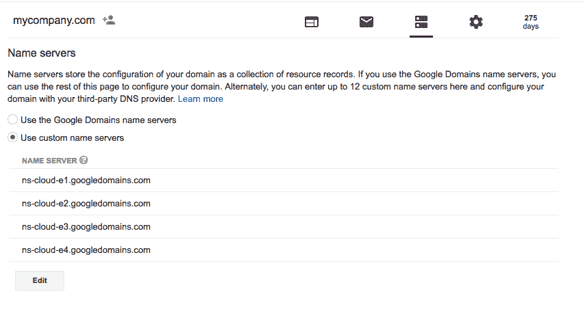

# Kubernetes 和 Google Cloud 上的集群联合和全局负载平衡—第 1 部分

> 原文：<https://medium.com/google-cloud/planet-scale-microservices-with-cluster-federation-and-global-load-balancing-on-kubernetes-and-a8e7ef5efa5e?source=collection_archive---------2----------------------->

## 警告:在这篇文章中描述的 Kubernetes 联盟将不再被支持。正在开发新的工具来取代它，当这些工具准备好的时候，我会写一篇新的博文。下面的理论上应该还是行得通的，但是我不再推荐了。

我最近在 Google Cloud Next 做了一个关于使用 Kubernetes 在世界各地部署和管理微服务的演讲。

https://www.youtube.com/watch?v=kmPBm-TQBSE

我已经在博客中讲述了如何[在 StatefulSet](http://blog.kubernetes.io/2017/01/running-mongodb-on-kubernetes-with-statefulsets.html) 中设置 MongoDB，所以现在我将深入探讨如何设置集群联盟并在全球范围内部署服务！

我假设你知道在谷歌云中创建项目的基本知识，并且已经安装和设置了[谷歌云 SDK](https://cloud.google.com/sdk/) 。如果没有，请查看我以前的博客帖子。

我们将特别关注三个方面，集群联合、联合入口和跨集群服务发现。我将把这些话题分成三篇博文，期待下一篇吧！

## 第 1 部分:集群联合

[集群联合](https://cloud.google.com/container-engine/docs/cluster-federation)可以用来管理多个 Kubernetes 集群，就像它们是一个集群一样。这意味着您可以在多个数据中心(和多个云)中创建集群，并使用联合来一次性控制它们！

## [第 2 部分:联合入口](/@SandeepDinesh/planet-scale-microservices-with-cluster-federation-and-global-load-balancing-on-kubernetes-and-cd182f981653)

[联邦入口](https://kubernetes.io/docs/tasks/administer-federation/ingress/)超级甜，目前只支持 Google Cloud。这允许您使用单个全局 IP 地址启动单个负载平衡器，它将自动向最近的集群动态发送流量！

## 第 3 部分:跨集群通信

[跨集群服务发现](http://kubernetes.io/docs/user-guide/federation/federated-services/)是一个概念，让一个 Kubernetes 集群中的服务自动发现其他集群中的服务。我们还会看看 [Google Cloud Pub/Sub](https://cloud.google.com/pubsub/) 启用异步微服务！

# 第 1 部分:集群联合

# 步骤 1:设置 DNS

DNS 是 Kubernetes 的核心，因为它用于集群中的服务发现。虽然在群集内部运行本地 DNS 服务器，但您需要有一个中央 DNS 服务来进行跨群集服务发现。你可以使用任何可编程的 DNS 服务来做到这一点，我们将使用 [Google Cloud DNS](https://cloud.google.com/dns/) 。

第一步是购买域名(或者使用你已经有的域名)。在我的例子中，我用[谷歌域名](https://domains.google/)购买了一个便宜的域名。对于这个例子，我将假设我购买的域名是“mycompany.com”

现在，您需要创建一个[管理的 DNS 区域](https://cloud.google.com/dns/zones/)。让我们使用“infra”子域来处理 Kubernetes 服务，这意味着该域将是“infra.mycompany.com”。我也将该域称为“kfed”，但您可以随意称呼它。

```
gcloud dns managed-zones create kfed \
  --description “Kubernetes Federation Zone” \
  --dns-name infra.mycompany.com
```

如果您转到[云 DNS 控制台](http://console.cloud.google.com/networking/dns/zones)，您应该会看到这个新区域被创建。


单击区域名称，您将看到更多详细信息，包括名称服务器:


此时，请转到您的域名注册机构，使用新管理区域中的 DNS 服务器。以下是它在谷歌域名中的样子:



# 步骤 2:创建集群

轻松有趣的一步。让我们将两个小型 Kubernetes 集群联合起来。

创建第一个群集(让我们使用 us-west1 数据中心):

```
gcloud container clusters create west-cluster \
  --zone us-west1-a --scopes cloud-platform
```

现在是第二个(让我们使用 us-east1 数据中心):

```
gcloud container clusters create east-cluster \
  --zone us-east1-b --scopes cloud-platform
```

几分钟后，两个集群都应该启动并运行。

# 步骤 3:创建联合控制平面

联合控制平面管理所有联合集群的全局状态。有趣的是，控制平面可以自托管在您的 Kubernetes 集群中，因此您甚至不需要设置任何额外的东西！

> N 注意:即使控制平面群集关闭，其他群集本身也是独立的，因此它们将继续运行，直到控制平面恢复运行。您仍然可以单独控制各个集群！这意味着您不必担心一个单一的故障会使您的所有集群瘫痪！

首先需要找到 Kubernetes 集群的上下文名称。运行以下命令:

```
kubectl config get-contexts
```

您应该会看到如下输出:


您可以看到每个集群都有自己的上下文，小星星表示当前哪个上下文是活动的。

这里还需要做一个额外的步骤。Kubernetes 联邦使用上下文名称来设置联邦秘密，但是它需要符合 [RFC1123 规范](https://kubernetes.io/docs/tasks/federation/set-up-cluster-federation-kubefed/#secret-name)。这意味着您需要重命名上下文。您可以使用以下命令来完成此操作:

```
#East Cluster kubectl config set-context east-coast \
   --cluster gke_$(PROJECT_ID)_$(CLUSTER_ZONE)_east_cluster \
   --user gke_$(PROJECT_ID)_$(CLUSTER_ZONE)_east_clusterkubectl config delete-context \
    gke_$(PROJECT_ID)_$(CLUSTER_ZONE)_east_cluster#West Clusterkubectl config set-context west-coast \
   --cluster gke_$(PROJECT_ID)_$(CLUSTER_ZONE)_west_cluster \
   --user gke_$(PROJECT_ID)_$(CLUSTER_ZONE)_west_clusterkubectl config delete-context \
    gke_$(PROJECT_ID)_$(CLUSTER_ZONE)_west_cluster
```

根据需要替换$(CLUSTER_ZONE)和$(PROJECT_ID)。

为了使部署联邦的过程更容易，我们将使用 [kubefed](https://kubernetes.io/docs/tutorials/federation/set-up-cluster-federation-kubefed/#getting-kubefed) 工具。让我们使用西海岸集群来托管控制平面(因为西海岸=最佳海岸)。

```
kubefed init kfed \
  --host-cluster-context=west-coast \
  --dns-zone-name="infra.mycompany.com.
  --dns-provider="google-clouddns"
```

*注意 dns 区域名称末尾的尾随句点。这一点很重要！*

此时，将部署联合控制平面。给它一两分钟来完全展开。这个命令将创建一个名为“kfed”的“虚拟”上下文当您使用“kfed”上下文时，您正在处理所有的联合集群。

# 步骤 4:联合集群

下一步是将两个集群都添加到联合控制平面。您也可以使用 kubefed 工具来完成这项工作。

```
kubefed --context=kfed join west-cluster \
  --cluster-context=west-coast \
  --host-cluster-context=west-coastkubefed --context=kfed join east-cluster \
  --cluster-context=east-coast \
  --host-cluster-context=west-coast
```

使用这两个命令，两个集群现在都联合起来了！您可以使用以下命令检查所有联合集群的状态:

```
kubectl --context=kfed get clustersNAME          STATUS  AGE
east-cluster  Ready   15s
west-cluster  Ready   42s
```

kubefed 目前有一个问题，阻止它创建默认名称空间。运行以下命令来修复它:

```
kubectl --context=kfed create ns default
```

# 步骤 5:设置集群 DNS

现在已经设置了联合，您必须确保每个集群中的 DNS 服务器知道使用您创建的 DNS 区域来执行跨集群服务发现。

第一步是创建一个配置映射，Kubernetes DNS 控制器将自动使用它来连接到 DNS 区域

```
apiVersion: v1
kind: ConfigMap
metadata:
  name: kube-dns
  namespace: kube-system
data:
  federations: kfed=infra.mycompany.com
```

将域名替换为您的域名，并将文件保存为 *kubedns-config.yaml*

现在创建配置图:

```
kubectl --context=kfed apply -f kubedns-config.yaml
```

需要记住的一件重要事情是，在运行 kubectl 命令时要使用正确的上下文。如果在联合上下文上运行命令，这些命令通常会传播到底层集群。如果您在单个集群上运行命令，这些命令将保留在该集群中。

就是这样！您已经成功地创建了一组联合 kubernetes 集群！

**阅读** [**第 2 部分**](/@SandeepDinesh/planet-scale-microservices-with-cluster-federation-and-global-load-balancing-on-kubernetes-and-cd182f981653) **我们在那里设置联邦入口！**