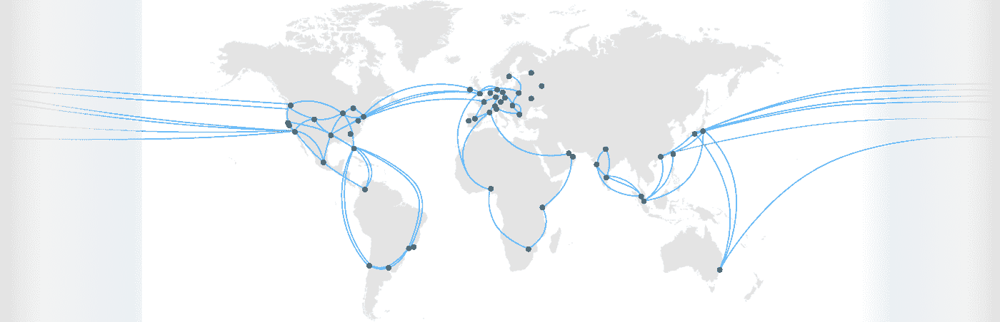
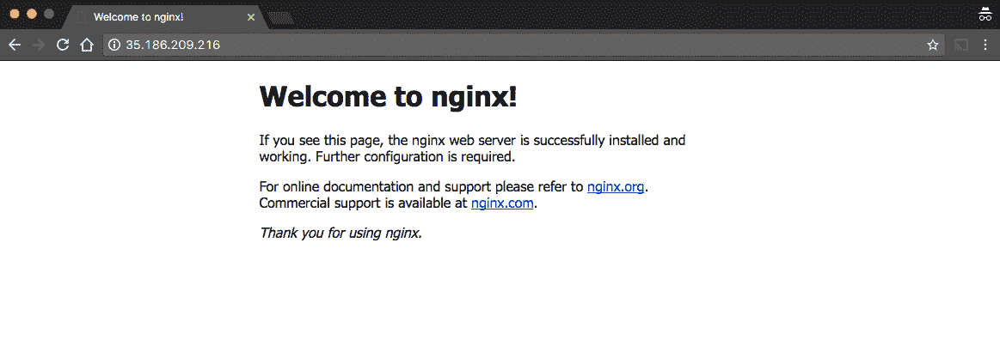

# Kubernetes 和 Google Cloud 上的集群联合和全局负载平衡—第 2 部分

> 原文：<https://medium.com/google-cloud/planet-scale-microservices-with-cluster-federation-and-global-load-balancing-on-kubernetes-and-cd182f981653?source=collection_archive---------0----------------------->

## 警告:在这篇文章中描述的 Kubernetes 联盟将不再被支持。正在开发新的工具来取代它，当这些工具准备好的时候，我会写一篇新的博文。下面的理论上应该还是行得通的，但是我不再推荐了。

我最近在 Google Cloud Next 做了一个关于使用 Kubernetes 在世界各地部署和管理微服务的演讲。

[https://www.youtube.com/watch?v=kmPBm-TQBSE](https://www.youtube.com/watch?v=kmPBm-TQBSE)

我已经在博客中讲述了如何[在 StatefulSet](http://blog.kubernetes.io/2017/01/running-mongodb-on-kubernetes-with-statefulsets.html) 中设置 MongoDB，所以现在我将深入探讨如何设置集群联盟并在全球部署您的服务！

我们将特别关注三个方面，集群联合、联合入口和跨集群服务发现。我将把这些话题分成三篇博文，期待下一篇吧！

我假设你知道在谷歌云中创建项目的基本知识，并且已经安装并设置了[谷歌云 SDK](https://cloud.google.com/sdk/) 。如果没有，请查看我以前的博客帖子。

## [第 1 部分:集群联盟](/google-cloud/planet-scale-microservices-with-cluster-federation-and-global-load-balancing-on-kubernetes-and-a8e7ef5efa5e#.xgjneibyz)

[集群联合](https://cloud.google.com/container-engine/docs/cluster-federation)可以用来管理多个 Kubernetes 集群，就像它们是一个集群一样。这意味着您可以在多个数据中心(和多个云)中创建集群，并使用联合来一次性控制它们！

## 第 2 部分:联合入口

[联邦入口](https://kubernetes.io/docs/tasks/administer-federation/ingress/)超级甜，目前只支持 Google Cloud。这允许您使用单个全局 IP 地址启动单个负载平衡器，它将自动向最近的集群动态发送流量！

## 第 3 部分:跨集群通信

[跨集群服务发现](http://kubernetes.io/docs/user-guide/federation/federated-services/)是一个概念，让一个 Kubernetes 集群中的服务自动发现其他集群中的服务。我们还将看看 [Google Cloud Pub/Sub](https://cloud.google.com/pubsub/) 启用异步微服务！

# 第 2 部分:联合入口

现在您有了一个联合集群，您能用它做什么呢？您可以做的一件很酷的事情是联合入口。让我们更深入地了解它是如何工作的。

谷歌云平台上最强大的组件之一就是网络。这是人们在看云的时候经常忘记的事情。谷歌已经建立了世界上最大的私有网络之一，这让我们可以做一些令人惊奇的事情。

当你在谷歌云上启动一个 [HTTP(S)负载平衡器](https://cloud.google.com/compute/docs/load-balancing/http/)时，你会得到一个单一的 IP 地址。这个 IP 地址是来自全球超过 100 个存在点的 [anycast](https://en.wikipedia.org/wiki/Anycast) ，用户自动连接到最近的一个。然后，它们的流量通过 Google 的私有主干网络发送到最近的托管您的应用程序的数据中心！



这么多台词！

这都是自动的。没有 DNS 欺骗，预热，或任何复杂的参与。只有一个 IP 地址。最棒的是，Federated Ingress 允许 Kubernetes 利用这一点，而无需执行任何手动设置！

***注意:如果你还没有完成***[***Part 1***](/google-cloud/planet-scale-microservices-with-cluster-federation-and-global-load-balancing-on-kubernetes-and-a8e7ef5efa5e)***，请先完成。否则，确保你知道你在做什么！***

# 步骤 1:创建全局 IP 地址

第一步是为我们的入口创建一个全局静态 IP 地址。

```
gcloud compute addresses create k-ingress --global
```

这将创建一个新的全局 IP 地址，称为“k-ingress”

# 步骤 2:创建联合部署和服务

在创建入口之前，您需要创建一个部署和服务来支持它。

让我们创建一个简单的 Nginx 部署，并将其扩展到 4 个副本:

```
kubectl --context=kfed create deployment nginx --image=nginx && \
  kubectl --context=kfed scale deployment nginx --replicas=4
```

这个命令将在联邦上下文中创建一个包含 4 个 nginx 副本的部署。因为我们有两个集群，每个集群将获得 2 个副本！联合控制平面会自动在集群中平均分配 pod。

现在创建一个服务来公开这个部署:

```
kubectl --context=kfed create service nodeport nginx \
  --tcp=80:80 --node-port=30036
```

在 YAML 表单中，服务定义如下所示:

```
apiVersion: v1
kind: Service
metadata:
  name: nginx
spec:
  ports:
    - port: 80
      targetPort: 80
      protocol: TCP
      nodePort: 30036
  selector:
    app: nginx
  type: NodePort
```

这将创建一个服务，通过节点端口公开我们的 nginx 部署。

您可能习惯于使用负载平衡器来公开服务，但这将在每个数据中心创建一个具有自己的 IP 地址的负载平衡器，这是我们不希望的。

相反，节点端口直接在集群中的所有虚拟机上公开服务(在本例中是在端口 30036 上，但是您可以选择任何有效的端口)。然后，入口负载平衡器会将流量路由到虚拟机上的该端口。

# 步骤 3:创建入口

最后一步是创建入口负载平衡器！

**可选:**我建议创建一个防火墙规则，允许您将流量从负载平衡器发送到虚拟机。虽然这不是绝对必要的，因为 Kubernetes 将创建自己的规则，它可以帮助防止防火墙规则的问题。运行以下命令创建规则:

```
gcloud compute firewall-rules create \
  federated-ingress-firewall-rule \
  --source-ranges 130.211.0.0/22 \
  --allow tcp:30036 --network default
```

将以下内容保存到一个名为 **ingress.yaml** 的文件中

```
apiVersion: extensions/v1beta1
kind: Ingress
metadata:
  name: nginx
  annotations:
    kubernetes.io/ingress.global-static-ip-name: “k-ingress”
spec:
  backend:
    serviceName: nginx
    servicePort: 80
```

并创建入口对象:

```
kubectl --context=kfed create -f ingress.yaml
```

元数据中的注释确保使用您之前创建的静态 IP 地址创建负载平衡器，并确保只创建一个全局负载平衡器。其余的看起来像一个标准的入口 YAML。我们希望来自所有路径的流量在端口 80 上到达 nginx 服务。你可以定制它并使用【ingress 提供的所有普通特性，比如路由、会话关联等，但是现在它是联邦的！

如果你想要 HTTPs 支持，我强烈推荐使用 [kube-lego](https://github.com/jetstack/kube-lego) ，它会自动将 [Let's Encrypt](https://letsencrypt.org/) 证书添加到你的入口负载平衡器。

入口负载平衡器将需要几分钟时间来启动，并确保所有后端运行状况检查都已启动和运行，并且防火墙规则已创建。

# 第四步:尝试一下！

如果您访问 Google Cloud 控制台中的[负载平衡器部分](https://console.cloud.google.com/networking/loadbalancing/loadBalancers/list)，您应该会看到一个为您创建的 HTTP(s)负载平衡器。这里我扩展了负载平衡器的细节:


您可以看到有两个实例组支持这个负载平衡器，一个在美国东部，一个在美国西部。这是两个 Kubernetes 星团。您还可以看到，每个集群中的三个虚拟机都很健康，这意味着负载平衡器已经启动并正在运行！

要获取服务的 IP 地址，请运行:

kubectl — context=kfed get ingress


当你访问 IP 地址的时候，你应该从 Nginx 上看到 hello world！



根据您所在的位置，您的流量将从离您最近的数据中心路由。你可以在我在 YouTube 上的演示中看到这个[的例子。](https://youtu.be/kmPBm-TQBSE?t=1975)

# 结论:

虽然我们在本演示中只使用了两个集群，但是入口负载平衡器可以轻松扩展到更多集群。您可以在每个 Google 云数据中心创建巨大的集群，单个入口负载平衡器可以自动在所有这些集群之间分配您的 HTTP(s)流量。两个联合集群或 20 个，所有步骤都是一样的！

当然，Federated Ingress 使用的 anycast magic 需要你在 Google 云平台上运行你所有的集群。目前，还不支持其他环境。如果你运行的是混合云，确保你的网络前端由入口负载均衡器支持，都运行在谷歌云平台上。

在第 3 部分中，我将向您展示如何使用跨集群服务发现来访问本地集群中不存在的服务，这对这些混合部署来说是完美的！