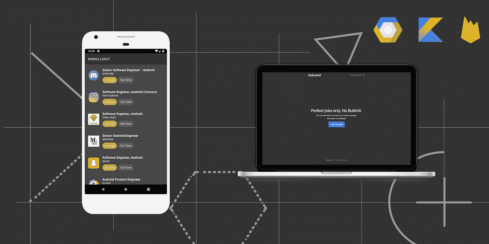
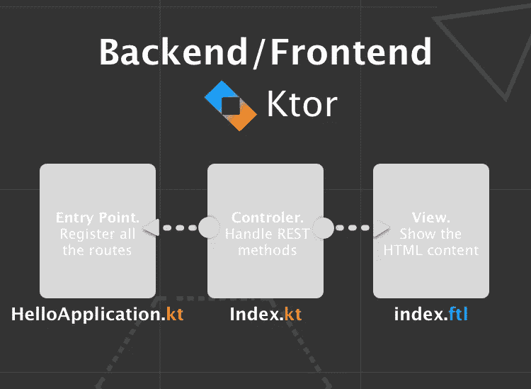
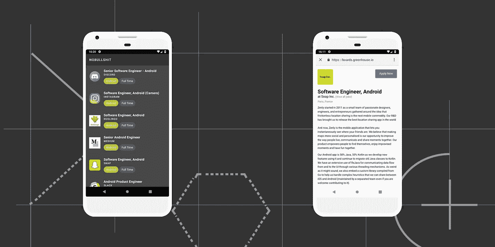

# 玩弄科特林:“你其实什么都知道无名氏！”

> 原文：<https://medium.com/google-cloud/playing-with-kotlin-you-know-everything-john-doe-8275a6e98a96?source=collection_archive---------1----------------------->

## 如何完全用 Kotlin 构建一个完整的项目？(后端/前端+应用程序)

在一份长期的 android 自由职业合同后，因为我有一些空闲时间，我决定投身于一个完全用 Kotlin 编写的完整项目，只是想知道**我能用这种优秀的语言走多远。**

为了具体化这个完整的项目，我选择创建一个平台，**帮助开发人员找到完美的工作**，由其他专业开发人员选择和批准。

因为我目前正在寻找一个偏远的位置，这个想法似乎很合适…😅

我叫它: [**NoBullshit**](https://nobullshit.appspot.com/) 。而且现在是[开源](https://github.com/PhilippeBoisney/NoBullshit)👻

# 设计架构

> 简单是效率的灵魂— *奥斯汀·弗里曼*

NoBullshit.io 的架构

因为这个项目倾向于 Kotlin 展示，我希望第一个版本非常简单:

*   [**后端/前端:**](https://www.nobullshit.io) *显示*网站，允许任何用户*提交工作*。目前，与其说它是后端，不如说它是前端(实际上我们可以认为 Firebase 是这里的主要后端)。然而，特别是因为这是部署在 [GCP](https://cloud.google.com/) 上，这可以很容易地演变成一个合适的后端。
*   [**安卓 app:**](https://play.google.com/store/apps/details?id=io.nobullshit.nobullshit) *列出专家开发者认可的作业*，通过 web 视图展示每一个。

# 实现后端🌏

我习惯于使用谷歌应用引擎，它允许你在一个完全托管的无服务器平台上构建和部署高度可扩展的应用。就像 AWS，不过是 Google 做的**。**

最近，GAE 宣布[支持科特林](https://cloud.google.com/community/tutorials/kotlin-ktor-app-engine-java8)和[科特](https://ktor.io/)！所以我选择了这个方案来部署 NoBullshit 的后端/前端。

令人惊讶的是，Ktor 非常容易学习和配置(顺便说一下，[那些样本](https://github.com/ktorio/ktor-samples)给了我很大的帮助❤).你可以在[“后端”模块](https://github.com/PhilippeBoisney/NoBullshit/tree/master/backend)中找到 NoBullshit 服务器的完整代码。

基本上，当您使用 Ktor 创建您的 web 服务器时，您只需要:

*   创建你的服务器的**入口点文件**，它将主要配置它的 ***不同的路径:***

摘自 [HelloApplication.kt](https://github.com/PhilippeBoisney/NoBullshit/blob/master/backend/src/main/kotlin/io/nobullshit/HelloApplication.kt)

*   在一个专用文件中，为每个页面/路径指定如何处理以及要处理哪些 **REST 方法**:

摘自 [Index.kt](https://github.com/PhilippeBoisney/NoBullshit/blob/master/backend/src/main/kotlin/io/nobullshit/route/Index.kt)

*   将相关的 **HTML 内容**添加到一个 [Freemarker](https://freemarker.apache.org/) 文件中。如果你知道 Kotlin 中的[字符串模板](https://kotlinlang.org/docs/reference/basic-types.html#string-templates)，你就不会对 Freemarker 有意见:

摘自 [index.ftl](https://github.com/PhilippeBoisney/NoBullshit/blob/master/backend/src/main/resources/templates/index.ftl)

我还创建了一个**模板文件**，以便**重用**一些 HTML 组件，例如*页眉*或*页脚*。这个特征叫做 [**宏**](https://freemarker.apache.org/docs/dgui_misc_userdefdir.html) 。

摘自 [template.ftl](https://github.com/PhilippeBoisney/NoBullshit/blob/master/backend/src/main/resources/templates/template.ftl)

好了🙂正如您在索引页面示例中看到的，使用 Ktor 的后端代码非常简单****可读**。**

****

> **测试呢？**

**Ktor 提供了一种简单的方法来测试您的服务器，而不需要实际创建一个 web 测试服务器。实际上，您必须使用“ *withTestApplication* 方法来启动一个**测试应用引擎**。然后，你将能够处理一个请求并断言你需要的任何东西。**

**摘自 [ApplicationTest.kt](https://github.com/PhilippeBoisney/NoBullshit/blob/master/backend/test/ApplicationTest.kt)**

**我还使用[mock](https://mockk.io/)来模拟并阻止测试期间与真实 Firestore 数据库的连接。**

****

**后端/前端:“发布新工作”功能。**

# **实施 Android 应用程序📱**

**作为一名 Android 工程师，这部分真的很简单…😅正如您在存储库中的[模块“Android”](https://github.com/PhilippeBoisney/NoBullshit/tree/master/android)中看到的，该应用程序使用:**

*   **[Dagger2](https://google.github.io/dagger/android.html) 用于依赖注入。在未来的版本中，我想我会给[Koin](https://insert-koin.io/)(Ktor 和 Android BTW)一个机会，特别是因为它看起来很容易使用 DSL 实现(也因为它是法语…🥖🥐🇫🇷).**
*   **FirebaseUI 用 Firestore 更好更方便地处理分页。**

**现在，这个应用程序非常简单，你可能已经看到了。也许我最近通过 [Google samples](https://github.com/googlesamples/android-architecture-components) 发现的唯一新的东西(至少对我来说)是定义一个类为“ **open”的能力，只用于测试带有注释的**。**

**摘自 [OpenForTesting.kt](https://github.com/PhilippeBoisney/NoBullshit/blob/master/android/app/src/debug/java/io/nobullshit/nobullshit/testing/OpenForTesting.kt) (调试)**

**多亏了 [Kotlin 编译器](https://kotlinlang.org/docs/reference/compiler-plugins.html)与[构建类型](https://developer.android.com/studio/build/build-variants#build-types)的结合，这种令人印象深刻的行为才成为可能。**

**摘自 [build.gradle](https://github.com/PhilippeBoisney/NoBullshit/blob/master/android/app/build.gradle)**

**例如，[这个类](https://github.com/PhilippeBoisney/NoBullshit/blob/master/android/app/src/main/java/io/nobullshit/nobullshit/db/dao/JobDao.kt) (JobDao)用我创建的 [*OpenForTesting*](https://github.com/PhilippeBoisney/NoBullshit/blob/master/android/app/src/debug/java/io/nobullshit/nobullshit/testing/OpenForTesting.kt) 注释进行了注释(它继承了 *OpenClass* 注释)，允许我在 my[instrumented tests](https://github.com/PhilippeBoisney/NoBullshit/blob/master/android/app/src/androidTest/java/io/nobullshit/nobullshit/ui/joblist/TIJobList.kt)中的**创建一个从 JobDao 继承**的**匿名类，并且**用一些 mock 修改它的行为**:****

**节选自 [TIJobList.kt](https://github.com/PhilippeBoisney/NoBullshit/blob/master/android/app/src/androidTest/java/io/nobullshit/nobullshit/ui/joblist/TIJobList.kt)**

**不要忘记为[创建与**几乎相同的注释，发布版本构建**](https://github.com/PhilippeBoisney/NoBullshit/blob/master/android/app/src/release/java/io/nobullshit/nobullshit/testing/OpenForTesting.kt)，**当然没有从 *OpenClass* 注释继承**🙂**

**摘自 [OpenForTesting.kt](https://github.com/PhilippeBoisney/NoBullshit/blob/master/android/app/src/release/java/io/nobullshit/nobullshit/testing/OpenForTesting.kt) (发布)**

**最后，关于这款 android 应用，我最后想和大家分享的是[mock](https://mockk.io/)的用法。这个 DSL 风格的模仿库使用起来非常简单，并且允许我模仿一个完整的 Firestore 响应。这么有用！**

**摘自 [MockUtils.kt](https://github.com/PhilippeBoisney/NoBullshit/blob/master/android/app/src/androidTest/java/io/nobullshit/nobullshit/util/MockUtils.kt)**

**此外，它的一个我非常喜欢的特性是“[轻松模拟](https://mockk.io/#relaxed-mock)”:这允许**跳过指定每个案例的行为**，同时仍然允许存根你需要的东西…👌**

****

**Android 应用程序:“列出并可视化工作”功能**

# **下一步是什么？**

**NoBullshit 的第一个版本旨在与 Kotlin 和**一起探索这种奇妙语言的可能性**，尤其是对于后端**。****

****FWI，我只花了 **5 天**就完成了这个项目(包括测试)，感谢所有的资源和现有的样本。仔细想想，这非常快，主要是因为**成熟的**和**庞大的**科特林生态系统。****

****这个项目是开源的，所以请随意贡献和推送一些新鲜的功能，或者帮我指出一些错误或最佳实践！****

****干杯👋****

**** [## 菲利普·博伊斯尼/诺布尔什特

### 一个完全用 Kotlin 编写的示例项目。后端与 Ktor 和 Android 应用程序。-菲利普·博伊斯尼/诺布尔什特

github.com](https://github.com/PhilippeBoisney/NoBullshit)****