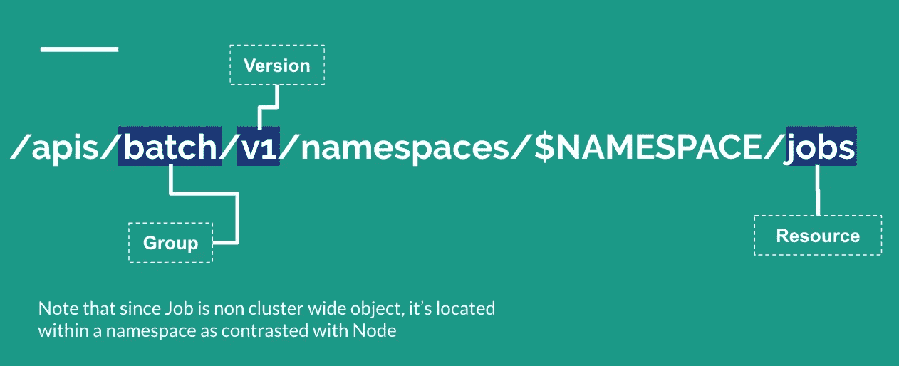

# 使用 Python Kubernetes API:在由 Google Kubernetes 引擎中的 Pod 生成的作业中运行任务

> 原文：<https://medium.com/google-cloud/playing-with-python-kubernetes-api-running-tasks-in-jobs-generated-by-a-pod-in-google-kubernetes-b5048696dfa8?source=collection_archive---------1----------------------->

在某些用例中，您可以使用一个作业进行一次性查询，然后为了优化应用程序而保存在一些缓存中。
当我试图利用 Kubernetes API 来执行这个任务时，我就是这么想的。

> 那么为什么是 Python 呢？因为我的这个项目与分析有关，如果我使用 Python 实际上更合适，因为它已经为我提供了许多统计库，如 Pandas 和 Scipy，并且它还为我可能需要能够与其他组件交互的其他库建立了库。

在直接进入主题之前，我想简单解释一下 Kubernetes API 服务器、Kubernetes 认证方法、Kubernetes 授权和 Kubernetes 客户端。

**介绍 API 服务器**

> 中央管理实体和唯一可以直接访问 etcd 的组件，作为 HTTP 上的 RESTful API 实现，所有其他组件通过它进行交互…

Kubernetes API 基本上是一个 HTTP API，JSON 是它的主要序列化模式。它还支持协议缓冲区(主要用于集群内部通信)。出于可扩展性的原因，Kubernetes 支持不同 API 路径下的多个 API 版本。现在看看 HTTP API 空间是如何构造的。在顶层，我们区分核心组(`/api/v1`)、命名组(`/apis/$NAME/$VERSION`)和全系统实体(如`/metrics`)。注意版本可以是`v1alpha1`(默认禁用)、`v2beta3`(默认启用)和`v1`。

一般来说，Kubernetes API 支持通过标准的 HTTP 动词`POST`、`PUT`、`DELETE`和`GET`在给定路径上进行创建、更新、删除和检索操作，并将 JSON 作为默认负载。

API 组、版本和资源(GVR)唯一地定义了 HTTP 路径:



作业 HTTP 路径的外观。

首先，当 HTTP 请求命中 Kubernetes API 时，首先应用的是请求将由在`DefaultBuildHandlerChain()` ( [config.go](https://github.com/kubernetes/apiserver/blob/master/pkg/server/config.go) )中注册的过滤器链处理。这期间会发生什么？在高层次上，过滤器或者传递相应的信息并将其附加到`ctx.RequestInfo`，比如经过身份验证的用户，或者返回适当的 HTTP 响应代码。现在我们将试着更深入地看看`DefaultBuildHandlerChain()`内部设置的过滤器:

*   `WithRequestInfo()`如 [requestinfo.go 中所定义](https://github.com/kubernetes/apiserver/blob/master/pkg/endpoints/filters/requestinfo.go)将一个`[RequestInfo](https://github.com/kubernetes/apiserver/blob/585f7eed30ae80d4b946d4b7c849dd47febdc498/pkg/endpoints/request/requestinfo.go#L117)`附加到上下文中
*   `WithMaxInFlightLimit()`如[中所定义，maxinflight.go](https://github.com/kubernetes/apiserver/blob/master/pkg/server/filters/maxinflight.go) 限制飞行中请求的数量
*   `WithTimeoutForNonLongRunningRequests()`如 [timeout.go](https://github.com/kubernetes/apiserver/blob/master/pkg/server/filters/timeout.go) 中所定义，与大多数`GET`、`PUT`、`POST`、`DELETE`请求一样，非长时间运行的请求超时，这与长时间运行的请求(如观察器和代理请求)相反
*   `WithPanicRecovery()`如 [wrap.go 中所定义](https://github.com/kubernetes/apiserver/blob/master/pkg/server/filters/wrap.go)包装一个处理程序来恢复和记录死机
*   [中定义的`WithCORS()`cors . go](https://github.com/kubernetes/apiserver/blob/master/pkg/server/filters/cors.go)提供了一个 CORS 实现；CORS 代表跨源资源共享，它是一种机制，允许嵌入在 HTML 页面中的 JavaScript 向不同于 JavaScript 起源的域发出 XMLHttpRequests。
*   `WithAuthentication()`如[中所定义的，authentication.go](https://github.com/kubernetes/apiserver/blob/master/pkg/endpoints/filters/authentication.go) 尝试将给定请求认证为用户，并将用户信息存储在提供的上下文中。成功时，从请求中删除`Authorization` HTTP 头。
*   `WithAudit()`如 [audit.go](https://github.com/kubernetes/apiserver/blob/master/pkg/endpoints/filters/audit.go) 中所定义，用所有传入请求的审计日志信息来修饰处理程序。审计日志条目包含诸如请求的源 IP、调用操作的用户和请求的名称空间等信息。
*   `WithImpersonation()`如 [impersonation.go 中定义的那样](https://github.com/kubernetes/apiserver/blob/master/pkg/endpoints/filters/impersonation.go)通过检查试图改变用户的请求来处理用户模拟(类似于 sudo)。
*   `WithAuthorization()`在 [authorization.go](https://github.com/kubernetes/apiserver/blob/master/pkg/endpoints/filters/authorization.go) 中定义，将所有授权的请求传递给多路复用器，多路复用器将请求发送给正确的处理器，否则返回禁止错误。

**Kubernetes 认证**

在 Kubernetes 中，我们有两种用户定义:

*   由 Kubernetes 管理的服务帐户，通常由 Kubernetes API 管理，绑定到特定的名称空间，由 API 服务器自动创建或通过 API 调用手动创建(其凭证保存为安装到 pods 的`Secrets`,从而允许集群内进程与 Kubernetes API 对话)；
*   普通用户，通常由外部独立服务管理。

Kubernetes 使用客户端证书、不记名令牌、认证代理或 HTTP basic auth 来通过认证插件认证 API 请求。当向 API 服务器发出 HTTP 请求时，插件试图将以下属性与在`[AuhenticateRequest(req *http.Request)](https://github.com/kubernetes/apiserver/blob/585f7eed30ae80d4b946d4b7c849dd47febdc498/pkg/authentication/group/authenticated_group_adder.go#L39)`中定义的请求相关联。更多信息可以在[认证](https://kubernetes.io/docs/reference/access-authn-authz/authentication/)中阅读。我们的一个认证策略是使用 X509 客户端证书。这也是理解 GKE 认证过程的前提。

GKE 有自己的控制平面。在 GKE 集群中，控制平面组件运行在 Google 拥有的 GCE 实例上，在一个单独的 Google 管理的项目中。每个实例只为一个客户运行这些组件。每个集群都有自己的[根认证机构(CA)](https://kubernetes.io/docs/tasks/tls/managing-tls-in-a-cluster) 。内部服务管理此 CA 的根密钥。每个集群也有自己的 etcd CA。etcd CA 的根密钥被分发到运行 Kubernetes API 服务器的虚拟机的元数据中。节点和 Kubernetes API 服务器之间的通信受 TLS 保护。有关更多信息，请参见[集群信任](https://cloud.google.com/kubernetes-engine/docs/concepts/cluster-trust)。

**Kubernetes 授权**

Kubernetes 使用 API 服务器授权 API 请求。它根据所有策略评估所有请求属性，并允许或拒绝请求。API 请求的所有部分都必须被某个策略允许才能继续。这种授权的功能一般在[那里](https://github.com/kubernetes/apiserver/blob/585f7eed30ae80d4b946d4b7c849dd47febdc498/pkg/endpoints/filters/authorization.go#L45)中提到。有几种[授权模式](https://kubernetes.io/docs/reference/access-authn-authz/authorization/)，其中一个例子是 RBAC，或基于角色的认证模式。`kubectl`提供了一种使用`auth can-i`命令验证特定 API 授权层的机制。

**支持的 Kubernetes 客户端**

有许多由官方支持或由社区维护的受支持客户端，列表可以在[那里](https://kubernetes.io/docs/reference/using-api/client-libraries/)看到。

客户端库通常会为您处理一些常见的任务，例如身份验证。大多数客户端库可以发现并使用 Kubernetes 服务帐户来验证 API 客户端是否在 Kubernetes 集群中运行，或者可以理解 [kubeconfig 文件](https://kubernetes.io/docs/tasks/access-application-cluster/authenticate-across-clusters-kubeconfig/)格式来读取凭证以及 API 服务器地址。

**使用 Kubernetes Python 客户端**

```
import os
from kubernetes import client, config, utils
from kubernetes.client.rest import ApiExceptionclass Constants(obj):
    NAMESPACE = 'example'class KubernetesApiClient(obj):
    def __init__(self):
        # load 
        try:
            config.load_incluster_config()
        except:
            config.load_kube_config()self.configuration = client.Configuration()def create_batch_api_client(self):
        return client.BatchV1Api(client.ApiClient(self.configuration))def create_job_object(self, job_name, container_image, args):
        volume_name = "" # volume inside of which you put your service account
        google_app_credentials_path = os.environ.get('GOOGLE_APPLICATION_CREDENTIALS')
        volume_mount = client.V1VolumeMount(
            mount_path='/'.join(google_app_credentials_path.split('/')[:-1]),
            name=volume_name
        )env = client.V1EnvVar(
            name='GOOGLE_APPLICATION_CREDENTIALS',
            value=google_app_credentials_path
        )container = client.V1Container(
            name=job_name,
            image=container_image,
            args=args,
            volume_mounts=[volume_mount],
            env=[env],
            image_pull_policy="Always")volume = client.V1Volume(
            name=volume_name,
            secret=client.V1SecretVolumeSource(secret_name='<secret-where-you-put-the-service-account>')
        )template = client.V1PodTemplateSpec(
            metadata=client.V1ObjectMeta(labels={"app": "sample"}),
            spec=client.V1PodSpec(restart_policy="Never", 
                                  containers=[container],
                                  volumes=[volume]))spec = client.V1JobSpec(
            template=template,
            backoff_limit=3,
            ttl_seconds_after_finished=60)job = client.V1Job(
            api_version="batch/v1",
            kind="Job",
            metadata=client.V1ObjectMeta(name=job_name),
            spec=spec)return job
```

然后你可以调用你的程序:

```
api_client = KubernetesApiClient()job_api_client = api_client.create_batch_api_client()job = api_client.create_job_object(job_name, container_image, args)*try*: 
    api_response = job_api_client.create_namespaced_job(
        namespace=Constants.NAMESPACE,
        body=job)
    *print*(str(api_response.status))
*except* ApiException *as* e:
    *print*(e) # Handle the exception.
```

在将该应用程序部署到集群中之前，请确保您使用的服务帐户已经能够访问您将在其中部署 Kubernetes 作业的名称空间，尤其是在您使用 RBAC 的情况下。

> 我们希望你能派上用场。👋