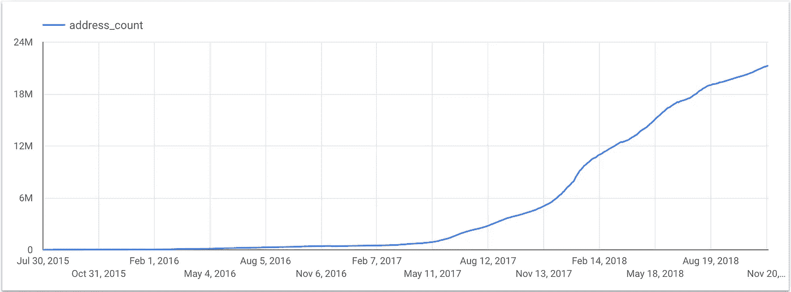
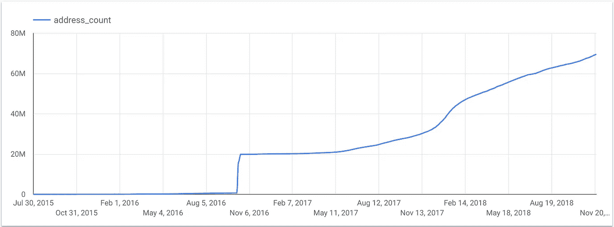

# 在 BigQuery 中绘制以太坊地址增长图

> 原文：<https://medium.com/google-cloud/plotting-ethereum-address-growth-chart-55cc0e7207b2?source=collection_archive---------0----------------------->

在我以前的文章中，我包括了一个[挑战](/google-cloud/how-to-query-balances-for-all-ethereum-addresses-in-bigquery-fb594e4034a7)，用于绘制一段时间内非零余额以太坊地址的数量。给擒抱它的家伙们的道具: [1](/@GuthL/about-the-count-of-not-empty-wallets-i-only-managed-to-get-this-far-aka-return-all-wallets-changes-336d4d14abe4) ， [2](https://gitter.im/ethereum-etl/Lobby?at=5bf80607f59704348eefe75a) 。

以下是我的解决方案:

[在 BigQuery 中运行它](https://bigquery.cloud.google.com/savedquery/869804627112:504b1f1f70fe4a40b88bc896d879f698)

最具挑战性的部分是填补一些地址没有乙醚转移的日期空白。例如，如果 11 月 1 日有 1 笔借项，11 月 3 日有 1 笔借项，按日期分组并累计求和将得到:

*   11 月 1 日:1 乙醚
*   11 月 3 日:2 日以太

相反，我们希望:

*   11 月 1 日:1 乙醚
*   11 月 2 日:1 以太
*   11 月 3 日:2 日以太

上面的解决方案利用解析函数`lead`来获得间隔之后的下一个日期；然后用`calendar`表的 join 来填补空白。

## 包括余额为零的地址

如果你在查询中去掉`where balance > 0`条件，你会得到如下图形:

如果你知道 2016 年 10 月中旬零余额地址高峰的原因，请在评论中告诉我(正如 [Thomas Jay Rush](https://medium.com/u/b9038003bde4?source=post_page-----55cc0e7207b2--------------------------------) 在评论中指出的，高峰是由 [DDos 攻击](/@tjayrush/defeating-the-ethereum-ddos-attacks-d3d773a9a063)引起的)。

如果有人能在 Kaggle 上写一个包含上述查询和图表的内核，我将不胜感激:[https://www.kaggle.com/bigquery/ethereum-blockchain](https://www.kaggle.com/bigquery/ethereum-blockchain)。

## 挑战

试通过绘制[洛伦兹曲线](https://en.wikipedia.org/wiki/Lorenz_curve)演示乙醚的[帕累托分布](https://en.wikipedia.org/wiki/Pareto_distribution)。

另请参阅:

*   [如何查询所有以太坊地址的余额](/google-cloud/how-to-query-balances-for-all-ethereum-addresses-in-bigquery-fb594e4034a7)
*   [如何在 BigQuery 中查询乙醚供应](/google-cloud/how-to-query-ether-supply-in-bigquery-90f8ae795a8)
*   [big query 中的以太坊:我们如何构建这个数据集](https://cloud.google.com/blog/products/data-analytics/ethereum-bigquery-how-we-built-dataset)
*   [实时以太坊免费通知大家](/google-cloud/real-time-ethereum-notifications-for-everyone-for-free-a76e72e45026)
*   在推特上关注我们:【https://twitter.com/EthereumETL 