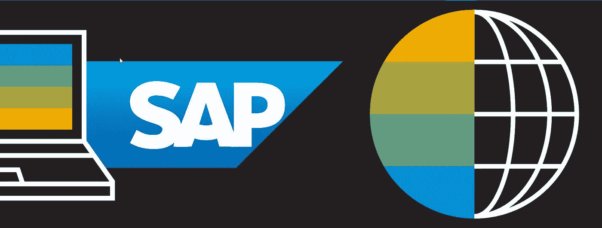
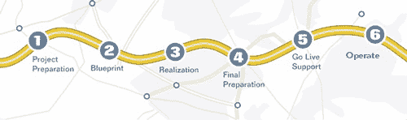
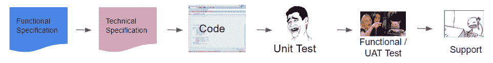
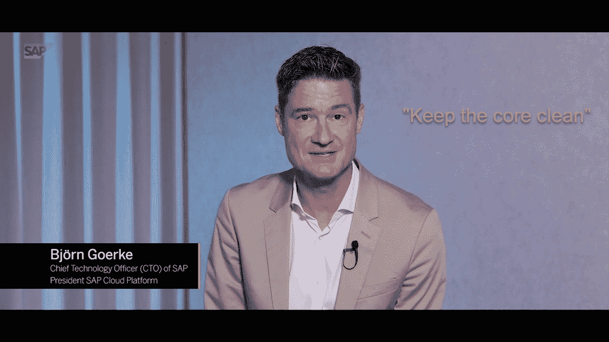
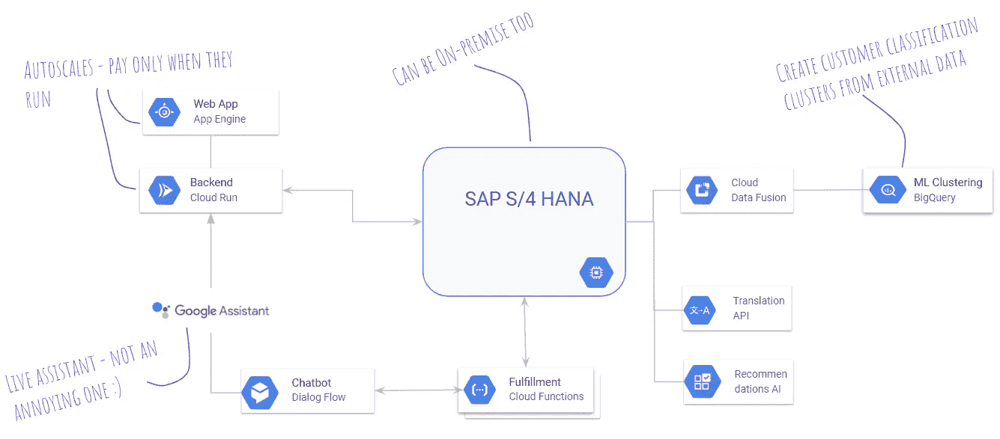

# SAP、谷歌云和开发人员

> 原文：<https://medium.com/google-cloud/podcast-sap-google-cloud-and-developers-79fd983e2c9a?source=collection_archive---------2----------------------->

与聪明的人类交流关于技术的想法总是很有趣。在一个关于 SAP 和谷歌云的播客中，我有一个不可思议的机会与开发者倡导者布莱恩·多尔西、T2、马克·米尔钱达尼和 T4·汤玛斯·荣格一起做这件事。

如果你是 SAP 顾问或开发人员，这个播客是为你准备的。如果你以前从未听说过 SAP，但是是一家运行 SAP 的公司的开发人员(即使在谷歌云之外)，这个播客也适合你——这就是我们的包容性！

点击收听播客[或继续阅读，了解关于 SAP 云计算之旅的一些想法。](https://gcppodcast.com/post/episode-215-sap-with-thomas-jung-and-lucia-subatin/)

# SAP 云计算之旅

SAP 世界对于云计算来说并不陌生，SAP 已经为开源技术做出了巨大的贡献。但是，SAP 生态系统中仍有许多人没有机会开始这一旅程……(还没有！)

Brian 在我们的播客中提出的一个问题是，在帮助传统 SAP 实践进入云环境时，哪些可行，哪些不可行(这是我的工作！).

TL:DR:最大的挑战不是技术上的。如果 SAP 开发人员可以将业务流程翻译成以德语缩写命名的表和字段，他们肯定可以学习云原生技术概念。

以我的经验来看，这是可行的和不可行的。

# 什么不起作用

最大的痛苦来自于思维方式的改变(或者思维方式的缺失)。

对于上下文，大多数 SAP 实践者习惯于本质上是长瀑布项目的迁移和实现项目。阶段法则，依赖是女王，不遵循它们会导致混乱。

良好的 ol’ASAP 方法—来源: [SAP 社区档案](https://archive.sap.com/documents/docs/DOC-8032)

定制对象的开发生命周期旨在保护业务不受干扰。当在生产性 SAP 环境中应用变更时，某些严重错误的影响会导致对组织的严重损害。

糟糕的测试、不足的数据、缺失的依赖:这些可能会使工厂停工，妨碍人们拿到工资，使卡车停在仓库里，并花费大量的金钱。

可以理解的是，人们坚持已知的良好实践来保持这些高度耦合的整体稳定运行。

ABAP 弗里克对象的生命周期示例。来源:*我实施 SAP 十几年的记忆*。

成熟的工具和方法在这里不应该受到指责。当有人试图将敏捷应用于瀑布模式或将 scrum 板应用于 ITIL 时，问题就来了。

当组织还没有在新流程、新工具以及最重要的新文化中获得足够的力量时，就会发生这种情况。因此，他们停留在顺序框架和迭代框架之间的项目执行中间状态。混乱的另一个原因。

**这里有一个注意事项**:有时混乱是由于正在进行的学习造成的。接受失败作为学习过程的一部分是好的，只要影响是可控的。

**这里的另一个注意事项**:SAP 堆栈的迁移项目很难挑战成熟的方法。风险和影响太高，迁移工作会冲淡学习过程。

# 什么管用

听取 SAP 的建议是有效的:保持核心清洁，或者，正如我所说的，不要管整块石头。客户修改 SAP 系统越多，他们获得的技术债务就越多，这将阻碍他们升级和整合创新的能力。

好消息是 SAP 软件已经为此做好了准备。看看 ABAP Restful 编程模型或 SAP Cloud SDK，从原则上看，它们是非常云原生的:以一种清晰的方式公开你的业务逻辑，而不知道什么会消耗它们。

来源:[保持核心清洁:来自比约恩·戈尔克的更新](https://www.youtube.com/watch?v=CYcJvL7qgqM)

不管使用什么(许可的)方法，“保持核心干净”翻译过来就是让 SAP 系统公开业务逻辑，并从对扩展功能更有意义的平台上使用它们。

如果您甚至不接触运行您的业务流程的系统，您就不需要担心影响它们的风险。

如果这些对 SAP 标准功能的扩展很小，并且相互之间没有耦合(比如微服务)，你甚至可以选择不同的平台和语言来部署它们。您还可以更频繁地提交更改，以增加功能并更频繁地纳入用户反馈。

看到我做了什么吗？我刚刚总结了一些云原生开发原则。

确保从小处着手，承担小风险，让团队在处理更大的项目之前适应新的协作方式。拥有一个安全的犯错空间可以培养创造力。

# 让这更真实

举一个客户通过网站发起购买的例子。SAP 系统保存了客户的主数据、购买历史、产品可用性等。

该网站托管在 App Engine 上，Cloud Run 部署了具有不同后端模块的容器。这些模块中至少有一个调用 SAP S/4HANA 公开的 REST APIs 来访问和创建主数据和事务。

使用无服务器、托管容器和 BigQuery 扩展 SAP S/4HANA 系统

在后台，SAP S/4HANA 启动对不同 API 的调用，包括访问 BigQuery 等数据仓库的 API，例如，翻译客户的评论或根据他们的购买历史向他们提供产品推荐。

这种方法的一些额外好处:

*   由于云运行和 App Engine 自动扩展，无需预先静态增加容量
*   你可以选择不同的编程语言，这欢迎更多的人加入这个派对
*   这些是开放的平台和标准，可以与其他云产品组合和交换，如 SAP 云平台中的产品
*   稍后的提示:您的托管容器也可以在内部运行

# 免费试用 SAP HANA

如果您想获得一些关于云原生开发和 SAP 的实践经验，现在可以使用这个 [Qwiklab](https://google.qwiklabs.com/catalog_lab/2583) 。

同时，你可以学习如何在谷歌云平台中部署 [SAP HANA，express edition。您可能有资格获得初始免费试用积分。](https://console.cloud.google.com/marketplace/details/sap-public/sap-hanaexpress-serverinclapps)

在 [SAP 开发者中心](http://developers.sap.com)也有一些很棒的免费教程。

保持核心(还有你的手！)干净，

露西娅·苏巴丁。