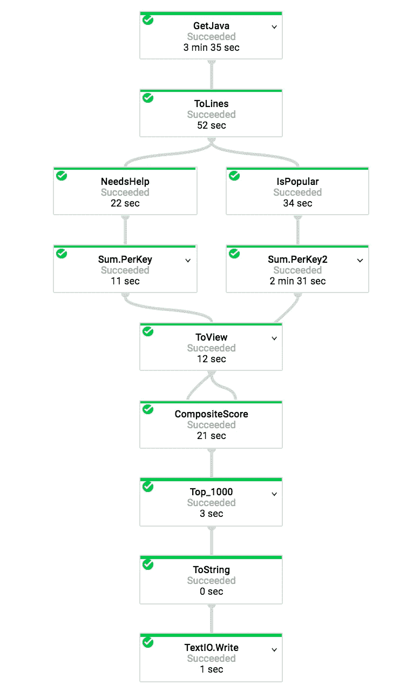

# GitHub 上流行的 Java 项目可能需要一些帮助(使用 BigQuery 和 Dataflow 进行分析)

> 原文：<https://medium.com/google-cloud/popular-java-projects-on-github-that-could-use-some-help-analyzed-using-bigquery-and-dataflow-dbd5753827f4?source=collection_archive---------2----------------------->

许多 Java 程序员想为开源项目做贡献，但是不知道从哪里开始。GitHub 上有这么多项目。哪些是真正需要你帮助的？理想情况下，您希望从可能被接受的小型本地化提交开始。

许多 Java 程序员在他们的代码中添加像 FIXME 和 TODO 这样的标记注释。如果我们在代码中寻找这些标签，那么我们将会非常清楚哪些项目需要帮助。

当然，很多项目都需要帮助，但是也许你愿意花时间在一个被广泛采用的项目上。您可以通过查看该项目中的类被导入到其他项目中的频率来发现哪些项目被经常使用。

谷歌最近[宣布](https://cloudplatform.googleblog.com/2016/06/GitHub-on-BigQuery-analyze-all-the-open-source-code.html)所有 GitHub 代码(超过 280 万个开源 GitHub 库和超过 20 亿个文件)都可以在 BigQuery 中进行分析，并公布了几个 SQL 语句的例子来分析数据。但是 SQL 有其固有的局限性——你不能在其中做编程性的事情，你添加到 SQL 中的用户定义函数和正则表达式越多，就越难理解发生了什么。

data flow(Apache Beam API 的一个实现)允许您用 Java 或 Python 编写简单、直接的数据管道。非常有用的是，Dataflow 将允许您从 BigQuery 查询开始构建管道，然后编写 Java 代码来逐步处理数据。

我的管道([完整代码在这里](https://github.com/GoogleCloudPlatform/training-data-analyst/blob/master/courses/data_analysis/lab2/javahelp/src/main/java/com/google/cloud/training/dataanalyst/javahelp/JavaProjectsThatNeedHelp.java))从一个简单的查询开始:

> string Java query = " SELECT content FROM[FH-big query:github _ extracts . contents _ Java _ 2016]"；

然后经历这些步骤:

数据流管道。管道[的代码在 Github 上。](https://github.com/GoogleCloudPlatform/training-data-analyst/blob/javahelp/javahelp/javahelp/src/main/java/com/google/cloud/training/dataanalyst/javahelp/JavaProjectsThatNeedHelp.java)

使用 BigQuery 查询获得 Java 内容后，我将内容字段分成几行，然后用这些行做两件事:

1.  弄清楚哪些包裹有求助电话。为此，我必须首先弄清楚 Java 文件属于哪些包。一个简单的方法是在 Java 文件的顶部寻找 package 语句。如果一个类在 com.google.training . data-analyst . flights 中，我会将它与完整的包名关联起来，还会与 com.google . training . data-analyst、com . Google . training、com . Google 和 com 关联起来。然后，我计算 FIXME 或 TODO 在文件中出现的次数——这将被添加到该文件所属的包的求助次数中。
2.  找出这个文件使用了哪些包。这是非常相似的，除了我寻找 import 语句并维护每个包的总使用量。

然后我得到一个包的受欢迎程度和需要多少帮助的综合分数，作为 log(numUses)*log(numHelpNeeded)。由该综合得分衡量的前 1000 个包被写入输出文件。使用对数的原因是因为这两者都受到显著的长尾效应的影响，而 log()用于调整这些值。

那么，GitHub 上哪些流行的 Java 项目需要您的帮助呢？抛开 com、uk、fi 这样的顶级域名和 org.apache、com.google 这样的大型组织(可能有多个项目)，我最后得出:

*   org.eclipse
*   org.sakaiproject
*   org.elasticsearch
*   intellij
*   org.onosproject
*   com.google.devtools.build
*   org.chromium
*   org.alfresco
*   org . project 泛光灯. openflow

在 Google 云平台上运行数据流管道的代码是这里的(将输出桶名称改为您有写权限的名称)。

编码快乐！

 [## GitHub 中的所有开源代码现在都在 BigQuery 内共享:分析所有代码！

### GitHub 中的所有开源代码现在都可以在 BigQuery 中获得。

medium.com](/@hoffa/github-on-bigquery-analyze-all-the-code-b3576fd2b150)