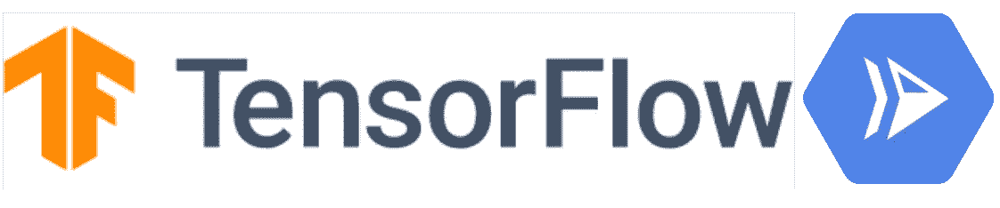

# 张量流和云运行预测

> 原文：<https://medium.com/google-cloud/portable-prediction-with-tensorflow-and-cloud-run-669c1c73ebd1?source=collection_archive---------0----------------------->



AI-Platform 是谷歌云平台(GCP) **服务，为 ML 管道**提供工具和无服务器计算。由于有了 [**Kubeflow**](https://github.com/kubeflow/kubeflow) **项目**，你可以在 GCP**以完全无服务器方式**共享、构建、培训和服务模型，或者在你的 Kubernetes 集群上的任何地方。你只需要专注于你的业务、你的模型和你的数据处理/转换。

机器学习管道有内部和外部两部分。在内部，您的数据科学家可以利用 GPU、TPU 和更多功能共享、构建和训练/超调模型。**为这一内部流程使用单一平台效率更高，AI-Platform 在这方面非常出色。**

ML 管道的外部/可见部分是面向最终用户的:预测服务部分。 **AI-Platform 在 GCP 部署模型**也非常方便:简单、快速、无服务器、“按需付费”。听起来很完美…

但趋势是*多云、*混合*部署*或*非厂商锁定*，大多数时候，用 ***容器。***

有什么挑战？

> 我想利用容器的可移植性，以及像人工智能平台一样的无服务器预测服务。

问题是人工智能平台是谷歌特有的，而 kubeflow 不是无服务器的。Kubernetes 上面的 Knative 来了，Kubernetes 提议为开发者提供无服务器的体验。GCP 提出了一个管理实现的 Knative: [**云运行**](https://cloud.google.com/run/) **。**你可以**运行无服务器无状态容器。**

*我只使用了 TensorFlow 1.x 来构建我的模型，我将讲述它。但是，* [*AI-Platform 支持更多的框架*](https://cloud.google.com/deep-learning-vm/)

# 构建符合云运行/知识的容器

从哪里开始？AI-Platform 做的都是，我不知道做了什么，怎么处理的。这是无服务器的神奇之处，但也是最令人困惑的:你不知道真正做了什么！

> 张量流模型是如何服务的？

[TensorFlow Extended (TFX)](https://www.tensorflow.org/tfx) 是 TensorFlow 的一部分，用于构建端到端的 ML 管道。其中一个组件是 [TensorFlowServing](https://www.tensorflow.org/tfx/guide/serving) 。嗯，听起来对我的问题不错。我们再深入一点。

## TensorFlowServing

TensorFlowServing 组件是一个安装在 linux 环境中为 TensorFlow 模型服务的[二进制文件。这个二进制文件在两个不同端口上启动一个带有 gRPC 和 RestAPI 端点的服务器。因此，提供模型和 2 个端口，就这样，您的模型就完成了！远比想象中容易！](https://www.tensorflow.org/tfx/serving/setup)

***在奖金****中还有一个[码头工人形象](https://www.tensorflow.org/tfx/serving/docker)。什么都不用安装，直接运行镜像！完美它将*轻松在云上运行*！！*

*让我们尝试一下并阅读文档。要运行容器，您必须运行以下命令*

```
*docker run -t --rm -p 8501:8501 \
    -v "$TESTDATA/saved_model_half_plus:/models/half_plus_two" \
    -e MODEL_NAME=half_plus_two \
    tensorflow/serving &*
```

***第一个问题:**你必须在容器中装入一个卷和服务它的模型。这打破了[契约](https://cloud.google.com/run/docs/reference/container-contract)的*无状态*部分。*

**没问题，*有了 docker，你就可以用这个 TensorFlowServing docker 图片作为基础图片，并在此基础上构建一些东西。例如，类似这样的事情:*

*   *将模型复制到容器中*
*   *将模型文件夹设置为`MODEL_NAME`变量。*

```
*FROM tensorflow/serving
COPY tf_models /models/tf_models
ENV MODEL_NAME tf_models*
```

**简单的*！您的模型被嵌入到您的容器中，env 变量被定义。并且，从基础映像继承而来的`tensorflow/serving`映像会自动运行该命令*

```
*tensorflow_model_server --port=8500 --rest_api_port=8501 \
  --model_name=${MODEL_NAME} \
  --model_base_path=${MODEL_BASE_PATH}/${MODEL_NAME}*
```

***第二个问题:**服务器不监听 Cloud Run/Knative 的`$PORT`环境变量，不可定制。*

*最后，**不能使用内置的 TensorFlowServing docker 映像和 Cloud Run/Knative:** 契约不被尊重。*

## *构建 TensorFlowServing 自定义图像*

*因此，我们必须自己构建一个符合 Cloud Run/Knative 的 TensorFlow 服务映像。*

*为此，我们必须编写一个`[Dockerfile](https://github.com/guillaumeblaquiere/cloudrun-tensorflow-prediction/blob/master/Dockerfile)`，让我们从一个 Ubuntu Xenial 映像开始*

```
*FROM ubuntu:xenial*
```

*安装 TensorFlowServing*

```
*RUN apt update && \apt-get install -y curl && \echo "deb [http://storage.googleapis.com/tensorflow-serving-apt](http://storage.googleapis.com/tensorflow-serving-apt) stable tensorflow-model-server tensorflow-model-server-universal" | tee /etc/apt/sources.list.d/tensorflow-serving.list && \curl [https://storage.googleapis.com/tensorflow-serving-apt/tensorflow-serving.release.pub.gpg](https://storage.googleapis.com/tensorflow-serving-apt/tensorflow-serving.release.pub.gpg) | apt-key add - && \apt update && \apt-get install tensorflow-model-server*
```

*复制模型以供使用*

```
*COPY exporter /models/tf_models*
```

*用正确的参数运行`tensorflow_model_server`*

```
*CMD tensorflow_model_server --port=8500 --rest_api_port=${PORT} --model_base_path=/models/tf_models --model_name=consumption*
```

*仅此而已。Docker 构建，Docker 运行，成功了。*

> *潜在问题:无法停用 gRPC 端口(这里是 8500，默认值)。如果 Cloud Run/Knative `*$PORT*`值设置为 gRPC 端口值，容器启动将失败*

# *集成人工智能平台训练步骤*

*太好了，集装箱建好了！但是，在人工智能平台上的培训和服务容器之间有一个缺口:*

> *如何检索训练好的模型？*

*事实上，我从来没有提到模型是如何在训练后恢复的。为此，我编写了一个`[cloudbuild.yaml](https://github.com/guillaumeblaquiere/cloudrun-tensorflow-prediction/blob/master/cloudbuild.yaml)`，用于将[云构建器](https://cloud.google.com/cloud-build/)与[现有云构建器](https://github.com/GoogleCloudPlatform/cloud-builders)一起使用。*

*第一步用`gsutil`命令从 Google 云存储中检索模型:这样，模型就可以被复制到容器中了。然后，用`docker`命令构建并推动容器。*

```
*steps:
  - name: 'gcr.io/cloud-builders/gsutil'
    args: [ 'cp', '-r', '${_EXPORT_BUCKET}', '.' ]
  - name: 'gcr.io/cloud-builders/docker'
    args: [ 'build', '-t', 'gcr.io/$PROJECT_ID/predict', '.' ]
  - name: 'gcr.io/cloud-builders/docker'
    args: ['push', 'gcr.io/$PROJECT_ID/predict']
images:
  - 'gcr.io/$PROJECT_ID/predict'
substitutions:
  _EXPORT_BUCKET: gs://my-bucket/path/to/export/exporter*
```

*现在，缺口被填补了。将训练好的模型导出到 Google 云存储，并进入容器的构建阶段。*

*太好了！工作完成后，您就有了一个可移植的容器来为您训练过的模型提供服务。现在，**您可以部署它，并预测您想要的位置！***

# *在云运行时部署*

*所有艰苦的工作都完成了。在 GCP 无服务器容器平台上测试和部署的时间:云运行。*

*首先，部署在云上运行*

```
*gcloud beta run deploy predict --image gcr.io/<PROJECT_ID>/predict*
```

*然后使用`instances.json`文件执行请求(与您的模型相关)*

```
*curl -X "content-type: application/json" -X POST -d [@instances](http://twitter.com/instances).json [https://predict-<hash>.run.app/v1/models/consumption:predict](https://predict-vqg64v3fcq-uc.a.run.app/v1/models/default:predict)*
```

*还有*轰*，这里预测*

```
*{    
    "predictions": [
        {            
            "predicted": [5.77138042]
        }
    ]
}*
```

# *便携式和无服务器*

*将 TensorFlowServing 打包到一个符合 Knative 合同的定制容器中是非常棒的。容器可以在任何地方运行，在 Knative 上，在 Kubernetes 上，在 VM 上，在云上，在本地…你可以在你想要的地方利用你的 ML 模型！*

*此外，您还可以将它与运行无状态和无服务器容器的优秀产品 Cloud Run 一起使用。**提供无服务器预测模型完全符合云运行能力及其设计目的**。*

*但是，如果留在 GCP，用云跑代替 AI-Platform 有什么优势？两个平台都是无服务器的，并且都执行在线预测，但是 AI 平台不需要额外的开发来为模型服务。那么，**用云跑**好吗？我将在下一篇文章中讨论这个主题。*

*代码示例可在[这里](https://github.com/guillaumeblaquiere/cloudrun-tensorflow-prediction)获得*