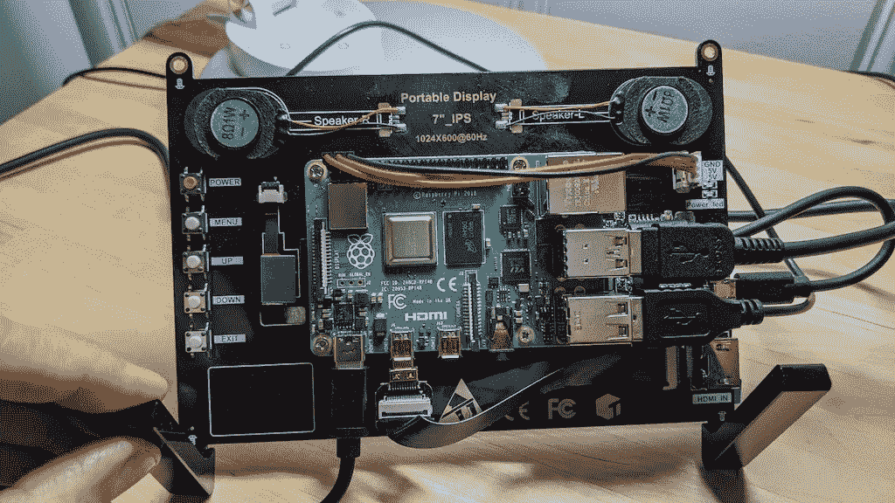

# 具有 Raspberry Pi 和谷歌云的强大远程工作站

> 原文：<https://medium.com/google-cloud/powerful-remote-workstations-with-raspberry-pi-and-google-cloud-912eca06f24?source=collection_archive---------1----------------------->

不同行业的许多人被困在家里工作，需要一个强大的工作站来处理计算密集型的交互工作。从动画、视觉效果、模拟、建筑到数据科学等等。在本文中，我将向您展示一种在云的帮助下将低功耗计算机转变为强大工作站的快速方法。

我将使用 Raspberry Pi 4 和谷歌云平台(GCP)来演示如何使用 Blender 在远程 Windows 工作站上制作动画和渲染。但是，有了这些想法，您几乎可以将手头的任何 Mac、Windows 或 Linux 计算机变成低延迟高端工作站的窗口，以便在任何地方完成您需要的工作。

任何云提供商都有可能做到这一点。无论您是否是或即将成为 GCP 的客户，我真心希望这能为您提供一些有用的信息，让您在这个对我们所有人都充满挑战的时代更高效地开展远程工作。

# 目标

在强大的 Windows 环境中运行 Blender，使用 GPU 加速进行建模、动画和渲染。这是我的设置和最终结果:


树莓 Pi 与远程工作站在 GCP 渲染宇宙自助洗衣店演示搅拌机场景。

骑自行车搅拌机场景动画由[安迪·拉苏海恩戈](http://dedouze.com/)实时播放，并与 RDP 一起推到当地的树莓派。

基本上只需要几个步骤来配置:

1.  本地机器
2.  远程显示协议客户端。
3.  具有 GPU 加速的云中的远程工作站——本例中为 Google Cloud。
4.  远程工作站上所需的客户端软件。

# 1.本地机器

我的 Raspberry Pi 4 Model B 电脑有 4 GB 内存，32 GB SD 卡运行[拉斯宾 NOOBS](https://www.raspberrypi.org/downloads/noobs/) ，支持多达两个 4k HDMI 显示器。为了简单起见，我将它安装在一个 7 英寸的液晶面板背面，该面板采用 1024x600 16:9 的液晶显示器，甚至是触摸屏。附件是一个鼠标和一个键盘，我用索尼在 2001 年卖回来的 PlayStation 2 开发者工具包买的！

我的互联网连接被宣传为 300 兆比特/秒，但实际上只有 200 兆比特/秒。对于这个测试，大约 10-20 Mbps 就足够了，特别是对于这个微型显示器。我试过一台 4k 55 英寸的电视，体验同样流畅。您的里程会因您的连接而异。



Raspberry Pi 4 安装在 7 英寸液晶触摸屏的背面。

# 2.远程显示协议

在这个例子中，我使用了 [RDP](https://en.wikipedia.org/wiki/Remote_Desktop_Protocol) ，因为它是免费的，并且是 Windows 自带的，Windows 将安装在云中的远程工作站上。我也使用 [Remmina](https://remmina.org/) 作为 RDP 的客户端，因为它是多平台的，免费的，并且支持其他协议。安装轻而易举。只需在终端中运行以下命令:

```
sudo apt-get install remmina
```

然后简单地运行:

```
remmina&
```


蕾米娜·RDP 的客户。

# 3.远程工作站

## 虚拟计算机

第一步是在[谷歌云](https://console.cloud.google.com)创建一个远程工作站。如果你没有帐户，你可以注册并获得 300 美元的免费信用点数来试用。在此示例中，我将创建一个具有以下规格的虚拟机实例:

*   8 个虚拟 CPU
*   30 GB 内存
*   50 GB 磁盘
*   1 个 NVIDIA TESLA P4 8 GB GPU，支持安装网格驱动程序的虚拟工作站。
*   Windows 2016 数据中心版。

您可能需要请求 GPU 配额。您可以从" [IAM & Admin > Quotas](https://console.cloud.google.com/iam-admin/quotas) 中完成此操作

请注意，这些机器和您在 GCP 创建的任何其他资源都是按时间计费的。请注意停止和/或删除您需要的资源，以避免产生不必要的成本。


创建虚拟机实例。

## 配置 RDP

接下来，初始化您将用于通过 RDP 连接的 Windows 密码。从创建的虚拟机下拉列表中单击“RDP >设置 windows 密码”选项。复制密码并记下 IP 地址。您将使用这两个工具在 Remmina 中配置 RDP 连接。


设置 Windows 密码。

返回 Remmina 并添加一个新的 RDP 连接配置。输入 IP 地址、用户名和密码。单击保存并连接。接受 RDP 服务器发送给客户端的安全证书。过一会儿，你就会将远程 Windows 桌面推送到你的 Raspberry Pi 上。


在 Remmina 中创建 RDP 客户端配置。

## 下载软件

为简单起见，我们将使用 IE 下载。我强烈推荐的唯一调整是禁用 Internet Explorer 增强的安全配置。它将使导航和下载变得更加容易。从登录时自动打开的服务器管理器窗口中，单击“本地服务器> IE 增强的安全配置”，并为管理员和用户选择“关闭”。一旦下载了本文中使用的软件，如果您愿意，您可以将其恢复。


关闭 Internet Explorer 增强的安全配置。

## NVIDIA 网格驱动程序

最后，您需要安装 NVIDIA GRID 驱动程序，以便利用远程机器上的 GPU。驱动程序可以从 Google 维护的 GCS 桶中公开获得。下载并安装:

[版本 425.31](https://storage.googleapis.com/nvidia-drivers-us-public/GRID/GRID8.0/425.31_grid_win10_server2016_64bit_international.exe)


NVIDIA 网格驱动程序安装。

# 4.安装客户端软件

最后，下载安装[搅拌机](https://blender.org/download)。


搅拌机运行与一个简单的场景。

这里有一些公开的[搅拌机演示文件](https://www.blender.org/download/demo-files/)，你可以用它来试试。


正在渲染的宝马演示由迈克潘。


宇宙自助洗衣店演示。

# 重要的

请注意，本文中创建的远程虚拟机是要花钱的，而且是按时间计费的。建议在使用完远程工作站后停止它，这样就不会因为云中有一台空闲的机器而产生成本。而且，根据规格的不同，如果连续几天 24x7 全天候运行，这些机器可能会很贵。

# 结论

设置功能强大的交互式远程工作站唾手可得。谷歌云提供灵活而强大的配置。有几个免费的远程显示协议和客户端用于多个平台，特别是如果你不需要无损像素精确的颜色。

# 放弃

我是一名工程师，目前在谷歌云工作。观点是我自己的。