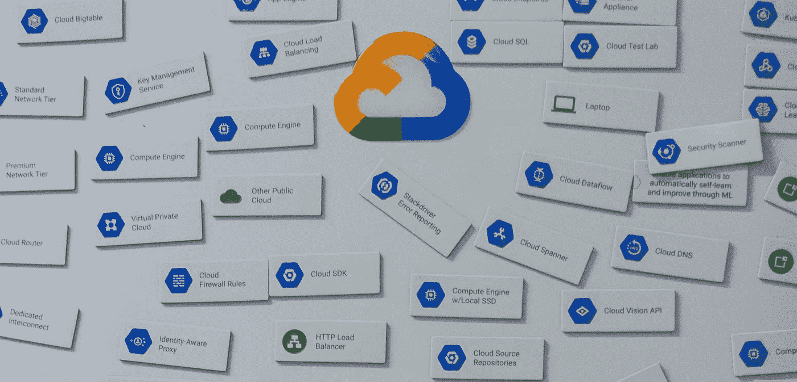

# 用 Prometheus & Grafana 进行实际监控(第四部分)

> 原文：<https://medium.com/google-cloud/practical-monitoring-with-prometheus-grafana-part-iv-d4f3f995cc78?source=collection_archive---------0----------------------->

使用身份感知代理保护 Grafana

照片由[米切尔罗](https://unsplash.com/@mitchel3uo?utm_source=medium&utm_medium=referral)在 [Unsplash](https://unsplash.com?utm_source=medium&utm_medium=referral)

在使用 Prometheus & Grafana 系列进行实际监控的[部分 I](/@yitaek/practical-monitoring-with-prometheus-grafana-part-i-22d0f172f993) 、 [II](/@yitaek/practical-monitoring-with-prometheus-grafana-part-ii-5020be20ebf6) 和 [III](https://towardsdatascience.com/practical-monitoring-with-prometheus-grafana-part-iii-81f019ecee19) 中，我们在 Kubernetes 上部署了 Prometheus 和 Grafana，安装了黑盒探头，并配置了异常检测，为我们的监控堆栈奠定了基础。在这最后一篇文章中，我们将完成设置，并看看如何使用…