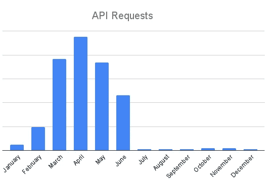
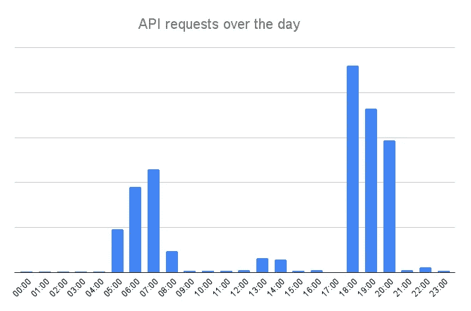
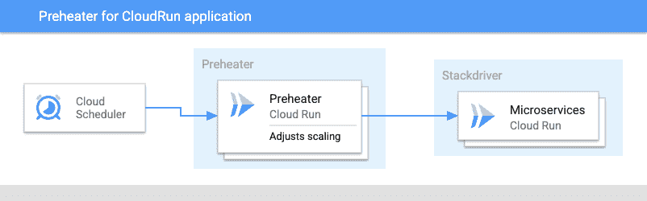

# 运行在 Google Cloud Run 上的预热应用程序

> 原文：<https://medium.com/google-cloud/pre-heating-cloud-run-apps-for-crisp-ux-d13c341e0a29?source=collection_archive---------2----------------------->

德国白芦笋的生长季节开始了，这启发了我写这篇关于如何在 Cloud Run 上自动扩展应用程序以提供良好用户体验的教程。

在 [Unsplash](https://unsplash.com/s/photos/white-asparagus?utm_source=unsplash&utm_medium=referral&utm_content=creditCopyText) 上由 [Waldemar Brandt](https://unsplash.com/@waldemarbrandt67w?utm_source=unsplash&utm_medium=referral&utm_content=creditCopyText) 拍照

# 种植芦笋

在我之前的生活中，我有幸为德国的芦笋种植者设计了一个应用程序。芦笋种植面临许多挑战，生长季节大约从 2 月中旬开始，大约持续到 6 月 23 日圣约翰前夕。第一批芦笋大约在四月初上市，对农民来说价格最高。但是德国的芦笋需要做到完美。大小和周长需要合适，它不应该尝起来有“木质”的味道，头部应该闭合。

芦笋的生长发育高度依赖于芦笋苗床的温度。使用一张有黑白两面的厚箔，农民可以控制床对阳光的吸收，从而加速或减缓芦笋的生长。他们通常根据 18 点钟的温度或大约 20 厘米深度的全天平均温度来决定使用铝箔的哪一面。

我们的解决方案是一个简单的传感器，它可以测量芦笋床不同深度的温度，并在移动应用程序中为农民显示数据。

我们从 API 监测数据中了解到，该应用程序主要在 3 月、4 月和 5 月使用(在 5 月使用，以防止芦笋过热)。6 月底后，这一数字几乎降至零。

每月的 API 请求

全天的使用情况也反映出大多数农民要么在晚上要么在早上计划他们的工作。但在这些时间窗口之外，这款应用的使用率很低。

API 请求在白天分发

可悲的是，在那个时候，我们仍然有基础设施在运行，随时可以为用户服务，只是不需要信息，增加了成本。当时，我们希望有一个更具弹性的扩展基础设施，以实现更高的成本效益。我们的基础设施每年有六位数的运行成本(我不允许透露确切的数字)，但只有一小部分时间在使用。

# 谷歌云运行

[Google Cloud Run](https://cloud.google.com/run) 允许你在 Google 管理的无服务器平台上调度容器。它基于 [Knative](https://knative.dev/) ，一个流行的无服务器框架，反过来在引擎盖下使用 [Kubernetes](https://kubernetes.io/) 。对我来说，Knative 最令人兴奋的特性之一是能够扩展到零。这意味着 Knative 能够运行应用程序的 0 个实例，同时仍然为来自客户端的请求提供服务。它通过“搁置”请求并启动一个容器来处理请求。

如您所见，这是上述应用程序的理想功能。在使用窗口之外，提供 API 的成本基本为零。而基于用户请求量的缩放由平台动态处理。

# 预热实例

但是它也有一点不好的地方。如果还没有容器实例在运行，这会增加客户端的延迟。这可能会导致糟糕的用户体验。但是当然有办法绕过这一点。当你从上面看图表时，我们可以看到用户正常使用应用程序的清晰阶段。所以我们的目标是为我们的大多数用户提供一个好的 UX。

我们可以做的是使用一些自动化，根据历史负载观察来显示容器的数量，以便为大多数用户确保一个清晰的 UX。对于该窗口之外的使用，延迟略有下降。我将这种模式称为“预热”，我们使用云调度程序来触发云运行实例，以更新我们想要的最小数量的应用程序实例。

# 如何设置它

预热器本身就是一个简单的 web 服务，用 [Golang](https://golang.org/) 编写。调用的参数是要扩展的服务，以及要使用的最小实例数。

让我们从预热器应用开始:

如您所见，这是一个相当简单的 go 应用程序，它公开了一个端点，该端点接受一些参数来扩展或缩减云运行服务。

为了将它打包成一个简单的 Docker 映像，我使用了以下 Docker 文件:

为了构建容器映像并将其推送到您的 GCR 存储库，您可以克隆 gist 并运行以下命令:

如果您还没有启动并运行云运行应用程序，您可以按照以下简单指南启动一个简单的应用程序[https://Cloud . Google . com/Run/docs/quick starts/pre build-deploy](https://cloud.google.com/run/docs/quickstarts/prebuilt-deploy)

首先，我们为预热器创建一个服务帐户，它能够更新现有的云运行服务:

对于生产场景，您可能希望创建一个比标准角色 roles/run.admin 提供的权限更低的角色。

接下来，我们将部署一个预热器实例来云运行

由于[云调度器](https://cloud.google.com/scheduler)需要激活 AppEngine API，下一步是激活 AppEngine:

之后，您可以简单地设置两个云调度器，一个用于扩展到 1(或更多)，另一个用于缩减应用程序:

您可以通过运行以下命令来测试作业

和分别

当使用以下命令进行检查时，您应该会看到 min 实例的数量相应地进行了调整(新版本可能需要一段时间才能激活)

您可以在 GitHub 上找到上述示例的完整源代码。[https://gist . github . com/cgrotz/a 4 a6 DCF 6 E8 aa 694 dfe 82724d 35 B2 CBE 6](https://gist.github.com/cgrotz/a4a6dcf6e8aa694dfe82724d35b2cbe6)

# 观点

这让您对 CloudRun 所拥有的功能以及它如何帮助您提供出色的用户体验有了一个很好的概述。当然，最重要的部分是你对你的用例以及你的用户的理解，有了手边合适的工具，你就能得到很棒的解决方案。

目前，上述实现基于实例计数的固定计划。它可以通过利用从云监控、Google Analytics 或 Firebase Analytics 收集的监控数据进行优化，并根据这些数据进行动态扩展。