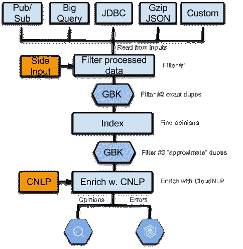
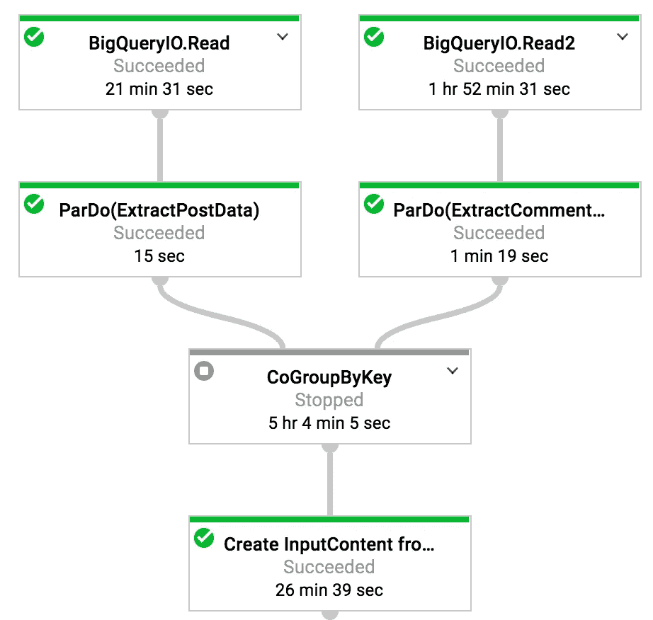

# 用 TensorFlow 和云数据流预测世界新闻的社会参与度:第 1 部分

> 原文：<https://medium.com/google-cloud/predicting-social-engagement-for-the-worlds-news-with-tensorflow-and-cloud-dataflow-part-1-b92ba8f14a7?source=collection_archive---------0----------------------->

*本故事最初发表于*[*datan coff . ee*](https://datancoff.ee/2017/12/predicting-social-engagement-for-the-worlds-news-with-tensorflow-and-cloud-dataflow-part-1/)*。*

如果你选取世界新闻的一个巨大横截面([g delt 项目](https://www.gdeltproject.org/))，把它与最大的[在线讨论](http://www.reddit.com)网站混合，并试图预测是什么驱动了 Reddit 上关于新闻的在线对话，会发生什么？是新闻文章的作者，发表时间，标题，帖子的内容？会不会是讨论板上的提交者，或者是新闻发布到的分论坛？

一个很自然的假设是，一篇新闻文章的内容会影响这篇新闻文章最终将被发布的子编辑。这是一个合乎逻辑的假设，但是有证据吗？如果有的话，我们能得到一个主题列表并将它们与子主题相关联吗？除了 subreddit 之外，我们是否可以推断出推动讨论线程中最多参与者和最多评论的因素？

这些见解有什么用？想象一下，一个新闻出版商或营销人员希望看到他们正在创建的内容有更多的参与。知道什么能吸引你的观众可以提高你的页面浏览量，最终增加收入。如果你是一名跟踪新闻如何在不同受众中传播的研究人员，了解这一点也会对你有所帮助。

像这样的预测任务是机器学习的主要候选，而 [TensorFlow](https://www.tensorflow.org/) 是训练 ML 模型和运行预测的权威框架。从某种意义上说，GDELT 的新闻报道目录和 Reddit 的讨论是天作之合，因为 GDELT 有训练模型的功能和输入，而 Reddit 有预测的标签或输出。GDELT 有按文章 URL 和属性(如标题、作者、出版日期、文章的全部内容等)索引的文章。reddit 也有文章的 URL，但除此之外，它还会将文章的提交者、子编辑(主题区)以及 Reddit 用户基于提交内容创建的所有评论带到论坛。

当我们着手为这个预测任务构建 TensorFlow 模型时，我们必须首先组装 TensorFlow 能够从中学习的数据集。在这个由多个部分组成的博客系列中，我们将首先解释我们如何构建这个输入数据集，将 GDELT 和 Reddit 数据结合在一起，然后我们将探索结果的训练和预测。

我们的第一个任务是将 GDELT 和 Reddit 数据放入一个易于查询的数据库中。这里自然选择了 BigQuery。已经有了 [GDELT](https://bigquery.cloud.google.com/table/gdelt-bq:gdeltv2.gkg_partitioned?tab=schema) 和 [Reddit](https://bigquery.cloud.google.com/dataset/fh-bigquery:reddit_posts) BigQuery 数据集，但是我们想要对新闻文章和 Reddit 帖子和评论的原始内容进行更深入的情感分析，为此我们使用了我们之前写过的数据流观点分析项目( [github repo](https://github.com/GoogleCloudPlatform/dataflow-opinion-analysis) )。

早在 2017 年 6 月，两位 GCP 解决方案架构师 Reza Rokni 和 John LaBarge 在两部分博客系列([博客 1](https://cloud.google.com/blog/big-data/2017/06/guide-to-common-cloud-dataflow-use-case-patterns-part-1) 和[博客 2](https://cloud.google.com/blog/big-data/2017/08/guide-to-common-cloud-dataflow-use-case-patterns-part-2) )中分享了他们开发生产质量数据流管道的最佳实践。当我们巩固数据准备管道的设计时，我们使用了其中的一些最佳实践来保证我们的意见分析基础设施经得起未来的考验。文章的其余部分将更详细地解释我们如何将这些数据流设计实践应用于我们在构建训练数据集时遇到的数据问题。

根据数据流管道的常规生命周期，数据流的 10 大设计模式可以大致分为:

*   协调管道的执行
*   入职外部数据
*   连接数据
*   分析数据和
*   写入数据

我们几乎在上述每个类别中都使用了模式。对于 onboarding 外部数据，我们使用外部服务访问[模式](https://cloud.google.com/blog/big-data/2017/06/guide-to-common-cloud-dataflow-use-case-patterns-part-1#pattern-calling-external-services-for-data-enrichment)，它允许我们调用 Cloud NLP 来用额外的主题信息丰富我们的数据集。为了加入 Reddit 帖子和评论，我们使用了 CoGroupByKey [模式](https://cloud.google.com/blog/big-data/2017/08/guide-to-common-cloud-dataflow-use-case-patterns-part-2#pattern-joining-two-pcollections-on-a-common-key)。在执行数据分析时，我们依赖于具有多个属性的键类的 GroupByKey [模式](https://cloud.google.com/blog/big-data/2017/08/guide-to-common-cloud-dataflow-use-case-patterns-part-2#pattern-groupby-using-multiple-data-properties)。最后，在处理无效或格式错误的输入数据时，我们实现了一个 Bigtable sink，它根据死信队列[模式](https://cloud.google.com/blog/big-data/2017/06/guide-to-common-cloud-dataflow-use-case-patterns-part-1#pattern-dealing-with-bad-data)收集无效的输入记录。

让我们更深入地了解这些模式如何帮助我们组装训练数据集。

正如我们之前提到的，我们使用 gzipped JSON 格式的文件从 GDELT 获得了一半的训练集(特性)。我们训练集的另一半(标签)是 Reddit 帖子和他们的评论，可以在 BigQuery 数据集的两个表中找到:帖子和评论。我们希望通过非常相似的处理管道运行 GDELT 新闻文章和 Reddit 帖子/评论，从它们中提取主题和观点，并将结果存储在 BigQuery 中。因此，我们编写了一个数据流管道，它可以根据我们传递给作业的参数来更改其输入源，但以相同的方式进行所有的下游处理。最终，我们得到了两个具有相同模式的 BigQuery 数据集，并且我们可以使用 BiqQuery 的 SQL 通过新闻文章的 URL 相互连接。

这是数据流管道的高级设计，我们用它将 GDELT 和 Reddit 数据都传送到 BigQuery。

*   从输入中读取
*   过滤已处理的 URL
*   过滤精确重复项
*   索引(摘录观点和标签)
*   过滤“近似的”重复项
*   丰富云 NLP
*   将意见写入 BigQuery，将无效输入写入 Bigtable



当我们为 Reddit 数据实现输入阅读器时，我们必须将 posts 和 comments 表连接在一起。这个 join 实现遵循我们的 CoGroupByKey 设计[模式](https://cloud.google.com/blog/big-data/2017/08/guide-to-common-cloud-dataflow-use-case-patterns-part-2#pattern-joining-two-pcollections-on-a-common-key)的建议。对于连接中的每个数据集，我们创建了一个 KV 键-值对，然后应用 CoGroupByKey 操作来匹配两个数据集之间的键。在 join 之后，我们对结果进行了迭代，创建了一个包含帖子和评论信息的实体。



专业提示:

*   当连接数据集时，如果其中一个数据集可以放入数据流工作虚拟机的内存中，侧面输入可能是 CoGroupByKey 的一种更快的替代方法。
*   使用基于服务的[数据流混洗](https://cloud.google.com/dataflow/service/dataflow-service-desc#cloud-dataflow-shuffle)来提高 CoGroupByKey 的性能。将以下参数添加到管道中:—experiments = shuffle _ mode = service

在阅读了我们的输入之后——无论是来自 GDELT 的新闻文章，还是来自 Reddit 的帖子——我们继续从数据中删除重复的内容。消除重复通常是通过在已处理的 ID 列表中查找一个记录 ID 来完成的，或者，如果该记录还没有被处理，则通过表示唯一性的某个键对元素进行分组来完成。

我们的管道中有三个级别的过滤使用了这两种技术。在第一个过滤器中，我们简单地检查记录的 URL(实际上是数据集中的 ID 列)是否已经被处理并存储在 BigQuery 中。对于这个检查，我们使用 URL 散列的侧面输入，并从我们正在写入的 BigQuery 数据集填充它。

在第二个和第三个过滤器中，我们只应用于 GDELT 中的新闻文章，我们正在查看新闻文章的内容。我们不需要对 Reddit 记录进行过滤，因为我们的数据源保证了帖子的唯一性。然而，GDELT 数据源是高度冗余的，反映出新闻世界也是高度重复的。

原始新闻故事仍由主要新闻出版物的工作人员或博客撰写，但很大一部分新闻网站，特别是地区出版物，转贴来自美联社、路透社、法新社、德国之声等新闻通讯社的新闻。我们的管道努力识别这样的转发，并把它们组合在一起。

我们将在本博客的剩余部分使用的术语注释:

*   原始文章:第一次发布原始新闻故事的网页
*   转贴:转贴/转载原创故事的网页
*   发布者:发布故事(原创或转贴)的域

当对原始新闻文章进行分组时，我们首先尝试匹配内容相同、文本没有任何差异的文章。在我们的管道中，这由 Filter #2 表示，并且这种过滤是通过根据我们在与出版日期连接的文章文本上计算的散列对所有传入的文本文章进行分组来实现的。

在这种最初的、简单的分组之后，我们接着尝试对文本中有小变化的文章进行分组，例如，因为它们以出版物的来源为前缀，例如(“芝加哥(AP)”)，或者因为它们在结尾添加了版权声明。这是一个比在文本上散列更高级的分组。这里，我们需要对文章的属性组合进行分组。

grouping [模式](https://cloud.google.com/blog/big-data/2017/08/guide-to-common-cloud-dataflow-use-case-patterns-part-2#pattern-groupby-using-multiple-data-properties)建议定义一个类，该类包含您想要分组的所有属性，然后用 AvroCoder 标记该类，作为该类的@DefaultCoder。通过这样做，我们可以免费获得这个类的对象的序列化/反序列化，然后我们可以使用 GroupByKey 根据它进行分组。

```
/*** @param Document indexes* @return a POJO containing 2 PCollections: Unique docs, and Duplicates*/private static ContentDuplicateOrNot filterSoftDuplicates(
 PCollection<ContentIndexSummary> indexes) {PCollectionTuple dedupeOrNot = indexes.apply("Extract Text grouping key",ParDo.of(new GetContentIndexSummaryKeyFn())).apply("Group by Text grouping key",GroupByKey.<ContentSoftDeduplicationKey, ContentIndexSummary>create()).apply("Eliminate Text dupes",ParDo.of(new EliminateTextDupes()).withOutputTags(PipelineTags.indexedContentNotToDedupeTag,TupleTagList.of(PipelineTags.indexedContentToDedupeTag)));PCollection<TableRow> dedupedWebresources =dedupeOrNot.get(PipelineTags.indexedContentToDedupeTag).apply(ParDo.of(new CreateWebresourceTableRowFromDupeIndexSummaryFn()));ContentDuplicateOrNot contentDuplicateOrNot = new ContentDuplicateOrNot(dedupeOrNot.get(PipelineTags.indexedContentNotToDedupeTag),dedupedWebresources);return contentDuplicateOrNot;}
```

已经证明在查找相似内容中有效的文档属性包括文档的标题、四舍五入到一千个字符的文档长度以及文章中讨论的主题。标题和文档长度是我们无需任何额外处理就能得到的，因为它是源数据集的一部分。为了获得文档的主题，我们需要运行 NLP 和情感分析，这就是为什么第三个也是最后一个过滤步骤被安排在“索引”步骤之后。基于内容的分组非常准确，使我们能够将插入分析数据集中的故事数量减少约 45%。例如，2017 年 6 月，GDELT 项目从 610 万个网页中提取了英语新闻，但只有 370 万个独特的故事。这种重复数据删除的额外好处是，我们能够汇总原创故事的所有转发的社会影响。

当我们在索引步骤中处理文本文档时，我们有时会遇到输入格式错误且无法处理的情况。例如，在 GDELT 中，我们有时会看到充满 CSS 格式的文本，这是 GDELT 网络爬虫中边缘情况的结果。或者，这是 Reddit 上的典型社交内容，我们看到完全由表情符号或 Unicode 符号组成的帖子无法被 NLP 库处理。这是另一个访问我们的模式包的机会。通常，开发人员会将潜在的“危险”代码块放入 try/catch 块中，并通过记录异常来处理异常。死信处理设计[模式](https://cloud.google.com/blog/big-data/2017/06/guide-to-common-cloud-dataflow-use-case-patterns-part-1#pattern-dealing-with-bad-data)建议，除了日志记录之外，将这些坏记录重定向到一个辅助输出中，然后将它们存储在一个支持快速写入的数据库中，例如 Bigtable、Datastore 或 BigQuery。然后，它建议定期检查死信表的内容，并调试这些坏记录，确定异常的原因。通常，需要改变业务逻辑，包括额外的边缘情况，或者改进数据收集，以解决不良记录，但是至少，我们不会忽略这些错误，并保留否则会丢失的数据。在我们的管道中，我们在索引步骤中实现了一个侧面输出，并为这个侧面输出实现了一个 Bigtable 接收器。

我们已经讨论了管道的索引步骤如何通过使用 Sirocco 意见提取库来查找文档的主题。Sirocco 并不是获取文档主题的唯一途径。Cloud NLP 提供了一个 API，用于将文本文档分成大约 700 个类别。此外，它还提供了从文本中提取实体的机制，这与 Sirocco 的功能非常相似。我们将 CloudNLP 的实体提取和 Sirocco 的实体提取集成到我们的管道中，以受益于我们管道中更丰富的文本分类，为此我们应用了来自模式博客帖子的另一个[模式](https://cloud.google.com/blog/big-data/2017/06/guide-to-common-cloud-dataflow-use-case-patterns-part-1#pattern-calling-external-services-for-data-enrichment)。

在索引步骤中的意见提取、CloudNLP 浓缩和最终过滤步骤之后，数据最终准备好插入到 BigQuery 中。请注意，Reddit 和 GDELT 数据将出现在不同的数据集中，但是，这些数据集的模式是相同的，我们可以通过新闻帖子的 URL 字段将 GDELT 中的新闻文章与 Reddit 帖子连接起来。

我们博客系列的第一部分到此结束，重点是为模型训练准备数据。我们从 GDELT 文章数据集中提取了一些特征，比如文章中的实体、作者或新闻文章、发表日期和时间以及观点。我们还有从 Reddit 帖子和评论中提取的训练标签，包括 Reddit 帖子的提交者、子编辑和评论的情绪。我们清理了重复的训练数据，并在此过程中获得了关于转发的有用信息，这将有助于我们提供更准确的社会影响估计。

**接下来的步骤**

在下一组博客中，我们将介绍开发张量流模型的方法。我们希望您能够在自己的数据处理管道中应用数据流最佳实践。如果你想了解更多，这里有几个有用的链接。

[通用云数据流用例模式指南，第 1 部分](https://cloud.google.com/blog/big-data/2017/06/guide-to-common-cloud-dataflow-use-case-patterns-part-1)

[常见云数据流用例模式指南，第 2 部分](https://cloud.google.com/blog/big-data/2017/08/guide-to-common-cloud-dataflow-use-case-patterns-part-2)

[数据流意见分析 github repo](https://github.com/GoogleCloudPlatform/dataflow-opinion-analysis)