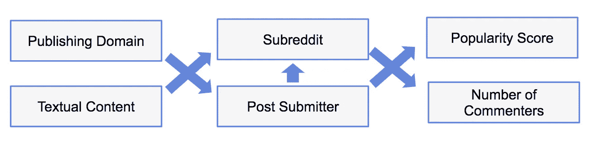

# 使用 Kaggle 或 Colab 预测用户对 Reddit 新闻的参与度

> 原文：<https://medium.com/google-cloud/predicting-user-engagement-with-news-on-reddit-using-kaggle-or-colab-d5ef0dcaff6a?source=collection_archive---------1----------------------->

*本故事最初发表于*[*datan coff . ee*](https://datancoff.ee/2018/05/predicting-user-engagement-with-news-on-reddit-using-kaggle-or-colab/)*。*

大约一个月前，我写了一个由 3 部分组成的博客系列(第 [1](https://cloud.google.com/blog/big-data/2018/03/predicting-community-engagement-on-reddit-using-tensorflow-gdelt-and-cloud-dataflow-part-1) 、 [2](https://cloud.google.com/blog/big-data/2018/03/predicting-community-engagement-on-reddit-using-tensorflow-gdelt-and-cloud-dataflow-part-2) 和 [3](https://cloud.google.com/blog/big-data/2018/03/predicting-community-engagement-on-reddit-using-tensorflow-gdelt-and-cloud-dataflow-part-3) )，内容是预测用户在 Reddit 社区(subreddits)中对新闻的参与度。作为该研究基础的 Jupyter 笔记本现在可以作为 Kaggle [内核](https://www.kaggle.com/datancoffee/predicting-community-engagement-on-reddit)以及配套的[数据集](https://www.kaggle.com/datancoffee/predicting-reddit-community-engagement-dataset)获得。

我发现，新闻文章的发布领域和文本内容可以很好地预测新闻文章的最终位置，以及分享新闻帖子的人。此外，当一起使用时，发布域、文本内容、**和**提交者产生了一个模型，该模型以 92%的准确率预测了子编辑，这可以用于异常检测，例如验证子编辑的发布是否符合已经看到的行为，或者是否构成了新的趋势或潜在的机器人活动。

对于用户参与度指标，如流行度得分或评论者和评论的数量，最佳预测者是将文章发布到 Reddit 的人(帖子提交者)，以及发布新闻的子编辑。使用文章文本内容的模型在预测参与度指标方面没有最好的准确性(尽管它们对 Subreddit 和 Submitter 有很好的预测性)，但我目前正在改进我使用的文本嵌入，并希望在不久的将来发布更多这方面的内容。

Reddit 新闻用户参与度的预测指标

随着笔记本现在在 [github](https://github.com/GoogleCloudPlatform/dataflow-opinion-analysis/tree/master/models) 中登记并在 [Kaggle](https://www.kaggle.com/datancoffee/predicting-community-engagement-on-reddit) 中共享，您可以比以前更容易地重现研究结果。以下是在这些环境下运行笔记本电脑的一些提示和技巧。

## 针对托管环境优化笔记本执行

你可以在 [Colab](https://colab.research.google.com) 或者 [Kaggle](https://www.kaggle.com/datancoffee/predicting-community-engagement-on-reddit) 中运行这个笔记本。要在 Colab 中运行，从 [github](https://github.com/GoogleCloudPlatform/dataflow-opinion-analysis/tree/master/models) 下载 RedditEngagement 笔记本，导入到 [Colab](https://colab.research.google.com) 中，在“定义常量和全局变量”代码单元格中设置`current_run_in_colab`变量为`True`，否则设置为`False`。

## 对于输入数据集，可以在 BigQuery 和 CSV 文件之间进行选择

决定是从 [datancoffee BigQuery 数据集](https://bigquery.cloud.google.com/dataset/datancoffee:discussion_opinions?pli=1)还是从[快照 CSV 文件](https://github.com/GoogleCloudPlatform/dataflow-opinion-analysis/blob/master/models/data/reddit-ds.zip)中获取训练数据。目前，只有 Colab 允许您访问 datancoffee BigQuery 数据集。要从 BigQuery 获取训练数据，请在“定义常量和全局变量”代码单元格中将`current_read_from_bq`变量设置为`True`，否则，将其设置为`False`。

## 获取 CSV 文件

从[数据流观点分析 github 库](https://github.com/GoogleCloudPlatform/dataflow-opinion-analysis/)下载 [reddit-ds.zip](https://github.com/GoogleCloudPlatform/dataflow-opinion-analysis/blob/master/models/data/reddit-ds.zip) 快照文件存档。[设置数据集的说明](https://github.com/GoogleCloudPlatform/dataflow-opinion-analysis/blob/master/models/RedditEngagement.ipynb)可在笔记本上找到。在 Kaggle 中，快照数据集与内核打包在一起。你不需要做任何事情就可以使用它。

## 使用 GPU 在 Kaggle 中运行

使用 GPU 运行确实会在执行时间上产生差异。使用 GPU 的训练运行时间约为 20 秒，而使用常规 CPU 的训练运行时间约为 400 秒。

## 提高模型准确性

完整 Reddit 数据集中的数据点数量很大，因此可用内存的大小很重要。`current_sample_frac`变量控制输入数据集的一部分，该部分将被采样，然后划分为训练、测试和验证子集。笔记本中的默认设置已被选择在 Kaggle 和 Colab 的公共托管版本中运行。对于子分类目标，设置为`current_sample_frac = 0.5`，对于评论分类目标，设置为`current_sample_frac = 0.25`。

请注意，这大约是我们在 3 部分博客系列中使用的**的一半，因此，在运行未修改的笔记本电脑时，您将获得的准确性数字将低于我们在博客系列中获得的数字。**

Kaggle 用 GPU 运行时给出 6.5GB 内存。要更准确地运行模型，请在可用内存约为 35–40GB 的环境中自托管模型。在这种情况下，您可以为子分类设置`current_sample_frac = 0.99`，为注释分类设置`current_sample_frac = 0.5`(或更高)。

享受快乐的深度学习！