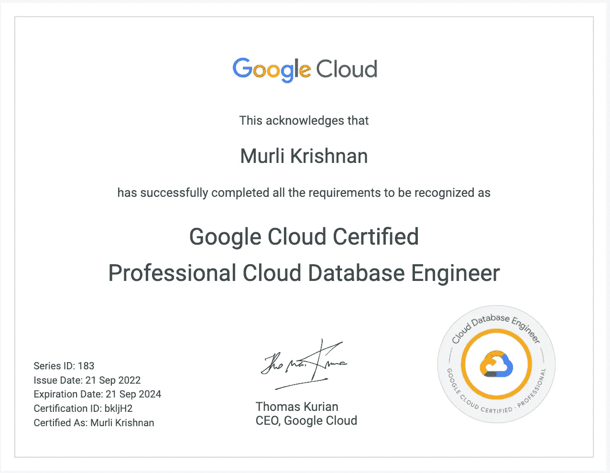
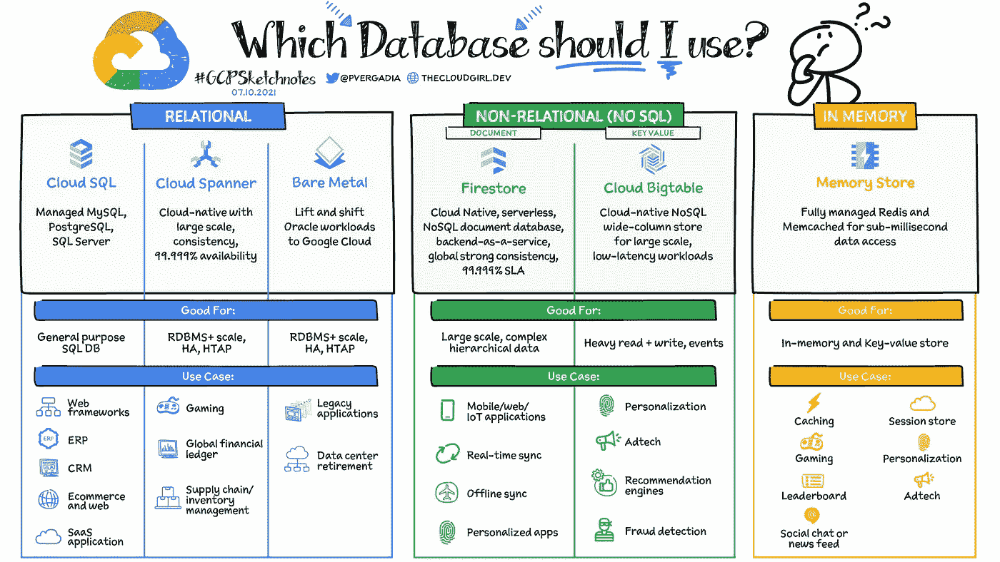
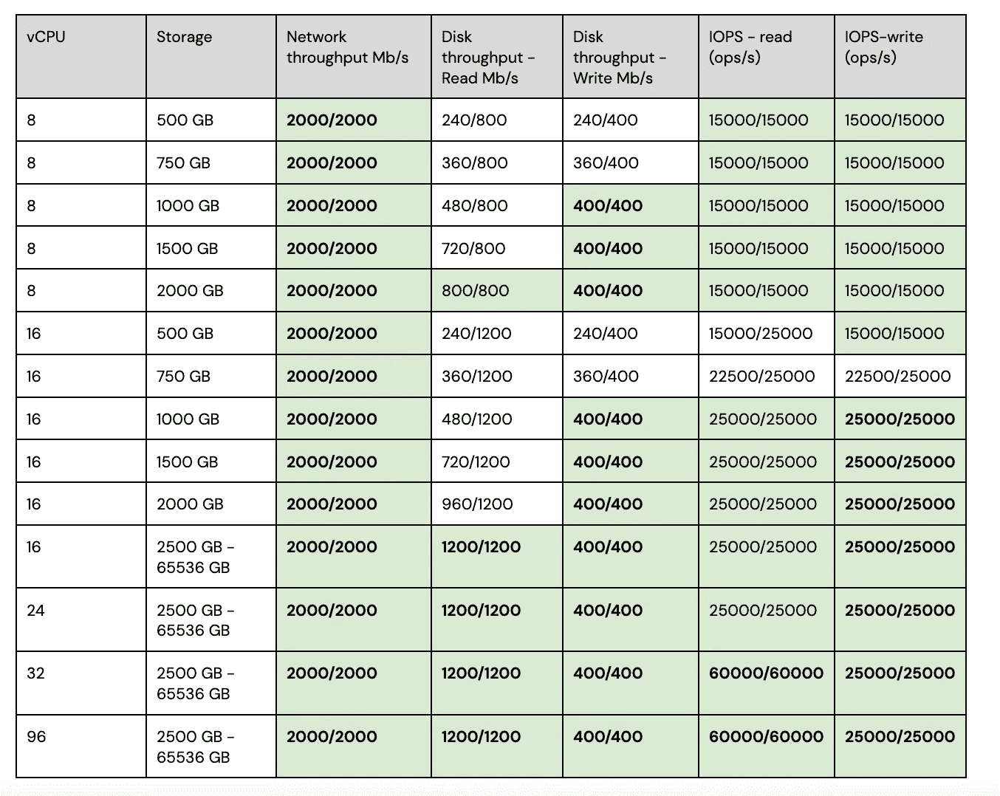
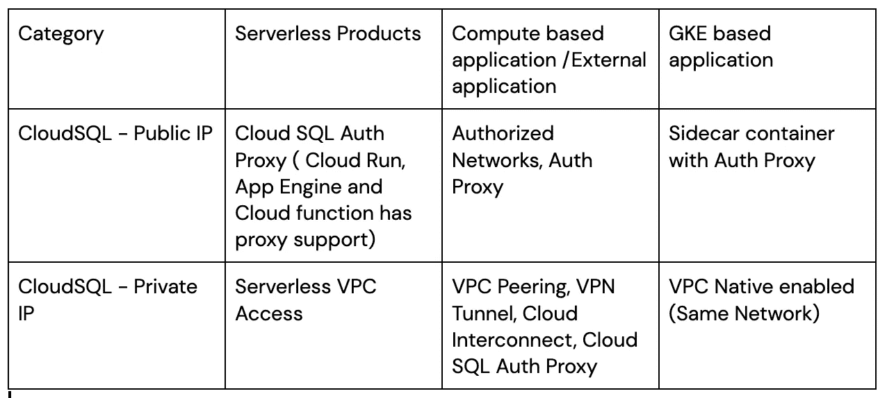
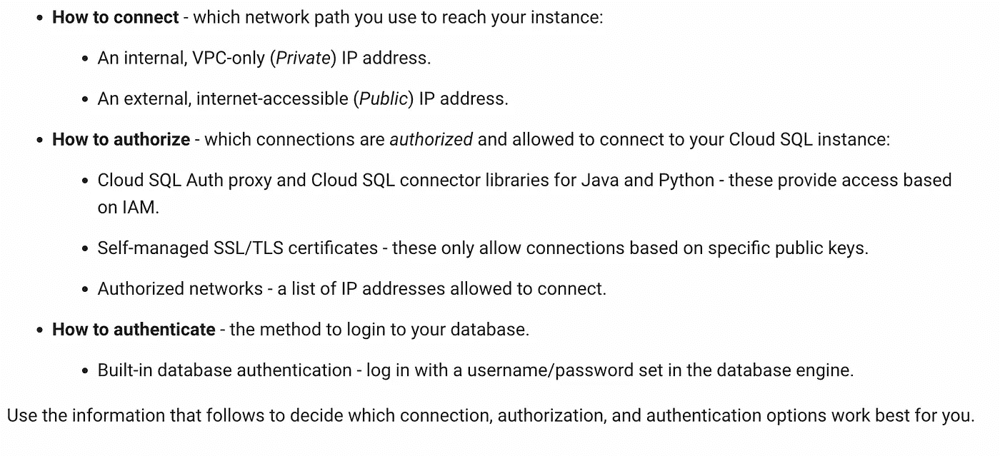
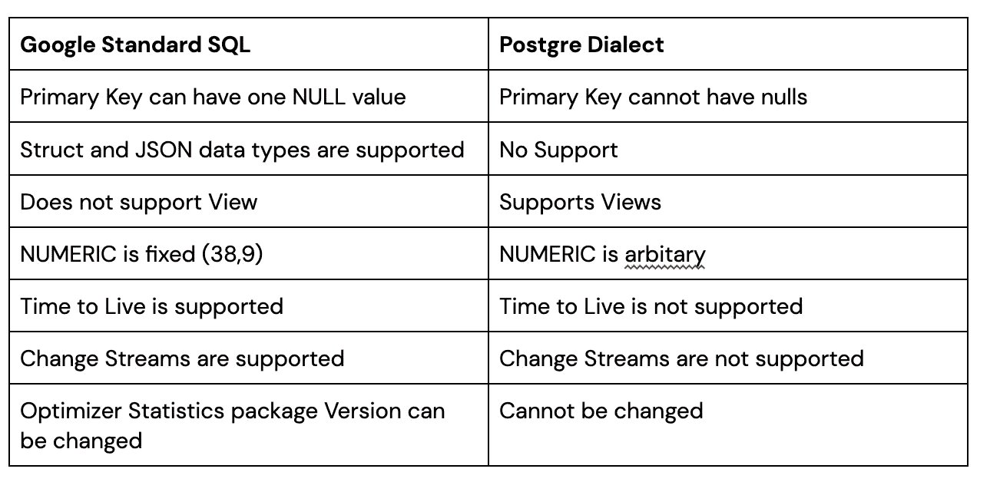
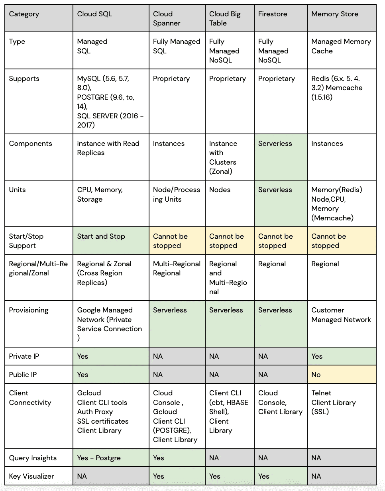
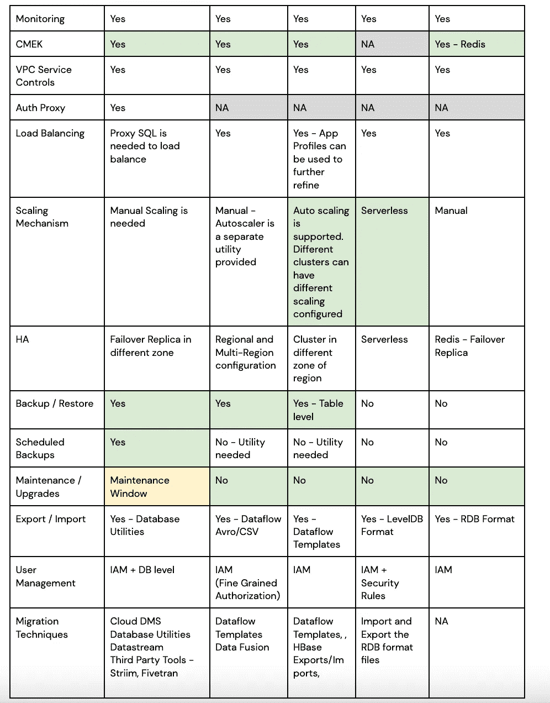

# Google Cloud 专业云数据库工程师认证备考

> 原文：<https://medium.com/google-cloud/preparation-for-google-cloud-professional-cloud-database-engineer-certification-f7ce6f0f30ab?source=collection_archive---------3----------------------->

> **关于我**:我在谷歌做数据的云迁移顾问。我是云爱好者和旅行爱好者

谷歌云最近在 2022 年 8 月推出了专业数据库工程师认证。

我最近在 2022 年 9 月参加了这个认证。

我写这篇文章是为了从认证的角度分享一些重点。

考试指南可从链接-[https://cloud . Google . com/certification/guides/cloud-database-engineer](https://cloud.google.com/certification/guides/cloud-database-engineer)获得

认证考试时长 2 小时，通常有 50 个问题。

该认证面向一直从事数据库解决方案(关系型或非 sql)工作，计划从(提升或现代化)角度采用/设计/管理 GCP 云平台数据库产品的受众。

该认证侧重于每个数据库解决方案产品的以下关键方面

1.  哪种数据库更适合您的目的(NoSQL 与 SQL、延迟、全球或区域存在、TCO、RPO、RTO、大小和规模)
2.  高可用性(容错)
3.  可扩展性(支持自动扩展或手动扩展，横向扩展或纵向扩展)
4.  数据迁移(同构和异构迁移、一次性迁移和复制、可用的工具和模板、第三方工具，如 Striim)
5.  与数据库的连接(无服务器、托管平台—私有/公共 ip 连接)
6.  监控性能并采取纠正措施以避免次优性能
7.  安全性、加密和访问控制(IAM 角色)
8.  备份(手动、自动、时间点恢复支持，谷歌的收购行动在这方面有何帮助)

首先，认证期望了解哪些数据库选项可用，以及它们的用例是什么

[https://cloud . Google . com/blog/topics/developers-从业者/your-Google-cloud-database-options-explained](https://cloud.google.com/blog/topics/developers-practitioners/your-google-cloud-database-options-explained)

注意— **AlloyDB** 是 GCP 平台的新产品之一，但在撰写本文时尚未包括在认证中。

我把这篇文章的重点放在了主要的竞争者上——Cloud SQL、Cloud Spanner、Big Table 和 Bare Metal，并在最后提到了一些应该准备的其他主题

# **云 SQL**

**由于产品本身的复杂性、特性和广度，云 SQL** 无疑是本次认证中最受关注的话题。

关键焦点:

## **云 SQL 的供应**

-数据库产品(MySQL、POSTGRE 和 SQL server)的**支持的版本**是什么

可以调配的最大**容量**是多少(64 TB，96 个虚拟 CPU)

**区域性(HA)或带状配置** 1。云 SQL 不支持跨区域 HA 实例
2。云 SQL 在故障转移实例
3 上执行同步复制。切换到故障切换实例需要几分钟时间(如果少于 3–5 分钟，会影响 RPO 要求)

**CPU/存储的配置**
vcpu 的配置和存储大小如何影响网络吞吐量、磁盘吞吐量和 IO 吞吐量
1。**网络吞吐量** —最大限制为 2000 MB/s，在 8 个 vCPU 配置时达到。
2。**磁盘吞吐量—** 每 1 GB 存储 0.48 Mb/s，**读取上限为 1200 Mb/s，写入上限为 400 Mb/s**
3。 **IO 吞吐量** —每 1 GB 存储每秒 30 次操作，读取吞吐量上限为 60K，写入吞吐量上限为 25K

影响性能参数的 CPU 和存储的不同组合

**副本设置** 1。实例
2 的副本解决了什么用例？**副本创建不需要任何停机时间**，应用程序仍然可以连接到实例并读取数据，只是不能执行管理操作
3。**副本放置**(云 SQL 不提供主实例和副本实例之间的显式负载平衡，想想代理 SQL)以及创建副本需要启用哪些功能(二进制日志记录和 PITR)
4 .**副本类型—** 了解每个副本的用例 **—外部副本**
—**从外部服务器复制**(了解如何从外部服务器复制的云 API)
—**级联副本** —副本的副本5。了解**实例间的复制滞后**(跨区域副本会比同区域副本有更大的复制滞后)
6。**使用跨区域副本的灾难恢复策略**—[https://cloud . Google . com/SQL/docs/MySQL/intro-to-cloud-SQL-Disaster-Recovery](https://cloud.google.com/sql/docs/mysql/intro-to-cloud-sql-disaster-recovery)

**扩展性** 1。从可扩展性的角度来看，云 SQL 支持纵向扩展方法，但可能会遇到硬性限制
请参考下面的替代方法(数据库分片，在特定于域的数据库上拆分大型数据库)
https://Cloud . Google . com/community/tutorials/horizontally-scale-MySQL-database-back end-with-Google-Cloud-SQL-and-proxy SQL
2。**云 SQL 的可扩展性本质上是手动的**

**连通性** 1。云 SQL 提供了**私有 IP** 和**公共 IP** 连接
2 的组合。了解如何通过 VPC 对等(私有服务连接和分配的 IP 范围)
3 在客户和租户项目之间提供**私有连接。了解哪种类型的产品、哪种类型的连接选项可用于应用程序**

**数据库迁移** 这是数据迁移生命周期中极其重要的一部分。这个主题本身是非常广泛和多样的，需要对数据库本身有深入的了解。
复杂性进一步延伸到**异源迁移**

我想从认证的角度强调一些关键点。

1.  了解**数据库迁移服务-DMS** (近实时或实时复制、停机时间、支持的源和目标组合、一次性迁移与连续迁移)
    检查每种类型数据库的先决条件
    [https://cloud . Google . com/Database-Migration/docs/MySQL/configure-source-Database](https://cloud.google.com/database-migration/docs/mysql/configure-source-database)
    [https://cloud . Google . com/Database-Migration/docs/MySQL/rds-no-super user](https://cloud.google.com/database-migration/docs/mysql/rds-no-superuser)
2.  **数据流** —为支持的数据库提供 CDC 风格，与数据流集成
3.  有哪些工具可以方便跨数据库数据迁移，例如: **Striim** ， **Fivetran** ， **Dataflow** 等。
    **Qwiklab**—[https://www . coursera . org/lecture/enterprise-database-migration/lab-review-online-data-migration-to-cloud-spanner-using-striim-4 qwds](https://www.coursera.org/projects/googlecloud-online-data-migration-to-cloud-spanner-using-striim-4z6gi?utm_source=link&utm_medium=page_share&utm_content=pdp&utm_campaign=banner_button)
4.  **离线迁移与在线迁移**
5.  观看下文，了解迁移的不同阶段以及支持这些阶段的供应商工具(MigVisor、Stratozone、Ispirer..)
    https://www.youtube.com/watch?v=-W4sbomrhyY
    https://www.youtube.com/watch?v=PDFC7XpGAVU

**数据摄取** 1。云 SQL 支持 SQL，CSV 文件导入导出使用 gcloud 命令(了解命令和要求)
2。数据流模板，数据融合和其他可以用来拉和推数据。

**监控性能** 1。利用云监控关键指标[https://cloud.google.com/sql/docs/mysql/admin-api/metrics](https://cloud.google.com/sql/docs/mysql/admin-api/metrics)
2。POSTGRE
3 的查询洞察。SQL Commenter
4 等工具的使用。可以采取什么措施来识别和修复性能瓶颈
[https://www.youtube.com/watch?v=gIeuiGg-_iw](https://www.youtube.com/watch?v=gIeuiGg-_iw)
[https://www.youtube.com/watch?v=rN99XFcAbyo](https://www.youtube.com/watch?v=rN99XFcAbyo)
5 .有哪些工具可用于性能基准测试

**备份和维护** 1。云 SQL 支持**手动和自动定时备份**(了解启用它们的 gcloud 参数)
2。**时间点恢复**是一项强大的功能(了解拥有 PITR 的先决条件以及如何进行恢复(克隆)—支持基于时间的恢复以及基于二进制日志的恢复)
3。维护也是重点领域，了解维护有哪些属性(**维护订单、重新安排维护和拒绝维护** )
4。**备份存储在哪里，**是否可以访问或运送到云存储，或者这些是专有的
5。**备份和导入/导出**有什么区别，可以在什么级别执行备份(数据库、实例或表级别)

**安全
安全** 1。**云 SQL 身份验证代理—** Unix 套接字和 TCP 连接，无服务器产品如何利用身份验证代理进行连接。
2。 **SSL 证书**有什么用，何时利用(公共 IP 连接)
3。证书轮换是如何发生的，任何停机，它能回滚吗
5。**使用 CMEK 密钥的静态数据加密**，密钥轮换以及对备份、克隆和副本的影响
6。**认证机制** —基于 IAM 或基于数据库用户密码
7。**实例级授权和数据库级授权**(授权..)
8。**公共 IP 连接的授权网络**以及它给没有专用 IP 的无服务器产品带来哪些限制以及如何解决。

支持的授权和身份验证机制摘要

参考—[https://cloud.google.com/sql/docs/mysql/connect-overview](https://cloud.google.com/sql/docs/mysql/connect-overview)

# 云扳手

云扳手在认证中有相当份额的问题。这是最天才的产品之一，为关系数据库带来了计算和存储的分离以及巨大的水平可伸缩性。

关键焦点:

**云扳手背景**

[https://thedataguy.in/internals-of-google-cloud-spanner/](https://thedataguy.in/internals-of-google-cloud-spanner/)
https://ai.google/research/pubs/pub39966T5[https://ai.google/research/pubs/pub45855](https://ai.google/research/pubs/pub45855)

**云扳手配置** 1。了解**供应单位**(节点和处理单位，Cloud Spanner 支持粒度实例供应—1/10 的节点)
2。**区域性或多区域性实例**(复制是如何发生的)——[https://cloud.google.com/spanner/docs/replication](https://cloud.google.com/spanner/docs/replication)
[https://cloud . Google . com/spanner/docs/whites/life-of-read-and-writes # side-distributed-file systems](https://cloud.google.com/spanner/docs/whitepapers/life-of-reads-and-writes#aside-distributed-filesystems)
3 .**与 Cloud Spanner 实例大小相关的数据库数量**(旁注—在 key visualiser 上有太多数据库的影响，尝试找出原因)
4 .**优点** —不必担心维护补丁或时间表，全球覆盖，99.999%的可用性，可以轻松扩展或缩减，负载平衡在内部完成，无需在网络端进行额外配置
5。**缺点** —成本(可由上述优势和总拥有成本抵消)

**云扳手方言对比** 云扳手提供了 Google 标准的 SQL 方言和 POSTGRE 方言，好知道一些区别(并非穷举)

**高可用性
1。**云扳手**至少具有区域配置**，其在区域的所有可用分区上提供自动复制，因此不明确需要配置 HA 实例
2。根据访问 spanner 实例的应用程序/用户的地理位置，**可以提供区域或多区域配置**，可以为多区域实例配置 leader 区域

**扩展性** 1。云扳手允许随意添加/移除处理单元/节点，但是**本质上是手动的
2。Cloud Spanner 自动缩放器**工具包可用于处理自动缩放(了解支持的不同类型的算法)——[https://cloud . Google . com/architecture/Auto scaling-cloud-Spanner](https://cloud.google.com/architecture/autoscaling-cloud-spanner)

**数据摄取** 1。预构建的数据流模板可用于 CSV 和 AVRO 文件(表级 CSV)
2。HarbourBridge 是值得一读的好东西，也是一种选择。
3。通读文章和视频—[https://cloud . Google . com/spanner/docs/migrating-MySQL-to-spanner](https://cloud.google.com/spanner/docs/migrating-mysql-to-spanner)
[https://cloud . Google . com/spanner/docs/migrating-Oracle-to-cloud-spanner](https://cloud.google.com/spanner/docs/migrating-oracle-to-cloud-spanner)
[https://cloud . Google . com/spanner/docs/migrating-postgres-spanner](https://cloud.google.com/spanner/docs/migrating-postgres-spanner)
[https://www.youtube.com/watch?v=xdVVYiV9VXI](https://www.youtube.com/watch?v=xdVVYiV9VXI)

**备份和恢复** 1。与云 SQL
2 相比，Cloud Spanner 提供**按需备份，而非计划备份。**支持时间点恢复**(了解属性—版本保留期、最早版本时间)**

**模式设计** 了解模式设计的最佳实践，因为如果设计不正确，这很容易导致次优性能[https://cloud.google.com/spanner/docs/schema-and-data-model](https://cloud.google.com/spanner/docs/schema-and-data-model)

**安全
安全** 1。了解扳手和**的不同**角色**之间的细微差别。
2。角色的粒度(实例、数据库级别)**

**性能监控和优化** 1。有哪些工具可用于分析性能
**自省工具** —读取、锁定、事务、查询统计(了解它们如何帮助识别问题)
**关键可视化器** —了解不同的模式以及何时使用
**云监控指标
查询执行计划、索引**

Cloud Spanner 支持事务和批处理(很好地了解了可用的突变类型——DML、突变和分区 DML)

注意—
**更改流**是关于云扳手的一个很好的特性(值得一提)
云扳手支持**细粒度授权**(但在撰写本文时认证中未涉及)
云扳手 Postgre 方言不作为认证的一部分

# 云大表

当要求对 GCP 生态系统中的宽或窄 NoSQL 表进行低延迟读写时，云 BigTable 必然会出现。

关键焦点

**云 BigTable Provisioning** 1。在 SSD 和 HDD 磁盘之间进行选择，在哪些使用情形下您会更喜欢 HDD 磁盘(更高的存储容量、更少的检索、用于备份集群)
2。云 BigTable 实例具有分区集群，最多可以有 8 个集群(可以在任何区域)，它如何影响复制延迟
3。大表的最佳特性— **每个集群都可以有自己的规格和缩放设置**。
4。了解每个实例可以配置多大的节点和多少个节点(参考该地区的配额)
5。实例就位后，哪些属性可以修改，哪些属性不可以修改

**缩放比例** 1。BigTable 的最大优点是为集群提供了**自动缩放设置**(了解哪些属性可以配置为自动缩放)

**图式设计** 1。触摸大表上模式设计的最佳实践基础[https://cloud.google.com/bigtable/docs/schema-design](https://cloud.google.com/bigtable/docs/schema-design)
2。每个数据库应该创建多少个表，它如何影响性能和关键的可视化指标

BigTable 的另一个强大特性——提供对如何处理传入请求的控制。
了解**在**单簇路由**和**多簇路由**的情况下如何影响一致性模型**。
什么是**应用配置文件的默认设置**
它如何影响实例的故障转移。

**性能监控** 1。按键可视化器
2。找到热门平板电脑并纠正模式设计或增加容量
3。云监控指标

**安全
安全** 1。IAM 角色
2。表级权限设置

**进出口
1。用于迁移序列文件(快照、复制库)的 Hbase 实用程序
2。用于接收不同格式数据的数据流模板**

**注意事项** — Bigtable 可以与 BigQuery 集成，使用联邦表进行分析

# 裸机解决方案

提供管理安装在 Google 云数据中心附近的区域扩展中的裸机解决方案硬件的方法。

1.  由于许可问题，Oracle 等专业工作负载在 GCP 没有直接支持
2.  目的在谷歌云的区域扩展中构建 HPE 机器
3.  通过合作伙伴互连(10 GBPS)线路连接
4.  区域扩展和谷歌云之间的出口是免费的
5.  VPC 对等是通过 [b/](http://b/2) w 区域扩展和谷歌云实现的。
6.  **在位于同一位置的数据中心调配，延迟小于 2 毫秒**

了解 Oracle 生态系统的不同概念会非常有用
1。**甲骨文数据卫士**
2。**Oracle RAC**3。 **Oracle 数据库云服务器** —专用硬件
4。 **Oracle RMAN** —备份/恢复
5。 **Ora2Pg** 工具— Oracle 到 Postgre 模式转换
6。 **LogMiner**

**架构裸机解决方案** [https://cloud.google.com/bare-metal/docs/bms-planning](https://cloud.google.com/bare-metal/docs/bms-planning)

Course Era 提供了关于 BMS 解决方案和使用案例的精彩视频，可以加以利用。

# 数据库产品的高层次比较

最后，我试着对我所知的数据库产品进行比较。

其他值得注意的事项
1。**云 Firestore** —(了解 Firestore 的使用案例以及数据库是如何配置的，本机模式和数据存储模式之间的区别，离线持久性)
2。**数据库专用工具**(例如:PgBouncer、PgBench for Postgre，很高兴了解这些工具和功能)

希望所提供的内容对您的认证之旅有所帮助。

**联动手柄**—[https://www.linkedin.com/in/murli-krishnan-a1319842/](https://www.linkedin.com/in/murli-krishnan-a1319842/)

快乐学习！！！