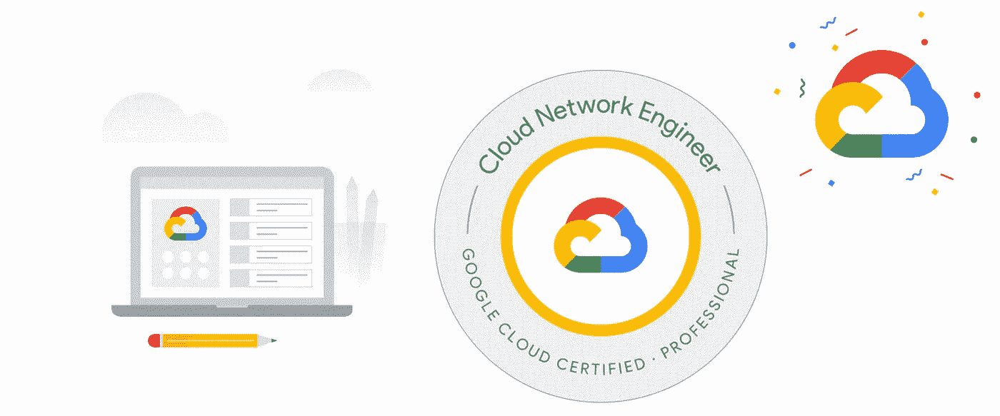
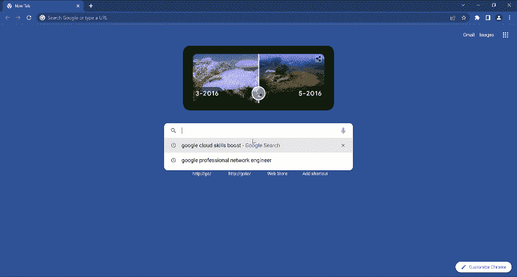
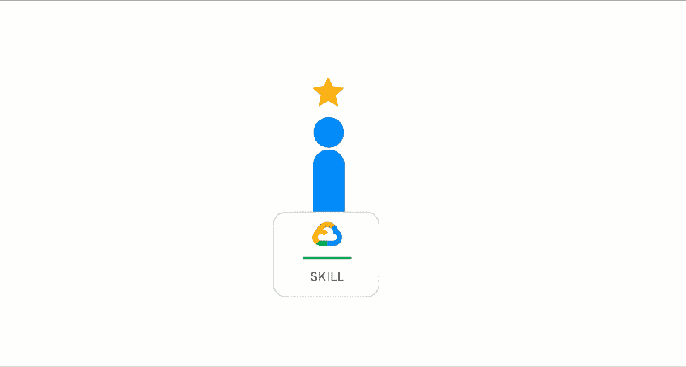
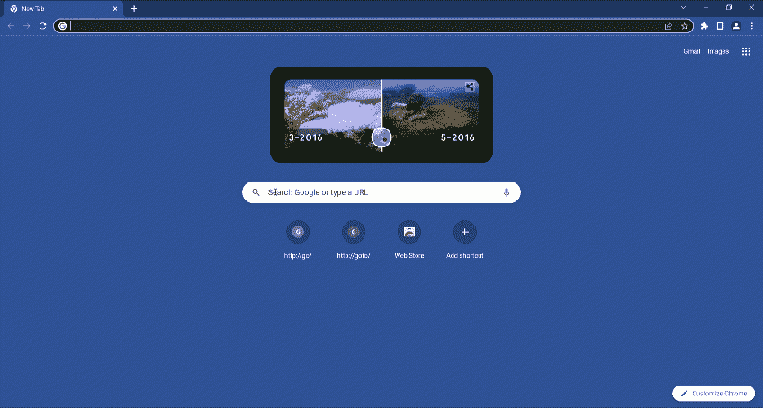
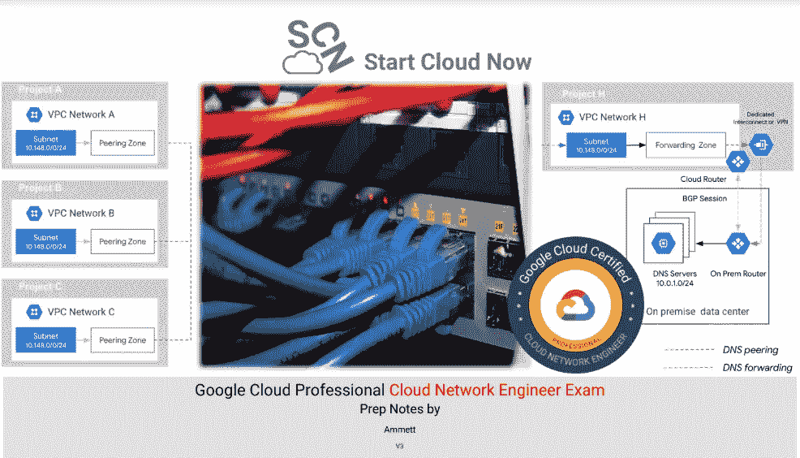

# 通过 GCP 专业云网络工程师考试为成功做准备

> 原文：<https://medium.com/google-cloud/preparing-for-success-with-the-gcp-professional-cloud-network-engineer-exam-da230f9788ed?source=collection_archive---------0----------------------->

PCNE

如果你有兴趣在谷歌云上学习网络，那么 [**谷歌专业云网络工程师**](https://cloud.google.com/certification/cloud-network-engineer) 认证就是对你的挑战。该考试涵盖了 GCP 网络的许多核心领域，足够严谨，让你思考。

我参加了一些谷歌云专业认证**，成功的关键是准备。**考试刷新于 2022 年 1 月，内容涵盖

*   谷歌云网络的设计、规划和原型制作
*   实施虚拟私有云(VPC)实例
*   配置网络服务
*   实现混合互连
*   管理、监控和优化网络运行

为了帮助你在这次考试中取得成功，我整理了一些小贴士。

# 第一步:查看考试指南

考试指南列出了要涵盖的所有目标。这是非常有用的，一看就知道你需要学习哪些方面来准备考试。可以在这里 **查看当前考试指南 [**。**](https://cloud.google.com/certification/guides/cloud-network-engineer/)**

# 第二步:注册谷歌云培训

在你阅读了考试指南之后，如果你认为值得花时间去查阅一些谷歌云学习材料。谷歌云有[谷歌云技能提升](https://www.cloudskillsboost.google/paths)。登录并注册您的学习路径，开始学习。对于这一条，我们来挑一下**网络工程学习路径**。

一旦您选择了学习路径，请查看[为您的专业云网络工程师之旅做准备](https://www.cloudskillsboost.google/course_templates/383)中的详细信息。这个免费的培训将向你展示考试中哪些主题是重要的，并让你知道自己的优势和劣势。

如果你正在寻找谷歌云培训的其他选择，Coursera 和 Pluralsight 上有一些课程。

**Coursera 链接**:

*   [准备你的专业云网络工程师之旅](https://www.coursera.org/learn/preparing-for-the-professional-cloud-network-engineer-journe?)
*   [准备 Google 云认证:云网络工程师职业证书](https://www.coursera.org/professional-certificates/google-cloud-networking)

**多视链接**:

*   [准备您的专业云网络工程师之旅](https://www.pluralsight.com/courses/preparing-professional-cloud-network-engineer-journey-1)
*   [准备 Google 云认证:云网络工程师职业证书](https://www.pluralsight.com/paths/google-cloud-certified-professional-network-engineer)

# 步骤 3:实验室实践经验

学习路径中包含几个实验，您应该努力完成它们。通过完成实验和任务，你有机会获得[技能徽章](https://cloud.google.com/training/badges)。

你也可以访问[https://codelabs.developers.google.com](https://codelabs.developers.google.com/)/搜索网络。您将会看到几个 codelabs，您可以在自己的环境中使用它们来获得更多的实践机会。在学习过程中，您可以探索服务配置中存在的各种选项。

# 第四步:有趣的东西——网络话题深度挖掘

谷歌云文档是技术文档。以下是我对你可以阅读的主题的一些建议。

*   [网络最佳实践](https://cloud.google.com/docs/enterprise/best-practices-for-enterprise-organizations#networking_and_security)
*   [组织约束](https://cloud.google.com/resource-manager/docs/organization-policy/overview)
*   [私人服务访问](https://cloud.google.com/vpc/docs/configure-private-services-access)，[私人谷歌访问](https://cloud.google.com/vpc/docs/configure-private-google-access-hybrid#config)
*   [云路由器](https://cloud.google.com/network-connectivity/docs/router/concepts/overview)
*   [DNS 最佳实践](https://cloud.google.com/dns/docs/best-practices#best_practices_for_dns_forwarding_zones_and_server_policies)
*   [选择负载均衡器](https://cloud.google.com/load-balancing/docs/choosing-load-balancer)、[入口](https://cloud.google.com/kubernetes-engine/docs/tutorials/http-balancer)、[会话关联](https://cloud.google.com/load-balancing/docs/backend-service#session_affinity)
*   [GKE 联网](https://cloud.google.com/kubernetes-engine/docs/concepts/network-overview)
*   [混合连接选项](https://cloud.google.com/hybrid-connectivity/)
*   [云 CDN](https://cloud.google.com/cdn/docs/overview)
*   [无效](https://cloud.google.com/cdn/docs/cache-invalidation-overview)
*   [故障排除](https://cloud.google.com/cdn/docs/troubleshooting-steps#compression-not-working)
*   [已签名的网址](https://cloud.google.com/cdn/docs/using-signed-urls#:~:text=Signed%20URLs%20contain%20authentication%20information,request%20associated%20with%20the%20URL.)
*   [NGFW](https://cloud.google.com/architecture/architecture-centralized-network-appliances-on-google-cloud?hl=en#choosing_an_option_for_attaching_network_segments)
*   [云甲](https://cloud.google.com/armor/docs/cloud-armor-overview)
*   [云 NAT](https://cloud.google.com/nat/docs/overview)
*   [VPC](https://cloud.google.com/vpc/docs/vpc)
*   [VPC 服务控制](https://cloud.google.com/vpc-service-controls/docs/overview)
*   [网络情报中心](https://cloud.google.com/network-intelligence-center/docs)

我还整理了一份这次考试的预习表，可以在 https://www.startcloudnow.com/google%20cloud.html[网站上找到](https://www.startcloudnow.com/google%20cloud.html)

PCNE 准备表

# 第五步:样题

认证网站上有样题可以在这里查看[。](https://docs.google.com/forms/d/e/1FAIpQLServ0tNGkr-dYAfmez_Gdk74dmVypZjzUKrkVFtFcArzhmPow/viewform)

# 第六步报名参加考试

报名考试[这里](https://webassessor.com/googlecloud)。

记住旅途中最重要的方面是学习。因此，继续在谷歌云上构建和试验，不要忘记庆祝你的成功。

**也可以随意查看我的文章** s—

*   [**准备 Google Cloud 专业云安全工程师考试**](/google-cloud/preparing-for-the-google-cloud-professional-cloud-security-engineer-exam-56bc34d02c45)
*   [**备战谷歌专业数据库工程师考试-2023**](/google-cloud/preparing-for-success-with-google-cloud-professional-cloud-database-engineer-exam-2023-3ad33fa3eea9)
*   [**备考谷歌云专业云 DevOps 工程师考试**](/google-cloud/preparing-for-the-google-cloud-professional-cloud-devops-engineer-exam-30e9d5fe07e4)

如果你想问一个问题，了解更多或分享一个想法？请在 [**Linkedin**](https://www.linkedin.com/in/ammett/) 或[**Twitter @ ammettw**](https://twitter.com/ammettw)**上联系我，并给我发消息。**

**我会保持联系的**